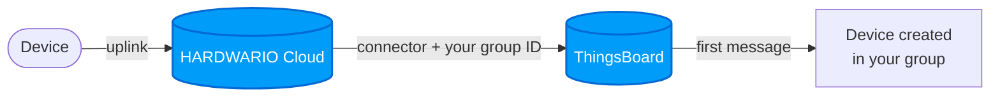
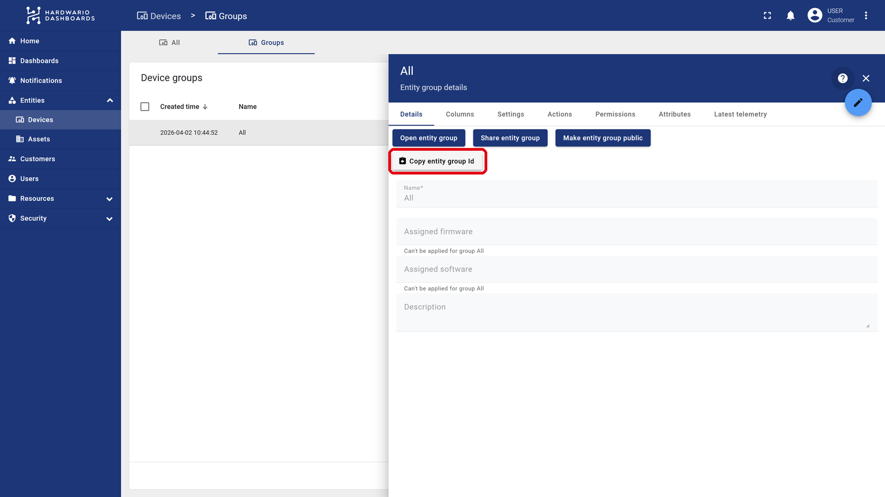

import Image from '@theme/IdealImage';
import ThingsBoardConnector from '@site/src/components/ThingsBoardConnector';
import EditCodeBlock from './edit-code-block.js';

# Connecting to the HARDWARIO Cloud

There are two ways to get your devices from HARDWARIO Cloud into ThingsBoard:

- **[Automatic connection](#automatic-connection)** (recommended): you add one connector, and every tagged device creates itself in your device group.
- **[Manual connection](#manual-connection)**: for devices that already exist in ThingsBoard.

---

## Automatic Connection {#automatic-connection}

Your devices **appear in your ThingsBoard account by themselves**, in the device group you choose. You add one connector and tag the devices you want to send. There is nothing to set up in ThingsBoard.

You need a ThingsBoard account. If you do not have one yet, contact us at [ask@hardwario.com](mailto:ask@hardwario.com).

### Step 1: Find Your Device Group

The device group tells ThingsBoard where your devices belong.

1. Sign in to [ThingsBoard](https://app.hardwario.cloud), open **Entities → Devices** and switch to the **Groups** tab.
2. Click the row of the group you want the devices in. Choose **All** if you do not use groups, or [create a new group](/apps/thingsboard/users-managing#creating-a-device-group) first.
3. In the group details on the right, click **Copy entity group Id**.

   

:::tip Keep your devices sorted
The group ID decides where your devices are created. Create a group for each building, site or project, and add one connector per group - each with its own group ID and its own tag (e.g. `thingsboard-warehouse`, `thingsboard-office`). Every device then lands in the right group by itself.
:::

### Step 2: Get Your Connector Code

Paste the copied ID below. The code fills itself in.

<ThingsBoardConnector />

### Step 3: Add the Connector

[Create a connector](/cloud/connectors#creating-a-connector) with these settings and paste the code from Step 2 as its [transformation function](/cloud/connectors#the-transformation-function):

| Setting | Value |
|---|---|
| **Name** | `thingsboard` |
| **Triggers** | `data`, `session`, `config` (see [Triggers](/cloud/connectors#triggers)) |
| **Tags** | a new tag `thingsboard` (see [Creating a Tag](/cloud/tags#creating-a-tag)) |

### Step 4: Tag Your Devices

Add the `thingsboard` tag to each device you want in ThingsBoard, see [Assigning Tags](/cloud/tags#assigning-tags), or tag many devices at once with [Bulk Actions](/cloud/bulk-actions#tags).

### What Happens in ThingsBoard

With the **next message** of each tagged device, the device appears in your device group:

| In ThingsBoard | Value |
|---|---|
| **Device name** | `chester-<serial number>`, e.g. `chester-2159012345` |
| **Label** | the serial number |
| **Attributes** | device name from HARDWARIO Cloud, product, firmware version, IMEI, ICCID, device configuration, serial numbers of BLE tags |
| **Telemetry** | all measurements with their original timestamps, rounded to two decimals; BLE tags as `ble_tags.0.…`, `ble_tags.1.…` |

Every next message only adds new data. A device reports at its own interval, so it can take up to one interval before it appears.

- **Renaming a device** in HARDWARIO Cloud only updates its name attribute. The device keeps its name, label and history.
- **New devices later:** just tag them with `thingsboard`.
- **A different group:** put the new group's ID into the connector. Devices move there with their next message.
- **Stopping the data:** remove the `thingsboard` tag. The device and its history stay in ThingsBoard.
- **Deleting a device in ThingsBoard** does not stop the data. While the device is tagged, its next message adds it again, so remove the tag first.
- **Devices you already have in ThingsBoard:** do not tag them, they would appear a second time. Use the [manual connection](#manual-connection) for them.

### Troubleshooting

| Problem | What to do |
|---|---|
| A device does not appear | Check that it has the `thingsboard` tag and has sent a message since you tagged it. |
| Devices do not appear in my group | Check the group ID in the connector against your group. After you fix it, devices move there with their next message. |

Anything else: [ask@hardwario.com](mailto:ask@hardwario.com).

---

## Manual Connection {#manual-connection}

Use this guide for devices that already exist in ThingsBoard. You create a connector, transform your data, and send it to ThingsBoard with the device's access token.

### Step 1: Prepare Your Device

Before setting up the connector, you need to prepare your device in the HARDWARIO Cloud so it knows where to send data and how to authenticate:

- **Assign a Tag**: open your device details and assign a tag (created in the right-hand menu)
- **Add the Access Token Label**: scroll down to the very bottom of the device page to find the `Labels` section. You need to create a new label here:
  - `Name`: enter a name for your token, e.g., `thingsboardtoken`  
    *(Note: You can choose any name, but it must be exactly the same for all devices sharing this connector and must match the name in your transformation code)*
  - `Value`: paste your ThingsBoard Access Token here

:::info How to get your ThingsBoard Access Token
Log in to your ThingsBoard dashboard, navigate to **Entities > Devices**, and click on your specific device. In the device details panel that pops up, click the **Copy access token** button.
:::

---

### Step 2: Create a New Connector

To establish communication with ThingsBoard, go to the `Connectors` section in the left-hand menu.  
Click `+ New Connector` and configure the following:

- `Name`: give your connector a name
- `Type`: select `Webhook` for ThingsBoard integration
- `Trigger`: choose `Data`
- `Tag`: assign the tag you created earlier

---

### Step 3: Transform Data for ThingsBoard Format

ThingsBoard requires a specific data format. You need to adjust your device data using a **transformation code**.  
In the connector page, scroll down to the `Transformation` section and click the magnifying glass icon 📄🔍 to open the code editor.

---

### Step 4: Insert the Transformation Code

Add the transformation logic that converts incoming data to a ThingsBoard-compatible format.

**Example of transformation code here:**

<EditCodeBlock initialText={`function main(job) {
    let body = job.message.body;
    const timemultiply = 1000;
    const sharedtimestamp = new Date(job.message.created_at).getTime();
    const sn = job.device.serial_number;
    const accesstoken = job.device.label.thingsboardtoken;

    const dataMap = {};
    function getTimestamp(possibleTimestamp) {
        return (typeof possibleTimestamp === 'number' && !isNaN(possibleTimestamp)) ? possibleTimestamp * timemultiply : sharedtimestamp;
    }
    function pushToData(ts, values) {
        if (!dataMap[ts]) {
            dataMap[ts] = {};
        }
        Object.assign(dataMap[ts], values);
    }

    // Common CHESTER parameters
    pushToData(sharedtimestamp, {
        'current_load': body.system?.current_load,
        'voltage_load': body.system?.voltage_load,
        'voltage_rest': body.system?.voltage_rest,
        'uptime': body.system?.uptime,
        'message.version': body.message?.version,
        'message.sequence': body.message?.sequence,
        'message.timestamp': body.message?.timestamp,
        'attribute.vendor_name': body.attribute?.vendor_name,
        'attribute.product_name': body.attribute?.product_name,
        'attribute.hw_variant': body.attribute?.hw_variant,
        'attribute.hw_revision': body.attribute?.hw_revision,
        'attribute.fw_name': body.attribute?.fw_name,
        'attribute.fw_version': body.attribute?.fw_version,
        'attribute.serial_number': body.attribute?.serial_number,
        'backup.line_voltage': body.backup?.line_voltage,
        'backup.batt_voltage': body.backup?.batt_voltage,
        'backup.state': body.backup?.state,
        'thermometer.temperature': body.thermometer?.temperature,
        'accelerometer.accel_x': body.accelerometer?.accel_x,
        'accelerometer.accel_y': body.accelerometer?.accel_y,
        'accelerometer.accel_z': body.accelerometer?.accel_z,
        'accelerometer.orientation': body.accelerometer?.orientation,
        'network.parameter.eest': body.network?.parameter?.eest,
        'network.parameter.ecl': body.network?.parameter?.ecl,
        'network.parameter.rsrp': body.network?.parameter?.rsrp,
        'network.parameter.rsrq': body.network?.parameter?.rsrq,
        'network.parameter.snr': body.network?.parameter?.snr,
        'network.parameter.plmn': body.network?.parameter?.plmn,
        'network.parameter.cid': body.network?.parameter?.cid,
        'network.parameter.band': body.network?.parameter?.band,
        'network.parameter.earfcn': body.network?.parameter?.earfcn,
        'network.imei': body.network?.imei,
        'network.imsi': body.network?.imsi
    });

    // BLE Tags - use index instead of addr
    body.ble_tags?.forEach((tag, tagIndex) => {
        tag.humidity?.measurements.forEach(m => {
            const ts = getTimestamp(m.timestamp);
            pushToData(ts, {
                [\`ble_tags.\${tagIndex}.humidity.measurement.min\`]: m?.min,
                [\`ble_tags.\${tagIndex}.humidity.measurement.max\`]: m?.max,
                [\`ble_tags.\${tagIndex}.humidity.measurement.avg\`]: m?.avg,
                [\`ble_tags.\${tagIndex}.humidity.measurement.mdn\`]: m?.mdn
            });
        });
        tag.temperature?.measurements.forEach(m => {
            const ts = getTimestamp(m.timestamp);
            pushToData(ts, {
                [\`ble_tags.\${tagIndex}.temperature.measurement.min\`]: m?.min,
                [\`ble_tags.\${tagIndex}.temperature.measurement.max\`]: m?.max,
                [\`ble_tags.\${tagIndex}.temperature.measurement.avg\`]: m?.avg,
                [\`ble_tags.\${tagIndex}.temperature.measurement.mdn\`]: m?.mdn
            });
        });
    });

    const sensorTypes = [
        'w1_thermometers', 'analog_channels', 'rtd_thermometer', 'weight', 'counter', 'current', 'voltage'
    ];

    sensorTypes.forEach(sensorType => {
        body[sensorType]?.forEach((entry, index) => {
            entry.measurements?.forEach(measurement => {
                const ts = getTimestamp(measurement.timestamp);
                const prefix = \`\${sensorType}.\${entry.serial_number || entry.channel || index}.measurement\`;
                const values = {};
                for (const key in measurement) {
                    if (key !== 'timestamp') {
                        values[\`\${prefix}.\${key}\`] = measurement[key];
                    }
                }
                pushToData(ts, values);
            });
        });
    });

    // Buttons
    body.buttons?.forEach((btn, index) => {
        pushToData(sharedtimestamp, {
            [\`button_\${index}.button\`]: btn?.button,
            [\`button_\${index}.count_click\`]: btn?.count_click,
            [\`button_\${index}.count_hold\`]: btn?.count_hold,
            [\`button_\${index}.events\`]: btn?.events
        });
    });

    // Weather Station, Hygrometer, Barometer, Radon Probe, IAQ Sensor, Soil Sensors
    const nestedSensors = [
        ['weather_station', ['wind_speed', 'wind_direction', 'rainfall']],
        ['hygrometer', ['temperature', 'humidity']],
        ['barometer', ['pressure']],
        ['radon_probe', ['chamber_humidity', 'chamber_temperature', 'concentration_daily', 'concentration_hourly']],
        ['iaq_sensor', ['temperature', 'humidity', 'illuminance', 'altitude', 'pressure', 'co2_conc', 'motion_count', 'press_count']],
        ['soil_sensors', ['moisture', 'temperature']]
    ];

    nestedSensors.forEach(([sensorKey, subkeys]) => {
        const sensor = body[sensorKey];
        if (!sensor) return;

        subkeys.forEach(subkey => {
            sensor?.[subkey]?.measurements?.forEach(m => {
                const ts = getTimestamp(m.timestamp);
                const prefix = \`\${sensorKey}.\${subkey}.measurements\`;
                const values = {};
                for (const k in m) {
                    if (k !== 'timestamp') {
                        values[\`\${prefix}.\${k}\`] = m[k];
                    }
                }
                pushToData(ts, values);
            });
        });
    });

    const data = Object.entries(dataMap).map(([ts, values]) => ({
        ts: Number(ts),
        values: values
    }));

    const url = "https://thingsboard.hardwario.com/api/v1/" + accesstoken + '/telemetry';
    return {
        method: "POST",
        url: url,
        header: {
            "Content-Type": "application/json"
        },
        data: data
    };
}`} />

---

---

### Step 5: Assign Devices to Connector

Scroll down and select which devices (with the matching tag) should be connected.  
On the left side, you'll see **incoming data** from the device.  
On the right side, you'll see the **transformed data** being sent to ThingsBoard.

---

Once everything is properly configured, your device’s data should begin flowing into ThingsBoard automatically.

:::tip
You can test the data by opening your device in ThingsBoard and checking whether the variables are being updated in real-time.  You can find them by clicking on the device and then selecting the **Latest Telemetry** tab.
:::

### Video Tutorial

:::tip
If you need further assistance or a visual demonstration of the process described in this guide, consult the [Video Guide](/apps/videos-apps/thingsboard-cloud-connection).
:::