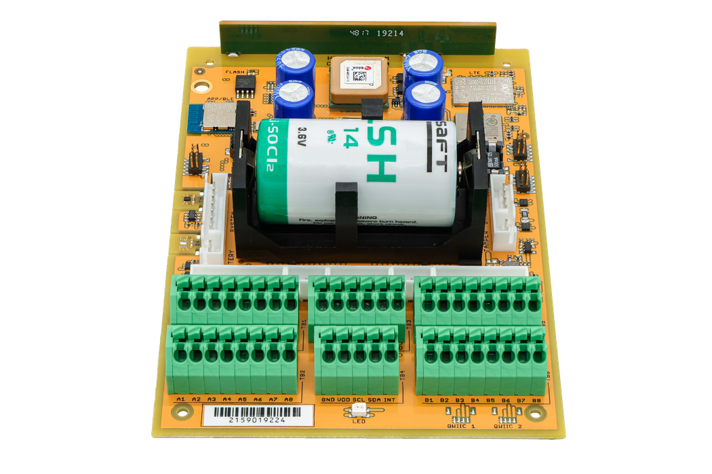
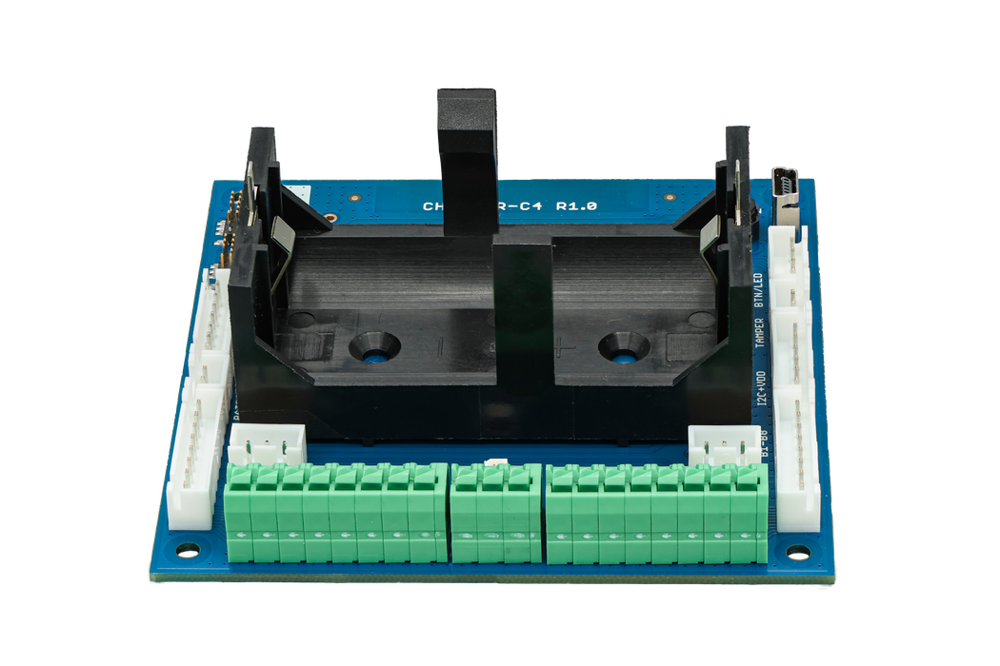
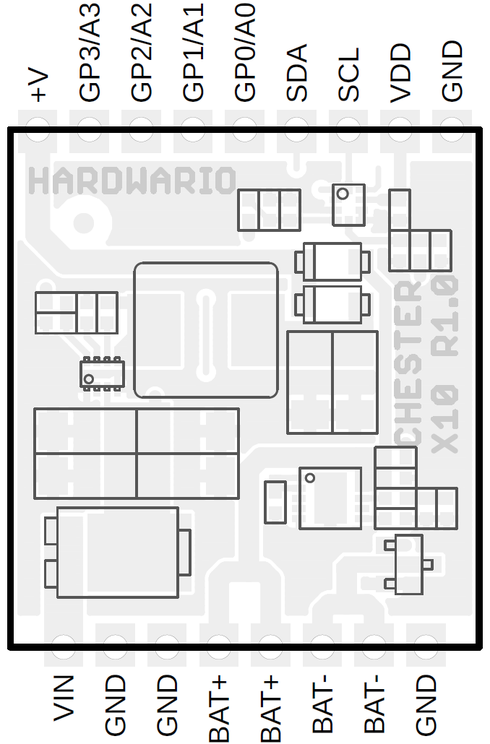

import Image from '@theme/IdealImage';

# CHESTER-X10

The **CHESTER-X10** is a **backup power** extension module with an on-board **single-cell Li-Po charger** for the CHESTER platform.

<Image img={require('./images/chester-x10-top.png')} alt="Photo of the red CHESTER-X10 board showing the step-down inductor, the MCP73833 charger, the TLA2024 ADC, and the Schottky power-path diodes"/>

## Module Overview

CHESTER-X10 powers the CHESTER mainboard from an external **5-28 VDC** line on **VIN** and keeps it running when that supply fails. The on-board **TPS62933** step-down converter produces a fixed **5 V** rail, which both powers the mainboard and supplies the **MCP73833** charger for a single-cell Li-Po / Li-Ion battery. The step-down output and the battery are **diode-OR'd** (Schottky **PMEG6010ELR**) onto the mainboard's supply, so while VIN is present the mainboard runs from the 5 V rail and the battery charges, and if VIN is lost the battery seamlessly takes over. A Schottky diode (**PMEG060T030ELPEZ**) protects the DC input.

An on-board **TLA2024** 12-bit ADC, read over **I²C**, measures the input voltage (VIN) and the battery voltage (BAT+) through precision dividers, so firmware can monitor the DC input and the battery state of charge. The module ships with a protected single-cell Li-Po battery and charges it at **450 mA**.

## Key Features

* **Backup Power:** Diode-OR between the DC input and the battery keeps the CHESTER mainboard powered if the external supply fails.
* **Wide DC Input:** External **5-28 VDC** on VIN via the on-board TPS62933 step-down converter.
* **Li-Po Charging:** On-board MCP73833 charger for a single-cell Li-Po / Li-Ion battery at 450 mA.
* **Battery Included:** Protected single-cell **3.7 V / 2000 mAh** Li-Po battery in the box.
* **On-board Voltage Monitoring:** 12-bit I²C ADC (TLA2024) measures the input and battery voltage.
* **Input Protection:** Schottky diode on the DC input.
* **I²C Host Interface:** Connects to the CHESTER mainboard over the standard I²C bus.

## Typical Applications

* **Uninterruptible Operation:** Keep a CHESTER node running through mains or DC-supply outages.
* **Remote & Off-Grid Sites:** Buffer an intermittent DC source, such as a solar or harvested-power feed.
* **Externally Powered Installations:** Run CHESTER from an industrial DC line with battery backup.
* **Battery-Backed Monitoring:** Applications that need to track both the input voltage and the battery state of charge.

## Technical Specifications

| Parameter | Value |
| :--- | :--- |
| **Module Type** | Backup power supply with single-cell Li-Po charger |
| **Power Input (VIN)** | 5-28 VDC |
| **Power Output** | Fixed 5 V, powers the CHESTER mainboard |
| **Battery Type** | Single-cell Li-Po / Li-Ion, 3.7 V, with integrated protection circuit |
| **Charging Current** | 450 mA |
| **Min. Recommended Battery Capacity** | 1000 mAh |
| **Voltage Monitoring** | On-board 12-bit I²C ADC (TLA2024), measures VIN and battery voltage |
| **Host Interface** | I²C |
| **Included Battery** | LP103454-PCM-LD, 3.7 V / 2000 mAh (56.0 × 34.5 × 10.3 mm) |
| **Connector** | Standard 2.54 mm pitch header (Soldered) |
| **Hardware Revision** | R1.1 |

## Key Components

| Component | Part Number | Description |
| :--- | :--- | :--- |
| **Step-Down Converter** | TPS62933 | Step-down converter, 5-28 VDC input, 5 V output |
| **Battery Charger** | MCP73833 | Single-cell Li-Po / Li-Ion linear charger (450 mA) |
| **Voltage-Monitoring ADC** | TLA2024 | 12-bit 4-channel I²C ADC (address 0x49); measures VIN and battery voltage |
| **Input Protection** | PMEG060T030ELPEZ / PMEG6010ELR | Schottky barrier diodes (input protection and power-path OR-ing) |

## Pin Configuration

The module uses a standardized header layout compatible with CHESTER extension slots.

:::note
The pin configuration shown is for the CHESTER-M CGLS mainboard.
:::

### CHESTER-X10 Connector Pinout

| Pin | Signal | Type | Description |
| :---: | :--- | :--- | :--- |
| 1 | GND | Ground | System ground reference |
| 2 | BAT- | Battery | Battery negative terminal (*) |
| 3 | BAT- | Battery | Battery negative terminal (*) |
| 4 | BAT+ | Battery | Battery positive terminal (*) |
| 5 | BAT+ | Battery | Battery positive terminal (*) |
| 6 | GND | Ground | System ground reference |
| 7 | GND | Ground | System ground reference |
| 8 | VIN | Power Input | External DC supply input (5-28 VDC) |

*Note: Use only a single-cell 3.7 V Li-Po (or Li-Ion) battery with an integrated protection circuit. Do not short-circuit the battery! The two BAT- and the two BAT+ pins are internally connected (doubled for current capacity).

:::info
CHESTER-X10 powers the CHESTER mainboard through the module slot. An external **5-28 VDC** supply on **VIN** (Pin 8) feeds the on-board TPS62933 step-down converter, whose fixed **5 V** output powers the mainboard and charges the battery connected to **BAT+** / **BAT-**. If the external supply is lost, the battery keeps the mainboard powered.
:::

### Host Interface (I²C)

CHESTER-X10 communicates with the CHESTER mainboard over the standard **I²C** bus. The on-board **TLA2024** ADC sits at I²C address **0x49** and lets firmware read the input and battery voltage:

| ADC channel | Measured signal | Divider |
| :--- | :--- | :--- |
| AIN0 | VIN (input voltage) | 330 kΩ / 22 kΩ |
| AIN1 | BAT+ (battery voltage) | 1 MΩ / 1 MΩ |

## Battery & Power Connection

Connect the external DC supply to **VIN** (Pin 8) and **GND** (Pin 1, 6, or 7), and connect a protected single-cell Li-Po / Li-Ion battery to **BAT+** (Pin 4 or 5) and **BAT-** (Pin 2 or 3).

:::warning
Use only a single-cell **3.7 V** Li-Po / Li-Ion battery with an **integrated protection circuit**, and never short-circuit the battery. A battery capacity of at least **1000 mAh** is recommended.
:::

While the external supply is connected, the mainboard runs from the 5 V step-down output and the battery charges at 450 mA. If the external supply is disconnected or fails, the battery continues to power the mainboard through the module's power-path diodes, providing uninterrupted backup power.

### Enclosure Feed-Through

Two options bring the DC-input cable into the enclosure:

- **Cable gland (default):** route the DC conductors through a cable gland in the enclosure wall and wire them to VIN and GND.
- **Panel-mount connector (on request):** an external connector in the enclosure wall lets the user plug in the DC supply, with no loose wiring inside. Available on request.

## Compatible CHESTER Configurations

The CHESTER-X10 module can be used with various CHESTER mainboard configurations. Below are examples of compatible setups:

<h4>CHESTER-M (CGLS)</h4>

<h4>CHESTER-C4</h4>

## CHESTER SDK usage

CHESTER-X10 can be used as part of the CHESTER SDK using the `ctr_x10` shield, or the `hardware-chester-x10` [Project Generator](/chester/firmware-sdk/how-to-project-generator.md) feature.

- [Example SDK usage](https://github.com/hardwario/chester-sdk/tree/main/samples/chester_x10)

## Schematic Diagrams

The following diagrams show the internal wiring of the module across its two sheets: the power supply and charger, and the voltage-monitoring ADC.

- [Schematic (PDF)](schematics/hio-chester-x10-r1.1.pdf)
- [Interactive PCB connector, part, testpoint and signal browser](pathname:///download/ibom/hio-chester-x10-r1.1.html)

### Power & Charger

### Voltage Monitoring

## Module Drawing

