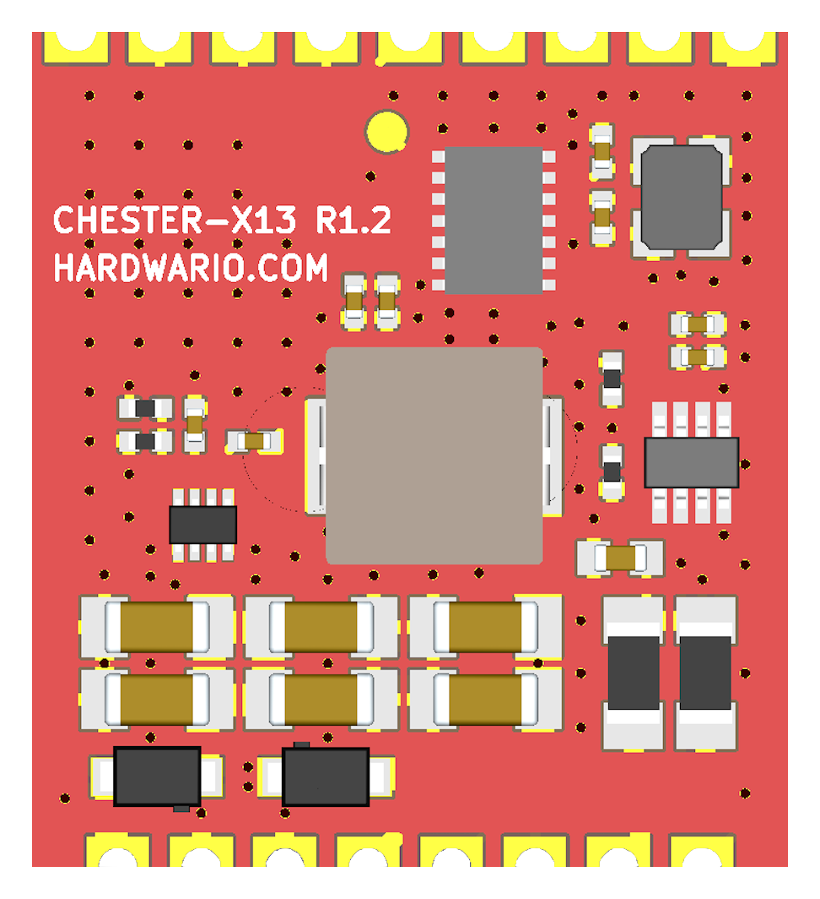
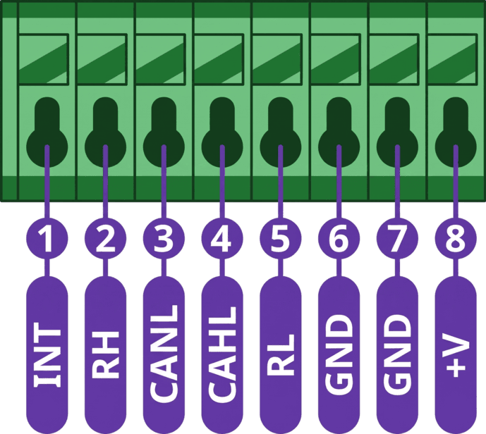
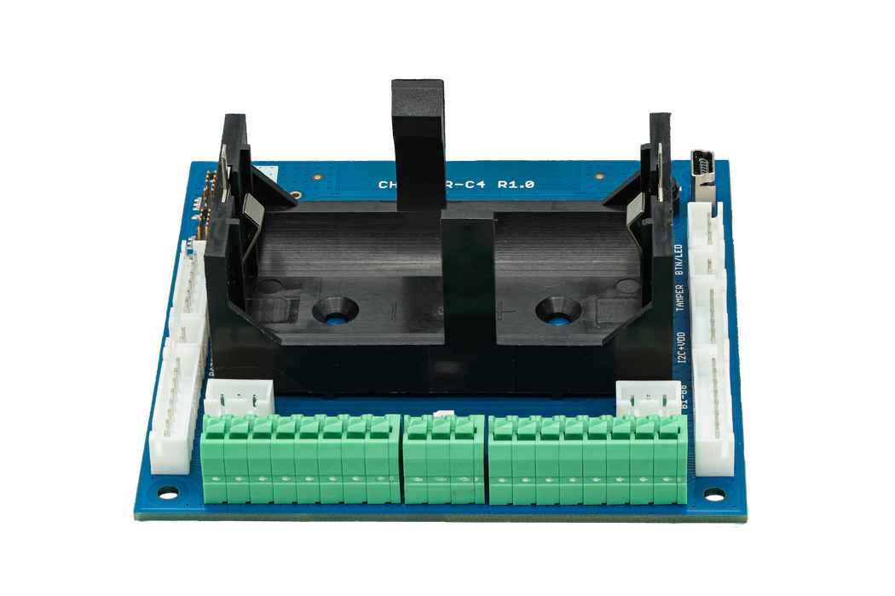
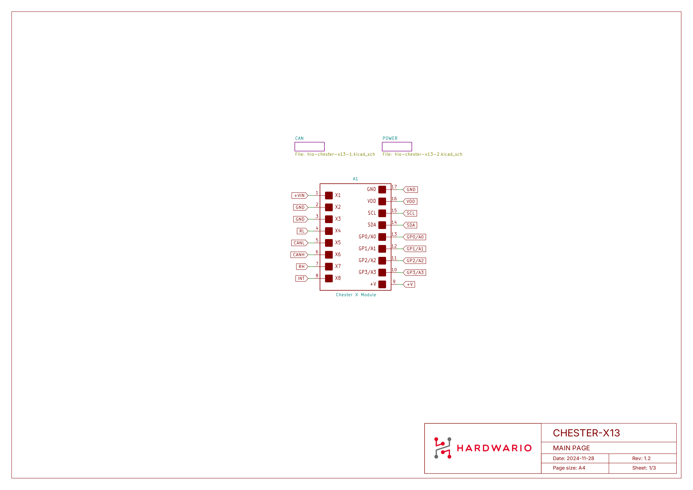
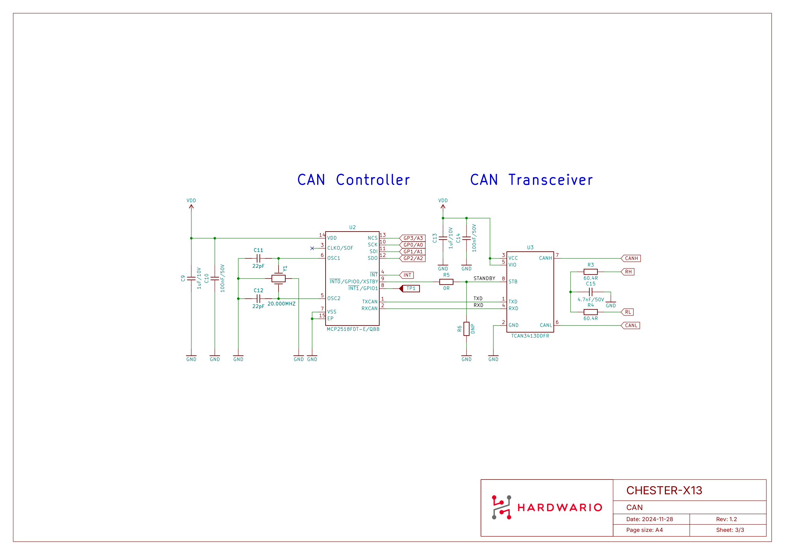
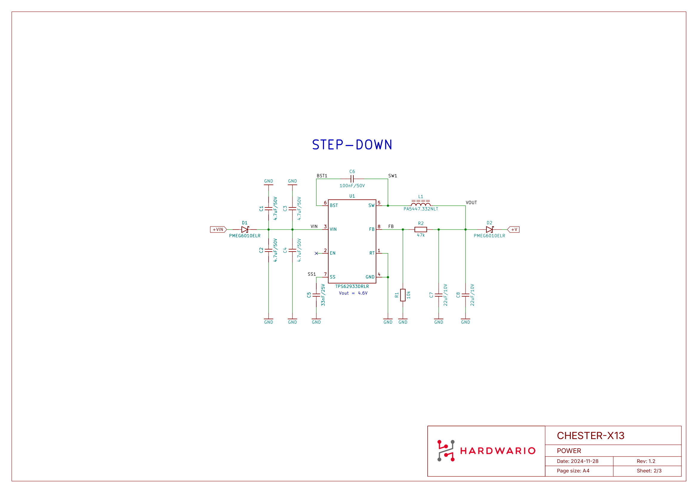
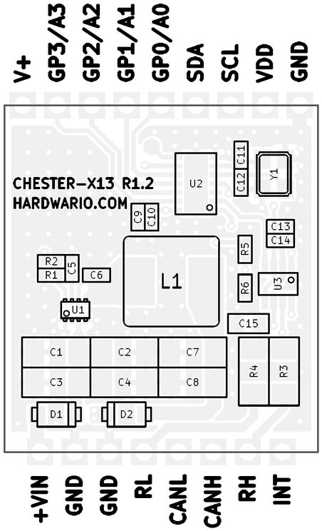

# CHESTER-X13

The **CHESTER-X13** is a **CAN Bus** extension module with **CAN FD** support for the CHESTER platform.

## Module Overview

CHESTER-X13 provides a **CAN / CAN FD** interface based on the **MCP2518FD** external CAN controller, which communicates with the CHESTER mainboard over **SPI**. An on-board **TCAN3413** transceiver drives the physical bus, and the **CANH** / **CANL** lines are brought out to the terminal block. On-board bus-termination resistors are provided but disconnected by default, so the module can sit anywhere on the bus.

The module can run directly from the CHESTER mainboard. Alternatively, an external 5-28 VDC line on +VIN feeds the on-board **TPS62933** step-down converter, whose fixed **5 V** output powers the CHESTER mainboard. Schottky diodes (**PMEG6010ELR**) protect the input. An interrupt output signals the CHESTER mainboard when the CAN controller requires attention.

## Key Features

* **CAN & CAN FD:** Wired connectivity based on the MCP2518FD CAN controller.
* **SPI Host Interface:** Connects to the CHESTER mainboard over SPI.
* **On-board Transceiver:** TCAN3413 transceiver drives the physical CAN bus.
* **Selectable Bus Termination:** On-board ~120 Ω termination, disconnected by default.
* **Flexible Power:** Runs from the CHESTER mainboard, or from an optional 5-28 VDC line on +VIN.
* **Input Protection:** Schottky diodes (PMEG6010ELR) on the power input.
* **Interrupt Output:** Dedicated interrupt line to the CHESTER mainboard.

## Typical Applications

* **Industrial CAN Networks:** Connecting CHESTER to a CAN / CAN FD bus.
* **Machinery & Equipment Monitoring:** Reading data from equipment that exposes a CAN interface.
* **Mobile Machinery & Vehicles:** Telemetry from agricultural, construction, and other mobile machinery.
* **Energy & Power Systems:** Monitoring generators, inverters, and battery systems with a CAN interface.
* **Retrofit Data Acquisition:** Tapping data from an existing CAN bus.

## Technical Specifications

| Parameter | Value |
| :--- | :--- |
| **Interface Type** | CAN / CAN FD |
| **Bit Rate** | Up to 1 Mbit/s (classic CAN), up to 5 Mbit/s (CAN FD) |
| **CAN Controller** | MCP2518FD (external, SPI) |
| **CAN Transceiver** | TCAN3413 |
| **Host Interface** | SPI |
| **Bus Termination** | On-board ~120 Ω, disconnected by default |
| **Power Input (+VIN)** | 5-28 VDC (optional external supply) |
| **Power Output (+V)** | Fixed 5 V, powers the CHESTER mainboard |
| **Bus Output** | CANH / CANL on the terminal block |
| **Connector** | Standard 2.54 mm pitch header (Soldered) |
| **Hardware Revision** | R1.2 |

## Key Components

| Component | Part Number | Description |
| :--- | :--- | :--- |
| **CAN Controller** | MCP2518FD | External CAN FD controller with SPI interface |
| **CAN Transceiver** | TCAN3413 | CAN FD transceiver (physical bus interface) |
| **DC-DC Converter** | TPS62933 | Step-down converter, 5-28 VDC input |
| **Input Protection** | PMEG6010ELR | Schottky barrier diodes for input protection |

## Pin Configuration

The module uses a standardized header layout compatible with CHESTER extension slots.

:::note
The pin configuration shown is for the CHESTER-M CGLS mainboard.
:::

### CHESTER-X13 Connector Pinout

| Pin | Signal | Type | Description |
| :---: | :--- | :--- | :--- |
| 1 | INT | Output | Interrupt output to the CHESTER mainboard |
| 2 | RH | CAN Termination | Termination tap for CANH (connect to CANH to enable the on-board termination) |
| 3 | CANH | CAN Bus | CAN bus line, high |
| 4 | CANL | CAN Bus | CAN bus line, low |
| 5 | RL | CAN Termination | Termination tap for CANL (connect to CANL to enable the on-board termination) |
| 6 | GND | Ground | System ground reference |
| 7 | GND | Ground | System ground reference |
| 8 | +VIN | Power Input | Optional external DC input to the on-board step-down (5-28 VDC) |

:::info
The module can run directly from the CHESTER mainboard. When an external **5-28 VDC** supply is connected to **+VIN** (Pin 8), the on-board TPS62933 step-down converter produces a fixed **5 V** that powers the CHESTER mainboard.
:::

### Host Interface (SPI)

Unlike most CHESTER-X modules (which use **I²C**), CHESTER-X13 communicates with the CHESTER mainboard over **SPI**. The MCP2518FD controller is driven through the module slot's GP pins:

| CHESTER-X pin | SPI function | MCP2518FD signal |
| :--- | :--- | :--- |
| GP0 | SCLK | SCK |
| GP1 | MOSI | SDI |
| GP2 | MISO | SDO |
| GP3 | CS | NCS |

The MCP2518FD interrupt output (INT) is routed to the module's **INT** terminal (pin 1). See the [Interrupt Pin](#interrupt-pin) subsection below.

### Interrupt Pin

The MCP2518FD signals events (such as a received CAN frame) on its interrupt output, which is brought out to the module's **INT** terminal (pin 1). This interrupt **must be wired to the CHESTER mainboard's INT terminal** so the mainboard can detect it. On the **CHESTER-M CGLS** mainboard, add a jumper wire from the extension module's terminal block to the mainboard's INT terminal. The wiring below is shown for a module in **slot B**; a module in another slot connects to that slot's INT terminal the same way.

* Example: interrupt wiring for a module in slot B (CHESTER-M CGLS).

## CAN Bus Connection

The CAN bus is wired directly to the terminal-block pins **CANH** (pin 3) and **CANL** (pin 4). Use **twisted-pair** cable with a **120 Ω** characteristic impedance, wire the bus as a **linear (daisy-chain) topology** — avoid star layouts and long stubs — and keep any untwisted wiring at the terminal block **as short as possible**.

The CAN interface is **not galvanically isolated**, so all nodes must share a common ground reference. Connect the bus **GND** to one of the terminal-block GND pins (pin 6 or 7).

### Termination Resistors

A CAN bus must be terminated with a **120 Ω** resistor between CANH and CANL at **both physical ends** of the bus. CHESTER-X13 provides an on-board termination that is **disconnected by default** (a node in the middle of the bus must not be terminated).

Enable it **only when the module sits at the end of the bus** by connecting **CANH to RH** (pin 3 to pin 2) and **CANL to RL** (pin 4 to pin 5) on the terminal block.

### Enclosure Feed-Through

Two options bring the CAN cable into the enclosure:

- **Cable gland (default):** route the CAN conductors through a cable gland in the enclosure wall and wire them to the terminal block.
- **Panel-mount connector (on request):** an external connector in the enclosure wall lets the user plug in the CAN cable, with no loose wiring inside. Available on request.

## Compatible CHESTER Configurations

The CHESTER-X13 module can be used with various CHESTER mainboard configurations. Below are examples of compatible setups:

<h4>CHESTER-M (CGLS)</h4>

<h4>CHESTER-C4</h4>

## CHESTER SDK usage

CHESTER-X13 can be used as part of the CHESTER SDK using the `ctr_x13_a` and `ctr_x13_b` shields, or `hardware-chester-x13-a` and `hardware-chester-x13-b` [Project Generator](/chester/firmware-sdk/how-to-project-generator.md) features.

- [Example SDK usage](https://github.com/hardwario/chester-sdk/tree/main/samples/chester_x13)

## Schematic Diagrams

The following diagrams show the internal wiring of the module across its three sheets: the main page, the CAN interface, and the power supply.

- [Schematic (PDF)](schematics/hio-chester-x13-r1.2.pdf)
- [Interactive PCB connector, part, testpoint and signal browser](pathname:///download/ibom/hio-chester-x13-r1.2.html)

### Main Page

### CAN

### Power

## Module Drawing

