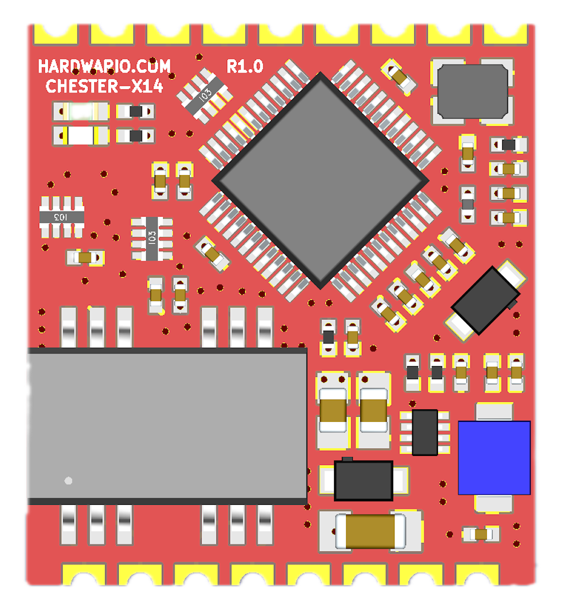
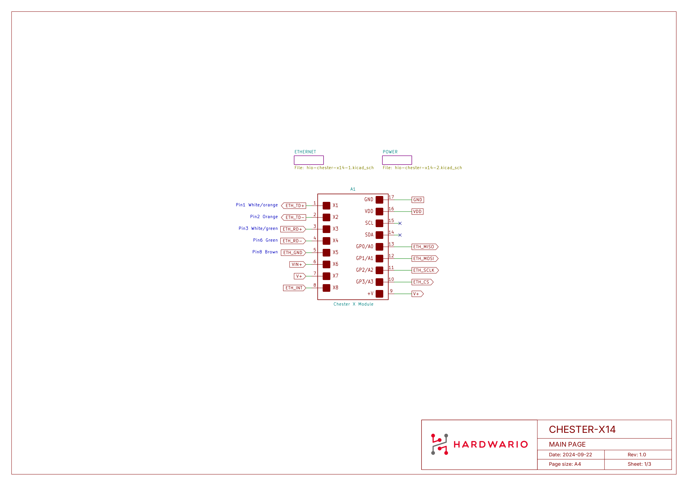
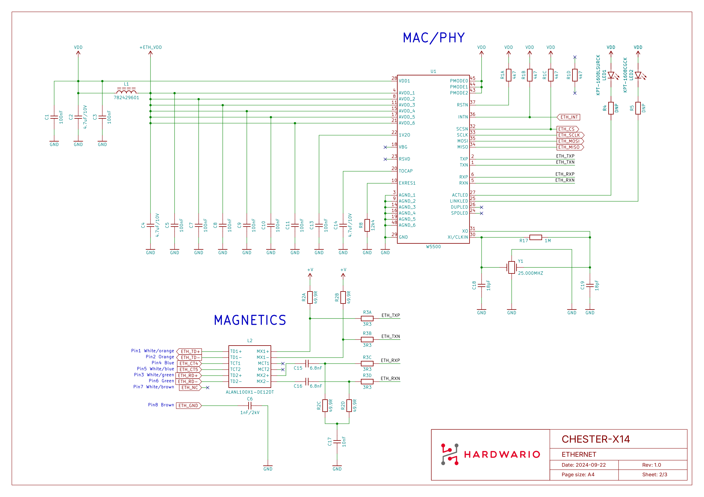
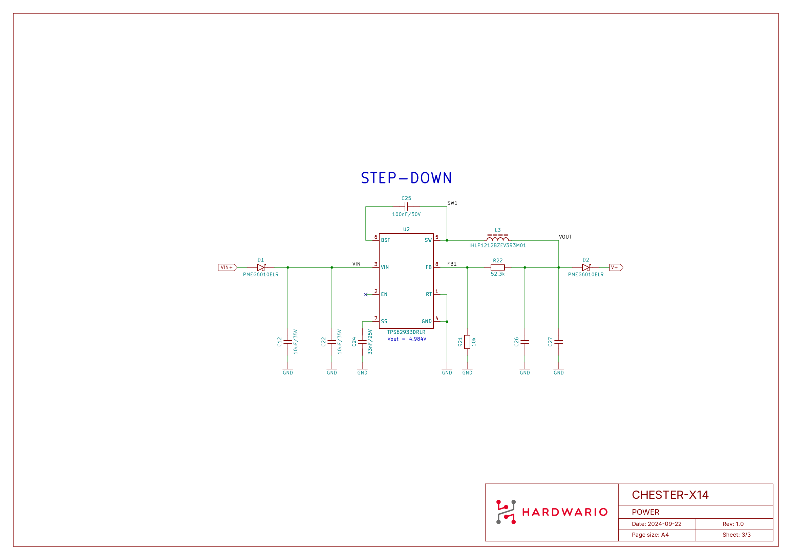
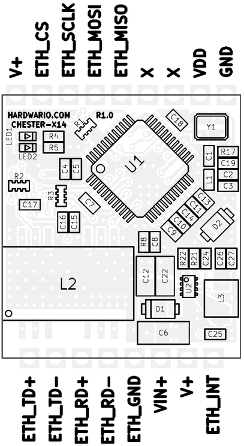

# CHESTER-X14

The **CHESTER-X14** is a wired **10/100 Ethernet** extension module for the CHESTER platform.

## Module Overview

CHESTER-X14 provides a 10/100 Mbps Ethernet interface based on the **W5500** hardwired TCP/IP controller, which integrates the MAC and PHY and communicates with the CHESTER mainboard over **SPI**. On-board Ethernet magnetics (**ALANL100X1-DE12DT**) provide galvanic isolation and signal conditioning. The differential receive/transmit pairs are brought out to the terminal block, where the individual Ethernet conductors are connected.

The module can run directly from the CHESTER mainboard. Alternatively, an external 6-26 VDC line on +VIN feeds the onboard **TPS62933** step-down converter, whose fixed **5 V** output (+V) powers the CHESTER mainboard. Schottky diodes (**PMEG6010ELR**) protect the input. An interrupt output signals the CHESTER mainboard when the Ethernet controller requires attention.

## Key Features

* **10/100 Ethernet:** Wired connectivity based on the W5500 hardwired TCP/IP controller.
* **SPI Host Interface:** Connects to the CHESTER mainboard over SPI.
* **Integrated Magnetics & Isolation:** On-board Ethernet transformer (ALANL100X1-DE12DT) provides galvanic isolation.
* **Flexible Power:** Runs from the CHESTER mainboard, or from an optional 6-26 V DC line on +VIN. The onboard step-down then delivers a fixed 5 V rail (+V) that powers the CHESTER mainboard.
* **Input Protection:** Schottky diodes (PMEG6010ELR) on the power input.
* **Interrupt Output:** Dedicated interrupt line to the CHESTER mainboard.
* **Status LEDs:** Link (green) and activity (red) indicators driven by the W5500.

## Typical Applications

* **Fixed-line Connectivity:** Wired Ethernet where cellular coverage is unavailable or undesirable.
* **Industrial Networks:** Connecting CHESTER to a local industrial LAN.
* **Building Automation:** Wired backbone for building and facility monitoring.
* **Gateways:** Wired uplink for data-collection nodes.

---

## Technical Specifications

| Parameter | Value |
| :--- | :--- |
| **Interface Type** | 10/100 Mbps Ethernet |
| **Ethernet Controller** | W5500 (hardwired TCP/IP, integrated MAC + PHY) |
| **Host Interface** | SPI |
| **Magnetics** | Integrated (ALANL100X1-DE12DT) |
| **Galvanic Isolation** | Yes, from the on-board Ethernet magnetics |
| **Power Input (+VIN)** | 6-26 V DC (optional external supply) |
| **Power Output (+V)** | Fixed 5 V, powers the CHESTER mainboard |
| **Ethernet Output** | Differential Rx/Tx pairs on the terminal block |
| **Connector** | Standard 2.54 mm pitch header (Soldered) |
| **Hardware Revision** | R1.0 |

---

## Key Components

| Component | Part Number | Description |
| :--- | :--- | :--- |
| **Ethernet Controller** | W5500 | Hardwired TCP/IP embedded Ethernet controller with SPI interface (MAC + PHY) |
| **Ethernet Magnetics** | ALANL100X1-DE12DT | Integrated LAN transformer for the 10/100 interface |
| **DC-DC Converter** | TPS62933 | Step-down converter, 6-26 V input |
| **Input Protection** | PMEG6010ELR | Schottky barrier diodes for input protection |

---

## Pin Configuration

The module uses a standardized header layout compatible with CHESTER extension slots.

:::note
The pin configuration shown is for the CHESTER-M CGLS mainboard.
:::

### CHESTER-X14 Connector Pinout

| Pin | Signal | Type | Description |
| :---: | :--- | :--- | :--- |
| 1 | INT | Output | Interrupt output to the CHESTER mainboard |
| 2 | +V | Power Output | Fixed 5 V from the onboard step-down (powers the CHESTER mainboard) |
| 3 | +VIN | Power Input | Optional external DC input to the onboard step-down (6-26 V) |
| 4 | GND | Ground | System ground reference |
| 5 | Rx- | Ethernet | Receive pair (negative) |
| 6 | Rx+ | Ethernet | Receive pair (positive) |
| 7 | Tx- | Ethernet | Transmit pair (negative) |
| 8 | Tx+ | Ethernet | Transmit pair (positive) |

:::info
The module can run directly from the CHESTER mainboard. When an external **6-26 V** supply is connected to **+VIN** (Pin 3), the onboard TPS62933 step-down converter produces a fixed **5 V** on **+V** (Pin 2), which powers the CHESTER mainboard.
:::

### Host Interface (SPI)

Unlike most CHESTER-X modules (which use **I²C**), CHESTER-X14 communicates with the CHESTER mainboard over **SPI**. The W5500 controller is driven through the module slot's GP pins:

| CHESTER-X pin | SPI function | W5500 signal |
| :--- | :--- | :--- |
| GP0 | MISO | ETH_MISO |
| GP1 | MOSI | ETH_MOSI |
| GP2 | SCLK | ETH_SCLK |
| GP3 | CS | ETH_CS |

The W5500 interrupt output (INTn) is routed to the module's **INT** terminal (pin 1). See the [Interrupt Pin](#interrupt-pin) section below.

---

## Ethernet Connection

The Ethernet magnetics are located on the module, so the individual Ethernet conductors are wired directly to the terminal-block pins (**Rx-**, **Rx+**, **Tx-**, **Tx+**). **No external magnetics are required**, because the on-board magnetics also provide **galvanic isolation** of the Ethernet interface.

Run each differential pair (Rx and Tx) as a **twisted pair** using **Cat5e** cable or better, and keep any un-twisted wiring at the terminal block **as short as possible**. Standard 10/100BASE-TX links (as used by the W5500) support cable runs up to **100 m**.

Wire the Ethernet cable to the terminal block as shown below. The RJ-45 pin and wire color follow the **T568B** standard; the CHESTER-X14 pin is taken from the pinout table above.

| RJ-45 pin | Wire (T568B) | Ethernet signal | CHESTER-X14 pin |
| :---: | :--- | :--- | :---: |
| 1 | White/orange | ETH_TD+ (Tx+) | 8 |
| 2 | Orange | ETH_TD- (Tx-) | 7 |
| 3 | White/green | ETH_RD+ (Rx+) | 6 |
| 6 | Green | ETH_RD- (Rx-) | 5 |
| 8 | Brown | ETH_GND (GND) | 4 |

---

## Status LEDs

Two status LEDs sit under the **HARDWARIO.COM** silkscreen in the top-left corner of the board. Both are driven directly by the W5500 controller:

| LED | W5500 signal | Color | Function |
| :--- | :--- | :--- | :--- |
| **LED1** | ACTLED | Red | Ethernet activity: toggles when frames are transmitted or received |
| **LED2** | LINKLED | Green | Ethernet link: lit when a link is established with the network |

---

## Compatible CHESTER Configurations

The CHESTER-X14 module can be used with various CHESTER mainboard configurations. Below are examples of compatible setups:

<h4>CHESTER-M (CGLS)</h4>

<h4>CHESTER-C4</h4>

---

## Interrupt Pin

The W5500 signals events (such as an incoming packet) on its interrupt output, which is brought out to the module's **INT** terminal (pin 1). This interrupt **must be wired to the CHESTER mainboard's INT terminal** so the mainboard can detect it. On the **CHESTER-M CGLS** mainboard, add a jumper wire from the extension module's terminal block to the mainboard's INT terminal, as shown below.

* Example of the interrupt connection for a module in slot B on the CHESTER-M CGLS mainboard.

---

## CHESTER SDK

CHESTER-X14 can be used as part of the CHESTER SDK using the `ctr_x14_a` and `ctr_x14_b` shields, or `hardware-chester-x14-a` and `hardware-chester-x14-b` [Project Generator](/chester/firmware-sdk/how-to-project-generator.md) features.

- [Example SDK usage](https://github.com/hardwario/chester-sdk/tree/main/samples/chester_x14)

---

## Schematic Diagrams

The following diagrams show the internal wiring of the module across its three sheets: the main page, the Ethernet interface, and the power supply.

- [Schematic (PDF)](schematics/hio-chester-x14-r1.0.pdf)
- [Interactive PCB connector, part, testpoint and signal browser](pathname:///download/ibom/hio-chester-x14-r1.0.html)

### Main Page

### Ethernet

### Power

## Module Drawing

