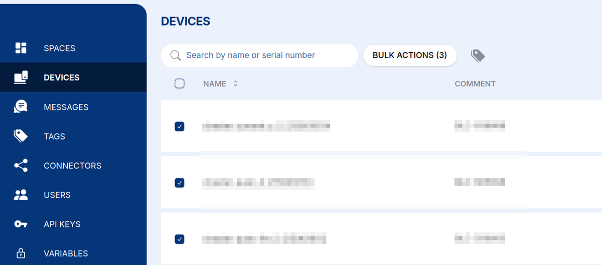
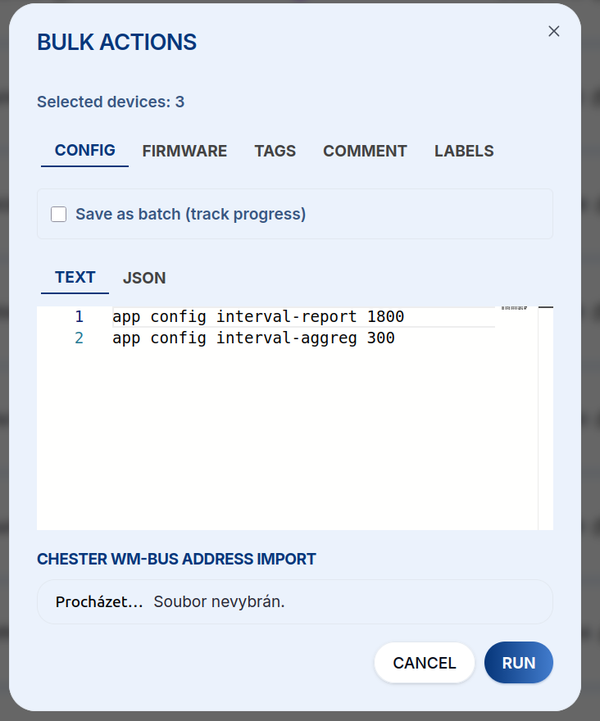
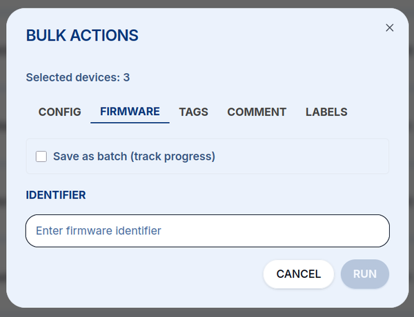
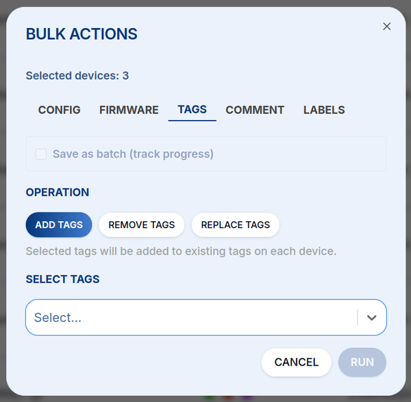
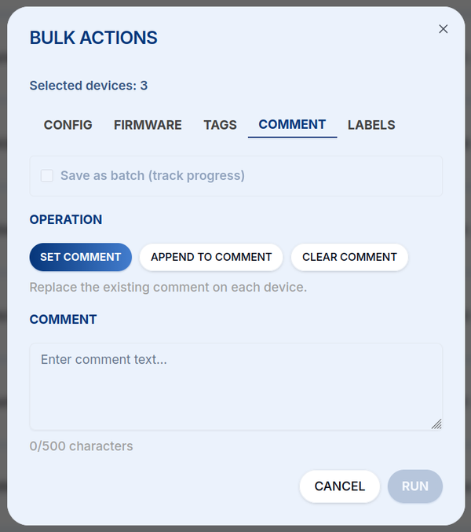
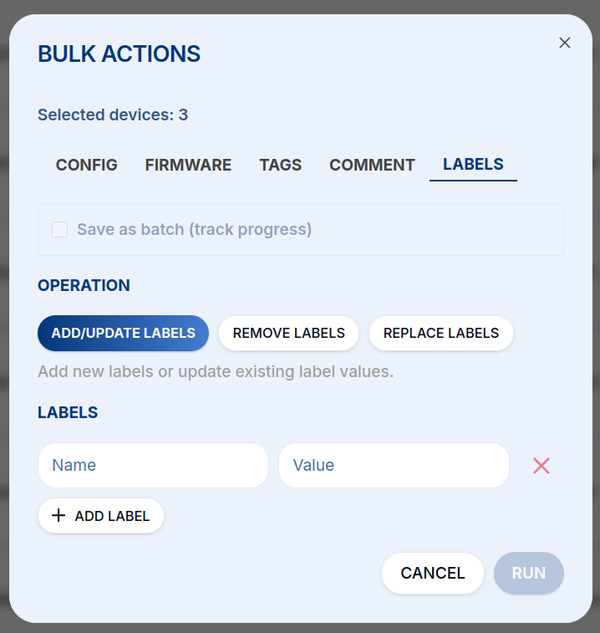

# Bulk Actions

**Bulk Actions** let you configure or manage **many devices at once** instead of one at a time,
handy when you roll out a fleet of CHESTER devices that should share the same configuration, firmware,
tags, or labels.

## Selecting Devices

On the **Devices** page, tick the checkbox next to each device you want to include (or the header
checkbox to select them all). The **BULK ACTIONS** button shows how many devices are selected. Click
it to open the Bulk Actions dialog.

## Running an Action

The dialog shows the number of **selected devices** and offers five tabs, one per kind of action.
Tick **Save as batch (track progress)** to record the operation as a batch so you can follow its
progress afterwards, then click **RUN** to apply the action to every selected device.

### Config

Send `app config` commands to every selected device, the same as a
[**Config downlink**](/cloud/downlink/config), applied in bulk. Enter the commands as **Text** or
**JSON**. For CHESTER wM-Bus deployments you can also import device addresses from a file.

### Firmware

Update the firmware of every selected device over the air. Enter the **firmware identifier** to roll
out (see [**Firmware**](/cloud/firmware)).

### Tags

Add, remove, or replace [**tags**](/cloud/tags) on the selected devices. Choose the **operation**
(Add / Remove / Replace) and pick the tags to apply.

### Comment

Set, append to, or clear the comment on the selected devices (up to 500 characters).

### Labels

Add/update, remove, or replace **labels** (name–value pairs) on the selected devices.

