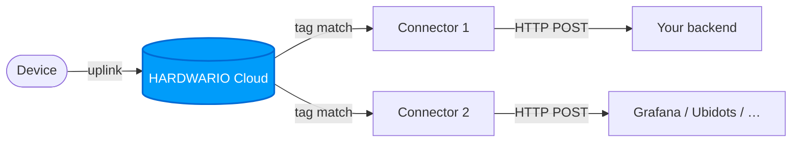

# Connectors

A **Connector** is a webhook that the Cloud calls every time a device sends an uplink message. Connectors are the primary way to push data from HARDWARIO Cloud to your own system, database, or third-party service.

## How Connectors Work

1. A device sends an uplink message to the Cloud
2. The Cloud finds all connectors that share a **tag** with the device
3. For each matching connector, the Cloud runs the **transformation function**
4. The transformed payload is sent as an HTTP request to your endpoint



## Creating a Connector

1. Open **Connectors** in the left sidebar, then click **+ NEW CONNECTOR**.

   

2. Fill in the dialog:

   | Field | Description |
   |---|---|
   | **Name** | Identifier for this connector |
   | **Direction** | `up`. The connector reacts to uplink messages (device → Cloud) |
   | **Type** | `webhook`. Delivers the message as an HTTP request |
   | **Triggers** | Which message types fire it (see [Triggers](#triggers)) |
   | **Tags** | Which device tags this connector listens to |

   <div className="screenshot-narrow">

   

   </div>

3. Click **CREATE**. The connector opens on its detail page, where you can review its settings and activity heatmap, and click **EDIT** to add the [transformation function](#the-transformation-function).

   <div className="screenshot-narrow">

   

   </div>

## Triggers

Select which message types trigger the connector:

| Trigger | Description |
|---|---|
| `data` | Periodic uplink with sensor readings. Most common |
| `session` | Boot message with firmware and network info |
| `config` | Configuration change acknowledgment |
| `stats` | Internal Cloud statistics |
| `codec` | Encoder/decoder key updates |

## The Transformation Function

Every connector runs a JavaScript function that receives a `job` object and returns the HTTP request to make. This lets you reshape the payload, add authentication headers, or filter messages.

On the connector's detail page, click **EDIT**. The editor has three tabs: **DETAILS** (name, direction, type, triggers, tags), **PLAYGROUND** (the function and its live preview), and **ADVANCED** (retry settings).

<div className="screenshot-narrow">


</div>

Open the **PLAYGROUND** tab. Write the function in the middle pane; the left pane shows a real device **message (Input)** and the right pane shows the **request that would be sent (Output)**, updated live as you type. Use **Select device** and **Select message type** to preview against real data. No HTTP request is sent while you edit.


```js
function main(job) {
  let body = job.message.body;
  return {
    "method": "POST",
    "url": "https://your-endpoint.example.com/data",
    "header": {
      "Content-Type": "application/json",
      "Authorization": "Bearer YOUR_TOKEN"
    },
    "data": body
  };
}
```

Returning `null` cancels the callback, which is useful for conditional forwarding:

```js
function main(job) {
  let temp = job.message.body?.thermometer?.temperature;
  if (temp === undefined) return null; // skip messages without temperature
  return {
    "method": "POST",
    "url": "https://your-endpoint.example.com/temperature",
    "data": { value: temp, device: job.device.name }
  };
}
```

When the function is ready, click **SAVE**.

### The `job` Object

The transformation function receives a `job` object with the following structure:

<details>
<summary><b>Show `job` object structure</b></summary>
<p>

```json
{
  "message": {
    "id": "018eebbe-678d-7c60-b4ef-d141f48378e8",
    "type": "data",
    "direction": "up",
    "created_at": "2024-04-17T11:08:27.917Z",
    "body": {
      "thermometer": { "temperature": 22.43 },
      "accelerometer": { "accel_x": 0.22, "accel_y": 9.8, "accel_z": 0.15, "orientation": 3 },
      "network": {
        "parameter": { "band": 20, "rsrp": -95, "rsrq": -6, "snr": 2 }
      }
    }
  },
  "device": {
    "id": "018a1535-fd39-7293-bd36-52df3e62e962",
    "space_id": "018a14f6-27e3-7293-b7d2-c39d7b0d7cd2",
    "serial_number": "2159020389",
    "name": "my-device",
    "label": { "location": "prague-floor-3" },
    "tags": ["temperature-sensors"]
  },
  "connector": {
    "id": "018aef7c-c122-7893-a07c-70dbc6ebbddc"
  }
}
```

</p>
</details>

## Testing Your Connector

The quickest way to confirm a connector actually fires, and to see exactly what it sends, is to point it at a free, temporary receiver such as [**webhook.site**](https://webhook.site). No backend of your own required. (The PLAYGROUND above tests your function's *output*; this tests the real HTTP *delivery*.)

1. **Get a receiver URL.** Open [webhook.site](https://webhook.site) and copy the **"Your unique URL"** shown at the top (it looks like `https://webhook.site/<id>`).

   

2. **Point the connector at it.** In the connector's **PLAYGROUND**, set the `url` in the transformation function to that address, then **SAVE**:

   ```js
   function main(job) {
     let body = job.message.body;
     return {
       "method": "POST",
       "url": "https://webhook.site/xxxxxxxx-xxxx-xxxx-xxxx-xxxxxxxxxxxx",
       "header": { "Content-Type": "application/json" },
       "data": body
     };
   }
   ```

   

   Make sure the connector's **Tags** and **Triggers** match your device (e.g. the `data` trigger).

3. **Trigger an uplink.** Wait for, or force, a message from a device in the space. A connector runs on real device uplinks.

4. **Check the result.** Go back to webhook.site: the request appears in the inbox on the left. Click it to inspect the **method**, **headers**, and **JSON body** the Cloud sent. Seeing it arrive confirms your connector works end to end.

   

:::tip
Edit the transformation function and trigger again to watch your changes land in real time. When you're happy, swap the webhook.site URL for your real endpoint.
:::

:::caution
webhook.site URLs are **public**, so use only test data while testing, and switch to your own endpoint for production traffic.
:::

**Other receivers** you can use the same way: [requestinspector.com](https://requestinspector.com/) (instant public endpoint), [ngrok.com](https://ngrok.com/) (tunnel to a server on your machine), [tailscale.com](https://tailscale.com/) (private network with a public funnel).

## Retry Policy

If the HTTP request fails (non-2xx response or timeout), the Cloud retries automatically. The default retry schedule (in seconds):

`10 → 30 → 60 → 600 → 1800 → 3600 → 10800 → 21600 → 43200`

You can customize the retry intervals in the connector's **ADVANCED** tab.
