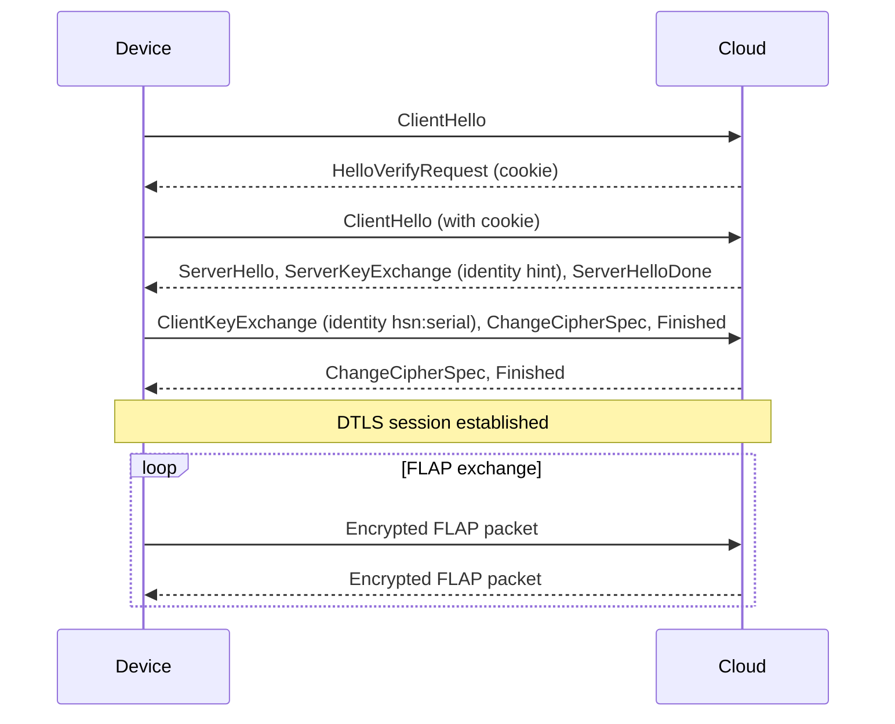

# FLAP DTLS Envelope

In the DTLS envelope (device setting `flap-dtls`), [**FLAP packets**](transfers.md#flap-packet) travel inside a **DTLS 1.2** session (RFC 6347) authenticated with a **pre-shared key** (PSK). The PSK authenticates the device and authorizes it to act as the device registered in HARDWARIO Cloud. DTLS encrypts the packets, protects their integrity and protects them against replay.

The decrypted DTLS record contains **only the FLAP packet**. There is no MAC tag and no serial number: the device is authenticated and identified by its PSK identity when the DTLS session is established.

```
+------------------- DTLS 1.2 record (encrypted) -------------------+
|  +-------------+----------------------+                           |
|  | Header      | Data                 |                           |
|  | 2 bytes     | 0 to n bytes         |                           |
|  +-------------+----------------------+                           |
+-------------------------------------------------------------------+
```

:::note

The DTLS envelope is currently available only on devices built on the **nRF9151** (for example WIMBER). CHESTER uses the MAC envelope as base64 text. This is a limitation of the current CHESTER SDK, not of the protocol, and DTLS support for CHESTER is planned.

:::

## DTLS Parameters

| Parameter | Value |
|---|---|
| **Protocol** | DTLS 1.2, UDP port 5005 |
| **Cipher suite** | `TLS_PSK_WITH_AES_128_CCM_8`, the only suite offered, see [**Cipher Suite**](#cipher-suite) |
| **PSK identity** | `hsn:` followed by the serial number in decimal, for example `hsn:2159017985` |
| **PSK** | 16 to 32 random bytes, unique for each device |
| **PSK identity hint** | `hio-udp-server` |
| **Extended master secret** | Requested (RFC 7627) |
| **Cookie exchange** | Enabled (HelloVerifyRequest) |
| **Connection ID** | Supported (RFC 9146), 4 bytes |
| **Idle timeout** | 24 hours |

### Cipher Suite

`TLS_PSK_WITH_AES_128_CCM_8` is supported both by the DTLS implementation of the nRF9151 modem and by the DTLS implementation of the Cloud. Its overhead per record is also small and fixed, so the size of a fragment is predictable (see [**Size Limits**](#size-limits)). That is why the Cloud offers only this suite.

### Connection ID

The **Connection ID** lets the device keep its DTLS session when the carrier changes its IP address or port, so it does not need a new handshake after waking up from PSM. A new handshake with the same identity replaces the previous session of the device.

## Handshake



The Cloud looks up the PSK by the identity from ClientKeyExchange. An unknown identity or a wrong PSK ends the handshake. After the handshake, the FLAP exchange works exactly as described in [**Transfers**](transfers.md).

## Size Limits

The size of a fragment follows from the size of the datagram and the overhead of the envelope:

```
fragment data = datagram - DTLS record overhead - 2 B FLAP header
```

The cipher suite is fixed, so the DTLS record overhead is fixed and small: the record header, an 8-byte explicit nonce and an 8-byte authentication tag of AES-128-CCM-8. With a 508-byte datagram this leaves almost 480 bytes of data per fragment.

| Direction | Data per fragment today |
|---|---|
| Uplink (device SDK) | 479 B |
| Downlink (Cloud) | 300 B |

The 508-byte datagram is a conservative limit that crosses any IPv4 path without fragmentation. Where the path MTU allows larger datagrams, the fragment size can grow accordingly, up to the maximum UDP payload.

## Setting Up DTLS

The same PSK must be stored in HARDWARIO Cloud and in the device.

**1. Generate a random PSK** of 16 bytes (32 hexadecimal characters):

```bash
openssl rand -hex 16
```

**2. Store the PSK in HARDWARIO Cloud**, for example with the [**REST API**](../api/devices.md). The PSK identity of a device added with a serial number is `hsn:<serial number>` automatically:

```bash
curl -X PUT \
  -H 'X-API-KEY: <api-key>' \
  -H 'Content-Type: application/json' \
  'https://api.hardwario.cloud/v2/spaces/<space-id>/devices/<device-id>' \
  -d '{
    "secret": "<psk-hex>",
    "secret_type": "psk"
  }'
```

**3. Store the PSK in the device and switch it to DTLS** in the device shell:

```
cloud psk set <psk-hex>
cloud config protocol flap-dtls
config save
```

The PSK is written into the secure credential storage of the modem. The device reconnects and opens a DTLS session with the Cloud on the next transmission. All cloud settings of the device are listed in [**Device Settings**](#device-settings).

## Device Settings

Devices built on the nRF9151 select the envelope and the server with the `cloud config` shell command. `cloud config show` lists all cloud settings. The settings that apply to the DTLS envelope:

| Parameter | Default | Description |
|---|---|---|
| `protocol` | `flap-hash` | Envelope: `flap-dtls` selects the DTLS envelope |
| `addr` | `157.245.24.13` | Default server IP address |
| `addr2`, `addr3` | Empty | Second and third server IP address, empty means unused |
| `port-flap-dtls` | `5005` | UDP port for the DTLS envelope |
| `failover` | `3` | Consecutive failed attempts before the device switches to the next address, `0` disables switching |

The defaults of the server addresses, the ports and `failover` come from Kconfig options of the firmware, so they can be changed when the firmware is built.
