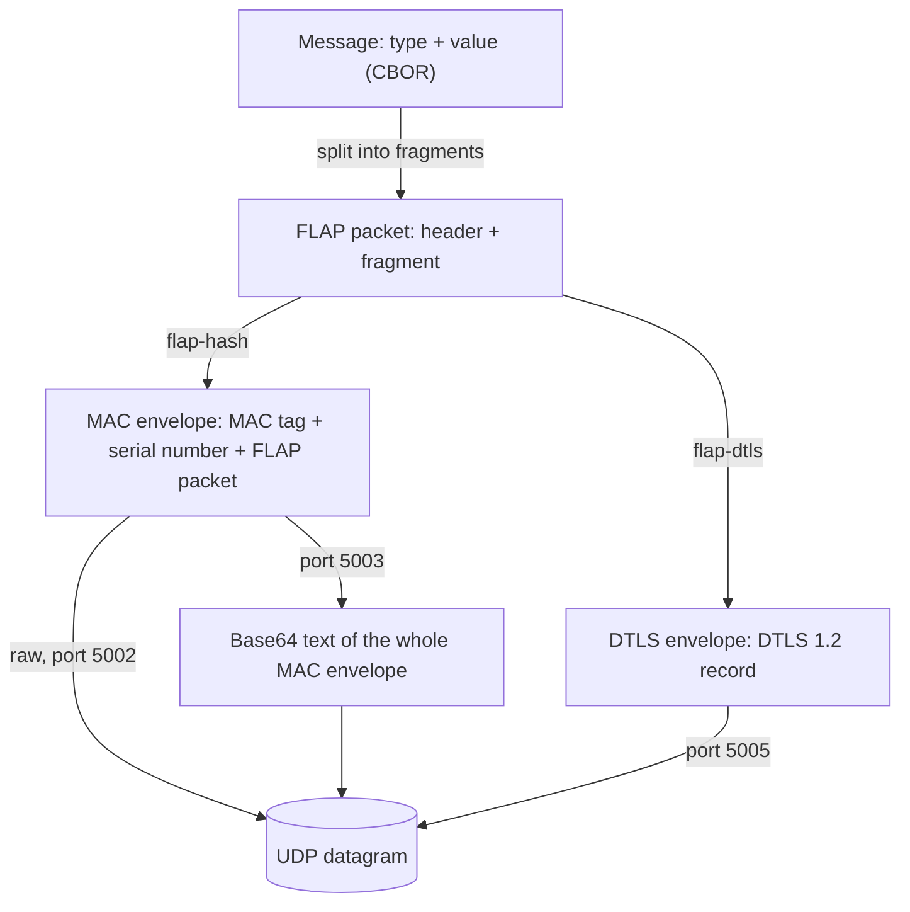

# Device Protocol (FLAP)

HARDWARIO devices with a cellular modem (for example **CHESTER** and **GLIDER**) talk to **HARDWARIO Cloud** over UDP using **FLAP**. FLAP is a lightweight request and response protocol designed for cellular IoT: it keeps the overhead low, needs only a few packets per exchange and works with the power saving features of LTE-M and NB-IoT (PSM, RAI).

The name comes from the four flags in the packet header: **F**irst, **L**ast, **A**ck and **P**oll.

:::info

This section is a technical reference of the wire protocol for firmware developers and integrators. You do not need it to use HARDWARIO Cloud with a HARDWARIO device, because the device SDK implements the protocol.

:::

## Design Principles

- **The device always speaks first.** The Cloud only responds and never sends a packet on its own. This works behind carrier NAT and with PSM, where the device cannot be reached between its transmissions.
- **One packet, one response.** Every packet from the device is answered by at most one packet from the Cloud.
- **Fragmentation.** A message of up to 16 KiB is split into fragments that fit into a 508-byte UDP payload, the largest payload that is guaranteed to cross the Internet without IP fragmentation (RFC 791, RFC 1122).
- **Acknowledgement.** Every fragment is acknowledged, and a sequence number detects lost and duplicated packets.
- **Downlink by polling.** The Cloud tells the device that a downlink is waiting, and the device fetches it with a poll packet.

## Protocol Layers

FLAP itself is only the packet: a 2-byte header with the flags and the sequence number, followed by one fragment of a message. On the way between the device and the Cloud, every FLAP packet is wrapped in one of two cryptographic **envelopes**:

- **MAC envelope** (`flap-hash`): the FLAP packet is preceded by a message authentication code (MAC) tag and the serial number of the device. The envelope is sent either raw (binary) or as base64 text. The receiver decodes base64 back to binary first and then processes the envelope the same way.
- **DTLS envelope** (`flap-dtls`): the FLAP packet travels inside a DTLS 1.2 session. There is no MAC tag and no serial number, because the device is authenticated and identified when the DTLS session is established.

| Layer | Content | Described in |
|---|---|---|
| **Message** | One application unit, for example a data upload: a type byte and a value | [**Message Types**](messages.md) |
| **FLAP packet** | A 2-byte header with the flags and the sequence number, followed by one fragment of a message | [**Packets and Transfers**](transfers.md) |
| **Envelope** | MAC envelope or DTLS envelope, protects the FLAP packet on the way | [**MAC Envelope**](mac-envelope.md), [**DTLS Envelope**](dtls-envelope.md) |
| **Transport** | One UDP datagram carries one enveloped FLAP packet | This page |

## Envelopes and Ports

| Envelope | Device setting | UDP port | Authentication and authorization | Integrity | Encryption | Used by |
|---|---|---|---|---|---|---|
| **MAC** (raw) | `flap-hash` | 5002 | Claim token | 64-bit MAC keyed with the claim token | No | Devices with the nRF9160 or nRF9151 |
| **MAC** (base64) | CHESTER LTE v2 | 5003 | Claim token | 64-bit MAC keyed with the claim token | No | CHESTER (nRF9160) |
| **DTLS** | `flap-dtls` | 5005 | Pre-shared key (PSK) | DTLS 1.2, AES-128-CCM-8 | Yes, AES-128-CCM-8 | Devices with the nRF9151 |

The secret of the envelope, the claim token or the PSK, authenticates the device and authorizes it to act as the device registered in HARDWARIO Cloud. In the MAC envelope the claim token is also the key of the MAC, so the same secret protects the integrity of every packet.

The FLAP packets, messages and device state in the Cloud are the same regardless of the envelope. The server address depends on the SIM card and APN, see [**SIM Card Setup**](/chester/platform-connectivity/cellular-networks/sim-card-setup).

:::note DTLS availability

The DTLS envelope is currently available only on devices built on the **nRF9151** (for example WIMBER). CHESTER uses the MAC envelope as base64 text. This is a limitation of the current CHESTER SDK, not of the protocol, and DTLS support for CHESTER is planned.

:::

## Terminology

| Term | Meaning |
|---|---|
| **Uplink** | Direction from the device to the Cloud |
| **Downlink** | Direction from the Cloud to the device |
| **FLAP packet** | The 2-byte FLAP header and one fragment of a message |
| **Envelope** | The cryptographic wrapping of a FLAP packet: MAC envelope or DTLS envelope |
| **Message** | One application unit (session, data, configuration, shell command, firmware chunk) |
| **Fragment** | The part of a message carried in one FLAP packet |
| **Transfer** | The exchange of all fragments of one message, including acknowledgements |
| **Sequence number** | A 12-bit counter in every FLAP packet that orders the exchange |
| **MAC tag** | The 8-byte message authentication code at the start of a MAC envelope |
| **Claim token** | A 16-byte secret unique to each device, written at the factory. It is used to add the device to the Cloud and as the MAC key |
