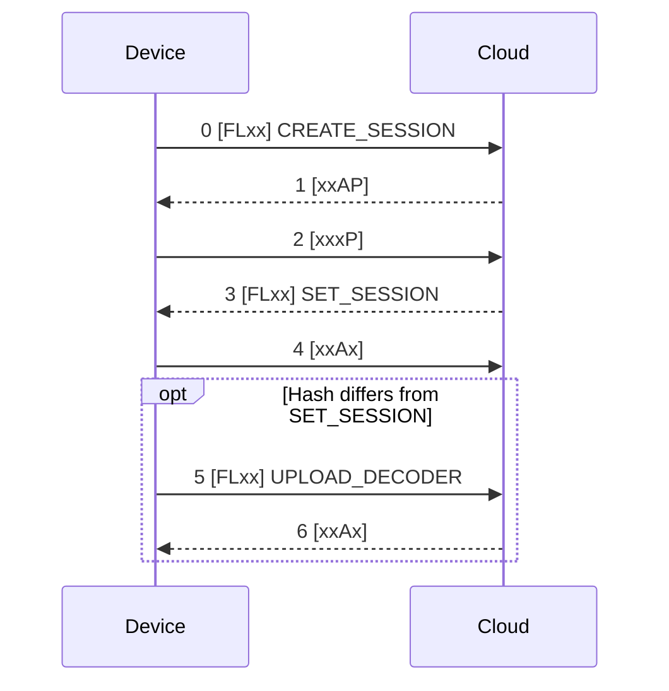

# FLAP Message Types

A **message** is reassembled from the data of all fragments of one transfer (see [**Transfers**](transfers.md)). Its first byte is the message type, the rest is the value:

```
+----------+------------------------------+
| Type     | Value                        |
| 1 byte   | 0 to 16383 bytes             |
+----------+------------------------------+
```

Most values are [**CBOR**](https://cbor.io/) maps with small integer keys. The Cloud ignores a message with an unknown type or an invalid value and does not acknowledge it.

## Message Types

| Type | Name | Direction | Value |
|---|---|---|---|
| `0x00` | CREATE_SESSION | Uplink | CBOR map with information about the device |
| `0x01` | GET_TIMESTAMP | Uplink | Empty. The Cloud answers with SET_TIMESTAMP |
| `0x02` | UPLOAD_CONFIG | Uplink | Configuration hash (8 B), `0x00`, CBOR array of configuration lines |
| `0x03` | UPLOAD_DECODER | Uplink | Codec hash (8 B), CBOR decoder definition |
| `0x04` | UPLOAD_ENCODER | Uplink | Codec hash (8 B), CBOR encoder definition |
| `0x05` | UPLOAD_STATS | Uplink | CBOR map with uptime and cellular network statistics |
| `0x06` | UPLOAD_DATA | Uplink | Decoder hash (8 B), CBOR application data |
| `0x07` | UPLOAD_SHELL | Uplink | CBOR map with results of shell commands |
| `0x08` | UPLOAD_FIRMWARE | Uplink | CBOR map with a firmware update request or status |
| `0x80` | SET_SESSION | Downlink | CBOR map with the session parameters |
| `0x81` | SET_TIMESTAMP | Downlink | Unix time in seconds as a 64-bit integer (8 B) |
| `0x82` | DOWNLOAD_CONFIG | Downlink | `0x00`, CBOR array of configuration commands |
| `0x86` | DOWNLOAD_DATA | Downlink | Encoder hash (8 B), CBOR application data |
| `0x87` | DOWNLOAD_SHELL | Downlink | CBOR map with shell commands to run |
| `0x88` | DOWNLOAD_FIRMWARE | Downlink | CBOR map with a firmware chunk |
| `0xFF` | REQUEST_REBOOT | Downlink | Reserved |

## Session Start

After the device connects to the network, it opens a session before it sends any data:

1. The device sends **CREATE_SESSION**. The Cloud acknowledges it with the P flag, because the SET_SESSION response is waiting.
2. The device polls and receives **SET_SESSION**. It sets its clock from the timestamp in it.
3. SET_SESSION contains the hashes of the decoder, encoder and configuration the Cloud knows for this device. The device uploads only those that differ: **UPLOAD_DECODER**, **UPLOAD_ENCODER**, **UPLOAD_CONFIG**.
4. The device is ready to send **UPLOAD_DATA** and to poll for downlinks.



The FLAP headers of the first five packets are `c000`, `3001`, `1002`, `c003` and `2004`.

### CREATE_SESSION

| Key | Value | Type |
|---|---|---|
| 0 | Watchdog timeout (reserved, 0) | Integer |
| 1 | Vendor name | Text |
| 2 | Product name | Text |
| 3 | Hardware variant | Text |
| 4 | Hardware revision | Text |
| 5 | Firmware bundle | Text |
| 6 | Firmware name | Text |
| 7 | Firmware version | Text |
| 8 | Bluetooth passkey | Text |
| 9 | IMSI | Integer |
| 10 | IMEI | Integer |
| 11 | Modem firmware version | Text |
| 12 to 15 | CHESTER-Z serial number, hardware revision, hardware variant, firmware version (only with CHESTER-Z) | Text |
| 16 | Serial number | Integer |
| 17 | ICCID | Text |

### SET_SESSION

| Key | Value | Type |
|---|---|---|
| 0 | Session ID | Integer |
| 1 | Decoder hash | Integer (64 bit) |
| 2 | Encoder hash | Integer (64 bit) |
| 3 | Configuration hash | Integer (64 bit) |
| 4 | Current time, Unix time in seconds | Integer |
| 5 | Device ID in HARDWARIO Cloud | Text |
| 6 | Device name in HARDWARIO Cloud | Text |

## Codecs and Data

A **decoder** converts CBOR data from the device into JSON, an **encoder** converts JSON downlinks into CBOR. Both are built into the firmware and uploaded automatically during the session start, so the Cloud always decodes data with the codec of the firmware that sent it.

The **codec hash** identifies a codec. It is computed over the CBOR codec definition (the value after the hash):

```
digest = SHA-256( codec )
w[k]   = digest[8k .. 8k+7] read as a little-endian 64-bit integer      for k = 0..3
hash   = w[0] ^ w[1] ^ w[2] ^ w[3]                     (sent as big-endian)
```

The Cloud checks the hash of an uploaded codec. UPLOAD_DATA and DOWNLOAD_DATA start with the hash of the codec that the data belongs to.

## Configuration

**UPLOAD_CONFIG** carries the configuration of the device as a CBOR array of text lines in the format of the `config show` shell command, preceded by an 8-byte configuration hash and the byte `0x00` (no compression). The Cloud stores the hash and returns it in SET_SESSION, so the device uploads its configuration only when it has changed.

**DOWNLOAD_CONFIG** carries configuration commands, see [**Config downlink**](../downlink/config.md). The device runs them, saves the configuration and reboots.

## Shell Commands

**DOWNLOAD_SHELL** is a CBOR map with an array of commands (key 0) and a 16-byte message ID (key 1). The device runs the commands and answers with **UPLOAD_SHELL**: a CBOR map with an array of results (key 0) and the same message ID (key 1). Each result contains the command (key 0), its return code if it is not zero (key 1) and an array of output lines (key 2). See [**Shell downlink**](../downlink/shell.md).

## Firmware Update

Firmware updates over the air use **UPLOAD_FIRMWARE** and **DOWNLOAD_FIRMWARE**:

1. The device requests an update with the type `download` and the firmware ID.
2. The Cloud sends the firmware in chunks (type `chunk`). The device answers each chunk with the type `next` and the offset of the next chunk.
3. After the last chunk the device reports `swap` and reboots into the new firmware.
4. After a successful boot it reports `ack`. If anything fails it reports `error`.

See [**Firmware**](../firmware.md) for how to start an update from HARDWARIO Cloud.
