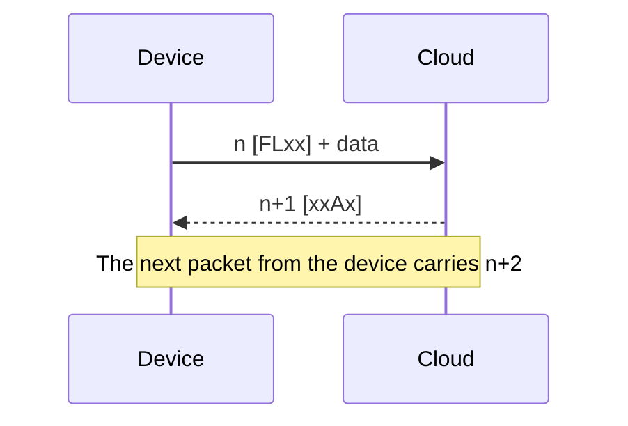
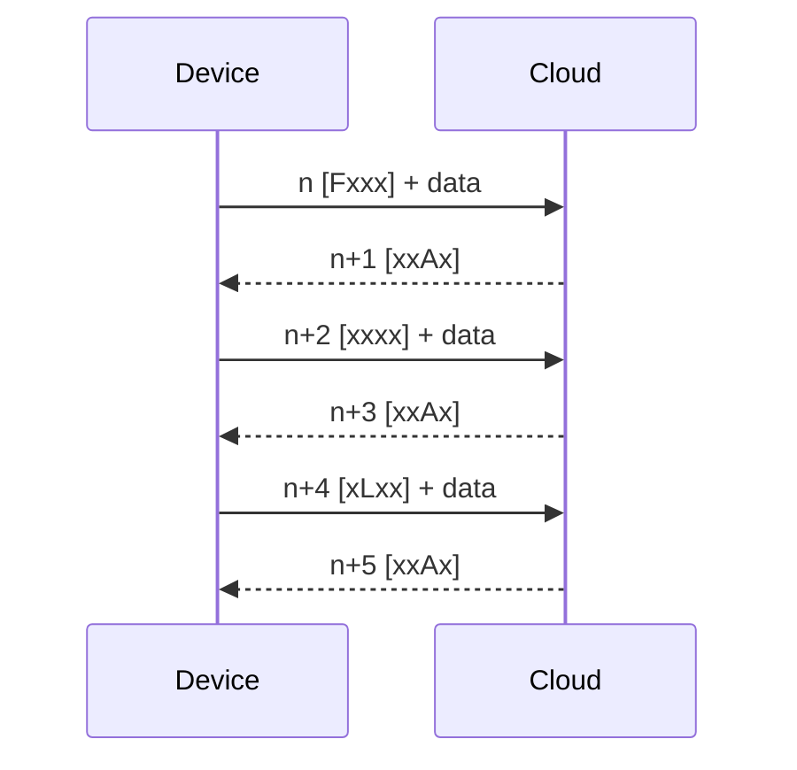
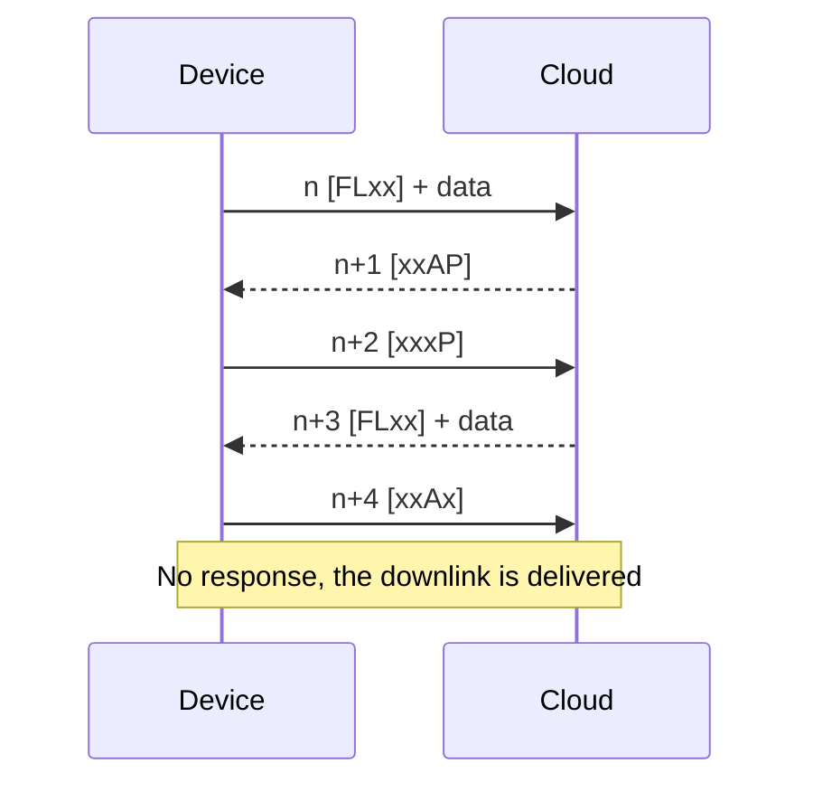
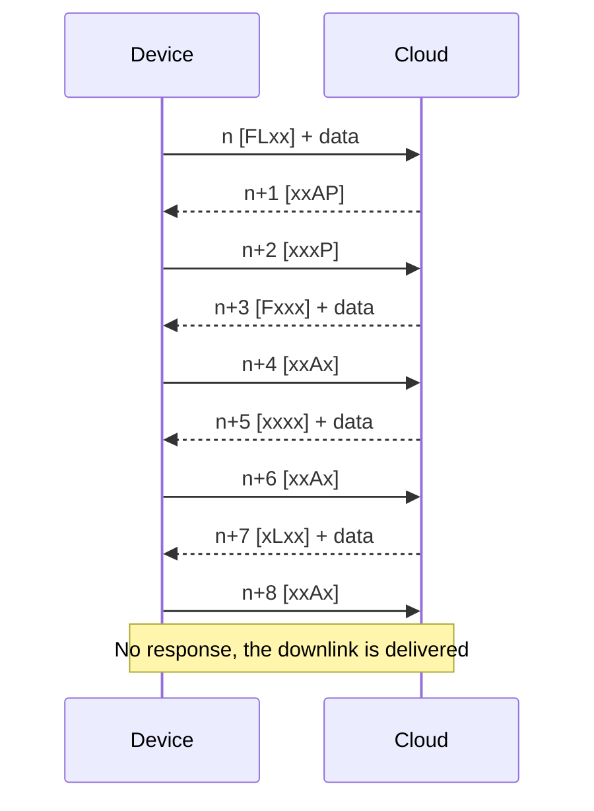
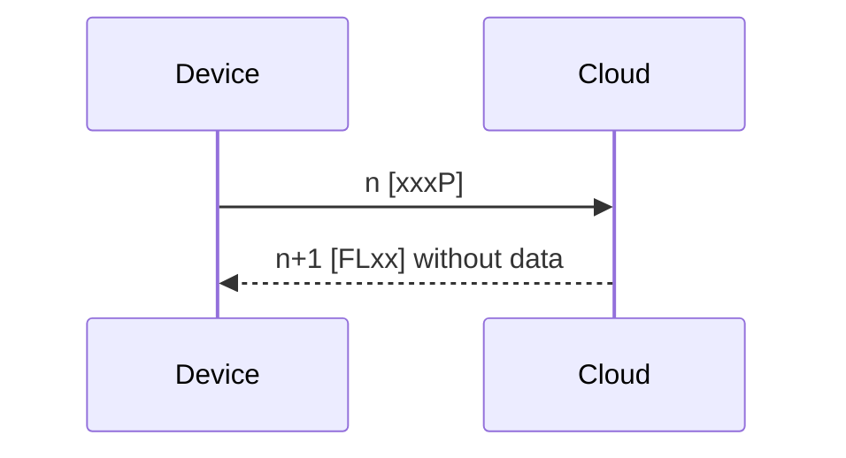
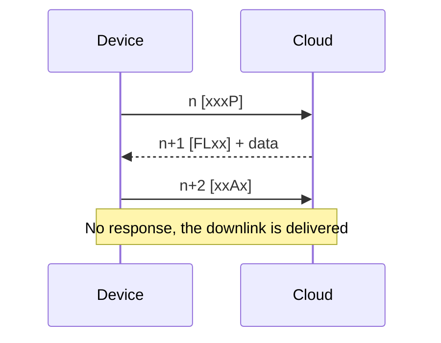
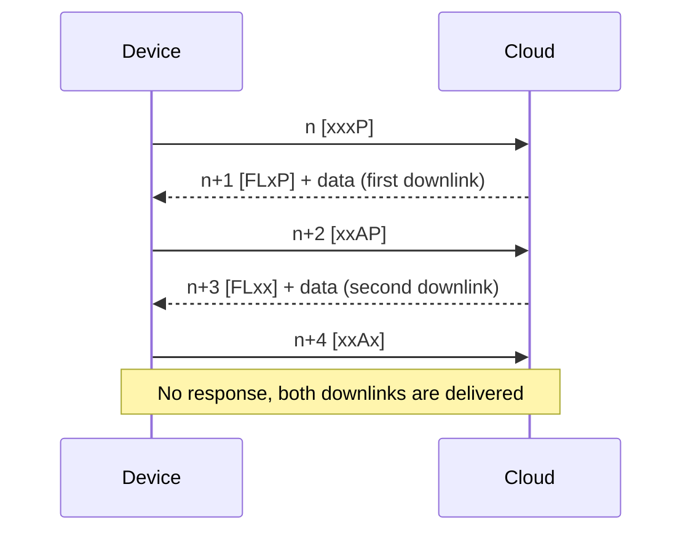

# FLAP Packets and Transfers

The FLAP packet is the protocol unit exchanged between the device and the Cloud. It is never sent on its own: on the way it always travels inside a [**MAC envelope**](mac-envelope.md) or a [**DTLS envelope**](dtls-envelope.md). All multi-byte fields are **big-endian**.

## FLAP Packet

```
+-------------+----------------------+
| Header      | Data                 |
| 2 bytes     | 0 to n bytes         |
+-------------+----------------------+
```

| Field | Size | Description |
|---|---|---|
| **Header** | 2 B | Flags and sequence number, see [**FLAP Header**](#flap-header) |
| **Data** | 0 to n B | One fragment of a message, see [**Message Types**](messages.md) |

### FLAP Header

The header is one 16-bit big-endian value:

| Bit | 15 | 14 | 13 | 12 | 11 to 0 |
|---|---|---|---|---|---|
| **Field** | F | L | A | P | Sequence number |

| Flag | Name | Meaning |
|---|---|---|
| **F** | First | The packet carries the first fragment of a message |
| **L** | Last | The packet carries the last fragment of a message. A single-fragment message has both F and L set |
| **A** | Ack | Acknowledges the previous packet of the counterpart. A packet with the A flag never carries data |
| **P** | Poll | From the device: "send me a downlink". From the Cloud: "a downlink is waiting for you" |

The 12-bit **sequence number** is described in [**Sequence Number**](#sequence-number).

### Flag Notation

In logs and in this documentation, the flags are written as four characters in the order `FLAP`, with `x` for a flag that is not set. For example `[FLxx]` is a single-fragment message and `[xxAP]` is an acknowledgement with the Poll flag.

| Header | Flags | Sequence | Meaning |
|---|---|---|---|
| `0xC000` | `[FLxx]` | 0 | Single-fragment message, start of a new exchange |
| `0x3001` | `[xxAP]` | 1 | Acknowledgement, a downlink is waiting |
| `0x1002` | `[xxxP]` | 2 | Poll |
| `0x2004` | `[xxAx]` | 4 | Acknowledgement |
| `0x0000` | `[xxxx]` | 0 | Reset request from the Cloud, see [**Reset**](#reset) |

## Sequence Number

The device and the Cloud share **one sequence counter**. Every packet, in either direction, carries the sequence number of the previous packet plus one:

- The device sends a packet with the sequence number `n`.
- The Cloud answers with `n+1`.
- The next packet from the device carries `n+2`.
- If the Cloud does not answer a packet (for example the final acknowledgement of a downlink), the next packet from the device carries the sequence number of its own last packet plus one.

An acknowledgement does **not** repeat the sequence number of the packet it acknowledges. It carries the next value of the counter.

The value `0` is reserved: a packet with the sequence number `0` starts a new exchange (see [**Reset**](#reset)). The value after `4095` is `1`. The device starts with `0` after a boot and after any error.

The device checks that every response carries the sequence number of its request plus one. If it does not, the device starts over with the sequence number `0`.

## Uplink Transfer

The device splits a message into fragments and sends them in order:

- The first fragment has the **F** flag, the last one the **L** flag, the fragments in between have no flags. A message that fits into one fragment is sent as `[FLxx]`.
- The Cloud acknowledges every fragment with `[xxAx]`.
- When the last fragment is acknowledged and a downlink is waiting, the acknowledgement is `[xxAP]`.
- Fragments never carry the A or P flag. To poll, the device sends a separate packet without data.

## Downlink Transfer

The device fetches downlinks by **polling**:

- The device sends `[xxxP]` without data.
- If a downlink is waiting, the Cloud answers with its first fragment (`[Fxxx]`, or `[FLxx]` for a single fragment). If nothing is waiting, it answers `[FLxx]` without data.
- The device acknowledges every fragment with `[xxAx]`. The Cloud answers the acknowledgement of a fragment with the next fragment.
- The acknowledgement of the last fragment is not answered, unless it is `[xxAP]`: then the Cloud answers with the next downlink.
- When another downlink is waiting, the Cloud sets the **P** flag on the last fragment, for example `[FLxP]` or `[xLxP]`.

A downlink is marked as delivered in HARDWARIO Cloud when the acknowledgement of its last fragment arrives. If that acknowledgement is lost, the next packet from the device that continues the sequence also confirms the delivery. Until then the Cloud offers the same downlink on every poll. A downlink that is not delivered within 30 days expires.

The device polls when an acknowledgement carries the P flag, at the poll interval set by the application (for example `app config interval-poll`), and on demand with the `cloud poll` shell command. See [**Downlink**](../downlink/index.md) for how downlinks are queued.

## Reset

**From the device.** A packet with the sequence number `0` tells the Cloud to discard the state of any unfinished transfer for this device and to treat the packet as the start of a new exchange. A downlink that was completely sent but not yet acknowledged is confirmed first.

**From the Cloud.** The Cloud asks the device to start over by sending a **reset packet**: header `0x0000` (no flags, sequence number `0`, no data). It sends one when:

- the sequence number of a packet is ahead of the expected value, for example after a restart of the Cloud service,
- the MAC tag of a [**MAC envelope**](mac-envelope.md) with a known serial number is invalid,
- the device keeps repeating the same packet for more than 60 seconds.

A device that receives a reset packet sets its sequence number to `0` and sends the current message again from its first fragment.

A packet with a sequence number behind the expected value is ignored.

## Retransmission and Duplicates

The Cloud never sends a packet on its own, so retransmission is the responsibility of the device. When a response does not arrive in time, the device can:

- **Repeat the packet.** The device sends the identical packet again (same sequence number, flags and data). The Cloud recognises it as a duplicate of the last packet and answers **every second** duplicate with the response it sent before, so the device should repeat at least twice. This matters with RAI, where the device can receive a response only right after it sends something.
- **Start over.** The device gives up the transfer and sends the message again with the sequence number `0`. The CHESTER SDK works this way: it waits 5 seconds for each response and starts over on any failure.

## Size Limits

- The data of one FLAP packet must fit into one UDP datagram together with the envelope. The datagram limit is 508 bytes today. The maximum fragment size therefore depends on the envelope, see [**MAC Envelope**](mac-envelope.md#size-limits) and [**DTLS Envelope**](dtls-envelope.md#size-limits).
- A message reassembled from fragments carries a value of at most 16383 bytes.

## Invalid Packets

The Cloud does not respond to a FLAP packet shorter than 2 bytes, a packet with the A flag that carries data, or a packet whose flags do not fit the current state of the transfer. Packets rejected by the envelope never reach this layer.

## Scenarios

The diagrams below show every combination of uplink and downlink. `n` is the current value of the sequence counter.

### Scenario A: Single-Fragment Uplink, No Downlink



### Scenario B: Multi-Fragment Uplink, No Downlink



### Scenario C: Single-Fragment Uplink, Single-Fragment Downlink Waiting



### Scenario D: Single-Fragment Uplink, Multi-Fragment Downlink Waiting



### Scenario E: Poll, No Downlink



### Scenario F: Poll, Single-Fragment Downlink



### Scenario G: Poll, Two Single-Fragment Downlinks



The session start in [**Message Types**](messages.md#session-start) is a real example of scenario C.
