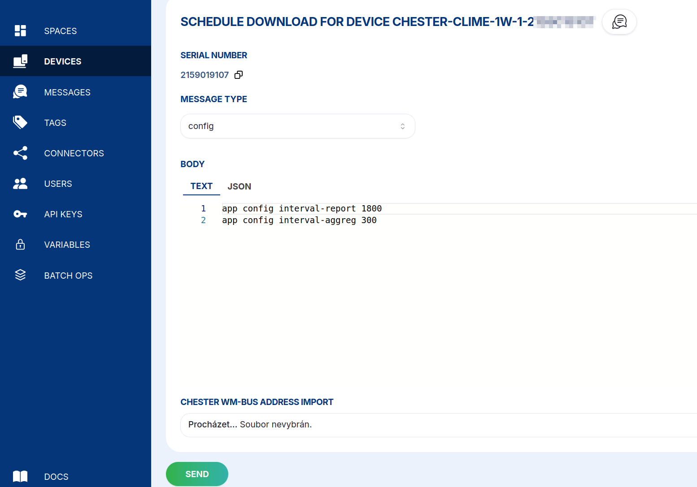

import Tabs from '@theme/Tabs';
import TabItem from '@theme/TabItem';

# Config

Change the device's configuration the same way you would over BLE or J-Link RTT — send one or more
`app config` commands, and CHESTER applies them the next time it sends an uplink packet or polls the
Cloud.

Open the device's **Messages** → **+&nbsp;SCHEDULE DOWNLINK**, set **Message type** to **config**, and
enter the commands in the **Body** as plain **text** or **JSON**, then **SEND**.



<Tabs>
  <TabItem value="text" label="Text" default>

```
app config mode lte
app config interval-sample 60
app config interval-aggreg 300
app config interval-report 1800
```

  </TabItem>
  <TabItem value="json" label="JSON">

```json
{
  "type": "config",
  "device_id": "<device-id>",
  "body": [
    "app config mode lte",
    "app config interval-sample 60",
    "app config interval-aggreg 300",
    "app config interval-report 1800"
  ]
}
```

  </TabItem>
</Tabs>

:::warning[Do not send config save over the Cloud]

When you configure a device **locally** you finish with `config save` to persist the changes and
reboot. **Over the Cloud you must not send `config save`** — HARDWARIO Cloud applies and saves the
configuration for you automatically. Adding it yourself can double-apply the change, so simply omit it.

:::

For the full list of configuration parameters see the CHESTER
[**Default Configuration**](/chester/catalog-applications/common-functionality#default-configuration)
reference; the `app config show` command prints a device's current values.
