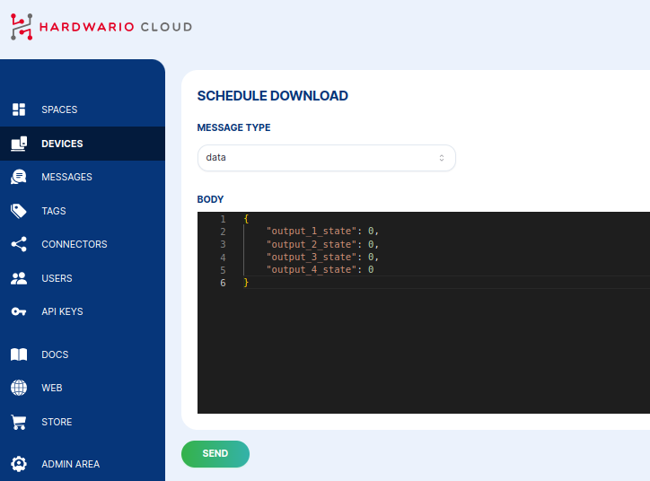

# Data

A **data** downlink sends a JSON object down to the device. Your firmware decodes it
into a structure with the values filled in. Use it to control outputs, change a
setpoint, or trigger an action.

## Send a data downlink

1. Open the device's **Messages** and click **+&nbsp;SCHEDULE DOWNLINK**.
2. Set **Message type** to **data**.
3. Enter the JSON **Body** your firmware expects, then click **SEND**.



For example, a CHESTER Control application with four outputs might accept:

```json
{
  "output_1_state": 0,
  "output_2_state": 0,
  "output_3_state": 0,
  "output_4_state": 0
}
```

The exact keys depend on your device's firmware. Like every downlink, the message is
**queued** and delivered the next time the device boots, sends an uplink, or polls the
Cloud.
