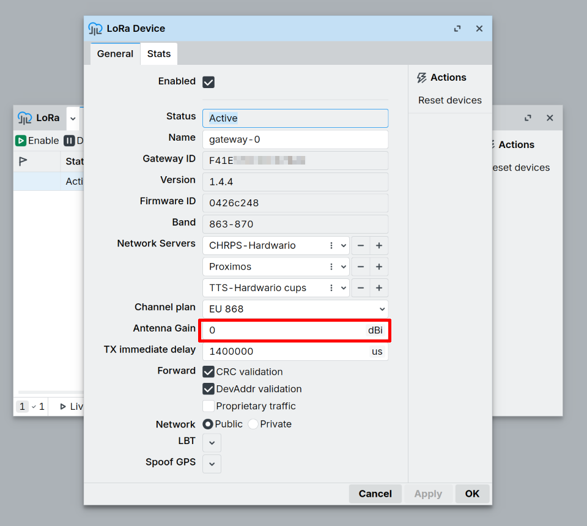

# Antenna Gain & Output Power

This page explains how transmit (TX) power works on a MikroTik LoRa gateway
(R11e-LR8G / wAP LR8G kit) and how to configure the `antenna-gain` setting so the
gateway stays within the legal radiated-power limit (EIRP).

:::warning Read this before attaching an external antenna
There is **no "TX power" setting on the gateway**. The card's only RF control is
`antenna-gain`, and its factory default is `0`. If you attach an antenna with gain
and leave the default, the gateway will radiate **above** the intended power and can
exceed the legal EIRP limit.
:::

---

## What is antenna gain?

Antenna gain describes how much an antenna concentrates radio energy in certain
directions, compared to a theoretical antenna that radiates equally in every
direction (an **isotropic radiator**). It's expressed in **dBi** — decibels
relative to isotropic.

:::info Gain reshapes power, it doesn't create it
A higher-gain antenna doesn't transmit more energy — it takes the same total
power and squeezes it into a narrower radiation pattern, concentrating more of
it toward the horizon and less straight up/down. Total radiated power stays
the same; gain only redistributes it.
:::

### Range vs. coverage radius

Two things are easy to confuse:

- **Range** — how far the signal reaches in the antenna's strongest direction
  (for an omnidirectional antenna, that's toward the horizon).
- **Coverage radius** — how much of the surrounding space, in every direction
  (including straight down, straight up, nearby floors of a building),
  actually gets usable signal.

A higher-gain omnidirectional antenna increases horizontal **range** by
narrowing the vertical beamwidth. That's good for long links over flat, open
terrain — but it can leave a **coverage gap directly under or very close to
the gateway**, since less energy goes that way. A device right below a
high-mounted, high-gain antenna can have worse signal than one much farther
away on the horizon.

| Antenna gain | Vertical beamwidth | Best for |
| --- | --- | --- |
| Low (~0–2 dBi) | Wide | Devices close by / at many different heights — e.g. indoors, multi-floor buildings |
| Higher (~6+ dBi) | Narrower | Long-range outdoor links, devices roughly level with or below the gateway, spread horizontally |

Match the antenna's gain to the deployment, not just to "more range = better."

---

## How TX power actually works

A MikroTik LoRa gateway does **not** set its own transmit power. The value comes from
the LoRaWAN Network Server and the gateway only compensates for the antenna:

```
radio output (at the connector) = server_value − antenna-gain
radiated EIRP                    = radio output + antenna gain − cable loss
```

- **`server_value`** — the TX power the Network Server requests, in dBm EIRP
  (Semtech UDP `txpk.powe` field). In ChirpStack this is `downlink_tx_power` in the
  region file (e.g. `region_eu868.toml`); `-1` means "use the band maximum".
- **`antenna-gain`** — a MikroTik gateway setting, in dBi. It is a **subtraction**, not
  a boost. It exists so that after the antenna adds its gain back, the radiated EIRP
  matches what the server asked for.

:::info Counter-intuitive
A **higher** `antenna-gain` value produces **lower** power out of the radio. It is a
compensation knob for regulatory compliance, not a way to increase range.
:::

---

## Configure `antenna-gain`

Enter the **real gain of the attached antenna in dBi, minus cable loss**.

:::info
For the full list of LoRa parameters and their exact definitions, see the MikroTik
documentation: [LoRa General Properties](https://help.mikrotik.com/docs/spaces/ROS/pages/16351619/General+Properties).
:::

### WebFig / WinBox

1. Open **LoRa** in the left menu.
2. Click the LoRa interface (e.g. `lora1`).
3. Go to the **General** tab.
4. Set **Antenna Gain** to the antenna's gain in dBi.
5. Click **Apply**.



### CLI (terminal / SSH)

```
/lora print
/lora set [find] antenna-gain=2
```

> On newer RouterOS builds the menu may be `/iot lora` instead of `/lora`. If `/lora`
> is not found, use `/iot lora set [find] antenna-gain=2`.

---

## Recommended values

| Antenna | Gain | `antenna-gain` value |
| --- | --- | --- |
| wAP LR8G kit built-in antenna (868 MHz) | 2 dBi | `2` |
| MikroTik omni LoRa antenna kit (`TOF-0809-...`) | 6.5 dBi | `6.5` |
| Other external antenna | see its datasheet | antenna dBi − cable loss |

If the antenna gain is unknown, err on the **higher** side — the gateway will back off
its power further and stay within legal limits.

---

## Worked example (EU868)

Downlink on 869.525 MHz, EIRP limit **27 dBm**, 6.5 dBi antenna, server requests
`powe = 27`:

| `antenna-gain` | Radio output | Radiated EIRP | Result |
| --- | --- | --- | --- |
| `0` (default) | 27 dBm | **33.5 dBm** | <span style={{color: 'var(--ifm-color-danger)'}}>✗</span> 6.5 dB over the limit |
| `6.5` | 20.5 dBm | 27 dBm | <span style={{color: 'var(--ifm-color-success)'}}>✓</span> correct |
| `4.5` (6.5 dBi antenna − 2 dB cable) | 22.5 dBm | 27 dBm | <span style={{color: 'var(--ifm-color-success)'}}>✓</span> correct |

---

## Changing the transmit power itself

Because the gateway takes its power from the Network Server, change the **downlink** TX
power there — for example in ChirpStack, `downlink_tx_power` (dBm EIRP) in
`region_eu868.toml`. The **uplink** TX power is a property of the **end device** (node
firmware or ADR from the server), not the gateway.

To increase real-world range, use a better antenna and/or shorter, lower-loss cable —
then update `antenna-gain` accordingly. The setting itself never adds power.

:::caution wAP LR8G kit — connect the internal antenna first
On the wAP LR8G kit the internal antenna is **not connected from the factory**. Attach
it to the card's **RFIO** u.FL connector (with the device powered off) before use, or
the card cannot transmit or receive over the antenna at all.
:::

---

## Regulatory limits (EU868)

- **Uplink:** max 25 mW = **14 dBm**
- **Downlink** on 869.525 MHz (RX2 band): up to 500 mW = **27 dBm** EIRP
- **EIRP** = TX power (dBm) + antenna gain (dBi) − cable loss (dB)

Always check the LoRaWAN Regional Parameters and your local regulations for the values
that apply to your deployment.

---

## Further reading

- [MikroTik — LoRa General Properties](https://help.mikrotik.com/docs/spaces/ROS/pages/16351619/General+Properties)
  — full reference for all LoRa configuration parameters, including `antenna-gain`.
