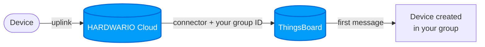

import Image from '@theme/IdealImage';
import ThingsBoardConnector from '@site/src/components/ThingsBoardConnector';
import EditCodeBlock from '../../../../../apps/thingsboard/edit-code-block.js';

# Připojení k HARDWARIO Cloud {#connecting-to-the-hardwario-cloud}

Zařízení z HARDWARIO Cloudu dostanete do ThingsBoard dvěma způsoby:

- **[Automatické připojení](#automatic-connection)** (doporučeno): přidáte jeden konektor a každé otagované zařízení se samo vytvoří ve vaší skupině zařízení.
- **[Ruční připojení](#manual-connection)**: pro zařízení, která už v ThingsBoard existují.

---

## Automatické připojení {#automatic-connection}

Vaše zařízení se **objeví ve vašem účtu ThingsBoard sama**, ve skupině zařízení, kterou si zvolíte. Přidáte jeden konektor a otagujete zařízení, která chcete posílat. V ThingsBoard nemusíte nic nastavovat.

Potřebujete účet v ThingsBoard. Pokud ho ještě nemáte, napište nám na [ask@hardwario.com](mailto:ask@hardwario.com).

### Krok 1: Najděte svou skupinu zařízení {#step-1-find-your-device-group}

Skupina zařízení říká ThingsBoard, kam vaše zařízení patří.

1. Přihlaste se do [ThingsBoard](https://app.hardwario.cloud), otevřete **Entities → Devices** a přepněte na záložku **Groups**.
2. Klikněte na řádek skupiny, do které chcete zařízení přidávat. Pokud skupiny nepoužíváte, zvolte **All**, nebo si nejdřív [vytvořte novou skupinu](/apps/thingsboard/users-managing#creating-a-device-group).
3. V detailu skupiny vpravo klikněte na **Copy entity group Id**.

   

:::tip Mějte zařízení roztříděná
ID skupiny určuje, kde se vaše zařízení vytvoří. Vytvořte si skupinu pro každou budovu, lokalitu nebo projekt a pro každou skupinu přidejte jeden konektor - každý s vlastním ID skupiny a vlastním tagem (např. `thingsboard-sklad`, `thingsboard-kancelar`). Každé zařízení pak skončí ve správné skupině samo.
:::

### Krok 2: Získejte kód konektoru {#step-2-get-your-connector-code}

Vložte zkopírované ID níže. Kód se doplní sám.

<ThingsBoardConnector />

### Krok 3: Přidejte konektor {#step-3-add-the-connector}

[Vytvořte konektor](/cloud/connectors#creating-a-connector) s tímto nastavením a jako [transformační funkci](/cloud/connectors#the-transformation-function) do něj vložte kód z kroku 2:

| Nastavení | Hodnota |
|---|---|
| **Name** | `thingsboard` |
| **Triggers** | `data`, `session`, `config` (viz [Spouštěče](/cloud/connectors#triggers)) |
| **Tags** | nový tag `thingsboard` (viz [Vytvoření tagu](/cloud/tags#creating-a-tag)) |

### Krok 4: Otagujte zařízení {#step-4-tag-your-devices}

Přidejte tag `thingsboard` každému zařízení, které chcete mít v ThingsBoard, viz [Přiřazování tagů](/cloud/tags#assigning-tags), nebo otagujte víc zařízení najednou přes [Hromadné akce](/cloud/bulk-actions#tags).

### Co se stane v ThingsBoard {#what-happens-in-thingsboard}

S **další zprávou** každého otagovaného zařízení se zařízení objeví ve vaší skupině zařízení:

| V ThingsBoard | Hodnota |
|---|---|
| **Název zařízení** | `chester-<sériové číslo>`, např. `chester-2159012345` |
| **Label** | sériové číslo |
| **Atributy** | název zařízení z HARDWARIO Cloudu, výrobek, verze firmwaru, IMEI, ICCID, konfigurace zařízení, sériová čísla BLE tagů |
| **Telemetrie** | všechna měření s původními časy, zaokrouhlená na dvě desetinná místa; BLE tagy jako `ble_tags.0.…`, `ble_tags.1.…` |

Každá další zpráva už jen přidává nová data. Zařízení se hlásí ve svém intervalu, takže se může objevit až za jeden interval.

- **Přejmenování zařízení** v HARDWARIO Cloudu změní jen atribut s jeho názvem. Zařízení si ponechá název, label i historii.
- **Další zařízení později:** stačí je otagovat tagem `thingsboard`.
- **Jiná skupina:** vložte do konektoru ID nové skupiny. Zařízení se tam přesunou s další zprávou.
- **Zastavení dat:** odeberte tag `thingsboard`. Zařízení i jeho historie v ThingsBoard zůstanou.
- **Smazání zařízení v ThingsBoard** data nezastaví. Dokud má zařízení tag, další zpráva ho přidá znovu, proto nejdřív odeberte tag.
- **Zařízení, která už v ThingsBoard máte:** netagujte je, objevila by se podruhé. Použijte pro ně [ruční připojení](#manual-connection).

### Řešení potíží {#troubleshooting}

| Problém | Co dělat |
|---|---|
| Zařízení se neobjevuje | Zkontrolujte, že má tag `thingsboard` a že od otagování poslalo zprávu. |
| Zařízení nejsou v mé skupině | Porovnejte ID skupiny v konektoru se svou skupinou. Po opravě se zařízení přesunou s další zprávou. |

Cokoli dalšího: [ask@hardwario.com](mailto:ask@hardwario.com).

---

## Ruční připojení {#manual-connection}

Tento návod použijte pro zařízení, která už v ThingsBoard existují. Vytvoříte konektor, transformujete data a pošlete je do ThingsBoard s access tokenem zařízení.

### Krok 1: Připravte zařízení {#step-1-prepare-your-device}

Než konektor nastavíte, připravte zařízení v HARDWARIO Cloud tak, aby vědělo, kam data posílat a jak se autentizovat:

- **Přiřaďte tag**: otevřete detail zařízení a přiřaďte mu tag (tagy se vytvářejí v pravém menu)
- **Přidejte label s access tokenem**: sjeďte na stránce zařízení úplně dolů k sekci `Labels` a vytvořte v ní nový label:
  - `Name`: zadejte název tokenu, například `thingsboardtoken`  
    *(Poznámka: Název si můžete zvolit jakýkoli, ale musí být úplně stejný u všech zařízení, která tento konektor sdílejí, a musí odpovídat názvu v transformačním kódu.)*
  - `Value`: vložte access token zařízení z ThingsBoard

:::info Jak získat access token z platformy ThingsBoard
Přihlaste se do své instance ThingsBoard, přejděte na **Entities > Devices** a klikněte na příslušné zařízení. V panelu s detailem zařízení, který se otevře, klikněte na tlačítko **Copy access token**.
:::

---

### Krok 2: Vytvořte nový konektor {#step-2-create-a-new-connector}

Chcete-li navázat komunikaci s platformou ThingsBoard, přejděte v levém menu do sekce `Connectors`.  
Klikněte na `+ New Connector` a nastavte:

- `Name`: pojmenujte konektor
- `Type`: pro integraci s platformou ThingsBoard zvolte `Webhook`
- `Trigger`: zvolte `Data`
- `Tag`: přiřaďte tag, který jste vytvořili dříve

---

### Krok 3: Transformujte data do formátu ThingsBoard {#step-3-transform-data-for-thingsboard-format}

ThingsBoard vyžaduje konkrétní formát dat. Data ze zařízení proto upravíte **transformačním kódem**.  
Na stránce konektoru sjeďte do sekce `Transformation` a kliknutím na ikonu lupy 📄🔍 otevřete editor kódu.

---

### Krok 4: Vložte transformační kód {#step-4-insert-the-transformation-code}

Přidejte transformační logiku, která příchozí data převede do formátu kompatibilního s platformou ThingsBoard.

**Ukázka transformačního kódu:**

<EditCodeBlock initialText={`function main(job) {
    let body = job.message.body;
    const timemultiply = 1000;
    const sharedtimestamp = new Date(job.message.created_at).getTime();
    const sn = job.device.serial_number;
    const accesstoken = job.device.label.thingsboardtoken;

    const dataMap = {};
    function getTimestamp(possibleTimestamp) {
        return (typeof possibleTimestamp === 'number' && !isNaN(possibleTimestamp)) ? possibleTimestamp * timemultiply : sharedtimestamp;
    }
    function pushToData(ts, values) {
        if (!dataMap[ts]) {
            dataMap[ts] = {};
        }
        Object.assign(dataMap[ts], values);
    }

    // Common CHESTER parameters
    pushToData(sharedtimestamp, {
        'current_load': body.system?.current_load,
        'voltage_load': body.system?.voltage_load,
        'voltage_rest': body.system?.voltage_rest,
        'uptime': body.system?.uptime,
        'message.version': body.message?.version,
        'message.sequence': body.message?.sequence,
        'message.timestamp': body.message?.timestamp,
        'attribute.vendor_name': body.attribute?.vendor_name,
        'attribute.product_name': body.attribute?.product_name,
        'attribute.hw_variant': body.attribute?.hw_variant,
        'attribute.hw_revision': body.attribute?.hw_revision,
        'attribute.fw_name': body.attribute?.fw_name,
        'attribute.fw_version': body.attribute?.fw_version,
        'attribute.serial_number': body.attribute?.serial_number,
        'backup.line_voltage': body.backup?.line_voltage,
        'backup.batt_voltage': body.backup?.batt_voltage,
        'backup.state': body.backup?.state,
        'thermometer.temperature': body.thermometer?.temperature,
        'accelerometer.accel_x': body.accelerometer?.accel_x,
        'accelerometer.accel_y': body.accelerometer?.accel_y,
        'accelerometer.accel_z': body.accelerometer?.accel_z,
        'accelerometer.orientation': body.accelerometer?.orientation,
        'network.parameter.eest': body.network?.parameter?.eest,
        'network.parameter.ecl': body.network?.parameter?.ecl,
        'network.parameter.rsrp': body.network?.parameter?.rsrp,
        'network.parameter.rsrq': body.network?.parameter?.rsrq,
        'network.parameter.snr': body.network?.parameter?.snr,
        'network.parameter.plmn': body.network?.parameter?.plmn,
        'network.parameter.cid': body.network?.parameter?.cid,
        'network.parameter.band': body.network?.parameter?.band,
        'network.parameter.earfcn': body.network?.parameter?.earfcn,
        'network.imei': body.network?.imei,
        'network.imsi': body.network?.imsi
    });

    // BLE Tags - use index instead of addr
    body.ble_tags?.forEach((tag, tagIndex) => {
        tag.humidity?.measurements.forEach(m => {
            const ts = getTimestamp(m.timestamp);
            pushToData(ts, {
                [\`ble_tags.\${tagIndex}.humidity.measurement.min\`]: m?.min,
                [\`ble_tags.\${tagIndex}.humidity.measurement.max\`]: m?.max,
                [\`ble_tags.\${tagIndex}.humidity.measurement.avg\`]: m?.avg,
                [\`ble_tags.\${tagIndex}.humidity.measurement.mdn\`]: m?.mdn
            });
        });
        tag.temperature?.measurements.forEach(m => {
            const ts = getTimestamp(m.timestamp);
            pushToData(ts, {
                [\`ble_tags.\${tagIndex}.temperature.measurement.min\`]: m?.min,
                [\`ble_tags.\${tagIndex}.temperature.measurement.max\`]: m?.max,
                [\`ble_tags.\${tagIndex}.temperature.measurement.avg\`]: m?.avg,
                [\`ble_tags.\${tagIndex}.temperature.measurement.mdn\`]: m?.mdn
            });
        });
    });

    const sensorTypes = [
        'w1_thermometers', 'analog_channels', 'rtd_thermometer', 'weight', 'counter', 'current', 'voltage'
    ];

    sensorTypes.forEach(sensorType => {
        body[sensorType]?.forEach((entry, index) => {
            entry.measurements?.forEach(measurement => {
                const ts = getTimestamp(measurement.timestamp);
                const prefix = \`\${sensorType}.\${entry.serial_number || entry.channel || index}.measurement\`;
                const values = {};
                for (const key in measurement) {
                    if (key !== 'timestamp') {
                        values[\`\${prefix}.\${key}\`] = measurement[key];
                    }
                }
                pushToData(ts, values);
            });
        });
    });

    // Buttons
    body.buttons?.forEach((btn, index) => {
        pushToData(sharedtimestamp, {
            [\`button_\${index}.button\`]: btn?.button,
            [\`button_\${index}.count_click\`]: btn?.count_click,
            [\`button_\${index}.count_hold\`]: btn?.count_hold,
            [\`button_\${index}.events\`]: btn?.events
        });
    });

    // Weather Station, Hygrometer, Barometer, Radon Probe, IAQ Sensor, Soil Sensors
    const nestedSensors = [
        ['weather_station', ['wind_speed', 'wind_direction', 'rainfall']],
        ['hygrometer', ['temperature', 'humidity']],
        ['barometer', ['pressure']],
        ['radon_probe', ['chamber_humidity', 'chamber_temperature', 'concentration_daily', 'concentration_hourly']],
        ['iaq_sensor', ['temperature', 'humidity', 'illuminance', 'altitude', 'pressure', 'co2_conc', 'motion_count', 'press_count']],
        ['soil_sensors', ['moisture', 'temperature']]
    ];

    nestedSensors.forEach(([sensorKey, subkeys]) => {
        const sensor = body[sensorKey];
        if (!sensor) return;

        subkeys.forEach(subkey => {
            sensor?.[subkey]?.measurements?.forEach(m => {
                const ts = getTimestamp(m.timestamp);
                const prefix = \`\${sensorKey}.\${subkey}.measurements\`;
                const values = {};
                for (const k in m) {
                    if (k !== 'timestamp') {
                        values[\`\${prefix}.\${k}\`] = m[k];
                    }
                }
                pushToData(ts, values);
            });
        });
    });

    const data = Object.entries(dataMap).map(([ts, values]) => ({
        ts: Number(ts),
        values: values
    }));

    const url = "https://thingsboard.hardwario.com/api/v1/" + accesstoken + '/telemetry';
    return {
        method: "POST",
        url: url,
        header: {
            "Content-Type": "application/json"
        },
        data: data
    };
}`} />

---

---

### Krok 5: Přiřaďte zařízení ke konektoru {#step-5-assign-devices-to-connector}

Sjeďte níž a zvolte, která zařízení (s odpovídajícím tagem) se mají připojit.  
Na levé straně uvidíte **příchozí data** ze zařízení.  
Na pravé straně uvidíte **transformovaná data** odesílaná do platformy ThingsBoard.

---

Až bude všechno správně nastavené, data ze zařízení by měla začít automaticky přicházet do ThingsBoard.

:::tip
Příjem dat ověříte tak, že zařízení otevřete v ThingsBoard a zkontrolujete, jestli se proměnné aktualizují v reálném čase. Najdete je po kliknutí na zařízení na záložce **Latest Telemetry**.
:::

### Videonávod {#video-tutorial}

:::tip
Pokud potřebujete další pomoc nebo vizuální ukázku postupu popsaného v tomto návodu, podívejte se na [videonávod](/apps/videos-apps/thingsboard-cloud-connection).
:::
