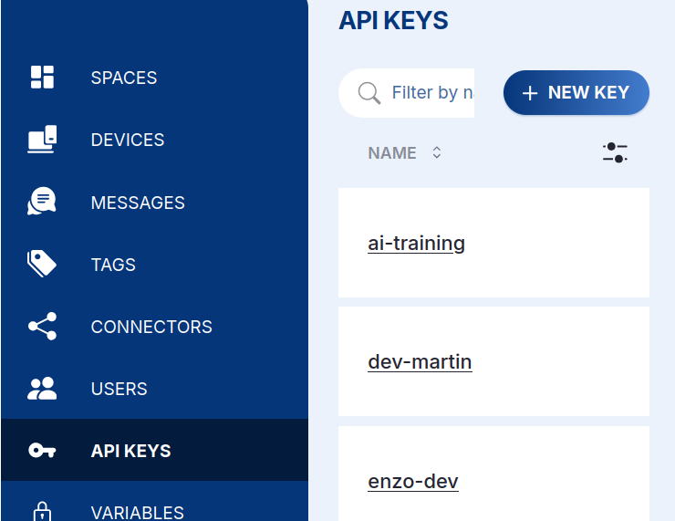
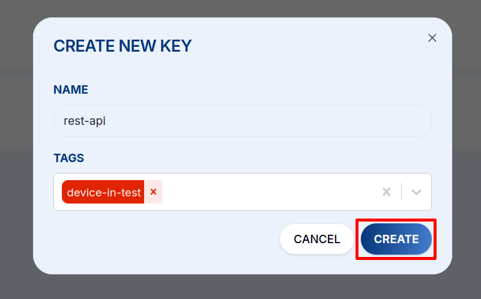
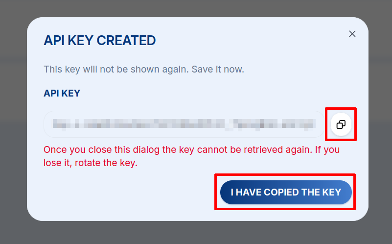

# Autentizace {#authentication}

Každý požadavek se autentizuje pomocí **API klíče** posílaného v hlavičce `X-API-KEY`.
API klíče jsou **vázané na Space** a klíč lze pomocí **tagů** omezit na konkrétní zařízení.

**Vytvoření klíče v HARDWARIO Cloud:**

1. Otevřete svůj Space, v levém panelu přejděte na **API Keys** a klikněte na **+ NEW KEY**.

   

2. Zadejte klíči **Name** a případně vyberte **Tags**, které omezí, ke kterým zařízením má přístup, poté klikněte na **CREATE**.

   

3. Zkopírujte klíč z dialogu **API Key Created** a bezpečně jej uložte, **zobrazí se pouze jednou**. Pokud jej ztratíte, vytvořte klíč nový.

   

Potom jej posílejte s každým voláním:

```bash
curl -H 'X-API-KEY: <api-key>' \
  'https://api.hardwario.cloud/v2/spaces'
```

:::caution
API klíče udržujte v tajnosti a nikdy je neukládejte do repozitáře. Omezte klíč pomocí tagů,
aby měl přístup jen k zařízením, která potřebuje, a při jeho vyzrazení jej okamžitě smažte
nebo vyměňte (`.../spaces/{space_id}/keys` umožňuje správu klíčů i programově).
:::
