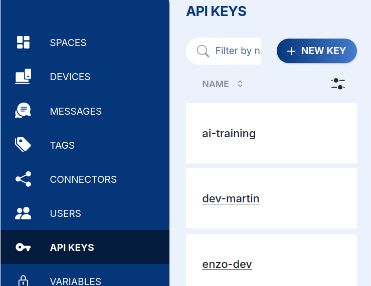
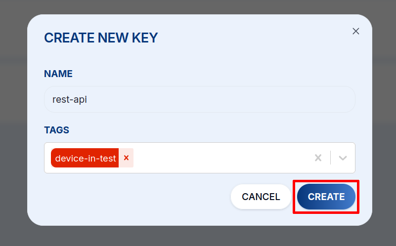
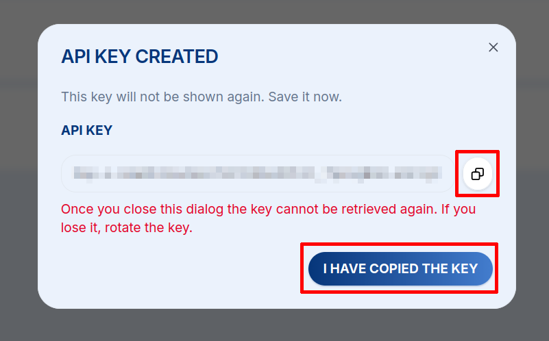

# Autentizace {#authentication}

Každý požadavek se ověřuje **klíčem API** v hlavičce `X-API-KEY`.
Klíče API jsou **vázané na prostor** a pomocí **tagů** můžete klíč omezit na konkrétní zařízení.

**Vytvoření klíče v HARDWARIO Cloud:**

1. Otevřete prostor, v levém panelu přejděte na **API Keys** a klikněte na **+ NEW KEY**.

   

2. Vyplňte **Name** klíče, případně vyberte **Tags**, které určí, ke kterým zařízením bude mít klíč přístup, a klikněte na **CREATE**.

   

3. Zkopírujte klíč z dialogu **API Key Created** a bezpečně ho uložte, protože **se zobrazí jen jednou**. Pokud ho ztratíte, nahraďte ho novým klíčem.

   

Potom ho posílejte s každým voláním:

```bash
curl -H 'X-API-KEY: <api-key>' \
  'https://api.hardwario.cloud/v2/spaces'
```

:::caution
Klíče API držte v tajnosti a nikdy je neukládejte do repozitáře. Klíč omezte tagy jen na zařízení,
která potřebuje, a pokud unikne, okamžitě ho smažte nebo vyměňte (klíče lze spravovat i programově
přes `.../spaces/{space_id}/keys`).
:::
