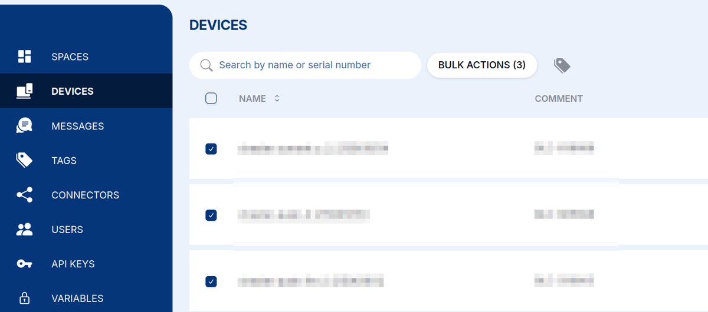
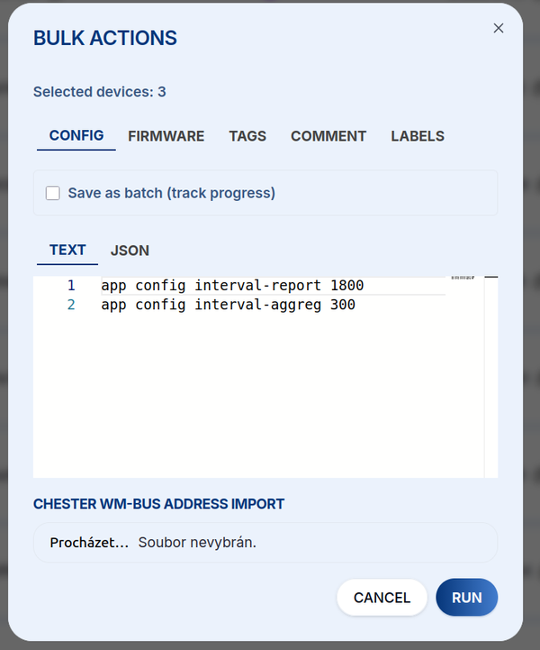
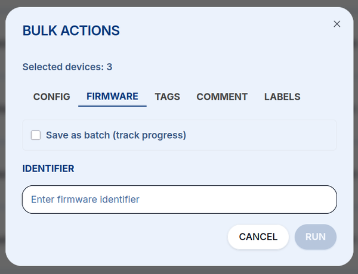
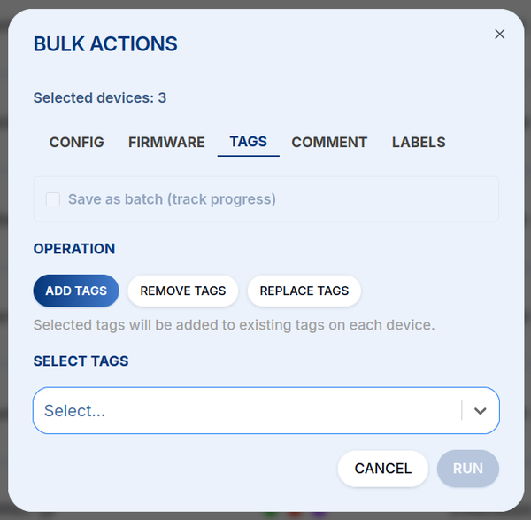
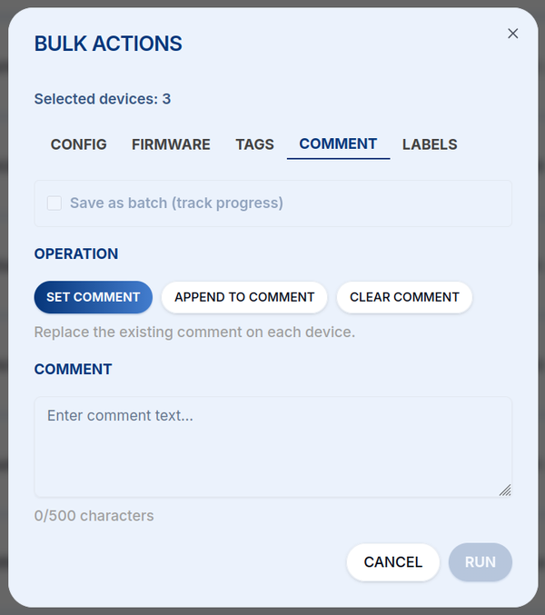
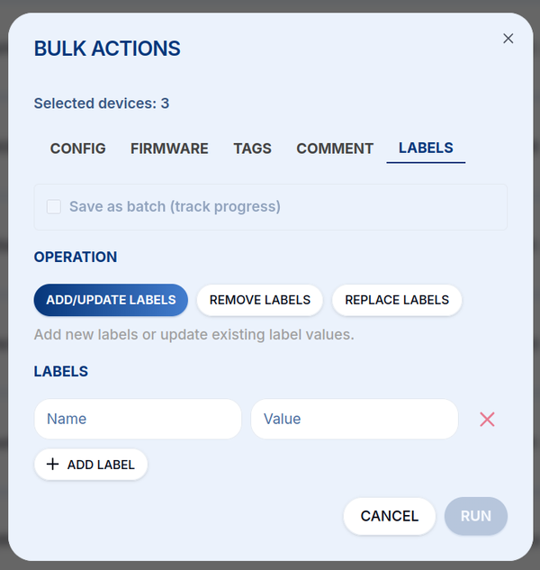

# Hromadné akce {#bulk-actions}

**Hromadnými akcemi** nastavíte nebo spravujete **mnoho zařízení najednou**, ne jedno po druhém.
Hodí se to při plošném nasazení flotily zařízení CHESTER, která mají mít stejnou konfiguraci, firmware,
tagy nebo labely.

## Výběr zařízení {#selecting-devices}

Na stránce **Devices** zaškrtněte políčko u každého zařízení, které chcete zahrnout (nebo políčkem
v záhlaví vyberte všechna). Tlačítko **BULK ACTIONS** ukazuje, kolik zařízení je vybráno. Kliknutím
na něj otevřete dialog hromadných akcí.

## Spuštění akce {#running-an-action}

Dialog zobrazuje počet **vybraných zařízení** a nabízí pět záložek, jednu pro každý druh akce.
Když zaškrtnete **Save as batch (track progress)**, operace se zaznamená jako dávka a její průběh
můžete později sledovat. Tlačítkem **RUN** akci provedete na všech vybraných zařízeních.

### Config {#config}

Odešlete příkazy `app config` do všech vybraných zařízení. Funguje to stejně jako
[**downlink konfigurace**](/cloud/downlink/config), jen hromadně. Příkazy zadejte jako **Text** nebo
**JSON**. U nasazení se zařízeními CHESTER wM-Bus můžete adresy zařízení importovat také ze souboru.

### Firmware {#firmware}

Aktualizujte firmware všech vybraných zařízení bezdrátově. Zadejte **identifikátor firmwaru**, který
chcete nasadit (viz [**Firmware**](/cloud/firmware)).

### Tags {#tags}

Přidejte, odeberte nebo nahraďte [**tagy**](/cloud/tags) na vybraných zařízeních. Zvolte **operaci**
(Add / Remove / Replace) a vyberte tagy, které se mají použít.

### Comment {#comment}

Nastavte, doplňte nebo smažte komentář u vybraných zařízení (až 500 znaků).

### Labels {#labels}

Přidejte, aktualizujte, odeberte nebo nahraďte **labely** (páry název–hodnota) u vybraných zařízení.

