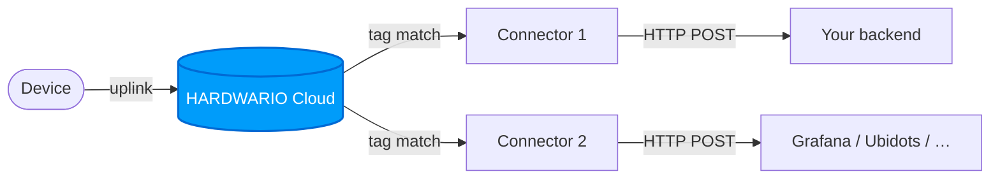
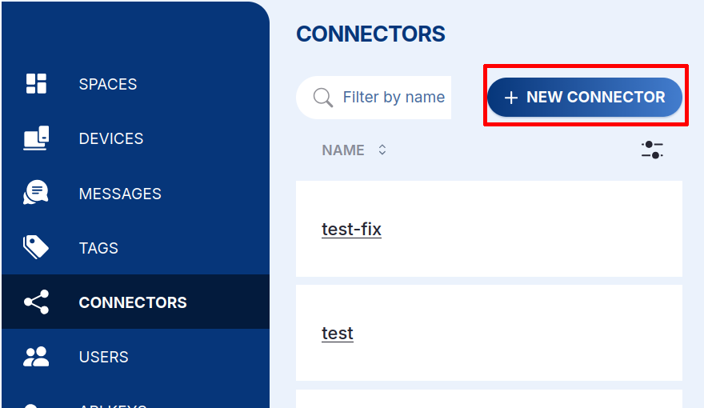
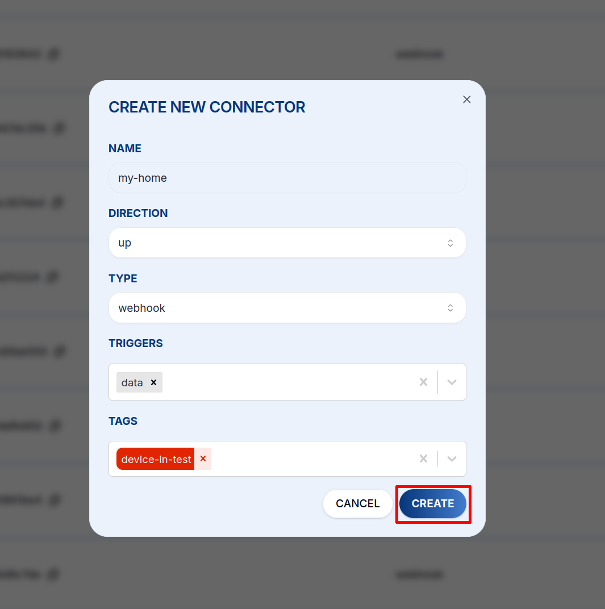
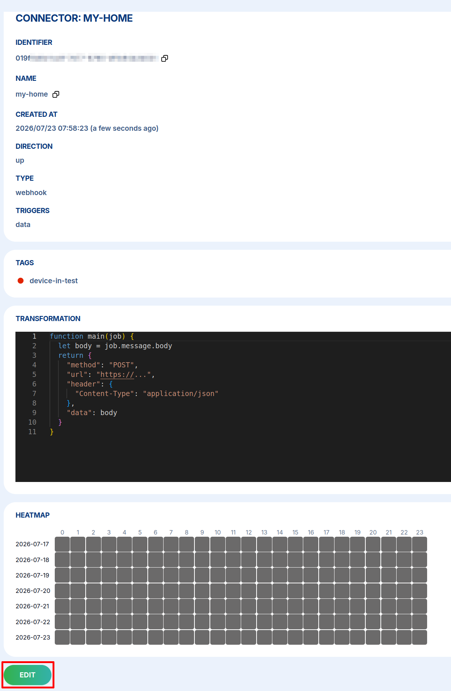
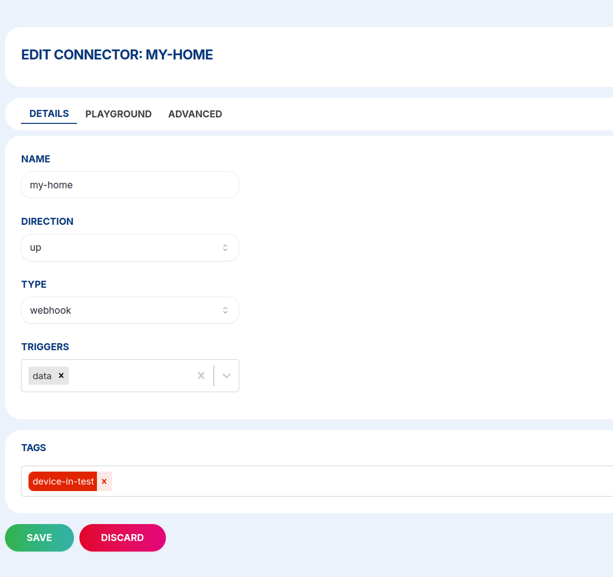
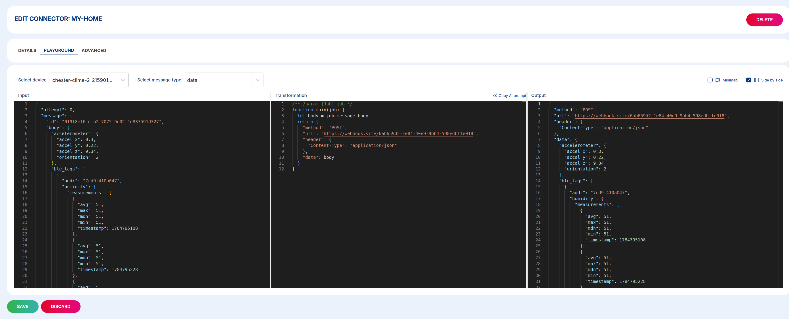
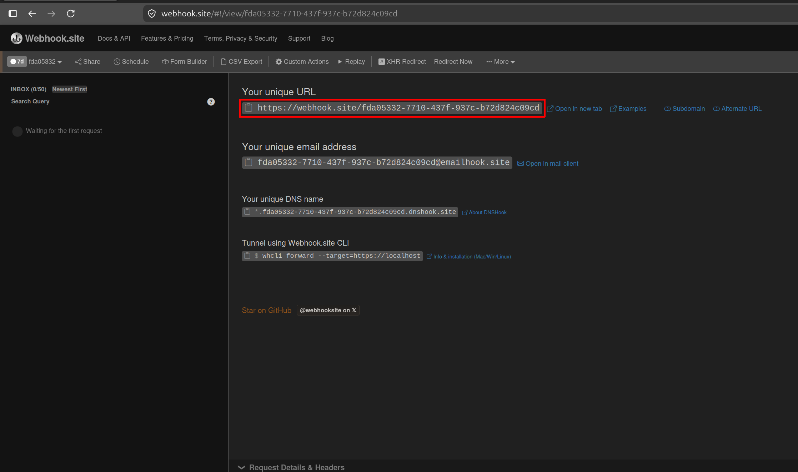
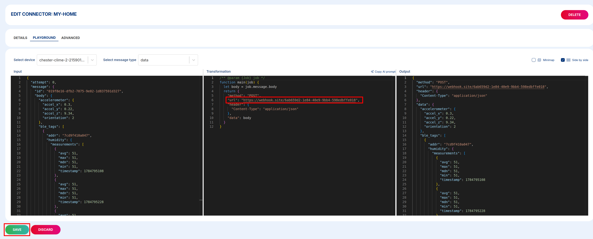
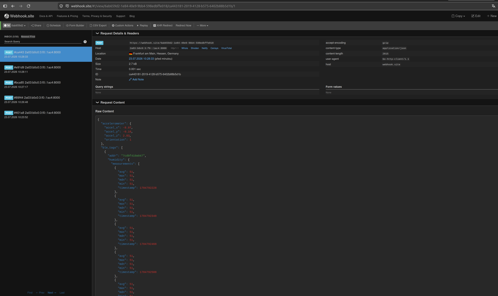

# Konektory {#connectors}

**Konektor** je webhook, který Cloud vyvolá vždy, když zařízení odešle uplink zprávu. Konektory jsou hlavní způsob, jak posílat data z HARDWARIO Cloud do vašeho vlastního systému, databáze nebo služby třetí strany.

## Jak konektory fungují {#how-connectors-work}

1. Zařízení odešle uplink zprávu do Cloudu
2. Cloud najde všechny konektory, které mají se zařízením společný **tag**
3. Pro každý odpovídající konektor Cloud spustí **transformační funkci**
4. Transformovaný payload se odešle jako HTTP požadavek na váš endpoint



## Vytvoření konektoru {#creating-a-connector}

1. Otevřete **Connectors** v levém panelu a klikněte na **+ NEW CONNECTOR**.

   

2. Vyplňte dialog:

   | Pole | Popis |
   |---|---|
   | **Name** | Identifikátor tohoto konektoru |
   | **Direction** | `up` — konektor reaguje na uplink zprávy (zařízení → Cloud) |
   | **Type** | `webhook` — doručí zprávu jako HTTP požadavek |
   | **Triggers** | Které typy zpráv jej spouští (viz [Spouštěče](#triggers)) |
   | **Tags** | Které tagy zařízení tento konektor odposlouchává |

   <div className="screenshot-narrow">

   

   </div>

3. Klikněte na **CREATE**. Konektor se otevře na své detailní stránce, kde můžete zkontrolovat jeho nastavení a heatmapu aktivity — a kliknutím na **EDIT** přidat [transformační funkci](#the-transformation-function).

   <div className="screenshot-narrow">

   

   </div>

## Spouštěče {#triggers}

Vyberte, které typy zpráv konektor spouští:

| Spouštěč | Popis |
|---|---|
| `data` | Periodický uplink s hodnotami ze senzorů — nejčastější |
| `session` | Zpráva po startu s informacemi o firmwaru a síti |
| `config` | Potvrzení změny konfigurace |
| `stats` | Interní statistiky Cloudu |
| `codec` | Aktualizace klíčů kodéru/dekodéru |

## Transformační funkce {#the-transformation-function}

Každý konektor spouští JavaScriptovou funkci, která přijímá objekt `job` a vrací HTTP požadavek, jenž se má provést. Umožňuje přeskládat payload, přidat autentizační hlavičky nebo filtrovat zprávy.

Na detailní stránce konektoru klikněte na **EDIT**. Editor má tři karty — **DETAILS** (název, směr, typ, spouštěče, tagy), **PLAYGROUND** (funkce a její živý náhled) a **ADVANCED** (nastavení opakování).

<div className="screenshot-narrow">



</div>

Otevřete kartu **PLAYGROUND**. Funkci napište v prostředním panelu; levý panel zobrazuje skutečnou **zprávu ze zařízení (Input)** a pravý panel **požadavek, který by se odeslal (Output)**, průběžně aktualizovaný během psaní. Pomocí **Select device** a **Select message type** si zobrazíte náhled nad skutečnými daty — během editace se žádný HTTP požadavek neodesílá.



```js
function main(job) {
  let body = job.message.body;
  return {
    "method": "POST",
    "url": "https://your-endpoint.example.com/data",
    "header": {
      "Content-Type": "application/json",
      "Authorization": "Bearer YOUR_TOKEN"
    },
    "data": body
  };
}
```

Vrácení `null` zruší zpětné volání — což je užitečné pro podmíněné přeposílání:

```js
function main(job) {
  let temp = job.message.body?.thermometer?.temperature;
  if (temp === undefined) return null; // skip messages without temperature
  return {
    "method": "POST",
    "url": "https://your-endpoint.example.com/temperature",
    "data": { value: temp, device: job.device.name }
  };
}
```

Až je funkce hotová, klikněte na **SAVE**.

### Objekt `job` {#the-job-object}

Transformační funkce přijímá objekt `job` s následující strukturou:

<details>
<summary><b>Zobrazit strukturu objektu `job`</b></summary>
<p>

```json
{
  "message": {
    "id": "018eebbe-678d-7c60-b4ef-d141f48378e8",
    "type": "data",
    "direction": "up",
    "created_at": "2024-04-17T11:08:27.917Z",
    "body": {
      "thermometer": { "temperature": 22.43 },
      "accelerometer": { "accel_x": 0.22, "accel_y": 9.8, "accel_z": 0.15, "orientation": 3 },
      "network": {
        "parameter": { "band": 20, "rsrp": -95, "rsrq": -6, "snr": 2 }
      }
    }
  },
  "device": {
    "id": "018a1535-fd39-7293-bd36-52df3e62e962",
    "space_id": "018a14f6-27e3-7293-b7d2-c39d7b0d7cd2",
    "serial_number": "2159020389",
    "name": "my-device",
    "label": { "location": "prague-floor-3" },
    "tags": ["temperature-sensors"]
  },
  "connector": {
    "id": "018aef7c-c122-7893-a07c-70dbc6ebbddc"
  }
}
```

</p>
</details>

## Testování konektoru {#testing-your-connector}

Nejrychlejší způsob, jak potvrdit, že se konektor skutečně spouští — a přesně vidět, co odesílá — je nasměrovat jej na bezplatný, dočasný příjemce, například [**webhook.site**](https://webhook.site). Vlastní backend není potřeba. (PLAYGROUND výše testuje *výstup* vaší funkce; tohle testuje skutečné HTTP *doručení*.)

1. **Získejte URL příjemce.** Otevřete [webhook.site](https://webhook.site) a zkopírujte **„Your unique URL“** zobrazenou nahoře (vypadá jako `https://webhook.site/<id>`).

   

2. **Nasměrujte na ni konektor.** V **PLAYGROUND** konektoru nastavte `url` v transformační funkci na tuto adresu a klikněte na **SAVE**:

   ```js
   function main(job) {
     let body = job.message.body;
     return {
       "method": "POST",
       "url": "https://webhook.site/xxxxxxxx-xxxx-xxxx-xxxx-xxxxxxxxxxxx",
       "header": { "Content-Type": "application/json" },
       "data": body
     };
   }
   ```

   

   Ujistěte se, že **Tags** a **Triggers** konektoru odpovídají vašemu zařízení (např. spouštěč `data`).

3. **Vyvolejte uplink.** Vyčkejte na zprávu ze zařízení v prostoru — nebo ji vynuťte. Konektor se spouští na skutečných uplincích ze zařízení.

4. **Zkontrolujte výsledek.** Vraťte se na webhook.site: požadavek se objeví ve schránce vlevo. Kliknutím na něj prohlédnete **metodu**, **hlavičky** a **JSON tělo**, které Cloud odeslal. Jeho doručení potvrzuje, že váš konektor funguje od začátku do konce.

   

:::tip
Upravte transformační funkci a znovu vyvolejte zprávu, abyste v reálném čase viděli dopad svých změn. Až budete spokojeni, vyměňte URL webhook.site za svůj skutečný endpoint.
:::

:::caution
URL na webhook.site jsou **veřejné** — během testování používejte pouze testovací data a pro provozní přenosy přepněte na vlastní endpoint.
:::

**Další příjemci**, které lze použít stejným způsobem: [requestinspector.com](https://requestinspector.com/) (okamžitý veřejný endpoint), [ngrok.com](https://ngrok.com/) (tunel na server na vašem počítači), [tailscale.com](https://tailscale.com/) (privátní síť s veřejným funnelem).

## Politika opakování {#retry-policy}

Pokud HTTP požadavek selže (odpověď mimo 2xx nebo timeout), Cloud jej automaticky opakuje. Výchozí plán opakování (v sekundách):

`10 → 30 → 60 → 600 → 1800 → 3600 → 10800 → 21600 → 43200`

Intervaly opakování můžete upravit na kartě **ADVANCED** konektoru.
