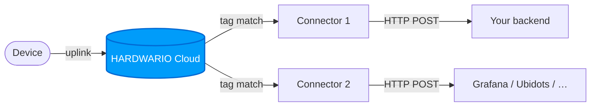
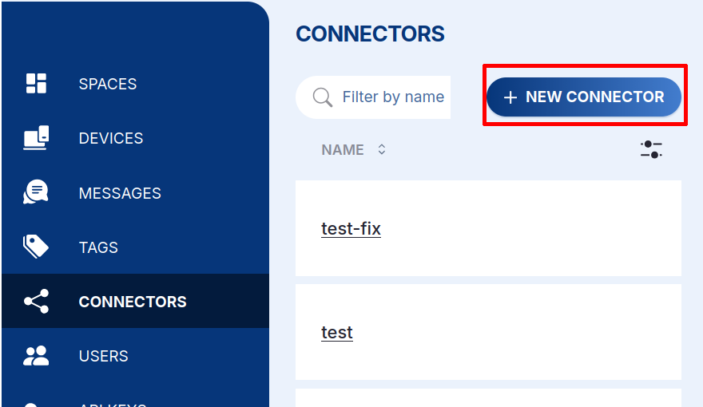
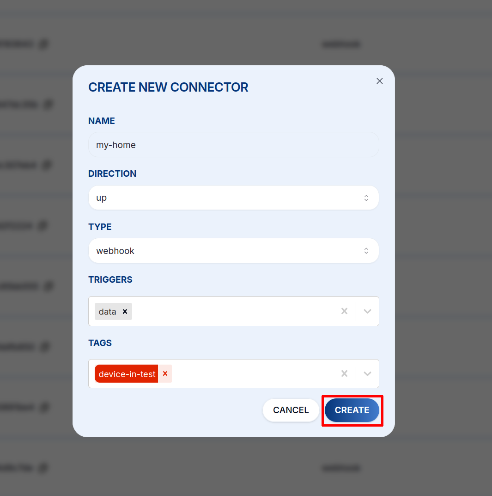
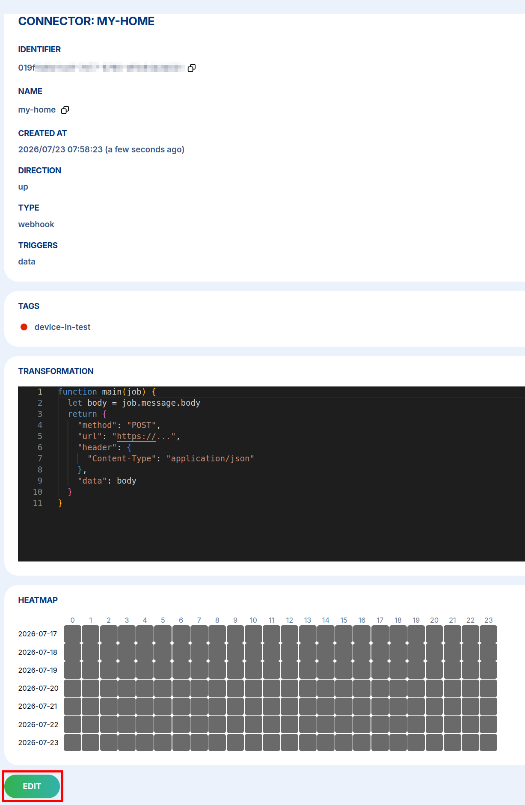
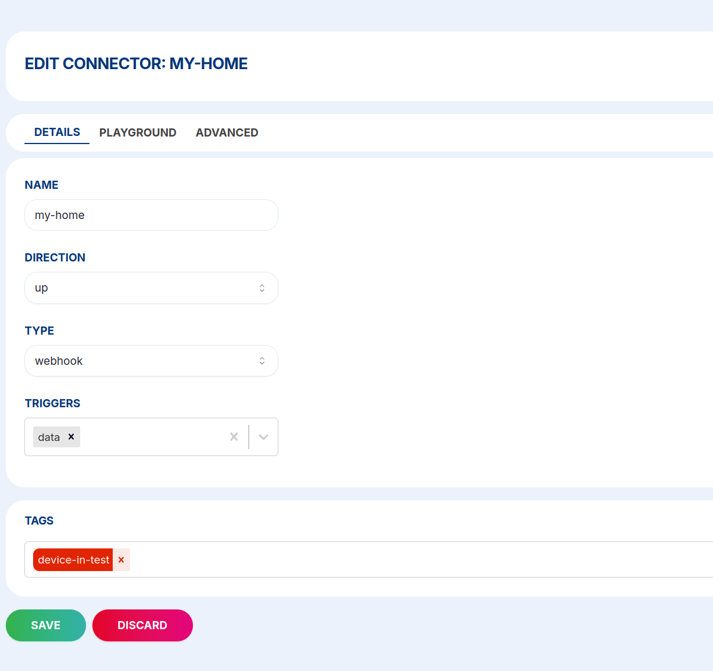
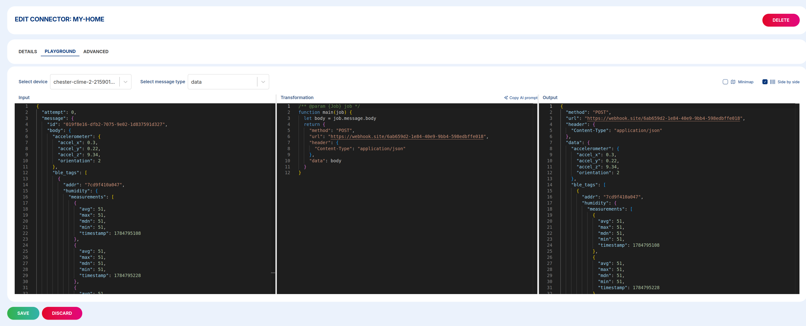
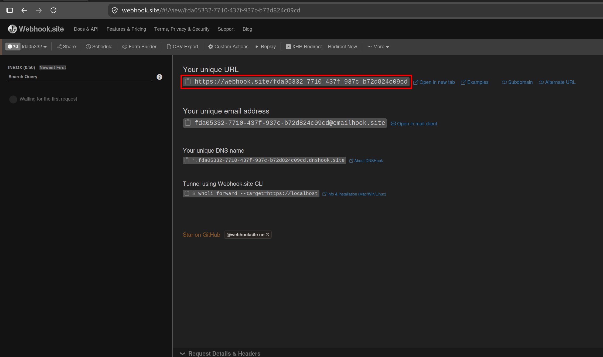
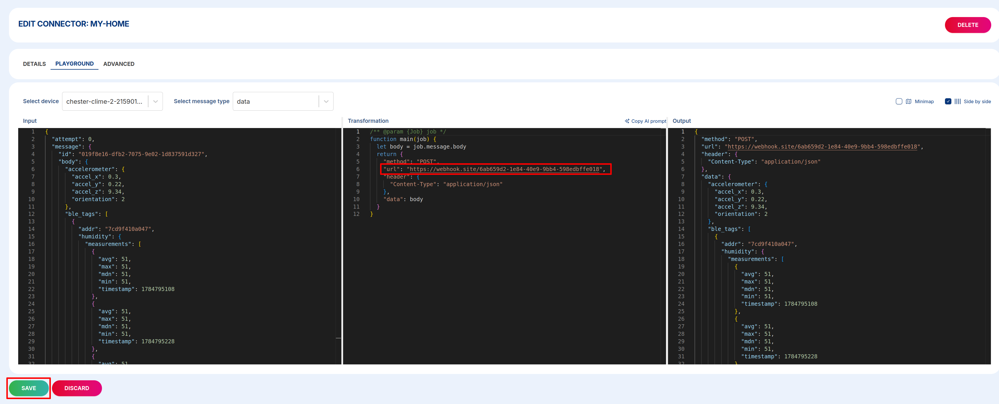
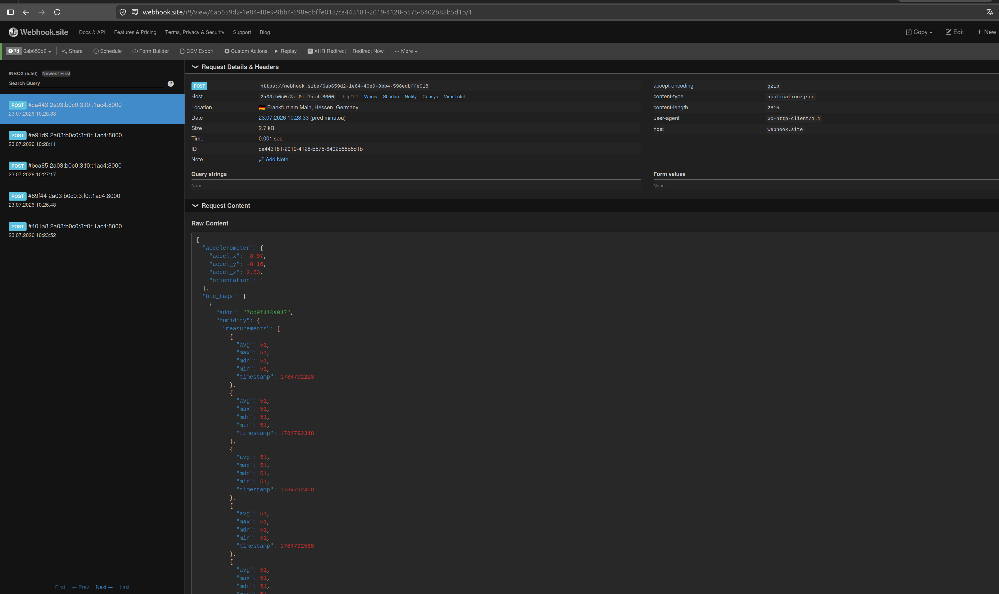

# Konektory {#connectors}

**Konektor** je webhook, který cloud zavolá pokaždé, když zařízení odešle zprávu uplink. Konektory jsou hlavní cestou, jak z HARDWARIO Cloud posílat data do vlastního systému, databáze nebo služby třetí strany.

## Jak konektory fungují {#how-connectors-work}

1. Zařízení odešle do cloudu zprávu uplink
2. Cloud najde všechny konektory, které mají se zařízením společný **tag**
3. Pro každý odpovídající konektor cloud spustí **transformační funkci**
4. Transformovaný payload se odešle jako požadavek HTTP na váš endpoint


```mermaid
flowchart LR
  Device([Device]) -->|uplink| Cloud[(HARDWARIO Cloud)]
  Cloud -->|tag match| C1[Connector 1]
  Cloud -->|tag match| C2[Connector 2]
  C1 -->|HTTP POST| Backend[Your backend]
  C2 -->|HTTP POST| Viz["Grafana / Ubidots / …"]
  classDef hero fill:#009cfa,stroke:#016ad4,stroke-width:2px,color:#ffffff;
  class Cloud hero;
```

## Vytvoření konektoru {#creating-a-connector}

1. Otevřete **Connectors** v levém panelu a klikněte na **+ NEW CONNECTOR**.

   

2. Vyplňte dialog:

   | Pole | Popis |
   |---|---|
   | **Name** | Identifikátor tohoto konektoru |
   | **Direction** | `up`. Konektor reaguje na zprávy uplink (zařízení → cloud) |
   | **Type** | `webhook`. Doručí zprávu jako požadavek HTTP |
   | **Triggers** | Které typy zpráv ho spouštějí (viz [Spouštěče](#triggers)) |
   | **Tags** | Na které tagy zařízení tento konektor reaguje |

   <div className="screenshot-narrow">

   

   </div>

3. Klikněte na **CREATE**. Otevře se stránka s detailem konektoru, kde zkontrolujete jeho nastavení a heatmapu aktivity; tlačítkem **EDIT** pak přidáte [transformační funkci](#the-transformation-function).

   <div className="screenshot-narrow">

   

   </div>

## Spouštěče {#triggers}

Vyberte, které typy zpráv konektor spouštějí:

| Spouštěč | Popis |
|---|---|
| `data` | Pravidelný uplink s naměřenými hodnotami ze senzorů. Nejčastější volba |
| `session` | Zpráva po startu s informacemi o firmwaru a síti |
| `config` | Potvrzení změny konfigurace |
| `stats` | Interní statistiky cloudu |
| `codec` | Aktualizace klíčů enkodéru/dekodéru |

## Transformační funkce {#the-transformation-function}

Každý konektor spouští funkci v JavaScriptu, která dostane objekt `job` a vrátí požadavek HTTP, který se má odeslat. Funkcí můžete payload přeskládat, přidat autentizační hlavičky nebo zprávy filtrovat.

Na stránce s detailem konektoru klikněte na **EDIT**. Editor má tři záložky: **DETAILS** (název, směr, typ, spouštěče, tagy), **PLAYGROUND** (funkce a její živý náhled) a **ADVANCED** (nastavení opakování).

<div className="screenshot-narrow">



</div>

Otevřete záložku **PLAYGROUND**. Funkci napište v prostředním panelu; levý panel zobrazuje skutečnou **zprávu ze zařízení (Input)** a pravý panel **požadavek, který by se odeslal (Output)**, průběžně aktualizovaný během psaní. V polích **Select device** a **Select message type** vyberete pro náhled skutečná data. Během úprav se žádný požadavek HTTP neodesílá.



```js
function main(job) {
  let body = job.message.body;
  return {
    "method": "POST",
    "url": "https://your-endpoint.example.com/data",
    "header": {
      "Content-Type": "application/json",
      "Authorization": "Bearer YOUR_TOKEN"
    },
    "data": body
  };
}
```

Když funkce vrátí `null`, callback se zruší. To se hodí pro podmíněné přeposílání:

```js
function main(job) {
  let temp = job.message.body?.thermometer?.temperature;
  if (temp === undefined) return null; // skip messages without temperature
  return {
    "method": "POST",
    "url": "https://your-endpoint.example.com/temperature",
    "data": { value: temp, device: job.device.name }
  };
}
```

Až je funkce hotová, klikněte na **SAVE**.

### Objekt `job` {#the-job-object}

Transformační funkce dostane objekt `job` s touto strukturou:

<details>
<summary><b>Zobrazit strukturu objektu `job`</b></summary>
<p>

```json
{
  "message": {
    "id": "018eebbe-678d-7c60-b4ef-d141f48378e8",
    "type": "data",
    "direction": "up",
    "created_at": "2024-04-17T11:08:27.917Z",
    "body": {
      "thermometer": { "temperature": 22.43 },
      "accelerometer": { "accel_x": 0.22, "accel_y": 9.8, "accel_z": 0.15, "orientation": 3 },
      "network": {
        "parameter": { "band": 20, "rsrp": -95, "rsrq": -6, "snr": 2 }
      }
    }
  },
  "device": {
    "id": "018a1535-fd39-7293-bd36-52df3e62e962",
    "space_id": "018a14f6-27e3-7293-b7d2-c39d7b0d7cd2",
    "serial_number": "2159020389",
    "name": "my-device",
    "label": { "location": "prague-floor-3" },
    "tags": ["temperature-sensors"]
  },
  "connector": {
    "id": "018aef7c-c122-7893-a07c-70dbc6ebbddc"
  }
}
```

</p>
</details>

## Testování konektoru {#testing-your-connector}

Nejrychleji ověříte, že se konektor opravdu spouští, a uvidíte přesně, co posílá, když ho nasměrujete na bezplatného dočasného příjemce, například [**webhook.site**](https://webhook.site). Vlastní backend nepotřebujete. (PLAYGROUND výše testuje *výstup* funkce, tento postup skutečné *doručení* přes HTTP.)

1. **Získejte URL příjemce.** Otevřete [webhook.site](https://webhook.site) a zkopírujte **„Your unique URL“** zobrazenou nahoře (vypadá jako `https://webhook.site/<id>`).

   

2. **Nasměrujte na ni konektor.** V **PLAYGROUND** konektoru nastavte `url` v transformační funkci na tuto adresu a klikněte na **SAVE**:

   ```js
   function main(job) {
     let body = job.message.body;
     return {
       "method": "POST",
       "url": "https://webhook.site/xxxxxxxx-xxxx-xxxx-xxxx-xxxxxxxxxxxx",
       "header": { "Content-Type": "application/json" },
       "data": body
     };
   }
   ```

   

   Zkontrolujte, že **Tags** a **Triggers** konektoru odpovídají zařízení (např. spouštěč `data`).

3. **Vyvolejte uplink.** Počkejte na zprávu ze zařízení v prostoru, nebo ji vynuťte. Konektor reaguje na skutečné uplinky ze zařízení.

4. **Zkontrolujte výsledek.** Vraťte se na webhook.site: požadavek se objeví ve schránce vlevo. Kliknutím na něj zobrazíte **metodu**, **hlavičky** a **tělo JSON**, které cloud odeslal. Když požadavek dorazí, máte potvrzeno, že konektor funguje od začátku do konce.

   

:::tip
Upravte transformační funkci, znovu vyvolejte zprávu a v reálném čase uvidíte, jak se změny projeví. Až budete spokojení, nahraďte URL webhook.site svým skutečným endpointem.
:::

:::caution
URL na webhook.site jsou **veřejné**, proto během testování používejte pouze testovací data a pro provozní přenosy přepněte na vlastní endpoint.
:::

**Další služby**, které můžete použít stejně: [requestinspector.com](https://requestinspector.com/) (okamžitý veřejný endpoint), [ngrok.com](https://ngrok.com/) (tunel na server na vašem počítači), [tailscale.com](https://tailscale.com/) (privátní síť s veřejným funnelem).

## Opakování doručení {#retry-policy}

Pokud požadavek HTTP selže (odpověď jiná než 2xx nebo vypršení časového limitu), cloud ho automaticky zopakuje. Výchozí plán opakování (v sekundách):

`10 → 30 → 60 → 600 → 1800 → 3600 → 10800 → 21600 → 43200`

Intervaly opakování můžete upravit na záložce **ADVANCED** konektoru.
