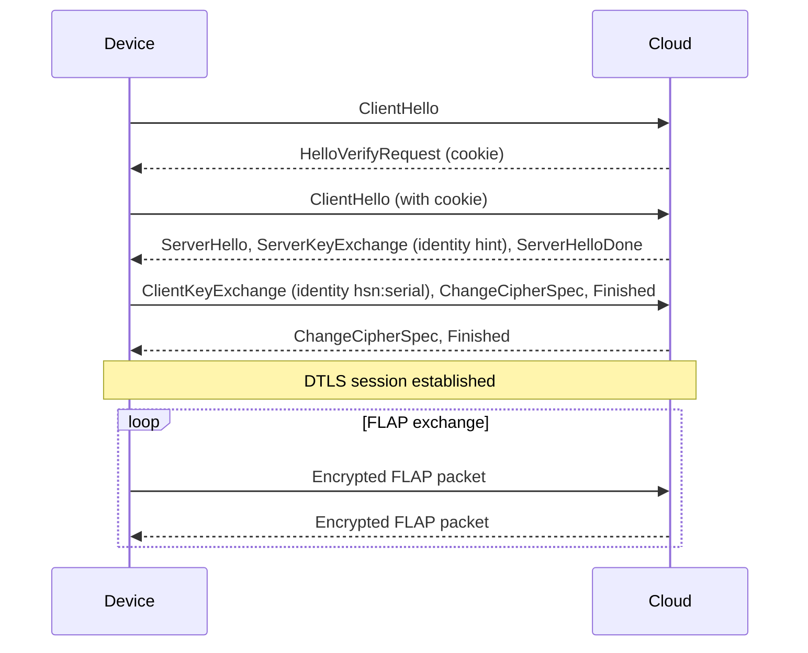

# Obálka DTLS protokolu FLAP {#flap-dtls-envelope}

V obálce DTLS (nastavení zařízení `flap-dtls`) putují [**pakety FLAP**](transfers.md#flap-packet) uvnitř relace **DTLS 1.2** (RFC 6347) ověřené **předsdíleným klíčem** (PSK). PSK ověřuje zařízení a opravňuje ho vystupovat jako zařízení registrované v HARDWARIO Cloud. DTLS pakety šifruje a chrání jejich integritu i proti opakování.

Dešifrovaný záznam DTLS obsahuje **jen paket FLAP**. Tag MAC ani sériové číslo v něm nejsou: zařízení se ověří a identifikuje svou identitou PSK při navázání relace DTLS.

```
+------------------- DTLS 1.2 record (encrypted) -------------------+
|  +-------------+----------------------+                           |
|  | Header      | Data                 |                           |
|  | 2 bytes     | 0 to n bytes         |                           |
|  +-------------+----------------------+                           |
+-------------------------------------------------------------------+
```

:::note

Obálka DTLS je zatím dostupná jen na zařízeních postavených na **nRF9151** (například WIMBER). Zařízení CHESTER používá obálku MAC jako text base64. Jde o omezení současného SDK pro CHESTER, ne protokolu, a podpora DTLS pro CHESTER je plánovaná.

:::

## Parametry DTLS {#dtls-parameters}

| Parametr | Hodnota |
|---|---|
| **Protokol** | DTLS 1.2, port UDP 5005 |
| **Šifrovací sada** | `TLS_PSK_WITH_AES_128_CCM_8`, jediná nabízená sada, viz [**Šifrovací sada**](#cipher-suite) |
| **Identita PSK** | `hsn:` a za ním sériové číslo v desítkové soustavě, například `hsn:2159017985` |
| **PSK** | 16 až 32 náhodných bajtů, jedinečných pro každé zařízení |
| **Nápověda identity PSK** | `hio-udp-server` |
| **Extended master secret** | Vyžadováno (RFC 7627) |
| **Výměna cookie** | Zapnuto (HelloVerifyRequest) |
| **Connection ID** | Podporováno (RFC 9146), 4 bajty |
| **Časový limit nečinnosti** | 24 hodin |

### Šifrovací sada {#cipher-suite}

Sadu `TLS_PSK_WITH_AES_128_CCM_8` podporuje implementace DTLS v modemu nRF9151 i implementace DTLS v Cloudu. Navíc má malou a pevnou režii na záznam, takže velikost fragmentu je předvídatelná (viz [**Limity velikosti**](#size-limits)). Proto Cloud nabízí jen tuto sadu.

### Connection ID {#connection-id}

**Connection ID** umožní zařízení zachovat relaci DTLS, když mu operátor změní IP adresu nebo port, takže po probuzení z PSM nepotřebuje nový handshake. Nový handshake se stejnou identitou nahradí předchozí relaci zařízení.

## Handshake {#handshake}



Cloud vyhledá PSK podle identity ze zprávy ClientKeyExchange. Neznámá identita nebo špatný PSK handshake ukončí. Po handshaku probíhá výměna FLAP přesně podle stránky [**Přenosy**](transfers.md).

## Limity velikosti {#size-limits}

Velikost fragmentu vychází z velikosti datagramu a režie obálky:

```
fragment data = datagram - DTLS record overhead - 2 B FLAP header
```

Šifrovací sada je pevně daná, takže režie záznamu DTLS je pevná a malá: hlavička záznamu, osmibajtový explicitní nonce a osmibajtový autentizační tag AES-128-CCM-8. S datagramem o velikosti 508 bajtů zbývá na fragment téměř 480 bajtů dat.

| Směr | Data na fragment dnes |
|---|---|
| Uplink (SDK zařízení) | 479 B |
| Downlink (Cloud) | 300 B |

Datagram o velikosti 508 bajtů je konzervativní limit, který projde libovolnou cestou IPv4 bez fragmentace. Kde MTU cesty dovolí větší datagramy, může velikost fragmentu odpovídajícím způsobem růst až na maximální payload UDP.

## Nastavení DTLS {#setting-up-dtls}

Stejný PSK musí být uložený v HARDWARIO Cloud i v zařízení.

**1. Vygenerujte náhodný PSK** o velikosti 16 bajtů (32 hexadecimálních znaků):

```bash
openssl rand -hex 16
```

**2. Uložte PSK do HARDWARIO Cloud**, například přes [**REST API**](../api/devices.md). Zařízení přidané se sériovým číslem má identitu PSK `hsn:<sériové číslo>` automaticky:

```bash
curl -X PUT \
  -H 'X-API-KEY: <api-key>' \
  -H 'Content-Type: application/json' \
  'https://api.hardwario.cloud/v2/spaces/<space-id>/devices/<device-id>' \
  -d '{
    "secret": "<psk-hex>",
    "secret_type": "psk"
  }'
```

**3. Uložte PSK do zařízení a přepněte ho na DTLS** v shellu zařízení:

```
cloud psk set <psk-hex>
cloud config protocol flap-dtls
config save
```

PSK se zapíše do zabezpečeného úložiště pověření v modemu. Zařízení se znovu připojí a při dalším vysílání otevře s Cloudem relaci DTLS. Všechna nastavení cloudu v zařízení popisuje sekce [**Nastavení zařízení**](#device-settings).

## Nastavení zařízení {#device-settings}

Zařízení postavená na nRF9151 vybírají obálku a server příkazem shellu `cloud config`. Příkaz `cloud config show` vypíše všechna nastavení cloudu. Pro obálku DTLS platí:

| Parametr | Výchozí hodnota | Popis |
|---|---|---|
| `protocol` | `flap-hash` | Obálka: `flap-dtls` vybere obálku DTLS |
| `addr` | `157.245.24.13` | Výchozí IP adresa serveru |
| `addr2`, `addr3` | Prázdné | Druhá a třetí IP adresa serveru, prázdná hodnota znamená nepoužito |
| `port-flap-dtls` | `5005` | Port UDP pro obálku DTLS |
| `failover` | `3` | Počet po sobě jdoucích neúspěšných pokusů, po kterých zařízení přepne na další adresu, `0` přepínání vypne |

Výchozí hodnoty adres serveru, portů a `failover` pocházejí z voleb Kconfig firmwaru, takže je lze změnit při sestavení firmwaru.
