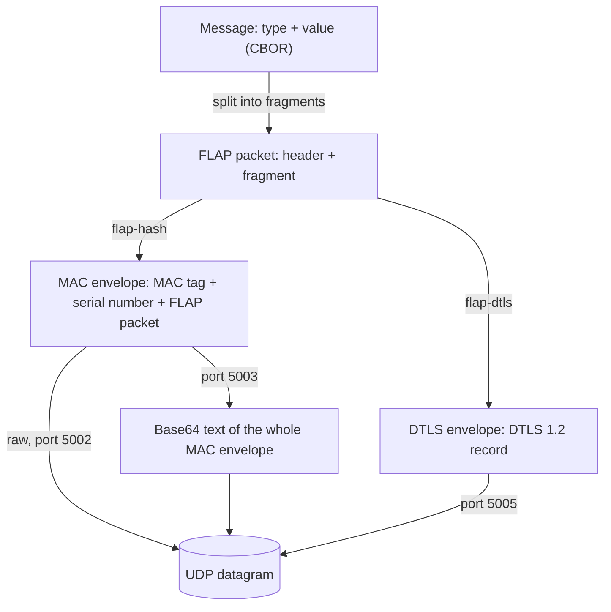

# Protokol zařízení (FLAP) {#device-protocol-flap}

Zařízení HARDWARIO s mobilním modemem (například **CHESTER** a **GLIDER**) komunikují s **HARDWARIO Cloud** přes UDP protokolem **FLAP**. FLAP je úsporný protokol typu požadavek a odpověď navržený pro mobilní IoT: má malou režii, na jednu výměnu potřebuje jen několik paketů a funguje s úspornými režimy LTE-M a NB-IoT (PSM, RAI).

Název vychází ze čtyř příznaků v hlavičce paketu: **F**irst, **L**ast, **A**ck a **P**oll.

:::info

Tato sekce je technická reference přenosového protokolu pro vývojáře firmwaru a integrátory. Pro běžné používání HARDWARIO Cloud se zařízením HARDWARIO ho znát nepotřebujete, protože protokol implementuje SDK zařízení.

:::

## Principy návrhu {#design-principles}

- **Zařízení vždy začíná.** Cloud pouze odpovídá a nikdy sám paket nepošle. Díky tomu protokol funguje za NAT operátora i s PSM, kdy zařízení mezi vysíláními není dosažitelné.
- **Jeden paket, jedna odpověď.** Na každý paket ze zařízení Cloud odpoví nejvýše jedním paketem.
- **Fragmentace.** Zpráva o velikosti až 16 KiB se rozdělí na fragmenty, které se vejdou do 508 bajtů UDP payloadu. To je největší payload, který zaručeně projde internetem bez IP fragmentace (RFC 791, RFC 1122).
- **Potvrzování.** Každý fragment se potvrzuje a sekvenční číslo odhalí ztracené i zdvojené pakety.
- **Downlink přes dotazování.** Cloud zařízení oznámí, že na něj čeká downlink, a zařízení si ho vyzvedne paketem poll.

## Vrstvy protokolu {#protocol-layers}

Samotný FLAP je jen paket: dvoubajtová hlavička s příznaky a sekvenčním číslem, za ní jeden fragment zprávy. Na cestě mezi zařízením a Cloudem je každý paket FLAP zabalený do jedné ze dvou kryptografických **obálek**:

- **Obálka MAC** (`flap-hash`): před paketem FLAP je tag autentizačního kódu zprávy (MAC) a sériové číslo zařízení. Obálka se posílá buď v surové binární podobě (raw), nebo jako text base64. Příjemce base64 nejprve dekóduje zpět na binární data a obálku pak zpracuje stejně.
- **Obálka DTLS** (`flap-dtls`): paket FLAP putuje uvnitř relace DTLS 1.2. Tag MAC ani sériové číslo v ní nejsou, protože se zařízení ověří a identifikuje už při navázání relace DTLS.

| Vrstva | Obsah | Popsáno v |
|---|---|---|
| **Zpráva** | Jedna aplikační jednotka, například odeslání dat: bajt typu a hodnota | [**Typy zpráv**](messages.md) |
| **Paket FLAP** | Dvoubajtová hlavička s příznaky a sekvenčním číslem, za ní jeden fragment zprávy | [**Pakety a přenosy**](transfers.md) |
| **Obálka** | Obálka MAC nebo obálka DTLS, chrání paket FLAP na cestě | [**Obálka MAC**](mac-envelope.md), [**Obálka DTLS**](dtls-envelope.md) |
| **Transport** | Jeden datagram UDP nese jeden paket FLAP v obálce | Tato stránka |

## Obálky a porty {#envelopes-and-ports}

| Obálka | Nastavení zařízení | Port UDP | Autentizace a autorizace | Integrita | Šifrování | Používá |
|---|---|---|---|---|---|---|
| **MAC** (raw) | `flap-hash` | 5002 | Claim token | 64bitový MAC s klíčem claim token | Ne | Zařízení s nRF9160 nebo nRF9151 |
| **MAC** (base64) | CHESTER LTE v2 | 5003 | Claim token | 64bitový MAC s klíčem claim token | Ne | CHESTER (nRF9160) |
| **DTLS** | `flap-dtls` | 5005 | Předsdílený klíč (PSK) | DTLS 1.2, AES-128-CCM-8 | Ano, AES-128-CCM-8 | Zařízení s nRF9151 |

Tajemství obálky, tedy claim token nebo PSK, ověřuje zařízení a opravňuje ho vystupovat jako zařízení registrované v HARDWARIO Cloud. V obálce MAC je claim token zároveň klíčem MAC, takže stejné tajemství chrání i integritu každého paketu.

Pakety FLAP, zprávy i stav zařízení v Cloudu jsou stejné bez ohledu na obálku. Adresa serveru závisí na SIM kartě a APN, viz [**Nastavení SIM karty**](/chester/platform-connectivity/cellular-networks/sim-card-setup).

:::note Dostupnost DTLS

Obálka DTLS je zatím dostupná jen na zařízeních postavených na **nRF9151** (například WIMBER). Zařízení CHESTER používá obálku MAC jako text base64. Jde o omezení současného SDK pro CHESTER, ne protokolu, a podpora DTLS pro CHESTER je plánovaná.

:::

## Terminologie {#terminology}

| Pojem | Význam |
|---|---|
| **Uplink** | Směr ze zařízení do Cloudu |
| **Downlink** | Směr z Cloudu do zařízení |
| **Paket FLAP** | Dvoubajtová hlavička FLAP a jeden fragment zprávy |
| **Obálka** | Kryptografické zabalení paketu FLAP: obálka MAC nebo obálka DTLS |
| **Zpráva** | Jedna aplikační jednotka (relace, data, konfigurace, příkaz shellu, část firmwaru) |
| **Fragment** | Část zprávy přenášená v jednom paketu FLAP |
| **Přenos** | Výměna všech fragmentů jedné zprávy včetně potvrzení |
| **Sekvenční číslo** | 12bitový čítač v každém paketu FLAP, který určuje pořadí výměny |
| **Tag MAC** | Osmibajtový autentizační kód zprávy na začátku obálky MAC |
| **Claim token** | Šestnáctibajtové tajemství jedinečné pro každé zařízení, zapsané ve výrobě. Slouží k přidání zařízení do Cloudu a jako klíč MAC |
