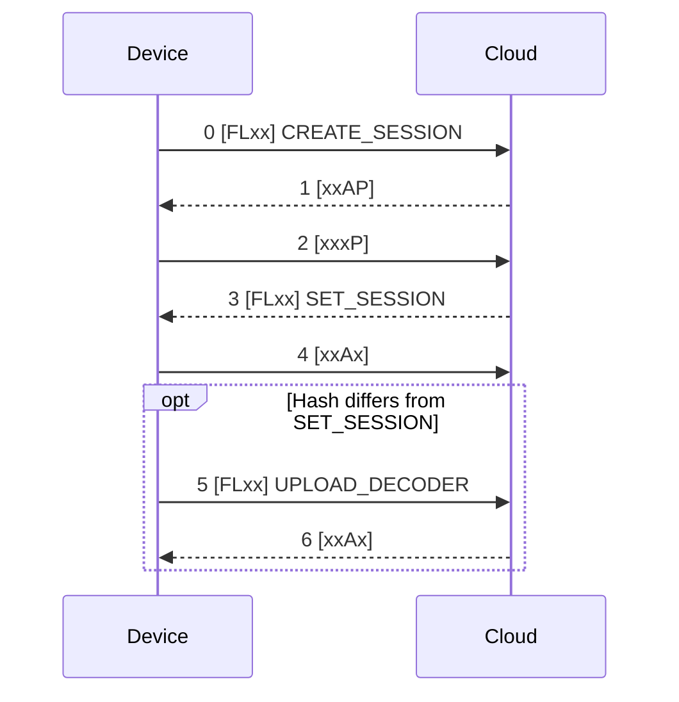

# Typy zpráv FLAP {#flap-message-types}

**Zpráva** se skládá z dat všech fragmentů jednoho přenosu (viz [**Přenosy**](transfers.md)). Její první bajt je typ zprávy, zbytek je hodnota:

```
+----------+------------------------------+
| Type     | Value                        |
| 1 byte   | 0 to 16383 bytes             |
+----------+------------------------------+
```

Většina hodnot jsou mapy [**CBOR**](https://cbor.io/) s malými celočíselnými klíči. Zprávu s neznámým typem nebo neplatnou hodnotou Cloud ignoruje a nepotvrdí ji.

## Typy zpráv {#message-types}

| Typ | Název | Směr | Hodnota |
|---|---|---|---|
| `0x00` | CREATE_SESSION | Uplink | Mapa CBOR s informacemi o zařízení |
| `0x01` | GET_TIMESTAMP | Uplink | Prázdná. Cloud odpoví zprávou SET_TIMESTAMP |
| `0x02` | UPLOAD_CONFIG | Uplink | Hash konfigurace (8 B), `0x00`, pole CBOR s řádky konfigurace |
| `0x03` | UPLOAD_DECODER | Uplink | Hash kodeku (8 B), definice dekodéru v CBOR |
| `0x04` | UPLOAD_ENCODER | Uplink | Hash kodeku (8 B), definice enkodéru v CBOR |
| `0x05` | UPLOAD_STATS | Uplink | Mapa CBOR s dobou běhu a statistikami mobilní sítě |
| `0x06` | UPLOAD_DATA | Uplink | Hash dekodéru (8 B), aplikační data v CBOR |
| `0x07` | UPLOAD_SHELL | Uplink | Mapa CBOR s výsledky příkazů shellu |
| `0x08` | UPLOAD_FIRMWARE | Uplink | Mapa CBOR s požadavkem na aktualizaci firmwaru nebo jejím stavem |
| `0x80` | SET_SESSION | Downlink | Mapa CBOR s parametry relace |
| `0x81` | SET_TIMESTAMP | Downlink | Unixový čas v sekundách jako 64bitové celé číslo (8 B) |
| `0x82` | DOWNLOAD_CONFIG | Downlink | `0x00`, pole CBOR s konfiguračními příkazy |
| `0x86` | DOWNLOAD_DATA | Downlink | Hash enkodéru (8 B), aplikační data v CBOR |
| `0x87` | DOWNLOAD_SHELL | Downlink | Mapa CBOR s příkazy shellu ke spuštění |
| `0x88` | DOWNLOAD_FIRMWARE | Downlink | Mapa CBOR s částí firmwaru |
| `0xFF` | REQUEST_REBOOT | Downlink | Vyhrazeno |

## Zahájení relace {#session-start}

Po připojení k síti zařízení nejprve otevře relaci, teprve potom posílá data:

1. Zařízení pošle **CREATE_SESSION**. Cloud ji potvrdí s příznakem P, protože čeká odpověď SET_SESSION.
2. Zařízení se dotáže a přijme **SET_SESSION**. Podle časové značky v ní si nastaví hodiny.
3. SET_SESSION obsahuje hashe dekodéru, enkodéru a konfigurace, které Cloud pro toto zařízení zná. Zařízení nahraje jen ty, které se liší: **UPLOAD_DECODER**, **UPLOAD_ENCODER**, **UPLOAD_CONFIG**.
4. Zařízení je připravené posílat **UPLOAD_DATA** a dotazovat se na downlinky.



Hlavičky FLAP prvních pěti paketů jsou `c000`, `3001`, `1002`, `c003` a `2004`.

### CREATE_SESSION {#create_session}

| Klíč | Hodnota | Typ |
|---|---|---|
| 0 | Časový limit watchdogu (vyhrazeno, 0) | Celé číslo |
| 1 | Název výrobce | Text |
| 2 | Název produktu | Text |
| 3 | Varianta hardwaru | Text |
| 4 | Revize hardwaru | Text |
| 5 | Balík firmwaru | Text |
| 6 | Název firmwaru | Text |
| 7 | Verze firmwaru | Text |
| 8 | Passkey pro Bluetooth | Text |
| 9 | IMSI | Celé číslo |
| 10 | IMEI | Celé číslo |
| 11 | Verze firmwaru modemu | Text |
| 12 až 15 | Sériové číslo, revize hardwaru, varianta hardwaru a verze firmwaru modulu CHESTER-Z (jen s CHESTER-Z) | Text |
| 16 | Sériové číslo | Celé číslo |
| 17 | ICCID | Text |

### SET_SESSION {#set_session}

| Klíč | Hodnota | Typ |
|---|---|---|
| 0 | ID relace | Celé číslo |
| 1 | Hash dekodéru | Celé číslo (64 bitů) |
| 2 | Hash enkodéru | Celé číslo (64 bitů) |
| 3 | Hash konfigurace | Celé číslo (64 bitů) |
| 4 | Aktuální čas, unixový čas v sekundách | Celé číslo |
| 5 | ID zařízení v HARDWARIO Cloud | Text |
| 6 | Název zařízení v HARDWARIO Cloud | Text |

## Kodeky a data {#codecs-and-data}

**Dekodér** převádí data CBOR ze zařízení do JSON, **enkodér** převádí downlinky v JSON do CBOR. Oba jsou součástí firmwaru a nahrávají se automaticky při zahájení relace, takže Cloud vždy dekóduje data kodekem firmwaru, který je poslal.

**Hash kodeku** identifikuje kodek. Počítá se z definice kodeku v CBOR (hodnota za hashem):

```
digest = SHA-256( codec )
w[k]   = digest[8k .. 8k+7] read as a little-endian 64-bit integer      for k = 0..3
hash   = w[0] ^ w[1] ^ w[2] ^ w[3]                     (sent as big-endian)
```

Cloud hash nahraného kodeku ověřuje. UPLOAD_DATA a DOWNLOAD_DATA začínají hashem kodeku, ke kterému data patří.

## Konfigurace {#configuration}

**UPLOAD_CONFIG** nese konfiguraci zařízení jako pole CBOR s textovými řádky ve formátu příkazu shellu `config show`. Před ním je osmibajtový hash konfigurace a bajt `0x00` (bez komprese). Cloud hash uloží a vrací ho v SET_SESSION, takže zařízení nahrává konfiguraci jen tehdy, když se změnila.

**DOWNLOAD_CONFIG** nese konfigurační příkazy, viz [**Downlink konfigurace**](../downlink/config.md). Zařízení je spustí, uloží konfiguraci a restartuje se.

## Příkazy shellu {#shell-commands}

**DOWNLOAD_SHELL** je mapa CBOR s polem příkazů (klíč 0) a šestnáctibajtovým ID zprávy (klíč 1). Zařízení příkazy spustí a odpoví zprávou **UPLOAD_SHELL**: mapou CBOR s polem výsledků (klíč 0) a stejným ID zprávy (klíč 1). Každý výsledek obsahuje příkaz (klíč 0), jeho návratový kód, pokud není nulový (klíč 1), a pole řádků výstupu (klíč 2). Viz [**Downlink shellu**](../downlink/shell.md).

## Aktualizace firmwaru {#firmware-update}

Aktualizace firmwaru bezdrátově používají zprávy **UPLOAD_FIRMWARE** a **DOWNLOAD_FIRMWARE**:

1. Zařízení požádá o aktualizaci typem `download` s ID firmwaru.
2. Cloud posílá firmware po částech (typ `chunk`). Zařízení odpoví na každou část typem `next` s offsetem další části.
3. Po poslední části zařízení ohlásí `swap` a restartuje se do nového firmwaru.
4. Po úspěšném startu ohlásí `ack`. Pokud cokoli selže, ohlásí `error`.

Jak spustit aktualizaci z HARDWARIO Cloud, popisuje stránka [**Firmware**](../firmware.md).
