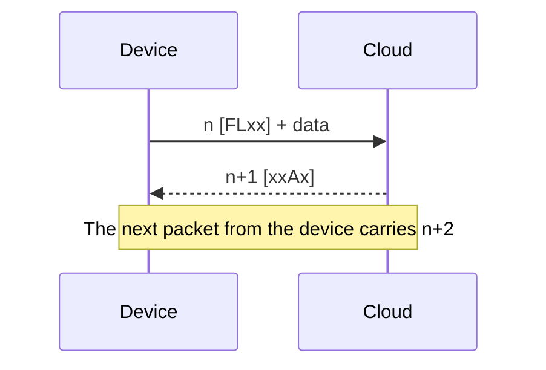
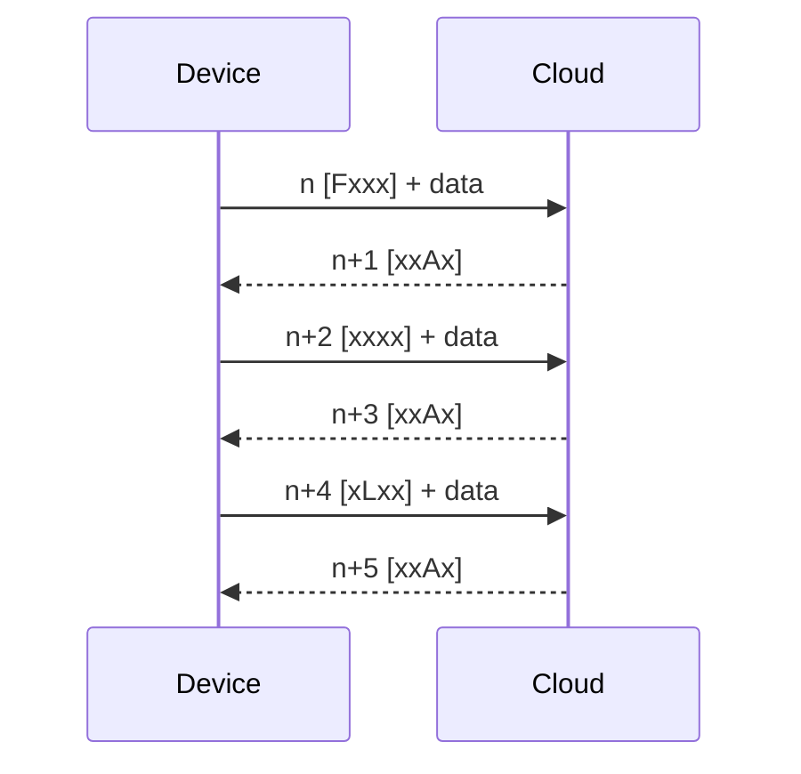
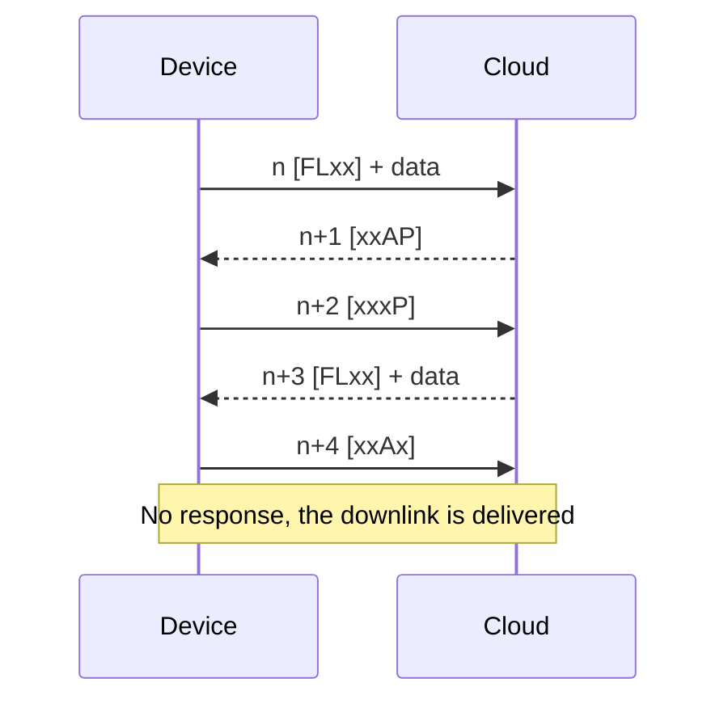
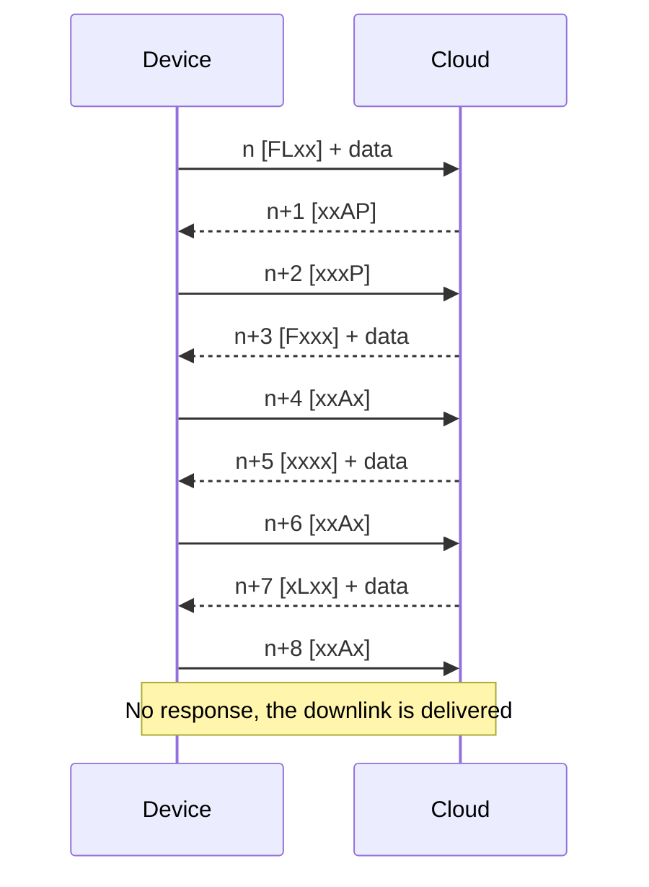
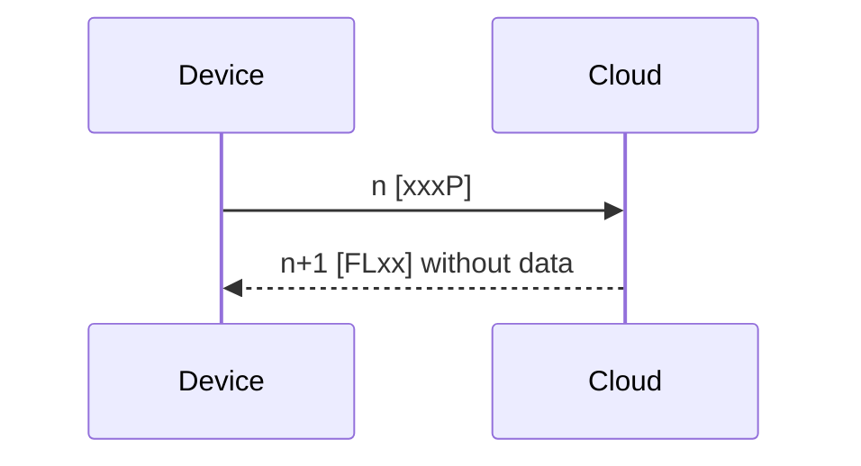
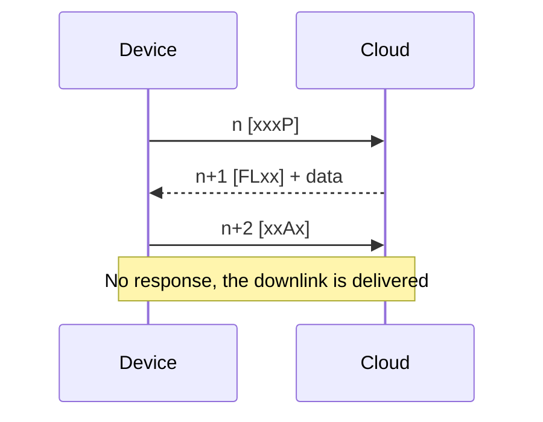
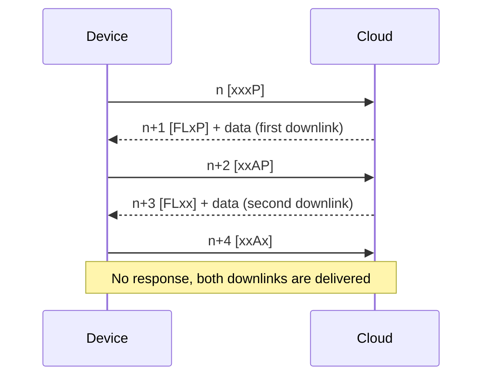

# Pakety a přenosy FLAP {#flap-packets-and-transfers}

Paket FLAP je jednotka protokolu, kterou si vyměňují zařízení a Cloud. Nikdy se neposílá samostatně: na cestě vždy putuje v [**obálce MAC**](mac-envelope.md) nebo v [**obálce DTLS**](dtls-envelope.md). Všechna vícebajtová pole jsou ve formátu **big-endian**.

## Paket FLAP {#flap-packet}

```
+-------------+----------------------+
| Header      | Data                 |
| 2 bytes     | 0 to n bytes         |
+-------------+----------------------+
```

| Pole | Velikost | Popis |
|---|---|---|
| **Hlavička** | 2 B | Příznaky a sekvenční číslo, viz [**Hlavička FLAP**](#flap-header) |
| **Data** | 0 až n B | Jeden fragment zprávy, viz [**Typy zpráv**](messages.md) |

### Hlavička FLAP {#flap-header}

Hlavička je jedna 16bitová hodnota ve formátu big-endian:

| Bit | 15 | 14 | 13 | 12 | 11 až 0 |
|---|---|---|---|---|---|
| **Pole** | F | L | A | P | Sekvenční číslo |

| Příznak | Název | Význam |
|---|---|---|
| **F** | First | Paket nese první fragment zprávy |
| **L** | Last | Paket nese poslední fragment zprávy. Zpráva z jediného fragmentu má nastavené F i L |
| **A** | Ack | Potvrzuje předchozí paket protistrany. Paket s příznakem A nikdy nenese data |
| **P** | Poll | Od zařízení: „pošli mi downlink“. Od Cloudu: „čeká na tebe downlink“ |

Dvanáctibitové **sekvenční číslo** popisuje sekce [**Sekvenční číslo**](#sequence-number).

### Zápis příznaků {#flag-notation}

V logech i v této dokumentaci se příznaky zapisují jako čtyři znaky v pořadí `FLAP`, nenastavený příznak jako `x`. Například `[FLxx]` je zpráva z jediného fragmentu a `[xxAP]` je potvrzení s příznakem Poll.

| Hlavička | Příznaky | Sekvence | Význam |
|---|---|---|---|
| `0xC000` | `[FLxx]` | 0 | Zpráva z jediného fragmentu, začátek nové výměny |
| `0x3001` | `[xxAP]` | 1 | Potvrzení, čeká downlink |
| `0x1002` | `[xxxP]` | 2 | Poll |
| `0x2004` | `[xxAx]` | 4 | Potvrzení |
| `0x0000` | `[xxxx]` | 0 | Žádost Cloudu o reset, viz [**Reset**](#reset) |

## Sekvenční číslo {#sequence-number}

Zařízení a Cloud sdílejí **jeden sekvenční čítač**. Každý paket v obou směrech nese sekvenční číslo předchozího paketu zvýšené o jedna:

- Zařízení pošle paket se sekvenčním číslem `n`.
- Cloud odpoví s `n+1`.
- Další paket ze zařízení nese `n+2`.
- Pokud Cloud na paket neodpoví (například na závěrečné potvrzení downlinku), další paket ze zařízení nese sekvenční číslo jeho vlastního posledního paketu zvýšené o jedna.

Potvrzení **neopakuje** sekvenční číslo paketu, který potvrzuje. Nese další hodnotu čítače.

Hodnota `0` je vyhrazená: paket se sekvenčním číslem `0` zahajuje novou výměnu (viz [**Reset**](#reset)). Po hodnotě `4095` následuje `1`. Zařízení začíná s `0` po startu a po každé chybě.

Zařízení kontroluje, že každá odpověď nese sekvenční číslo jeho požadavku zvýšené o jedna. Pokud ne, začne znovu se sekvenčním číslem `0`.

## Přenos uplinku {#uplink-transfer}

Zařízení rozdělí zprávu na fragmenty a pošle je popořadě:

- První fragment má příznak **F**, poslední příznak **L**, fragmenty mezi nimi nemají žádný. Zpráva, která se vejde do jednoho fragmentu, se posílá jako `[FLxx]`.
- Cloud potvrdí každý fragment paketem `[xxAx]`.
- Když Cloud potvrzuje poslední fragment a čeká downlink, potvrzení je `[xxAP]`.
- Fragmenty nikdy nenesou příznak A ani P. Když se chce zařízení dotázat na downlink, pošle samostatný paket bez dat.

## Přenos downlinku {#downlink-transfer}

Zařízení si downlinky vyzvedává **dotazováním**:

- Zařízení pošle `[xxxP]` bez dat.
- Pokud čeká downlink, Cloud odpoví jeho prvním fragmentem (`[Fxxx]`, u jediného fragmentu `[FLxx]`). Pokud nic nečeká, odpoví `[FLxx]` bez dat.
- Zařízení potvrdí každý fragment paketem `[xxAx]`. Na potvrzení fragmentu Cloud odpoví dalším fragmentem.
- Na potvrzení posledního fragmentu Cloud neodpoví, pokud to není `[xxAP]`: pak odpoví dalším downlinkem.
- Když čeká další downlink, Cloud nastaví příznak **P** na posledním fragmentu, například `[FLxP]` nebo `[xLxP]`.

Downlink se v HARDWARIO Cloud označí jako doručený, když dorazí potvrzení jeho posledního fragmentu. Pokud se toto potvrzení ztratí, doručení potvrdí i další paket ze zařízení, který navazuje na sekvenci. Do té doby Cloud nabízí stejný downlink při každém dotazu. Downlink, který se nepodaří doručit do 30 dnů, vyprší.

Zařízení se dotazuje, když potvrzení nese příznak P, v intervalu nastaveném aplikací (například `app config interval-poll`) a na vyžádání příkazem shellu `cloud poll`. Jak se downlinky řadí do fronty, popisuje stránka [**Downlink**](../downlink/index.md).

## Reset {#reset}

**Ze zařízení.** Paket se sekvenčním číslem `0` říká Cloudu, aby zahodil stav nedokončeného přenosu tohoto zařízení a paket zpracoval jako začátek nové výměny. Downlink, který byl celý odeslán, ale ještě nepotvrzen, se nejprve potvrdí.

**Z Cloudu.** Cloud žádá zařízení o nový začátek **resetovacím paketem**: hlavička `0x0000` (žádné příznaky, sekvenční číslo `0`, žádná data). Pošle ho, když:

- sekvenční číslo paketu je vyšší než očekávaná hodnota, například po restartu služby Cloudu,
- tag MAC [**obálky MAC**](mac-envelope.md) se známým sériovým číslem je neplatný,
- zařízení opakuje stejný paket déle než 60 sekund.

Zařízení, které přijme resetovací paket, nastaví sekvenční číslo na `0` a pošle aktuální zprávu znovu od prvního fragmentu.

Paket se sekvenčním číslem nižším, než je očekávaná hodnota, Cloud ignoruje.

## Opakování a duplicity {#retransmission-and-duplicates}

Cloud nikdy sám paket nepošle, takže za opakování odpovídá zařízení. Když odpověď nepřijde včas, zařízení může:

- **Zopakovat paket.** Zařízení pošle znovu identický paket (stejné sekvenční číslo, příznaky i data). Cloud ho rozpozná jako duplikát posledního paketu a na **každý druhý** duplikát odpoví odpovědí, kterou poslal předtím, takže zařízení by mělo paket zopakovat alespoň dvakrát. Důležité je to s RAI, kdy zařízení může přijmout odpověď jen hned poté, co něco odešle.
- **Začít znovu.** Zařízení přenos vzdá a pošle zprávu znovu se sekvenčním číslem `0`. Takto funguje SDK pro CHESTER: na každou odpověď čeká 5 sekund a při jakékoli chybě začne znovu.

## Limity velikosti {#size-limits}

- Data jednoho paketu FLAP se musí spolu s obálkou vejít do jednoho datagramu UDP. Limit datagramu je dnes 508 bajtů. Maximální velikost fragmentu proto závisí na obálce, viz [**Obálka MAC**](mac-envelope.md#size-limits) a [**Obálka DTLS**](dtls-envelope.md#size-limits).
- Zpráva složená z fragmentů nese hodnotu o velikosti nejvýše 16383 bajtů.

## Neplatné pakety {#invalid-packets}

Cloud neodpoví na paket FLAP kratší než 2 bajty, na paket s příznakem A, který nese data, ani na paket, jehož příznaky neodpovídají aktuálnímu stavu přenosu. Pakety, které odmítne obálka, se do této vrstvy vůbec nedostanou.

## Scénáře {#scenarios}

Diagramy níže ukazují všechny kombinace uplinku a downlinku. `n` je aktuální hodnota sekvenčního čítače.

### Scénář A: uplink z jednoho fragmentu, žádný downlink {#scenario-a-single-fragment-uplink-no-downlink}



### Scénář B: uplink z více fragmentů, žádný downlink {#scenario-b-multi-fragment-uplink-no-downlink}



### Scénář C: uplink z jednoho fragmentu, čeká downlink z jednoho fragmentu {#scenario-c-single-fragment-uplink-single-fragment-downlink-waiting}



### Scénář D: uplink z jednoho fragmentu, čeká downlink z více fragmentů {#scenario-d-single-fragment-uplink-multi-fragment-downlink-waiting}



### Scénář E: poll, žádný downlink {#scenario-e-poll-no-downlink}



### Scénář F: poll, downlink z jednoho fragmentu {#scenario-f-poll-single-fragment-downlink}



### Scénář G: poll, dva downlinky z jednoho fragmentu {#scenario-g-poll-two-single-fragment-downlinks}



Zahájení relace na stránce [**Typy zpráv**](messages.md#session-start) je skutečným příkladem scénáře C.
