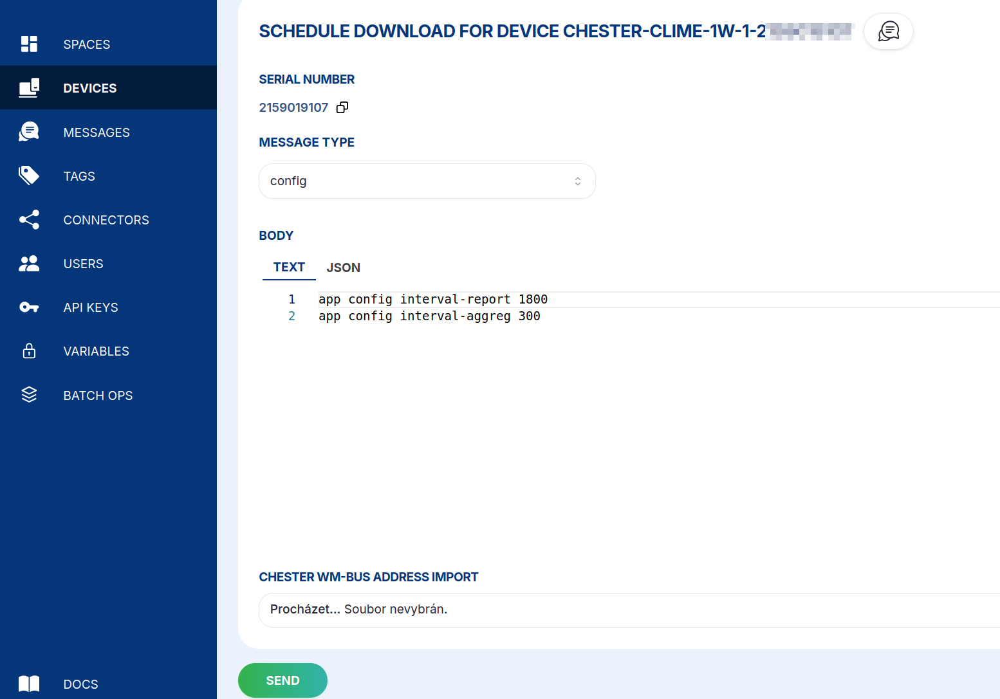

import Tabs from '@theme/Tabs';
import TabItem from '@theme/TabItem';

# Konfigurace {#config}

Konfiguraci zařízení změníte stejně jako přes BLE nebo J-Link RTT: odešlete jeden nebo více
příkazů `app config` a zařízení CHESTER je použije, až příště odešle paket uplink nebo se zeptá
cloudu.

Otevřete u zařízení **Messages** → **+&nbsp;SCHEDULE DOWNLINK**, nastavte **Message type** na **config**,
zadejte příkazy do pole **Body** jako obyčejný **text** nebo **JSON** a klikněte na **SEND**.



<Tabs>
  <TabItem value="text" label="Text" default>

```
app config mode lte
app config interval-sample 60
app config interval-aggreg 300
app config interval-report 1800
```

  </TabItem>
  <TabItem value="json" label="JSON">

```json
{
  "type": "config",
  "device_id": "<device-id>",
  "body": [
    "app config mode lte",
    "app config interval-sample 60",
    "app config interval-aggreg 300",
    "app config interval-report 1800"
  ]
}
```

  </TabItem>
</Tabs>

:::warning[Neposílejte config save přes cloud]

Při **místní** konfiguraci zařízení končíte příkazem `config save`, který změny uloží a zařízení
restartuje. **Přes cloud příkaz `config save` posílat nesmíte**, protože HARDWARIO Cloud konfiguraci
použije a uloží automaticky. Kdybyste ho přidali, mohla by se změna použít dvakrát, proto ho vynechte.

:::

Úplný seznam konfiguračních parametrů najdete v dokumentaci zařízení CHESTER v části
[**Výchozí konfigurace**](/chester/catalog-applications/common-functionality#default-configuration);
příkaz `app config show` vypíše aktuální hodnoty zařízení.
