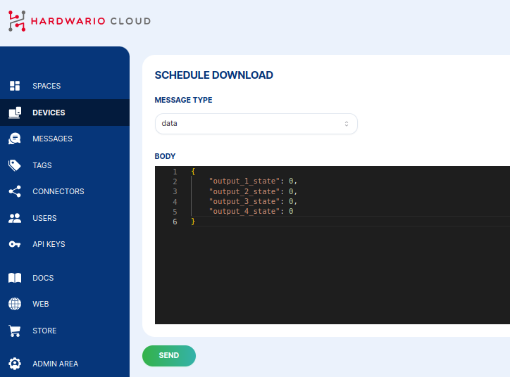

# Data {#data}

Downlink typu **data** posílá do zařízení objekt JSON. Firmware ho dekóduje
do struktury s vyplněnými hodnotami. Hodí se k ovládání výstupů, změně
požadované hodnoty nebo ke spuštění akce.

## Odeslání downlinku typu data {#send-a-data-downlink}

1. Otevřete u zařízení sekci **Messages** a klikněte na **+&nbsp;SCHEDULE DOWNLINK**.
2. Nastavte **Message type** na **data**.
3. Do pole **Body** zadejte JSON, který firmware očekává, a klikněte na **SEND**.



Například aplikace CHESTER Control se čtyřmi výstupy může přijímat:

```json
{
  "output_1_state": 0,
  "output_2_state": 0,
  "output_3_state": 0,
  "output_4_state": 0
}
```

Konkrétní klíče závisí na firmwaru zařízení. Jako každý downlink se i tato zpráva
**zařadí do fronty** a doručí se při příštím startu zařízení, odeslání uplinku nebo
dotazu na cloud.
