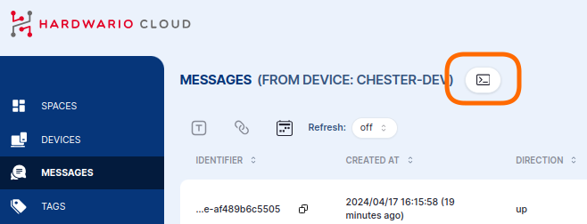
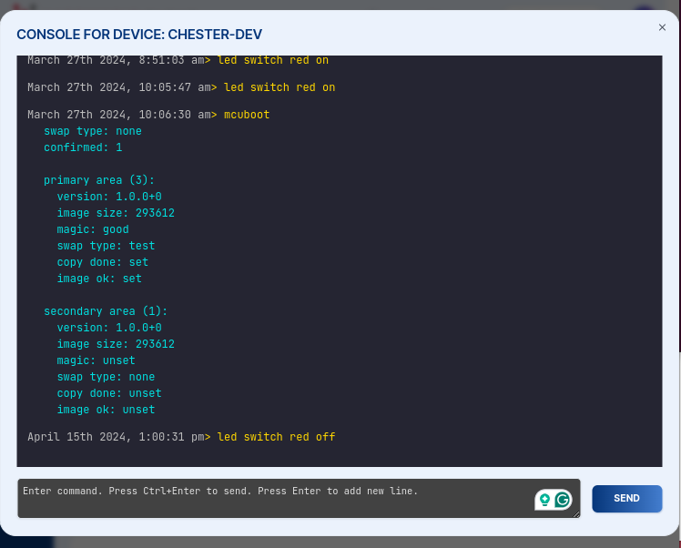

# Příkazy shellu {#shell-commands}

Ve zprávách nebo v detailu zařízení klikněte na ikonu **shell**, čímž otevřete konzoli shellu.

V konzoli můžete zadat **jeden nebo více příkazů**, které se vykonají při dalším startu zařízení **CHESTER**,
při odeslání dat nebo při dotazu do HARDWARIO Cloud. **Odpověď každého příkazu** pak dostanete zpět do konzole, takže
okno nemusíte nechávat otevřené. Naplánujte příkazy a vraťte se později (i následující den)
pro výsledky.

Funguje zde jakýkoli příkaz shellu zařízení. Několik užitečných:

| Příkaz | Popis |
| --- | --- |
| `help` | Vypíše všechny dostupné příkazy shellu |
| `info show` | Zobrazí informace o zařízení. HARDWARIO Serial Number (HSN), verzi firmwaru atd. |
| `app config show` | Vypíše konfiguraci aplikace |
| `lte config show` | Vypíše konfiguraci sítě NB-IoT/LTE |
| `lrw config show` | Vypíše konfiguraci sítě LoRaWAN |
| `config reset` | Obnoví výchozí konfiguraci |

