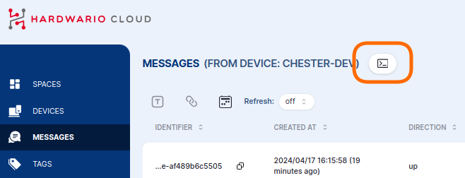
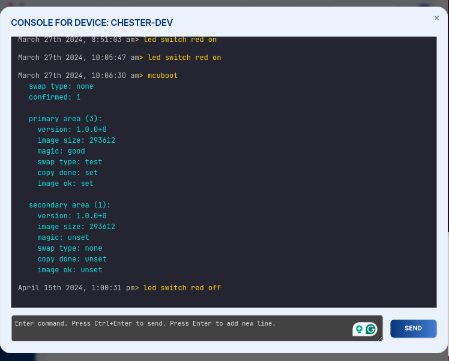

# Příkazy shellu {#shell-commands}

Konzoli shellu otevřete ikonou **shell** ve zprávách nebo v detailu zařízení.

V konzoli můžete zadat **jeden nebo více příkazů**, které zařízení **CHESTER** provede při příštím startu,
odeslání dat nebo dotazu na cloud. **Odpověď každého příkazu** pak dostanete zpět do konzole, takže
okno nemusíte nechávat otevřené. Příkazy naplánujte a pro výsledky se vraťte později (klidně
i další den).

Funguje zde jakýkoli příkaz shellu zařízení. Několik užitečných:

| Příkaz | Popis |
| --- | --- |
| `help` | Vypíše všechny dostupné příkazy shellu |
| `info show` | Zobrazí informace o zařízení: HARDWARIO Serial Number (HSN), verzi firmwaru atd. |
| `app config show` | Vypíše konfiguraci aplikace |
| `lte config show` | Vypíše konfiguraci sítě NB-IoT/LTE |
| `lrw config show` | Vypíše konfiguraci sítě LoRaWAN |
| `config reset` | Obnoví výchozí konfiguraci |

