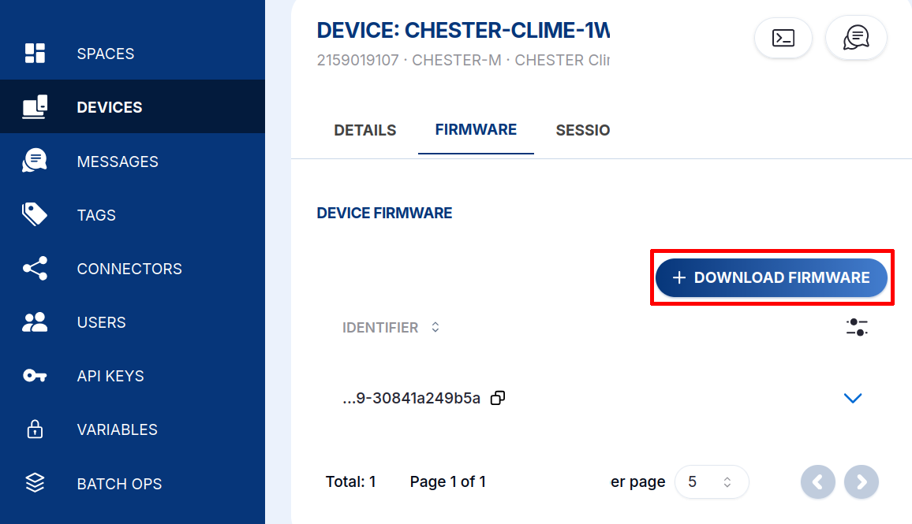
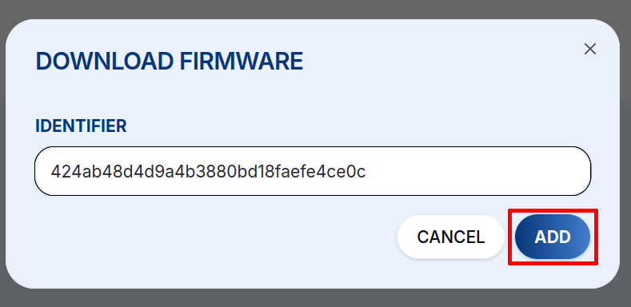
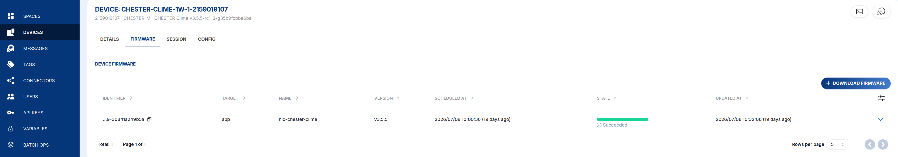
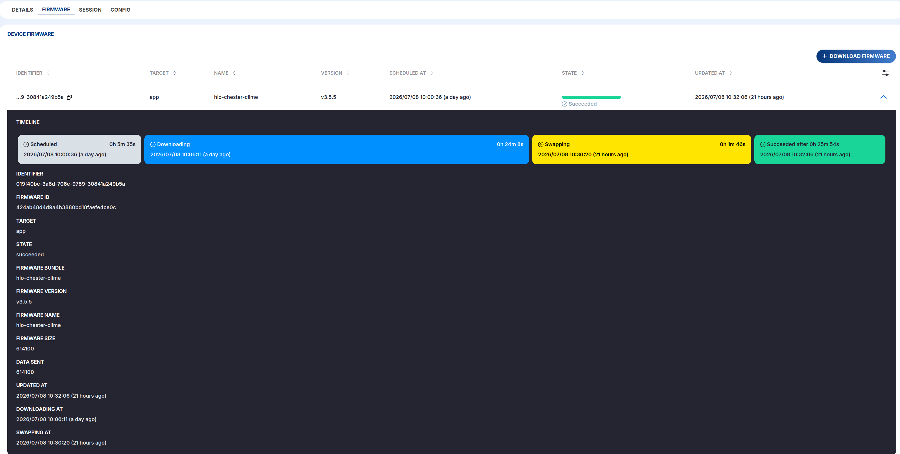

# Aktualizace firmwaru {#firmware-updates}

Firmware zařízení CHESTER můžete aktualizovat na dálku z cloudu, vzduchem, bez
fyzického přístupu k zařízení. Těmto aktualizacím se také říká **FOTA** (Firmware
Over-The-Air).

## 1. Získejte identifikátor firmwaru {#1-get-the-firmware-identifier}

Většina aktualizací využívá **hotový katalogový firmware**, takže nemusíte nic
sestavovat sami. Otevřete tabulku
[**Catalog Applications → Application Firmware**](/chester/catalog-applications/catalog-applications#application-firmware)
zařízení CHESTER, najděte svou aplikaci a variantu a zkopírujte její **Identifier** (hodnota jako
`424ab48d4d9a4b3880bd18faefe4ce0c`).

:::info Sestavte si vlastní firmware
Pomocí HARDWARIO CLI si můžete sestavit a nahrát **vlastní** firmware a jeho
identifikátor použít stejným způsobem, viz
[**Build and Deploy**](/chester/firmware-sdk/build-and-deploy) v dokumentaci zařízení CHESTER.
:::

## 2. Naplánujte stažení na zařízení {#2-schedule-the-download-on-the-device}

Otevřete detail zařízení, přepněte na kartu **Firmware** a klikněte na
**+ DOWNLOAD FIRMWARE**.

Vložte **Identifier** firmwaru a klikněte na **ADD**.

## 3. Zařízení se aktualizuje samo {#3-the-device-updates-itself}

Při dalším startu, odeslání dat nebo dotazu na cloud začne zařízení CHESTER
stahovat nový firmware. Stahování běží **na pozadí asi 30 minut**, takže zařízení
normálně dál měří a odesílá data.

Seznam **Firmware** zobrazuje každé naplánované stažení a jeho **stav** (Scheduled,
Downloading, Swapping, Succeeded, Cancelled):

Otevřením záznamu můžete celou aktualizaci sledovat krok za krokem na časové ose:

## Co se děje na zařízení {#what-happens-on-the-device}

Po stažení nového firmwaru se firmware přesune mezi externí SPI flash a interní
flash mikrokontroléru. To trvá až dvě minuty a během této doby stavová LED bliká
zeleně/žlutě/červeně. Zařízení CHESTER se poté s novým firmwarem znovu připojí k
HARDWARIO Cloud, firmware je ověřen jako _healthy_ a cloudu je potvrzena úspěšná
aktualizace.

:::info Automatický rollback
Bootloader MCUboot je chráněný: pokud nový firmware neběží správně, zařízení se
vrátí k předchozí verzi a znovu se připojí se starým firmwarem.
:::
