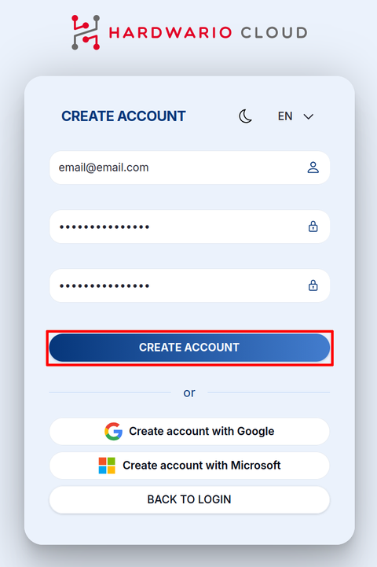
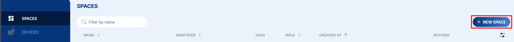
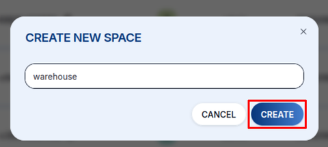
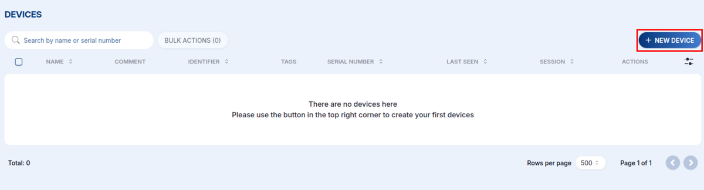
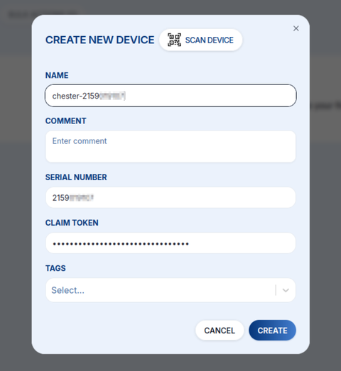
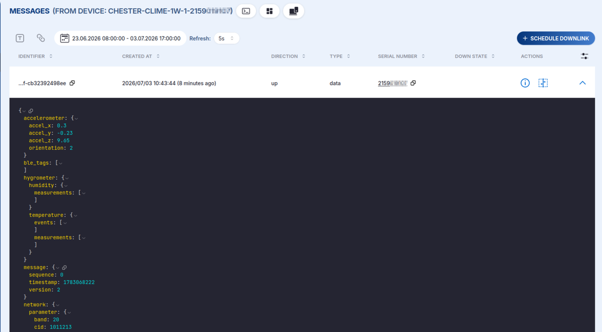

# Rychlý průvodce HARDWARIO Cloud {#hardwario-cloud-quick-start-guide}

Vítejte v **HARDWARIO Cloud**, platformě, kde se spravují vaše zařízení a kam přichází vaše živá
data. Podle následujících kroků si vytvoříte účet, zaregistrujete první zařízení a začnete pracovat
s jeho zprávami.

## Krok 1: Vytvořte si účet HARDWARIO Cloud {#step-1-create-a-hardwario-cloud-account}

1. Přejděte na [**https://hardwario.cloud**](https://hardwario.cloud)
2. Klikněte na **SIGN UP**
3. Vytvořte účet pomocí účtu **Google** nebo **Microsoft**, případně přes **e-mail a heslo** (ověřte svůj e-mail).
4. Po ověření se **přihlaste**.

:::info
Pro vyšší bezpečnost doporučujeme ověření přes **Google** nebo **Microsoft**.
:::

## Krok 2: Vytvořte svůj Space {#step-2-create-your-space}

1. V pravém horním rohu klikněte na **SPACES → NEW SPACE**.

   

2. Pojmenujte svůj space (například: `my-home`, `office-sensors`, `warehouse`). Řiďte se [**konvencemi pojmenování**](/cloud/#naming-conventions).

   

3. Právě zde budou vaše zařízení žít. Podrobnosti viz [**Spaces**](/cloud/spaces).

## Krok 3: Přidejte zařízení {#step-3-add-a-device}

1. Vyberte svůj **Space**.
2. Přejděte na **DEVICES → +NEW DEVICE**.

   

3. Zadejte informace o zařízení: buď **naskenujte QR kód** (`⛶ SCAN DEVICE`) a vše se vyplní automaticky, nebo zadejte **Name**, **HARDWARIO Serial Number (HSN)** a **Claim Token** ručně.

   

4. Uložte: vaše zařízení je nyní **zaregistrováno v Cloudu**. Vše, co můžete dělat dál, najdete v sekci [**Devices**](/cloud/devices).

## Krok 4: Podívejte se na svá data {#step-4-see-your-data}

Jakmile je zařízení napájené a připojené, jeho uplinky se objeví v Cloudu.

- Příchozí payloady si přečtěte v sekci [**Messages**](/cloud/messages).
- Související zařízení seskupte a filtrujte pomocí [**Tags**](/cloud/tags).
- Informace typu klíč–hodnota pro jednotlivá zařízení ukládejte pomocí [**Variables**](/cloud/variables).

## Krok 5: Zasáhněte do chodu svých zařízení {#step-5-act-on-your-devices}

Cloud je obousměrný: pošlete konfiguraci, data nebo shell příkazy zpět pomocí
[**Downlink**](/cloud/downlink) a nahrajte nový [**Firmware**](/cloud/firmware) vzduchem.

## Krok 6: Propojte Cloud se svými systémy {#step-6-integrate-with-your-systems}

Data z Cloudu odešlete dál pomocí [**Connectors**](/cloud/connectors) (webhooky), nebo se na ně
programově dotazujte přes [**REST API**](/cloud/api).

## Krok 7: Spravujte přístup {#step-7-manage-access}

Pozvěte kolegy a řiďte, kdo může váš Space vidět a měnit, v sekci [**Users**](/cloud/users).

## Další kroky {#next-steps}

Podrobnosti ke všem funkcím najdete v kompletní [**dokumentaci HARDWARIO Cloud**](/cloud/).
