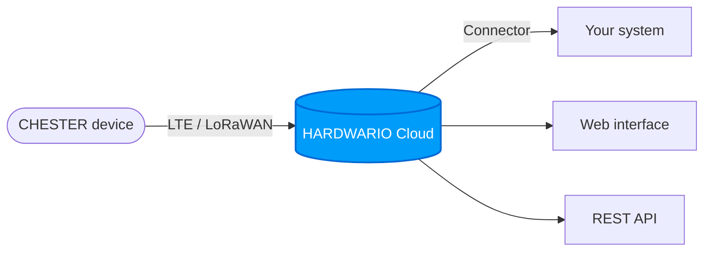

# HARDWARIO Cloud {#hardwario-cloud}

[**HARDWARIO Cloud**](https://hardwario.cloud/) je platforma pro správu zařízení CHESTER a dalších IoT zařízení HARDWARIO. Poskytuje webové rozhraní a REST API pro správu zařízení, příjem zpráv, vzdálenou konfiguraci zařízení a nahrávání aktualizací firmwaru vzduchem.

## Klíčové funkce {#key-features}

| Funkce | Popis |
|---|---|
| **Spaces** | Izolované pracovní prostory. Každý s vlastními zařízeními, uživateli, tagy a konektory |
| **Devices** | Přidávání a správa IoT zařízení, zobrazení stavu v reálném čase a informací o firmwaru |
| **Messages** | Procházení uplink/downlink zpráv s JSON prohlížečem a základním dashboardem |
| **Tags** | Označení skupin zařízení a jejich propojení s konektory |
| **Connectors** | Přeposílání dat pomocí webhooků s transformací v JavaScriptu |
| **Downlink** | Vzdálené odesílání konfigurace, dat nebo shell příkazů do zařízení |
| **Firmware** | Nahrávání aktualizací firmwaru vzduchem (FOTA) |
| **API** | Plný přístup k REST API pomocí API klíčů |

## Jak to funguje {#how-it-works}

Všechna zařízení patří do některého **Space**. Space je nejvyšší kontejner pro všechno: zařízení, uživatele, tagy, konektory a proměnné. Můžete mít více prostorů (např. jeden na zákazníka nebo projekt).

Více podrobností najdete v sekci [**Spaces**](spaces.md).

## Automatické kodeky {#automatic-codecs}

V Cloud v2 jsou kodeky zařízení (enkodéry a dekodéry) obsaženy přímo ve firmwaru a nahrají se automaticky při prvním připojení zařízení. Kodeky není potřeba nastavovat ručně.

## Spolehlivé doručení {#reliable-delivery}

Cloud v2 spolu se subsystémem **LTE v2** v zařízení CHESTER přidává:
- Automatickou fragmentaci paketů (podporuje payload o velikosti mnoha kilobajtů)
- Potvrzování příjmu s automatickým opakovaným odesláním
- Podepisování zpráv pomocí SHA-256

:::info

Informace o tom, jak používat nebo povýšit firmware zařízení CHESTER na LTE v2, najdete v [How To: LTE v2](/chester/firmware-sdk/how-to-lte-v2).

:::

## Konvence pojmenování {#naming-conventions}

Názvy prostorů, zařízení, tagů a konektorů se řídí stejnými pravidly:

- Pouze malá písmena (`a–z`), číslice (`0–9`) a pomlčky (`-`)
- Délka nejméně 3 znaky
- Nesmí začínat číslicí
- Nesmí začínat ani končit pomlčkou

Regulární výraz: `/^[a-z][a-z0-9-]+[a-z0-9]$/`
