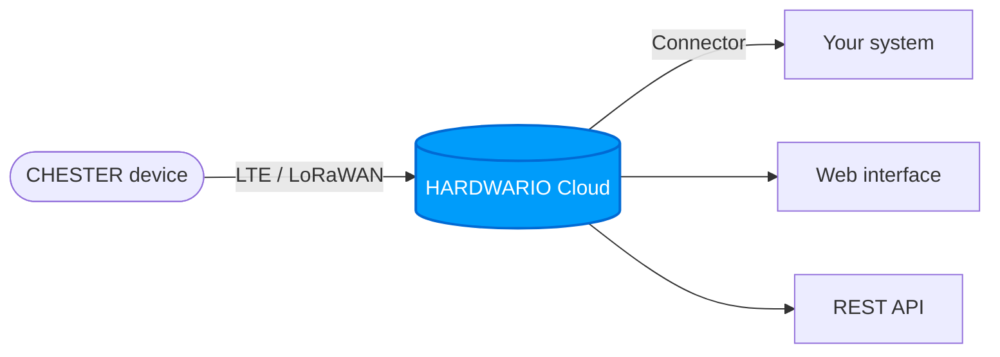

# HARDWARIO Cloud {#hardwario-cloud}

[**HARDWARIO Cloud**](https://hardwario.cloud/) je platforma pro správu zařízení CHESTER a dalších zařízení IoT od HARDWARIO. Nabízí webové rozhraní a REST API, přes které zařízení spravujete, přijímáte z nich zprávy, na dálku je konfigurujete a bezdrátově aktualizujete jejich firmware.

## Klíčové funkce {#key-features}

| Funkce | Popis |
|---|---|
| **Spaces** | Izolované pracovní prostory, každý s vlastními zařízeními, uživateli, tagy a konektory |
| **Devices** | Přidávání a správa zařízení IoT, aktuální stav a informace o firmwaru |
| **Messages** | Procházení zpráv uplink a downlink s prohlížečem JSON a základním dashboardem |
| **Tags** | Označení skupin zařízení a jejich propojení s konektory |
| **Connectors** | Přeposílání dat pomocí webhooků s transformací v JavaScriptu |
| **Downlink** | Vzdálené odesílání konfigurace, dat nebo příkazů shellu do zařízení |
| **Firmware** | Bezdrátové aktualizace firmwaru (FOTA) |
| **API** | Plný přístup k REST API pomocí klíčů API |

## Jak to funguje {#how-it-works}

```mermaid
flowchart LR
  CHESTER([CHESTER device]) -->|LTE / LoRaWAN| Cloud[(HARDWARIO Cloud)]
  Cloud -->|Connector| System[Your system]
  Cloud --> Web[Web interface]
  Cloud --> API[REST API]
  classDef hero fill:#009cfa,stroke:#016ad4,stroke-width:2px,color:#ffffff;
  class Cloud hero;
```

Všechna zařízení patří do některého **prostoru** (Space). Prostor je kontejner nejvyšší úrovně pro všechno: zařízení, uživatele, tagy, konektory a proměnné. Můžete mít více prostorů (např. jeden na zákazníka nebo projekt).

Podrobnosti najdete na stránce [**Prostory**](spaces.md).

## Automatické kodeky {#automatic-codecs}

V Cloud v2 jsou kodeky zařízení (enkodéry a dekodéry) obsaženy přímo ve firmwaru a nahrají se automaticky při prvním připojení zařízení. Kodeky není potřeba nastavovat ručně.

## Spolehlivé doručení {#reliable-delivery}

Cloud v2 spolu se subsystémem **LTE v2** v zařízení CHESTER přidává:
- Automatickou fragmentaci paketů (payload může mít i mnoho kilobajtů)
- Potvrzování příjmu s automatickým opakovaným odesláním
- Autentizaci zpráv 64bitovým kódem založeným na SHA-256

Přenosový protokol popisuje stránka [**Protokol zařízení (FLAP)**](device-protocol/index.md).

:::info

Jak používat LTE v2 nebo na ně převést firmware zařízení CHESTER, popisuje stránka [Jak na: LTE v2](/chester/firmware-sdk/how-to-lte-v2).

:::

## Konvence pojmenování {#naming-conventions}

Názvy prostorů, zařízení, tagů a konektorů se řídí stejnými pravidly:

- Pouze malá písmena (`a–z`), číslice (`0–9`) a spojovníky (`-`)
- Délka nejméně 3 znaky
- Nesmí začínat číslicí
- Nesmí začínat ani končit spojovníkem

Regulární výraz: `/^[a-z][a-z0-9-]+[a-z0-9]$/`
