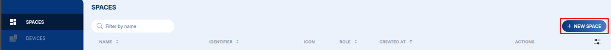
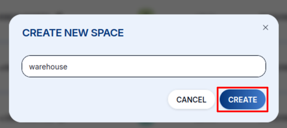

# Prostory {#spaces}

**Prostor (Space)** je nejvyšší organizační jednotka v HARDWARIO Cloud. Všechno, tedy zařízení, tagy, konektory, proměnné i uživatelé, patří do některého prostoru.

Typické využití:
- Jeden prostor pro nasazení u jednoho **zákazníka**
- Jeden prostor pro **projekt** nebo prostředí (např. `myproject-dev`, `myproject-prod`)
- Osobní prostor pro vývoj a testování

## Typy prostorů {#space-types}

| Typ | Popis |
|---|---|
| **personal** | Vytvoří se automaticky pro každý uživatelský účet. Váš soukromý pracovní prostor |
| **team** | Sdílený pracovní prostor pro skupinu uživatelů |
| **default** | Standardní typ prostoru pro zákaznická nasazení |
| **premium** | Prostor s rozšířenými limity nebo funkcemi |

## Vytvoření prostoru {#creating-a-space}

1. V pravém horním rohu otevřete **SPACES** a klikněte na **+ NEW SPACE**.

   

2. Zadejte název podle [konvencí pojmenování](/cloud/#naming-conventions) a klikněte na **CREATE**.

   

Nový prostor se okamžitě objeví v přepínači prostorů.

## Přehled prostoru {#space-overview}

Po otevření prostoru zobrazuje levý postranní panel všechny dostupné sekce:

- **Devices**: všechna zařízení zaregistrovaná v tomto prostoru
- **Messages**: zprávy uplink a downlink ze všech zařízení
- **Tags**: správa tagů
- **Connectors**: webhookové konektory
- **Variables**: dešifrovací klíče a další proměnné na úrovni prostoru
- **Users**: členové prostoru a jejich role
- **FOTA**: správa aktualizací firmwaru

## Členové {#members}

Do prostoru můžete ke spolupráci pozvat další uživatele. Každý člen má jednu z rolí:

| Role | Oprávnění |
|---|---|
| **Admin** | Plný přístup. Může přidávat/odebírat zařízení, spravovat konektory, zvát uživatele, měnit nastavení |
| **User** | Přístup pouze pro čtení. Může prohlížet zařízení a zprávy, ale nemůže nic měnit |

Zvaní členů a správu jejich rolí popisuje stránka [**Uživatelé**](/cloud/users) v sekci **Správa**.

:::info

Uživatel může být členem více prostorů, v každém s jinou rolí.

:::

## API klíče {#api-keys}

Každý prostor má vlastní klíče API pro programový přístup. Klíče platí jen pro daný prostor a přes [REST API](/cloud/api) s nimi můžete vypisovat zařízení, načítat zprávy a odesílat downlinky.

Klíč API vytvoříte v prostoru v **Settings → API Keys**.
