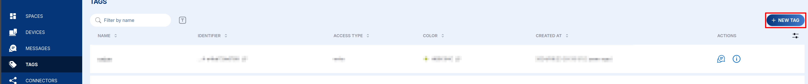
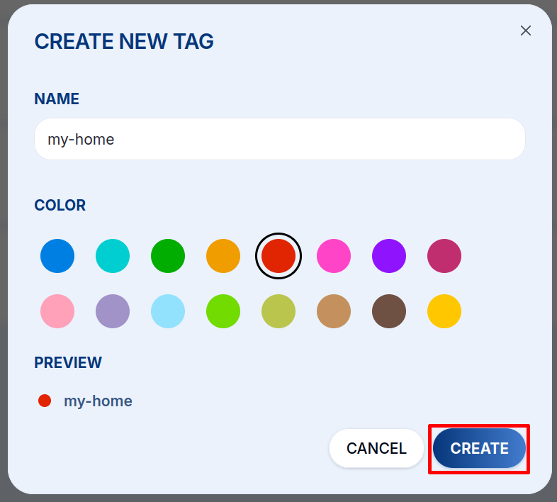

# Tagy {#tags}

Tagy jsou **pojmenované štítky s barvou**, které přiřazujete zařízením i konektorům. Jsou lepidlem, které propojuje zařízení s konektory: zpráva ze zařízení se předá jen těm konektorům, které s daným zařízením sdílejí alespoň jeden tag.

## Proč tagy? {#why-tags}

Tagy umožňují flexibilní směrování zpráv, aniž byste kamkoli natvrdo zapisovali ID zařízení:

- Jedno zařízení → více konektorů (přiřaďte více tagů)
- Mnoho zařízení → jeden konektor (přiřaďte jim všem stejný tag)
- Oddělená prostředí: tag `production` vs. tag `dev`, každý připojený k jinému endpointu

## Vytvoření tagu {#creating-a-tag}

1. Otevřete **Tags** v levém postranním panelu a klikněte na **+&nbsp;NEW TAG**.

   

2. Zadejte název (podle [konvencí pojmenování](/cloud/#naming-conventions)), zvolte **barvu** pro vizuální identifikaci v pohledech na zařízení a konektory a klikněte na **CREATE**.

   <div className="screenshot-narrow">

   

   </div>

## Přiřazování tagů {#assigning-tags}

Tagy lze přiřadit na dvou místech:

- **Detail zařízení → záložka Tags**: přiřazení tagů zařízení
- **Nastavení konektoru**: výběr tagů, kterým konektor naslouchá

Zařízení bez přiřazených tagů nespustí žádný konektor.

## Typ přístupu {#access-type}

Tagy mají pole `access_type`:

| Hodnota | Popis |
|---|---|
| `write` | Plný přístup. Tag lze použít pro čtení zpráv i pro odesílání downlinků |
| `read` | Pouze pro čtení. Tag může přijímat zprávy, ale nelze jej použít pro downlinky |

## Příklad nastavení {#example-setup}

```
Tag: "temperature-sensors"

  Device: chester-floor-1  ──[temperature-sensors]──▶  Connector: my-backend
  Device: chester-floor-2  ──[temperature-sensors]──▶  Connector: my-backend
  Device: chester-floor-3  ──[temperature-sensors]──▶  Connector: my-backend
```

Všechna tři zařízení sdílejí stejný tag, takže všechny jejich zprávy jsou prostřednictvím konektoru předány do `my-backend`.
