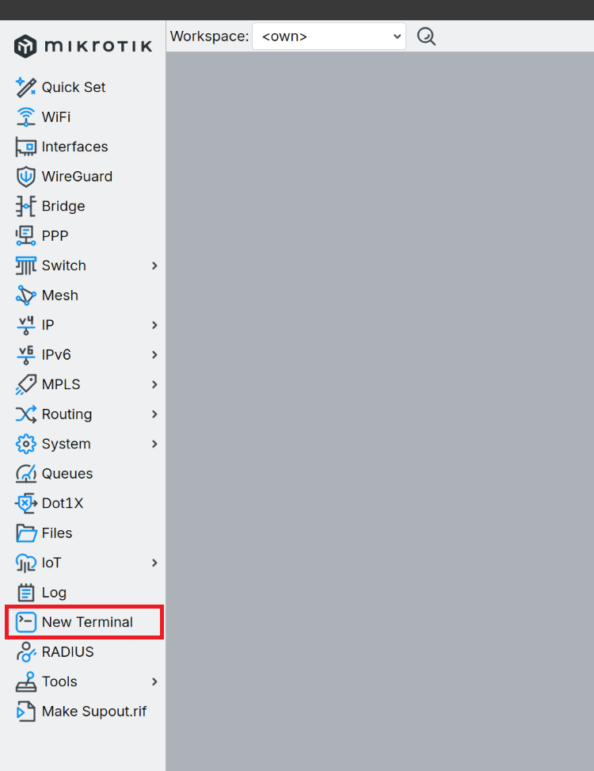
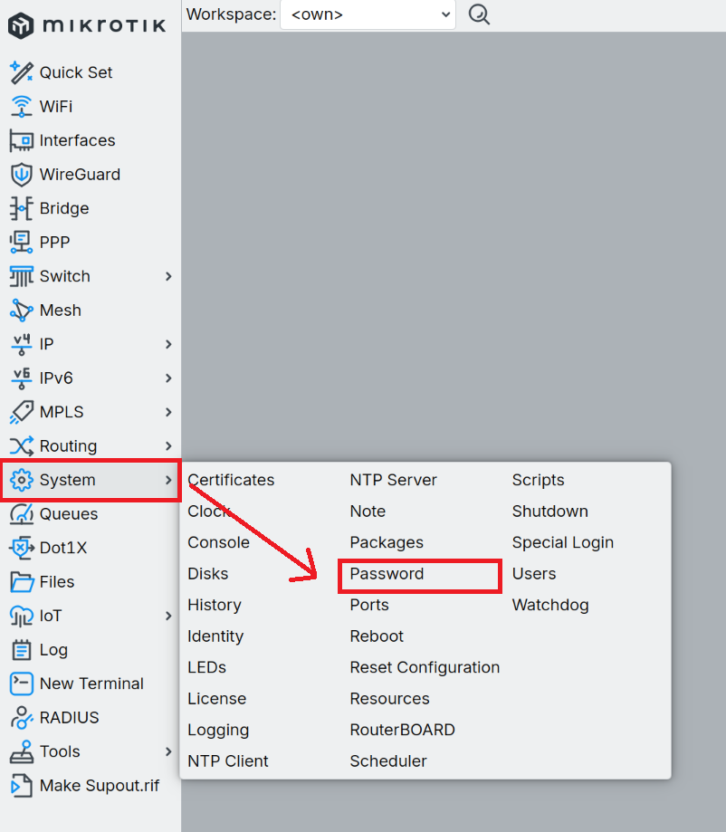
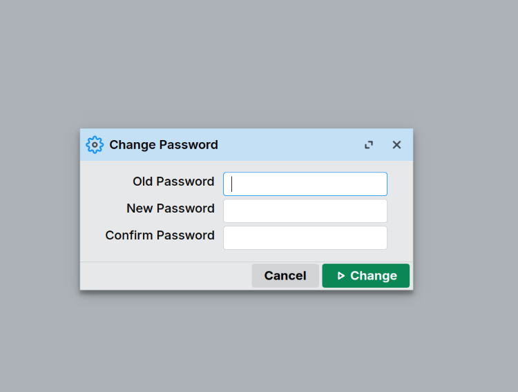
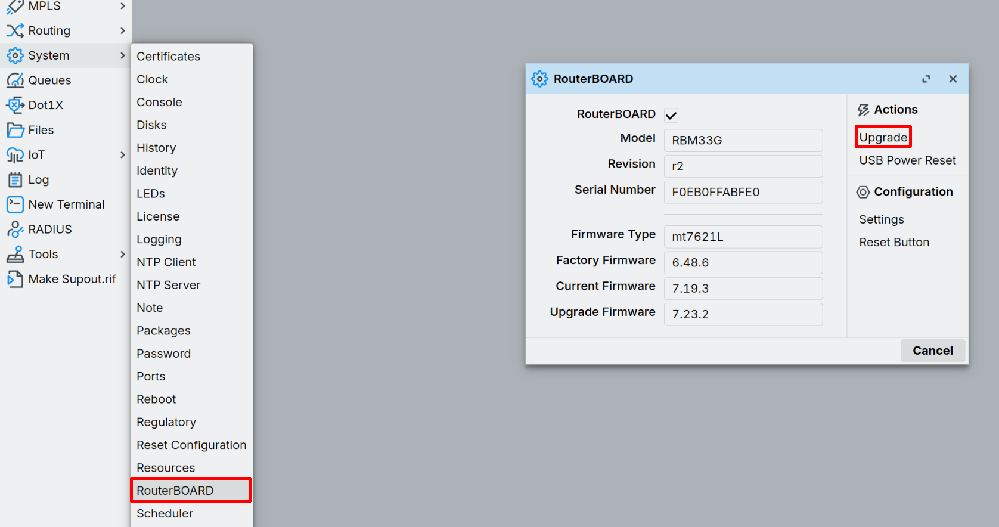

import Image from '@theme/IdealImage';

# Rychlý průvodce zařízením EMBER {#ember-quick-start-guide}

Vítejte! Tato stránka vám pomůže **zapnout** vaše zařízení HARDWARIO **EMBER** a vybrat, co dál:
- Provozovat **spravovaný LoRaWAN backend** od HARDWARIO (ChirpStack + Node-RED)
- Připojit EMBER k vašemu vlastnímu **ChirpStack**
- Připojit EMBER k **The Things Stack (TTS)**

---

## Než začnete {#before-you-start}

#### Co je EMBER {#what-ember-is}
EMBER je průmyslová **brána LoRaWAN (IoT Hotspot)** postavená na **MikroTik RBM33G**, určená pro venkovní nasazení (krabička IP67).  
Popis hardwaru: https://docs.hardwario.com/ember/hardware-description/

#### Budete potřebovat {#you-will-need}
- Bránu EMBER (Hotspot) — její **antény LoRaWAN a LTE jsou už namontované vevnitř** a připojené
  z výroby, takže není potřeba žádnou anténu připojovat
- *(Volitelně)* **externí anténu LoRaWAN** s konektorem typu N, pokud vám interní anténa nedá
  potřebný dosah — objednává se zvlášť a její montáž znamená otevření krabičky
- Zdroj napájení:
  - adaptér 24 V DC / napájecí zdroj 24 V DC, nebo
  - pasivní PoE 24 V DC přes port **WAN**
- Připojení k internetu (WAN a/nebo LTE, podle vaší konfigurace)
- LoRaWAN backend (spravovaná služba HARDWARIO / vlastní ChirpStack / TTS / jiný)


#### Rychlé odkazy {#quick-links}
- Produktová stránka EMBER (datasheet + přehled): https://www.hardwario.com/products/ember/
- Konfigurace Hotspotu (LAN IP, přihlášení, skript RouterOS): https://docs.hardwario.com/ember/hotspot-configuration/
- Spravovaný network server (ChirpStack + Node-RED provozované HARDWARIO): https://docs.hardwario.com/ember/cloud-service/

---

## Krok 1: Nastavení zařízení EMBER {#step-1-set-up-your-ember}

#### 1.1 Antény — už připojené {#11-antennas--already-connected}

EMBER přichází se **dvěma anténami namontovanými uvnitř krabičky** — jednou pro **LoRaWAN**, jednou pro **LTE** —
obě jsou připojené z výroby. **Není potřeba nic připojovat** a rádio nikdy nezůstane bez
antény, takže můžete bránu hned zapnout.

**Externí** anténa je volitelná. Protože interní anténa obsazuje konektor u.FL na kartě,
její montáž znamená otevřít krabičku a přesunout tento konektor na pigtail konektoru **LRW** — viz
[Přechod na externí anténu](hardware-description.md#switching-to-an-external-antenna).

Ať už používáte jakoukoli anténu, nastavte v RouterOS **`antenna-gain`** na zisk dané antény. Při špatné
hodnotě brána vyzařuje nad zákonným limitem EIRP — viz
[Zisk antény a výstupní výkon](mikrotik/antenna-gain.md).

:::caution Pokud otevřete krabičku
Nikdy nezapínejte bránu s prázdným konektorem u.FL na kartě LoRa — vysílání do otevřeného
konektoru může kartu poškodit. Krabičku pečlivě znovu utěsněte; závisí na tom její krytí **IP67**.
:::

Více informací: [Popis hardwaru → Antény](hardware-description.md#antennas)

#### 1.2 Napájení brány {#12-power-the-gateway}
EMBER lze napájet:
- **napájecím adaptérem 24 V DC**
- **napájecím zdrojem 24 V DC**
- **pasivním PoE 24 V DC** přes **ethernetový port WAN**

Více informací: https://docs.hardwario.com/ember/hardware-description/#power-supply-options

#### 1.3 Bezpečnostní poznámka k venkovní montáži {#13-outdoor-mounting-safety-note}
:::danger

Při venkovní instalaci musí být **EMBER Hotspot** namontován s konektory směřujícími dolů.

:::

---

## Krok 2: Připojení pro lokální přístup {#step-2-connect-for-local-access}

EMBER běží na **MikroTik RouterOS**.  
Pro počáteční přístup a správu použijte rozhraní WAN (port RJ-45 nejvíce vlevo) a standardní nástroje RouterOS.

**Pokud ještě nemáte nainstalovaný Winbox 4, postupujte podle [průvodce instalací Winbox 4](/ember/mikrotik/winbox4-installation).**
#### 2.1 Připojení k zařízení EMBER pomocí Winbox 4 {#21-connect-to-ember-using-winbox-4}

Po otevření aplikace se podívejte do seznamu, kde byste měli vidět vaše zařízení **EMBER**.
- Pokud je v seznamu více zařízení, podívejte se na desku EMBER — na její levé straně jsou dva ethernetové konektory se štítkem. Na štítku najděte **MAC adresu** — kombinaci čísel a písmen za textem **E01** (například: **E01: 48:A5:8A:4F:17:A6**).
- Vraťte se do **Winboxu** a najděte zařízení s **odpovídající MAC adresou**. Kliknutím na zařízení v seznamu jej vyberte.
- Ujistěte se, že je **propojka** na desce **odstraněná**. Umístění propojky je na obrázku níže.


**Hlavní dokumentace (doporučený začátek):**
- Konfigurace a lokální přístup k EMBER Hotspot:  
  https://docs.hardwario.com/ember/hotspot-configuration/

---

## Krok 3: Počáteční konfigurační skript RouterOS {#step-3-initial-routeros-configuration-script}

### 3.1 Nastavení hesla {#31-set-password}
**Otevřete nové okno terminálu** (nebo se připojte přes SSH k vašemu zařízení EMBER na adrese `172.31.255.254`):

    

**Nastavte bezpečné heslo administrátora**
Poté vložte následující skript, nebo to můžete udělat ručně.
```
/user set admin password=YOUR_NEW_PASSWORD
```

V levém panelu otevřete **System**→ **Password**.



Vyplňte pole: 
 - Old Password: **ember** (výchozí heslo) 
 - New Password: `<YOUR_PASSWORD>` 
 - Confirm Password: `<YOUR_PASSWORD>`
 - Klikněte na **Change**



### 3.2 Spuštění základní konfigurace {#32-run-base-configuration}
Poté vložte následující skript, nebo to můžete udělat ručně.

```routeros
/system identity set name=ember
/interface bridge add name=bridge0
/interface bridge port add bridge=bridge0 interface=ether2
/interface bridge port add bridge=bridge0 interface=ether3
/ip address add address=172.31.255.1/24 interface=bridge0 network=172.31.255.0
/ip dhcp-client add interface=ether1 disabled=no
/system note set show-at-login=no
```
Skript spusťte stisknutím **Enter**.
Nyní je potřeba aktualizovat RouterOS. Přejděte na [Kontrola aktualizací RouterOS a jejich instalace, pokud jsou dostupné.](#checks-for-routeros-updates-and-installs-if-available).

#### Ruční nastavení: {#manual-setup}
Nastaví identitu systému na „ember".
- **System → Identity** změňte identitu na **ember** a klikněte na **OK**.


Vytvoří rozhraní bridge (bridge0) a přidá do něj ether2 a ether3.
- **Bridge → New** změňte název na **bridge0** a klikněte na **OK**.


Přiřadí bridge IP adresu 172.31.255.1/24 pro přístup z LAN a přidá porty do bridge.
- **IP → Addresses →  New** a vyplňte **Address**, **Network** a vyberte **Interface**:
  - Addresses: **172.31.255.1/24**
  - Network: **172.31.255.0**
  - Interface: **bridge0**
- Potvrďte kliknutím na **OK**


- V okně Bridge přejděte na **Ports → New**, vyberte rozhraní **ether2**. Ujistěte se, že je vybraný **bridge0**, a klikněte na **OK**


- V okně Bridge přejděte na **Ports → New**, vyberte rozhraní **ether3**. Ujistěte se, že je vybraný **bridge0**, a klikněte na **OK**


Zapne DHCP klienta na ether1 (WAN) pro připojení k internetu.
- V levém panelu **IP → DHCP Client → New**, vyberte jako rozhraní **ether1** a klikněte na **OK**.
 

Zapnutí úvodní poznámky.
- V levém panelu **System → Note** odškrtněte **Show At Login** a klikněte na **OK**.


#### Kontrola aktualizací RouterOS a jejich instalace, pokud jsou dostupné. {#checks-for-routeros-updates-and-installs-if-available}
- V levém panelu **System → Packages → Check for Updates**. Otevře se nové okno, zkontrolujte, zda verze odpovídají. Pokud ne, klikněte na **Download&Install** a několik minut vyčkejte.


---

### 3.3 Instalace balíčku IoT {#33-install-iot-package}
Po opětovném připojení přejděte v levém panelu na **System → Packages → Check for Updates**. V seznamu najděte **iot** a klikněte na něj. V pravém panelu klikněte na **Enable** a poté na **Apply Changes**. Otevře se nové okno, klikněte na **OK** a několik sekund vyčkejte.


---

### 3.4 Konfigurace rozhraní LoRa a aktualizace bootloaderu {#34-configure-lora-interface-and-update-bootloader}

Po opětovném připojení následujícím po restartu vložte do terminálu tento skript pro konfiguraci rozhraní LoRa:

```routeros
/iot lora servers remove [find]
```

**Co tento skript dělá:**
- Odstraní všechny předkonfigurované záznamy LoRaWAN Network Server (LNS)

Spusťte stisknutím **Enter**.

Samotné rozhraní LoRa — včetně volby `antenna=uFL` a hodnoty `antenna-gain` pro
připojenou anténu — se nastavuje společně s vaším backendem. Viz
[Konfigurace Hotspotu → LoRaWAN](hotspot-configuration.md#lorawan) a
[Zisk antény a výstupní výkon](mikrotik/antenna-gain.md).

### 3.5 Aktualizace RouterBOARD {#35-upgrade-routerboard}
V levém panelu přejděte na **System → RouterBOARD** a klikněte na **Upgrade**. Otevře se nové okno, klikněte na **OK**.


Po aktualizaci je potřeba zařízení EMBER restartovat. V levém panelu přejděte na **System → Reboot**. Otevře se nové okno, klikněte na **OK**.


---

## Krok 4: Výběr LoRaWAN backendu {#step-4-choose-your-lorawan-backend}

### Spravovaný network server HARDWARIO (spravovaný backend) {#hardwario-managed-network-server-managed-backend}

HARDWARIO může LoRaWAN Network Server provozovat za vás jako plně **spravovanou službu**.  
Je určena pro rychlý start bez nutnosti provozovat vlastní infrastrukturu.

Co služba obvykle poskytuje:
- **ChirpStack** – LoRaWAN Network Server  
- **Node-RED** – zpracování dat, dekódování payloadu a přeposílání  
- Předkonfigurované propojení mezi bránou, LNS a integracemi

Kolem zařízení EMBER poskytuje HARDWARIO také volitelně **SIM kartu s konektivitou** pro LTE backhaul a **bezpečný vzdálený přístup přes OpenVPN**.

Doporučeno, pokud chcete **rychle získat data ze zařízení** a přeposlat je do aplikací nebo dashboardů.

#### Klíčové odkazy {#key-links}
- Přehled a koncept služby:  
  **https://docs.hardwario.com/ember/cloud-service/**

- Webový portál (správa služby):  
  https://docs.hardwario.com/ember/cloud-service/#web-management

- ChirpStack ve spravované službě:  
  https://docs.hardwario.com/ember/cloud-service/#chirpstack-lorawan-server

- Node-RED ve spravované službě:  
  https://docs.hardwario.com/ember/cloud-service/#node-red-application

---

### ChirpStack (vlastní hosting) {#chirpstack-self-hosted}

**Dokumentace:**
- ChirpStack (přehled LoRaWAN Network Serveru):  
  **https://docs.hardwario.com/ember/lorawan-network-server/lorawan-chirpstack**

Další zdroje:
- Přidání brány EMBER do ChirpStack v4 (tutoriál HARDWARIO):  
  https://docs.hardwario.com/ember/chirpstack/chirpstack-ember/

- (Volitelně) Instalace ChirpStack v4 (Debian/Ubuntu):  
  https://docs.hardwario.com/apps/chirpstack/chirpstack-installation/

---

### The Things Stack {#the-things-stack}

**Dokumentace**
- The Things Stack (přehled LoRaWAN Network Serveru):  
  **https://docs.hardwario.com/ember/lorawan-network-server/lorawan-tts**


---

### Vlastní LoRaWAN server {#self-hosted-lorawan-server}
Pokud už provozujete jiný LoRaWAN server, můžete EMBER nastavit tak, aby pakety přeposílal na váš server.

Klíčová poznámka z oficiální konfigurace Hotspotu:
- Pokud **nepoužíváte spravovanou službu HARDWARIO**, použijte **IP adresu vašeho LoRaWAN serveru**
  a **nemusíte konfigurovat VPN tunely**.

Reference: https://docs.hardwario.com/ember/hotspot-configuration/

---

## Krok 5: Souhrnný kontrolní seznam {#step-5-summary-checklist}

- Ke kartě LoRa je připojená anténa — interní z výroby, nebo externí na **LRW**
- Napájení připojeno (24 V DC nebo pasivní PoE 24 V přes WAN)
- Venkovní instalace: konektory směřují dolů
- PC připojeno k portu **WAN**, dostává DHCP lease, dosáhne na `172.31.255.1` (změněno z výchozí hodnoty)
- Přihlášení do RouterOS funguje (`admin` / `[vaše-heslo]`)
- Počáteční konfigurační skript dokončen (Kapitola 3)
- RouterOS aktualizován na nejnovější verzi
- Balíček IoT nainstalován
- Rozhraní LoRa nakonfigurováno (anténa nastavena na uFL)
- `antenna-gain` nastaven na zisk připojené antény ([proč je to důležité](mikrotik/antenna-gain.md))
- Bootloader aktualizován
- Brána je nakonfigurována na váš backend (spravovaný HARDWARIO / ChirpStack / TTS / jiný)
- V UI LoRaWAN serveru stav brány ukazuje **Last seen / connected**
- Vidíte uplinky alespoň z jednoho zařízení LoRaWAN

---

## Řešení problémů (rychle) {#troubleshooting-quick}

#### Nelze dosáhnout na `172.31.255.1` {#cant-reach-172312551}
- Ujistěte se, že jste připojeni do portu **WAN** (ne LAN). Po spuštění konfiguračního skriptu jsou porty LAN ether2 a ether3.
- Zkontrolujte, že je vaše PC nastaveno na DHCP (nebo nastavte statickou IP v `172.31.255.0/24`).
- Zkontrolujte LED indikátory ethernetového spoje.
- Pokud jste ještě nespustili konfigurační skript, výchozí IP může být stále `172.31.255.254`.

#### Brána je zapnutá, ale LoRaWAN server ji „nevidí" {#gateway-is-powered-but-not-seen-in-the-lorawan-server}
- Zkontrolujte, zda je propojka odstraněná. Obrázek najdete [zde](#21-connect-to-ember-using-winbox-4).
- Potvrďte cíl přeposílání brány (adresa serveru / porty / protokol).
- Zkontrolujte připojení k internetu přes WAN/LTE.
- Ujistěte se, že je nainstalovaný balíček IoT (zkontrolujte pomocí `/system package print`).
- Zkontrolujte, že je nakonfigurováno rozhraní LoRa (zkontrolujte pomocí `/iot lora print`).
- Pokud používáte spravovanou službu HARDWARIO, potvrďte, že používáte poskytnutou URL služby a správné konfigurační pokyny.

#### Reset zařízení {#reset-device}
Odpojte napájecí kabel, držte tlačítko reset a napájecí kabel znovu zapojte. Po 5 sekundách začne LED blikat, tlačítko uvolněte. Umístění tlačítka reset najdete na obrázku [zde](#21-connect-to-ember-using-winbox-4).

#### Chcete porozumět základní konfiguraci RouterOS {#want-to-understand-the-baseline-routeros-configuration}
- Referenční konfigurace je dokumentována zde:  
  https://docs.hardwario.com/ember/hotspot-configuration/
