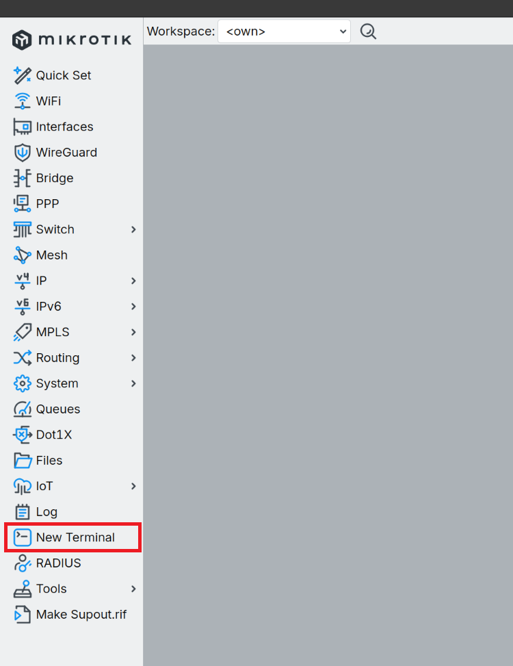
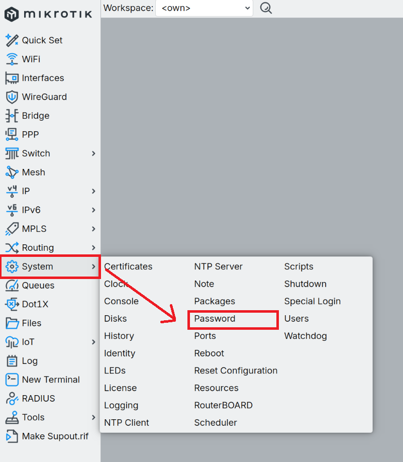
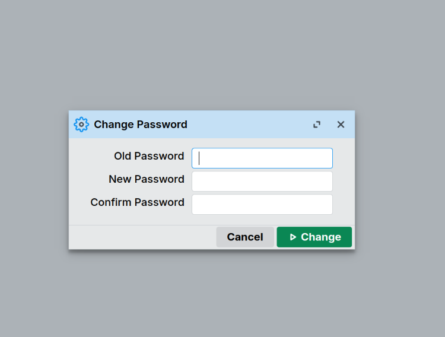

import Image from '@theme/IdealImage';

# Rychlý průvodce zařízením EMBER {#ember-quick-start-guide}

Tato stránka vám pomůže zařízení HARDWARIO **EMBER** **zapnout** a vybrat, jak pokračovat:
- Využít **spravovaný backend LoRaWAN**, který provozuje HARDWARIO (ChirpStack + Node-RED)
- Připojit EMBER k vlastnímu serveru **ChirpStack**
- Připojit EMBER k platformě **The Things Stack (TTS)**

---

## Než začnete {#before-you-start}

#### Co je EMBER {#what-ember-is}
EMBER je průmyslová **brána LoRaWAN (IoT Hotspot)** postavená na platformě **MikroTik RBM33G** a určená pro venkovní nasazení (krabička IP67).  
Popis hardwaru: https://docs.hardwario.com/ember/hardware-description/

#### Budete potřebovat {#you-will-need}
- Bránu EMBER (Hotspot): její **antény LoRaWAN a LTE jsou už namontované uvnitř** a připojené
  z výroby, takže žádnou anténu připojovat nemusíte
- *(Volitelně)* **externí anténu LoRaWAN** s konektorem typu N, pokud vám vnitřní anténa nezajistí
  potřebný dosah. Objednává se zvlášť a při její montáži je třeba otevřít krabičku
- Napájení:
  - adaptér 24 V DC / napájecí zdroj 24 V DC, nebo
  - pasivní PoE 24 V DC přes port **WAN**
- Připojení k internetu (WAN a/nebo LTE, podle konfigurace)
- Backend LoRaWAN (spravovaná služba HARDWARIO / vlastní ChirpStack / TTS / jiný)


#### Rychlé odkazy {#quick-links}
- Produktová stránka EMBER (produktový list + přehled): https://www.hardwario.com/products/ember/
- Konfigurace hotspotu (IP adresa LAN, přihlášení, skript RouterOS): https://docs.hardwario.com/ember/hotspot-configuration/
- Spravovaný síťový server (ChirpStack + Node-RED, provozuje HARDWARIO): https://docs.hardwario.com/ember/cloud-service/

---

## Krok 1: Nastavení zařízení EMBER {#step-1-set-up-your-ember}

#### 1.1 Antény jsou už připojené {#11-antennas--already-connected}

EMBER se dodává se **dvěma anténami uvnitř krabičky**, jednou pro **LoRaWAN** a jednou pro **LTE**;
obě jsou připojené z výroby. **Nic nemusíte připojovat**, rádio nikdy nezůstane bez antény,
a bránu tak můžete hned zapnout.

**Externí** anténa je volitelná. Vnitřní anténa zabírá konektor u.FL na kartě, takže při montáži
externí antény musíte otevřít krabičku a na místo vnitřní antény připojit pigtail konektoru **LRW**, viz
[Přechod na externí anténu](hardware-description.md#switching-to-an-external-antenna).

Ať používáte kteroukoli anténu, nastavte v RouterOS **`antenna-gain`** na její zisk. Se špatnou
hodnotou brána vyzařuje mimo povolený limit EIRP, viz
[Zisk antény a výstupní výkon](mikrotik/antenna-gain.md).

:::caution Pokud otevřete krabičku
Nikdy nezapínejte bránu, když je konektor u.FL na kartě LoRa prázdný. Vysílání do nezapojeného
konektoru může kartu poškodit. Krabičku pak pečlivě znovu utěsněte, závisí na tom její krytí **IP67**.
:::

Více informací: [Popis hardwaru → Antény](hardware-description.md#antennas)

#### 1.2 Napájení brány {#12-power-the-gateway}
EMBER lze napájet:
- **napájecím adaptérem 24 V DC**
- **napájecím zdrojem 24 V DC**
- **pasivním PoE 24 V DC** přes **ethernetový port WAN**

Více informací: https://docs.hardwario.com/ember/hardware-description/#power-supply-options

#### 1.3 Bezpečnostní poznámka k venkovní montáži {#13-outdoor-mounting-safety-note}
:::danger

Při venkovní instalaci musí být **EMBER Hotspot** namontovaný konektory dolů.

:::

---

## Krok 2: Připojení pro lokální přístup {#step-2-connect-for-local-access}

EMBER používá systém **MikroTik RouterOS**.  
K prvnímu přístupu a ke správě použijte rozhraní WAN (krajní levý port RJ-45) a standardní nástroje RouterOS.

**Pokud ještě nemáte nainstalovaný Winbox 4, postupujte podle [návodu k instalaci Winbox 4](/ember/mikrotik/winbox4-installation).**
#### 2.1 Připojení k zařízení EMBER přes Winbox 4 {#21-connect-to-ember-using-winbox-4}

Po otevření aplikace byste v seznamu měli vidět své zařízení **EMBER**.
- Pokud je v seznamu více zařízení, podívejte se na desku EMBER. Na její levé straně jsou dva ethernetové konektory se štítkem. Na štítku najděte **MAC adresu**, tedy řetězec číslic a písmen za textem **E01** (například **E01: 48:A5:8A:4F:17:A6**).
- Vraťte se do aplikace **Winbox** a najděte zařízení s **odpovídající MAC adresou**. Vyberte ho kliknutím v seznamu.
- Zkontrolujte, že je **propojka** na desce **vyjmutá**. Kde propojka je, ukazuje obrázek níže.


**Hlavní dokumentace (doporučený začátek):**
- Konfigurace zařízení EMBER Hotspot a lokální přístup:  
  https://docs.hardwario.com/ember/hotspot-configuration/

---

## Krok 3: Počáteční konfigurační skript RouterOS {#step-3-initial-routeros-configuration-script}

### 3.1 Nastavení hesla {#31-set-password}
**Otevřete nové okno terminálu** (nebo se k zařízení EMBER připojte přes SSH na adrese `172.31.255.254`):

    

**Nastavte bezpečné heslo administrátora**
Vložte následující skript, nebo postupujte ručně.
```
/user set admin password=YOUR_NEW_PASSWORD
```

V levém panelu otevřete **System**→ **Password**.



Vyplňte pole: 
 - Old Password: **ember** (výchozí heslo) 
 - New Password: `<YOUR_PASSWORD>` 
 - Confirm Password: `<YOUR_PASSWORD>`
 - Klikněte na **Change**



### 3.2 Spuštění základní konfigurace {#32-run-base-configuration}
Vložte následující skript, nebo postupujte ručně.

```routeros
/system identity set name=ember
/interface bridge add name=bridge0
/interface bridge port add bridge=bridge0 interface=ether2
/interface bridge port add bridge=bridge0 interface=ether3
/ip address add address=172.31.255.1/24 interface=bridge0 network=172.31.255.0
/ip dhcp-client add interface=ether1 disabled=no
/system note set show-at-login=no
```
Skript spusťte stisknutím **Enter**.
Potom aktualizujte RouterOS, viz [Kontrola a instalace aktualizací RouterOS](#checks-for-routeros-updates-and-installs-if-available).

#### Ruční nastavení: {#manual-setup}
Nastaví identitu systému na „ember“.
- V **System → Identity** změňte identitu na **ember** a klikněte na **OK**.


Vytvoří rozhraní bridge (bridge0) a přidá do něj ether2 a ether3.
- V **Bridge → New** změňte název na **bridge0** a klikněte na **OK**.


Přiřadí rozhraní bridge IP adresu 172.31.255.1/24 pro přístup z LAN a přidá do něj porty.
- Otevřete **IP → Addresses → New**, vyplňte **Address** a **Network** a vyberte **Interface**:
  - Addresses: **172.31.255.1/24**
  - Network: **172.31.255.0**
  - Interface: **bridge0**
- Potvrďte kliknutím na **OK**


- V okně Bridge přejděte na **Ports → New** a vyberte rozhraní **ether2**. Zkontrolujte, že je vybraný **bridge0**, a klikněte na **OK**


- V okně Bridge přejděte na **Ports → New** a vyberte rozhraní **ether3**. Zkontrolujte, že je vybraný **bridge0**, a klikněte na **OK**


Zapne klienta DHCP na ether1 (WAN) kvůli připojení k internetu.
- V levém panelu otevřete **IP → DHCP Client → New**, jako rozhraní vyberte **ether1** a klikněte na **OK**.
 

Vypne úvodní poznámku při přihlášení.
- V levém panelu otevřete **System → Note**, zrušte zaškrtnutí **Show At Login** a klikněte na **OK**.


#### Kontrola a instalace aktualizací RouterOS {#checks-for-routeros-updates-and-installs-if-available}
- V levém panelu otevřete **System → Packages → Check for Updates**. V novém okně zkontrolujte, zda se verze shodují. Pokud ne, klikněte na **Download&Install** a několik minut počkejte.


---

### 3.3 Instalace balíčku IoT {#33-install-iot-package}
Až se znovu připojíte, otevřete v levém panelu **System → Packages → Check for Updates**. V seznamu najděte **iot** a klikněte na něj. V pravém panelu klikněte na **Enable** a poté na **Apply Changes**. V novém okně klikněte na **OK** a několik sekund počkejte.


---

### 3.4 Konfigurace rozhraní LoRa a aktualizace bootloaderu {#34-configure-lora-interface-and-update-bootloader}

Až se po restartu znovu připojíte, vložte do terminálu tento skript, který nakonfiguruje rozhraní LoRa:

```routeros
/iot lora servers remove [find]
```

**Co skript dělá:**
- Odstraní všechny předem nastavené záznamy síťového serveru LoRaWAN (LNS)

Spusťte ho stisknutím **Enter**.

Samotné rozhraní LoRa včetně volby `antenna=uFL` a hodnoty `antenna-gain` pro připojenou
anténu nastavíte spolu s backendem, viz
[Konfigurace hotspotu → LoRaWAN](hotspot-configuration.md#lorawan) a
[Zisk antény a výstupní výkon](mikrotik/antenna-gain.md).

### 3.5 Aktualizace RouterBOARD {#35-upgrade-routerboard}
V levém panelu přejděte na **System → RouterBOARD** a klikněte na **Upgrade**. V novém okně klikněte na **OK**.


Po aktualizaci zařízení EMBER restartujte. V levém panelu přejděte na **System → Reboot** a v novém okně klikněte na **OK**.


---

## Krok 4: Výběr backendu LoRaWAN {#step-4-choose-your-lorawan-backend}

### Spravovaný síťový server HARDWARIO (spravovaný backend) {#hardwario-managed-network-server-managed-backend}

HARDWARIO může síťový server LoRaWAN provozovat za vás jako plně **spravovanou službu**.  
Služba je určená pro rychlý start bez vlastní infrastruktury.

Služba obvykle zahrnuje:
- **ChirpStack**: síťový server LoRaWAN  
- **Node-RED**: zpracování dat, dekódování payloadu a přeposílání  
- Předem nastavené propojení brány, LNS a integrací

K zařízení EMBER může HARDWARIO volitelně dodat také **SIM kartu s konektivitou** pro páteřní připojení LTE a **bezpečný vzdálený přístup přes OpenVPN**.

Tuto možnost doporučujeme, pokud chcete **rychle získat data ze zařízení** a předávat je do aplikací nebo dashboardů.

#### Klíčové odkazy {#key-links}
- Přehled a koncept služby:  
  **https://docs.hardwario.com/ember/cloud-service/**

- Webový portál (správa služby):  
  https://docs.hardwario.com/ember/cloud-service/#web-management

- ChirpStack ve spravované službě:  
  https://docs.hardwario.com/ember/cloud-service/#chirpstack-lorawan-server

- Node-RED ve spravované službě:  
  https://docs.hardwario.com/ember/cloud-service/#node-red-application

---

### ChirpStack (na vlastním serveru) {#chirpstack-self-hosted}

**Dokumentace:**
- ChirpStack (přehled síťového serveru LoRaWAN):  
  **https://docs.hardwario.com/ember/lorawan-network-server/lorawan-chirpstack**

Další zdroje:
- Přidání brány EMBER do ChirpStack v4 (návod HARDWARIO):  
  https://docs.hardwario.com/ember/chirpstack/chirpstack-ember/

- (Volitelně) Instalace ChirpStack v4 (Debian/Ubuntu):  
  https://docs.hardwario.com/apps/chirpstack/chirpstack-installation/

---

### The Things Stack {#the-things-stack}

**Dokumentace**
- The Things Stack (přehled síťového serveru LoRaWAN):  
  **https://docs.hardwario.com/ember/lorawan-network-server/lorawan-tts**


---

### Vlastní server LoRaWAN {#self-hosted-lorawan-server}
Pokud už provozujete jiný server LoRaWAN, můžete EMBER nastavit tak, aby na něj přeposílal pakety.

Důležitá poznámka ze stránky Konfigurace hotspotu:
- Pokud **nepoužíváte spravovanou službu HARDWARIO**, zadejte **IP adresu svého serveru LoRaWAN**;
  **VPN tunely pak konfigurovat nemusíte**.

Viz: https://docs.hardwario.com/ember/hotspot-configuration/

---

## Krok 5: Souhrnný kontrolní seznam {#step-5-summary-checklist}

- Ke kartě LoRa je připojená anténa: vnitřní z výroby, nebo externí na **LRW**
- Napájení je připojené (24 V DC nebo pasivní PoE 24 V přes WAN)
- Venkovní instalace: konektory směřují dolů
- Počítač je připojený k portu **WAN**, dostane adresu z DHCP a dosáhne na `172.31.255.1` (změněno z výchozí hodnoty)
- Přihlášení do RouterOS funguje (`admin` / `[vaše-heslo]`)
- Počáteční konfigurační skript je hotový (krok 3)
- RouterOS je aktualizovaný na nejnovější verzi
- Balíček IoT je nainstalovaný
- Rozhraní LoRa je nakonfigurované (anténa nastavená na uFL)
- `antenna-gain` odpovídá zisku připojené antény ([proč na tom záleží](mikrotik/antenna-gain.md))
- Bootloader je aktualizovaný
- Brána je nastavená na váš backend (spravovaný HARDWARIO / ChirpStack / TTS / jiný)
- V rozhraní serveru LoRaWAN ukazuje stav brány **Last seen / connected**
- Vidíte uplinky alespoň z jednoho zařízení LoRaWAN

---

## Rychlé řešení problémů {#troubleshooting-quick}

#### Adresa `172.31.255.1` není dostupná {#cant-reach-172312551}
- Zkontrolujte, že je kabel zapojený do portu **WAN** (ne LAN). Po spuštění konfiguračního skriptu jsou porty LAN ether2 a ether3.
- Zkontrolujte, že počítač získává adresu přes DHCP (nebo mu nastavte statickou IP adresu z rozsahu `172.31.255.0/24`).
- Zkontrolujte kontrolky linky na ethernetovém portu.
- Pokud jste ještě nespustili konfigurační skript, výchozí IP adresa může být stále `172.31.255.254`.

#### Brána je zapnutá, ale server LoRaWAN ji „nevidí“ {#gateway-is-powered-but-not-seen-in-the-lorawan-server}
- Zkontrolujte, zda je propojka vyjmutá. Obrázek najdete [zde](#21-connect-to-ember-using-winbox-4).
- Ověřte, kam brána přeposílá data (adresa serveru / porty / protokol).
- Zkontrolujte připojení k internetu přes WAN/LTE.
- Ověřte, že je nainstalovaný balíček IoT (příkazem `/system package print`).
- Ověřte, že je rozhraní LoRa nakonfigurované (příkazem `/iot lora print`).
- Pokud používáte spravovanou službu HARDWARIO, ověřte, že používáte URL služby, kterou jste od nás dostali, a správné konfigurační pokyny.

#### Reset zařízení {#reset-device}
Odpojte napájecí kabel, stiskněte a držte tlačítko reset a kabel znovu zapojte. Po 5 sekundách začne LED blikat, pak tlačítko uvolněte. Kde je tlačítko reset, ukazuje obrázek [zde](#21-connect-to-ember-using-winbox-4).

#### Základní konfigurace RouterOS {#want-to-understand-the-baseline-routeros-configuration}
- Referenční konfiguraci popisuje stránka:  
  https://docs.hardwario.com/ember/hotspot-configuration/
