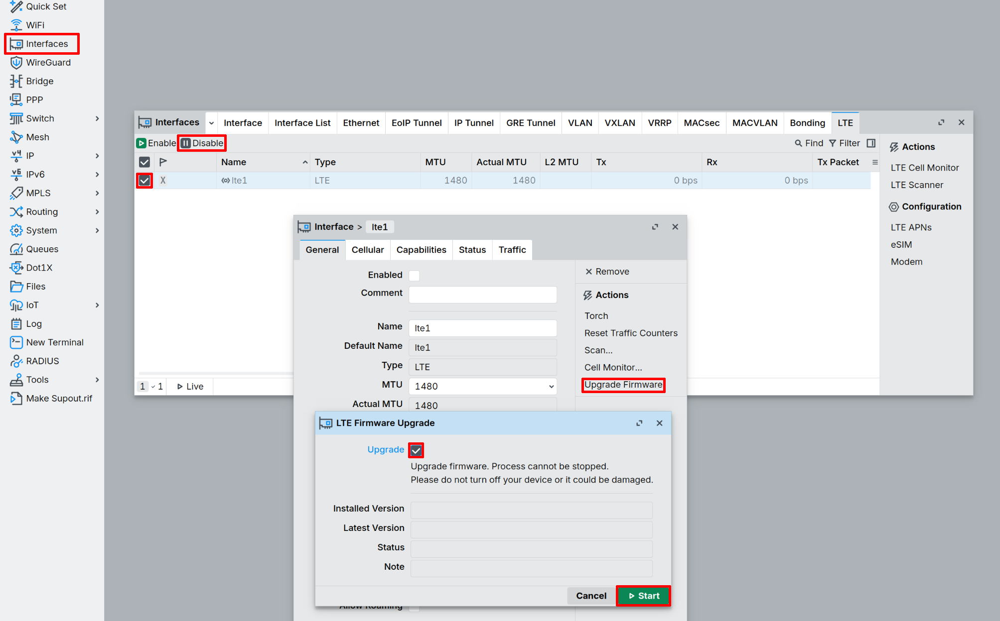

import Image from '@theme/IdealImage';

# Konfigurace hotspotu {#hotspot-configuration}

V tomto článku najdete podrobnosti o konfiguraci zařízení EMBER Hotspot. Je definována [**konfiguračním skriptem RouterOS**](https://help.mikrotik.com/docs/display/ROS/Getting+started).

## Koncept systému {#system-concept}

Pro službu **EMBER** existuje alespoň jedna lokalita, ale můžete použít několik instancí síťového serveru a několik lokalit.

Minimální konfigurace lokality je:

* Jedno zařízení **LoRaWAN** (například CHESTER)

* Jedna brána **LoRaWAN** (EMBER Hotspot)

* Jedna instance serveru **LoRaWAN** (**ChirpStack** nebo **The Things Stack** — vlastní hosting, nebo provozovaný společností **HARDWARIO** jako [managovaná služba](cloud-service.md))

Každé zařízení **EMBER Hotspot** může obsloužit více než 100 zařízení **LoRaWAN**, pokud jsou v rádiovém pokrytí.

:::tip

Redundantní konfigurace lokality vyžaduje minimálně dvě jednotky **EMBER Hotspot** (obě v rádiovém pokrytí zařízení).

:::

## IP adresy {#ip-addresses}

Toto jsou rozhraní, na která se **IP** adresy vztahují:

* **WAN Ethernet** – přiřazeno pomocí **DHCP** klienta

* **LAN Ethernet** – neroutovaná `172.31.255.254`

  :::caution

  Toto rozhraní poskytuje funkci **DHCP** serveru.

  :::

* **LTE Modem** – přiřazeno dynamicky operátorem **LTE**

* **OpenVPN endpoint** – `192.168.16.10` pro 1. hotspot, `192.168.16.11` pro 2. hotspot atd.

* **WireGuard endpoint** – `192.168.17.10` pro 1. hotspot, `192.168.17.11` pro 2. hotspot atd.

Výchozí zařízení **EMBER Hotspot** má následující přihlašovací údaje:

* Uživatelské jméno: `admin`

* Heslo: `ember`

Správa je dostupná prostřednictvím těchto služeb:

* **SSH** – přístup ke vzdálenému shellu

* **WinBox** – konfigurační aplikace pro desktop

* **WebFig** – webová konfigurační aplikace

* **RouterOS API** – HTTP REST API

Přístup je omezen z **LAN** IP sítě `172.31.255.0/24` a z VPN endpointů managované služby `192.168.16.1` + `192.168.17.1`.

## VPN tunely {#vpn-tunnels}

[Managovaná služba](cloud-service.md) HARDWARIO je propojena se všemi jednotkami **EMBER Hotspot** dvěma nezávislými VPN tunely přes internetové připojení **LTE**:

* **OpenVPN** – VPN na bázi TCP pro provoz **LoRaWAN**

* **WireGuard** – VPN na bázi UDP pro vzdálenou správu zařízení **EMBER Hotspot**

## Základ protokolu {#protocol-basis}

Podporovaný protokol **LoRaWAN** je založen na [**specifikaci LoRaWAN**](https://lora-alliance.org/about-lorawan/).

Podporovaná konektivita **LTE** je založena na specifikacích **3GPP**.

## Konvence pojmenování {#naming-convention}

Název zařízení **EMBER Hotspot** je složen z identifikátoru zákazníka + indexu managované služby + indexu zařízení **EMBER Hotspot**.

```
/system identity set name=ember-<customer identifier>-<01>-hotspot-<01>
```
## Aktualizace LTE {#update-lte}

Udržujte firmware modemu **LTE** aktuální, abyste zajistili stabilní konektivitu.

1. V levém menu vyberte **Interfaces**.
2. Vyberte své rozhraní `lte1` a klikněte na **Disable**.
3. Dvakrát klikněte na rozhraní `lte1` a vyberte **Upgrade firmware**.
4. Kliknutím na **Start** zkontrolujte dostupné aktualizace.
5. Pokud je aktualizace dostupná, zaškrtněte **Upgrade** a klikněte na **Start**.
6. Po dokončení instalace zařízení restartujte.

:::tip

Požadavek na SIM kartu závisí na velikosti skoku mezi verzemi.
Při aktualizaci jen o jednu nebo dvě verze musí být SIM karta
vložena a nakonfigurována, aby aktualizace fungovala. Při větším
skoku verzí se aktualizace dokončí i bez vložené SIM karty.
:::

:::caution

Během aktualizace firmwaru neodpojujte napájení ani zařízení nijak
nepřerušujte. Přerušená aktualizace může modem uvést do nepoužitelného stavu.
:::


## Konfigurace rozhraní {#interface-configuration}

### LAN {#lan}

```
/interface bridge add name=bridge1
/interface bridge port add bridge=bridge1 interface=ether2
/interface bridge port add bridge=bridge1 interface=ether3
/ip address add address=172.31.255.254/24 interface=bridge1 network=172.31.255.0
/ip pool add name=pool1 ranges=172.31.255.100-172.31.255.199
/ip dhcp-server add address-pool=pool1 interface=bridge1 name=dhcp1
/ip dhcp-server network add address=172.31.255.0/24 dns-server=172.31.255.254,8.8.8.8,8.8.4.4 gateway=172.31.255.254 netmask=24
```

### LTE {#lte}

```
/interface ppp-client add apn=internet name=ppp-out1 port=usb3
/interface lte apn set [ find default=yes ] apn=internet ip-type=ipv4 use-network-apn=no
/interface lte set [ find ] allow-roaming=yes apn-profiles=default band="" name=lte1 network-mode=lte
/ip dns set allow-remote-requests=yes servers=8.8.8.8,8.8.4.4
/system clock set time-zone-autodetect=no time-zone-name=Europe/Prague
```

:::tip

Nahraďte `internet` hodnotou **APN**, kterou vám poskytl váš mobilní operátor.

:::

#### Odemčení PIN SIM karty {#sim-pin-unlock}

Pokud **SIM** karta vyžaduje **PIN** kód, odemkněte ji pomocí:

```
/interface/lte/set lte1 pin="1234"
```

Trvalé vypnutí **PIN** kódu na **SIM** kartě (doporučeno pro routery bez obsluhy):

```
/interface/lte/at-chat lte1 input="AT+CLCK=\"SC\",0,\"1234\""
```

:::caution

Nahraďte `1234` skutečným **PIN** kódem vaší **SIM** karty.

:::

#### Verifikace {#verification}

Zkontrolujte stav připojení **LTE**:

```
/interface/lte/monitor lte1 once
```

Ověřte připojení k internetu:

```
/ping 8.8.8.8 count=3
```

### WAN {#wan}

:::tip

Konektivita LTE má přednost před WAN díky vzdálenosti routeru (výchozí vzdálenost routeru LTE je 2).

:::

```
/ip dhcp-client add default-route-distance=5 interface=ether1 use-peer-dns=no use-peer-ntp=no
```

### OpenVPN {#openvpn}

:::tip

Certifikáty (certifikační autorita, certifikát zařízení **EMBER Hotspot**, privátní klíč zařízení **EMBER Hotspot**) se importují z managované služby.

:::

```
/interface ovpn-client add name=ember-cloud-ovpn certificate=hotspot-01.crt_0 connect-to=<public IPv4 of Cloud Service> port=1194 mode=ip protocol=tcp cipher=aes128 auth=sha256 tls-version=only-1.2 verify-server-certificate=yes use-peer-dns=no add-default-route=no user=hotspot-01
```

### WireGuard {#wireguard}

Klíče **WireGuard** (veřejný klíč pro managovanou službu + privátní klíč pro zařízení **EMBER Hotspot**) se přebírají z managované služby.

```
/interface wireguard add disabled=no listen-port=51820 mtu=1420 name=wireguard1
/interface wireguard peers add endpoint-address=<public IPv4 of Cloud Services> endpoint-port=51820 allowed-address=192.168.17.1/32 interface=wireguard1 persistent-keepalive=1m public-key="<WireGuard Cloud Service public>"
/ip address add address=192.168.17.10/24 network=192.168.17.0 interface=wireguard1
```

## LoRaWAN {#lorawan}

:::tip

Výchozí servery **TTN** můžete ignorovat.

:::

```
/iot lora servers add address=192.168.16.1 down-port=1700 name=ember-cloud up-port=1700 protocol=UDP
/iot lora set 0 antenna=uFL disabled=no name=gateway-0 network=private servers=ember-cloud
```

:::caution

Pokud nepoužíváte managovanou službu HARDWARIO, musíte použít IP adresu svého serveru **LoRaWAN** a nemusíte konfigurovat VPN tunely.

:::

## Datacake {#datacake}

**Datacake** je IoT platforma, která hostuje server **LoRaWAN**. Pro připojení zařízení **EMBER** ke službě **Datacake** je potřeba zaregistrovat účet a vytvořit dashboard. Přidání zařízení do dashboardu:

* Přidejte server **Datacake** do seznamu serverů spuštěním následujícího příkazu na **RouterOS**

```
/iot lora servers add address=eu1.datacake-lns.com up-port=1700 name=datacake down-port=1700 protocol=UDP
```

* Přiřaďte server **Datacake** zařízení **LoRa**

```
/iot lora set 0 servers=datacake
```

* Přidejte bránu zadáním následujících údajů:
    - Název brány (jakýkoli název)
    - `Gateway EUI` (v RouterOS označeno jako `Gateway ID` pod `LoRa` > `Devices` > `gateway`)
    - Frekvence (podle lokality zařízení)

## Zabezpečení přístupu {#securing-access}

Zařízení **EMBER Hotspot** je zabezpečeno firewallem a dalšími konfiguračními volbami podle [**tohoto článku MikroTik**](https://help.mikrotik.com/docs/display/ROS/Securing+your+router).

### Seznamy rozhraní {#interface-lists}

```
/interface list add name=wan
/interface list add name=lan
/interface list add name=management
/interface list member add interface=ether1 list=wan
/interface list member add interface=lte1 list=wan
/interface list member add interface=bridge1 list=lan
/interface list member add interface=bridge1 list=management
/interface list member add interface=wireguard1 list=management
```

### Firewall {#firewall}

```
/ip firewall filter add action=fasttrack-connection chain=forward connection-state=established,related comment=FastTrack
/ip firewall filter add chain=forward action=drop connection-state=invalid comment="Drop invalid"
/ip firewall filter add chain=forward action=accept connection-state=established,related comment="Established, Related"
/ip firewall filter add chain=input action=accept connection-state=established,related comment="Established, Related"
/ip firewall filter add chain=input action=accept in-interface-list=management comment=Management
/ip firewall filter add action=drop chain=input
/ip firewall filter add action=accept chain=forward connection-state=new in-interface=bridge1 out-interface=ether1 comment="Internet for PC only from ether1"
/ip firewall filter add chain=forward action=drop
/ip firewall nat add action=masquerade chain=srcnat out-interface-list=wan
```

### Služby {#services}

```
/ip neighbor discovery-settings set discover-interface-list=lan
/ipv6 settings set disable-ipv6=yes max-neighbor-entries=1024
/tool mac-server set allowed-interface-list=none
/tool mac-server mac-winbox set allowed-interface-list=none
/tool mac-server ping set enabled=no
/ipv6 nd set [find] disabled=yes
/tool bandwidth-server set enabled=no
/ip proxy set enabled=no
/ip socks set enabled=no
/ip upnp set enabled=no
/ip cloud set ddns-enabled=no update-time=yes
/ip ssh set strong-crypto=yes
/ip service set telnet disabled=yes
/ip service set ftp disabled=yes
/ip service set api disabled=yes
/ip service set api-ssl address=172.31.255.0/24,192.168.16.1/32,192.168.17.1
/ip service set ssh address=172.31.255.0/24,192.168.16.1/32,192.168.17.1
/ip service set winbox address=172.31.255.0/24,192.168.16.1/32,192.168.17.1
```
