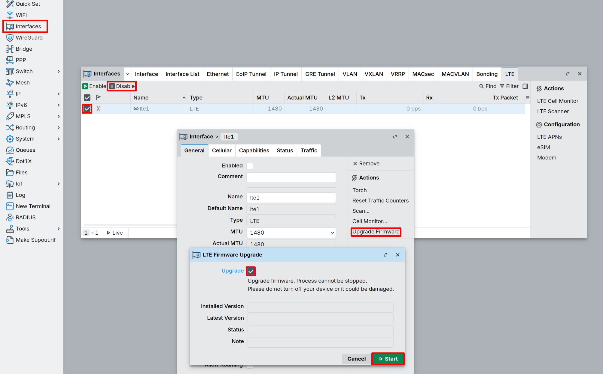

import Image from '@theme/IdealImage';

# Konfigurace hotspotu {#hotspot-configuration}

Tento článek podrobně popisuje konfiguraci zařízení EMBER Hotspot, kterou definuje [**konfigurační skript RouterOS**](https://help.mikrotik.com/docs/display/ROS/Getting+started).

## Koncept systému {#system-concept}

Služba **EMBER** má alespoň jednu lokalitu, můžete ale využít i více lokalit a více instancí síťového serveru.

Minimální konfigurace lokality:

* Jedno zařízení **LoRaWAN** (například CHESTER)

* Jedna brána **LoRaWAN** (EMBER Hotspot)

* Jedna instance serveru **LoRaWAN** (**ChirpStack** nebo **The Things Stack** na vlastním serveru, nebo provozovaný společností **HARDWARIO** jako [spravovaná služba](cloud-service.md))

Každé zařízení **EMBER Hotspot** může obsloužit více než 100 zařízení **LoRaWAN**, pokud jsou v jeho rádiovém dosahu.

:::tip

Redundantní konfigurace lokality vyžaduje minimálně dvě jednotky **EMBER Hotspot** (obě v rádiovém dosahu zařízení).

:::

## IP adresy {#ip-addresses}

Adresy **IP** mají tato rozhraní:

* **WAN Ethernet**: adresu přiděluje klient **DHCP**

* **LAN Ethernet**: neroutovaná adresa `172.31.255.254`

  :::caution

  Na tomto rozhraní běží server **DHCP**.

  :::

* **LTE Modem**: adresu dynamicky přiděluje operátor **LTE**

* **OpenVPN endpoint**: `192.168.16.10` pro 1. hotspot, `192.168.16.11` pro 2. hotspot atd.

* **WireGuard endpoint**: `192.168.17.10` pro 1. hotspot, `192.168.17.11` pro 2. hotspot atd.

Zařízení **EMBER Hotspot** má z výroby tyto přihlašovací údaje:

* Uživatelské jméno: `admin`

* Heslo: `ember`

Ke správě slouží tyto služby:

* **SSH**: přístup ke vzdálenému shellu

* **WinBox**: desktopová konfigurační aplikace

* **WebFig**: webová konfigurační aplikace

* **RouterOS API**: HTTP REST API

Přístup je povolen jen z IP sítě **LAN** `172.31.255.0/24` a z VPN endpointů spravované služby `192.168.16.1` a `192.168.17.1`.

## VPN tunely {#vpn-tunnels}

[Spravovaná služba](cloud-service.md) HARDWARIO je se všemi jednotkami **EMBER Hotspot** propojená dvěma nezávislými VPN tunely přes internetové připojení **LTE**:

* **OpenVPN**: VPN na bázi TCP pro provoz **LoRaWAN**

* **WireGuard**: VPN na bázi UDP pro vzdálenou správu zařízení **EMBER Hotspot**

## Základ protokolu {#protocol-basis}

Podporovaný protokol **LoRaWAN** vychází ze [**specifikace LoRaWAN**](https://lora-alliance.org/about-lorawan/).

Podporované připojení **LTE** vychází ze specifikací **3GPP**.

## Konvence pojmenování {#naming-convention}

Název zařízení **EMBER Hotspot** se skládá z identifikátoru zákazníka, indexu spravované služby a indexu zařízení **EMBER Hotspot**.

```
/system identity set name=ember-<customer identifier>-<01>-hotspot-<01>
```
## Aktualizace LTE {#update-lte}

Aby bylo připojení stabilní, udržujte firmware modemu **LTE** aktuální.

1. V levém menu vyberte **Interfaces**.
2. Vyberte rozhraní `lte1` a klikněte na **Disable**.
3. Dvakrát klikněte na rozhraní `lte1` a vyberte **Upgrade firmware**.
4. Kliknutím na **Start** zkontrolujte dostupné aktualizace.
5. Pokud je aktualizace dostupná, zaškrtněte **Upgrade** a klikněte na **Start**.
6. Po dokončení instalace zařízení restartujte.

:::tip

Zda je potřeba SIM karta, závisí na tom, o kolik verzí aktualizujete.
Při aktualizaci o jednu nebo dvě verze musí být SIM karta vložená
a nakonfigurovaná, jinak aktualizace neproběhne. Při větším skoku
se aktualizace dokončí i bez SIM karty.
:::

:::caution

Během aktualizace firmwaru neodpojujte napájení a práci zařízení
nepřerušujte. Přerušená aktualizace může modem vyřadit z provozu.
:::


## Konfigurace rozhraní {#interface-configuration}

### LAN {#lan}

```
/interface bridge add name=bridge1
/interface bridge port add bridge=bridge1 interface=ether2
/interface bridge port add bridge=bridge1 interface=ether3
/ip address add address=172.31.255.254/24 interface=bridge1 network=172.31.255.0
/ip pool add name=pool1 ranges=172.31.255.100-172.31.255.199
/ip dhcp-server add address-pool=pool1 interface=bridge1 name=dhcp1
/ip dhcp-server network add address=172.31.255.0/24 dns-server=172.31.255.254,8.8.8.8,8.8.4.4 gateway=172.31.255.254 netmask=24
```

### LTE {#lte}

```
/interface ppp-client add apn=internet name=ppp-out1 port=usb3
/interface lte apn set [ find default=yes ] apn=internet ip-type=ipv4 use-network-apn=no
/interface lte set [ find ] allow-roaming=yes apn-profiles=default band="" name=lte1 network-mode=lte
/ip dns set allow-remote-requests=yes servers=8.8.8.8,8.8.4.4
/system clock set time-zone-autodetect=no time-zone-name=Europe/Prague
```

:::tip

Nahraďte `internet` názvem **APN** od svého mobilního operátora.

:::

#### Odemčení PIN SIM karty {#sim-pin-unlock}

Pokud **SIM** karta vyžaduje kód **PIN**, odemkněte ji příkazem:

```
/interface/lte/set lte1 pin="1234"
```

Kód **PIN** na **SIM** kartě trvale vypnete takto (doporučujeme u routerů bez obsluhy):

```
/interface/lte/at-chat lte1 input="AT+CLCK=\"SC\",0,\"1234\""
```

:::caution

Nahraďte `1234` skutečným kódem **PIN** své **SIM** karty.

:::

#### Ověření {#verification}

Zkontrolujte stav připojení **LTE**:

```
/interface/lte/monitor lte1 once
```

Ověřte připojení k internetu:

```
/ping 8.8.8.8 count=3
```

### WAN {#wan}

:::tip

Připojení LTE má přednost před WAN díky menší vzdálenosti trasy (route distance; výchozí vzdálenost trasy LTE je 2).

:::

```
/ip dhcp-client add default-route-distance=5 interface=ether1 use-peer-dns=no use-peer-ntp=no
```

### OpenVPN {#openvpn}

:::tip

Certifikáty (certifikační autorita, certifikát zařízení **EMBER Hotspot**, privátní klíč zařízení **EMBER Hotspot**) se importují ze spravované služby.

:::

```
/interface ovpn-client add name=ember-cloud-ovpn certificate=hotspot-01.crt_0 connect-to=<public IPv4 of Cloud Service> port=1194 mode=ip protocol=tcp cipher=aes128 auth=sha256 tls-version=only-1.2 verify-server-certificate=yes use-peer-dns=no add-default-route=no user=hotspot-01
```

### WireGuard {#wireguard}

Klíče **WireGuard** (veřejný klíč spravované služby a privátní klíč zařízení **EMBER Hotspot**) se přebírají ze spravované služby.

```
/interface wireguard add disabled=no listen-port=51820 mtu=1420 name=wireguard1
/interface wireguard peers add endpoint-address=<public IPv4 of Cloud Services> endpoint-port=51820 allowed-address=192.168.17.1/32 interface=wireguard1 persistent-keepalive=1m public-key="<WireGuard Cloud Service public>"
/ip address add address=192.168.17.10/24 network=192.168.17.0 interface=wireguard1
```

## LoRaWAN {#lorawan}

:::tip

Výchozí servery **TTN** můžete ignorovat.

:::

```
/iot lora servers add address=192.168.16.1 down-port=1700 name=ember-cloud up-port=1700 protocol=UDP
/iot lora set 0 antenna=uFL disabled=no name=gateway-0 network=private servers=ember-cloud
```

:::caution

Pokud nepoužíváte spravovanou službu HARDWARIO, zadejte IP adresu svého serveru **LoRaWAN**; VPN tunely pak konfigurovat nemusíte.

:::

## Datacake {#datacake}

**Datacake** je platforma IoT s vlastním serverem **LoRaWAN**. Chcete-li zařízení **EMBER** připojit ke službě **Datacake**, zaregistrujte si účet a vytvořte dashboard. Zařízení do dashboardu přidáte takto:

* Přidejte server **Datacake** do seznamu serverů tímto příkazem v **RouterOS**

```
/iot lora servers add address=eu1.datacake-lns.com up-port=1700 name=datacake down-port=1700 protocol=UDP
```

* Přiřaďte server **Datacake** zařízení **LoRa**

```
/iot lora set 0 servers=datacake
```

* Přidejte bránu a zadejte tyto údaje:
    - Název brány (libovolný)
    - `Gateway EUI` (v RouterOS se zobrazuje jako `Gateway ID` v `LoRa` > `Devices` > `gateway`)
    - Frekvence (podle umístění zařízení)

## Zabezpečení přístupu {#securing-access}

Zařízení **EMBER Hotspot** chrání firewall a další nastavení podle [**tohoto článku společnosti MikroTik**](https://help.mikrotik.com/docs/display/ROS/Securing+your+router).

### Seznamy rozhraní {#interface-lists}

```
/interface list add name=wan
/interface list add name=lan
/interface list add name=management
/interface list member add interface=ether1 list=wan
/interface list member add interface=lte1 list=wan
/interface list member add interface=bridge1 list=lan
/interface list member add interface=bridge1 list=management
/interface list member add interface=wireguard1 list=management
```

### Firewall {#firewall}

```
/ip firewall filter add action=fasttrack-connection chain=forward connection-state=established,related comment=FastTrack
/ip firewall filter add chain=forward action=drop connection-state=invalid comment="Drop invalid"
/ip firewall filter add chain=forward action=accept connection-state=established,related comment="Established, Related"
/ip firewall filter add chain=input action=accept connection-state=established,related comment="Established, Related"
/ip firewall filter add chain=input action=accept in-interface-list=management comment=Management
/ip firewall filter add action=drop chain=input
/ip firewall filter add action=accept chain=forward connection-state=new in-interface=bridge1 out-interface=ether1 comment="Internet for PC only from ether1"
/ip firewall filter add chain=forward action=drop
/ip firewall nat add action=masquerade chain=srcnat out-interface-list=wan
```

### Služby {#services}

```
/ip neighbor discovery-settings set discover-interface-list=lan
/ipv6 settings set disable-ipv6=yes max-neighbor-entries=1024
/tool mac-server set allowed-interface-list=none
/tool mac-server mac-winbox set allowed-interface-list=none
/tool mac-server ping set enabled=no
/ipv6 nd set [find] disabled=yes
/tool bandwidth-server set enabled=no
/ip proxy set enabled=no
/ip socks set enabled=no
/ip upnp set enabled=no
/ip cloud set ddns-enabled=no update-time=yes
/ip ssh set strong-crypto=yes
/ip service set telnet disabled=yes
/ip service set ftp disabled=yes
/ip service set api disabled=yes
/ip service set api-ssl address=172.31.255.0/24,192.168.16.1/32,192.168.17.1
/ip service set ssh address=172.31.255.0/24,192.168.16.1/32,192.168.17.1
/ip service set winbox address=172.31.255.0/24,192.168.16.1/32,192.168.17.1
```
