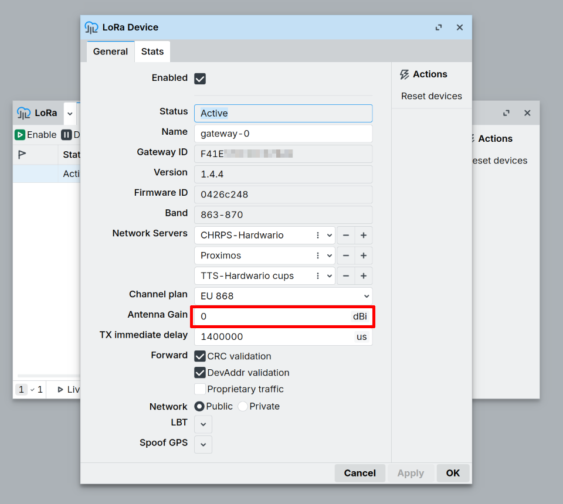

# Zisk antény a výstupní výkon {#antenna-gain--output-power}

Tato stránka vysvětluje, jak funguje vysílací (TX) výkon u brány LoRa od společnosti MikroTik
(R11e-LR8G / wAP LR8G kit) a jak nastavit parametr `antenna-gain`, aby brána
zůstala v zákonném limitu vyzářeného výkonu (EIRP).

:::warning Přečtěte si to dřív, než připojíte externí anténu
Brána **nemá žádné nastavení „TX power“**. Jediným nastavením RF na kartě je
`antenna-gain` a jeho výchozí hodnota z výroby je `0`. Pokud připojíte anténu se ziskem
a výchozí hodnotu ponecháte, brána bude vyzařovat **vyšší** výkon, než má, a může
překročit zákonný limit EIRP.
:::

---

## Co je zisk antény? {#what-is-antenna-gain}

Zisk antény popisuje, jak moc anténa soustřeďuje rádiovou energii do určitých
směrů ve srovnání s teoretickou anténou, která vyzařuje rovnoměrně do všech
směrů (**izotropní zářič**). Vyjadřuje se v **dBi**, decibelech
vztažených k izotropnímu zářiči.

:::info Zisk výkon přetváří, nevytváří ho
Anténa s vyšším ziskem nevysílá více energie. Vezme stejný celkový
výkon a vtěsná ho do užšího vyzařovacího diagramu, takže více energie míří
k horizontu a méně přímo nahoru či dolů. Celkový vyzářený výkon zůstává
stejný; zisk ho jen přerozděluje.
:::

### Dosah a poloměr pokrytí {#range-vs-coverage-radius}

Dvě věci se snadno pletou:

- **Dosah**: jak daleko signál dosáhne v nejsilnějším směru antény
  (u všesměrové antény je to směrem k horizontu).
- **Poloměr pokrytí**: jak velká část okolního prostoru ve všech směrech
  (včetně přímo dolů, přímo nahoru, na sousední patra budovy)
  skutečně dostane použitelný signál.

Všesměrová anténa s vyšším ziskem zvyšuje horizontální **dosah** tím, že
zužuje vertikální vyzařovací úhel. To se hodí pro dlouhé spoje nad rovným otevřeným
terénem, ale může vzniknout **mezera v pokrytí přímo pod bránou nebo velmi blízko
ní**, protože tím směrem jde méně energie. Zařízení přímo pod vysoko umístěnou
anténou s vysokým ziskem může mít horší signál než zařízení mnohem
dále na horizontu.

| Zisk antény | Vertikální vyzařovací úhel | Vhodné pro |
| --- | --- | --- |
| Nízký (~0–2 dBi) | Široký | Zařízení poblíž / v různých výškách, např. uvnitř budov, vícepatrové objekty |
| Vyšší (~6+ dBi) | Užší | Venkovní spoje na velkou vzdálenost, zařízení zhruba v úrovni brány nebo pod ní, rozmístěná horizontálně |

Zisk antény volte podle konkrétního nasazení, ne podle pravidla „větší dosah = lepší“.

---

## Jak vysílací výkon skutečně funguje {#how-tx-power-actually-works}

Brána LoRa od MikroTik si vysílací výkon **nenastavuje** sama. Hodnota přichází ze
síťového serveru LoRaWAN a brána jen kompenzuje zisk antény:

```
radio output (at the connector) = server_value − antenna-gain
radiated EIRP                    = radio output + antenna gain − cable loss
```

- **`server_value`**: vysílací výkon, který požaduje síťový server, v dBm EIRP
  (pole `txpk.powe` protokolu Semtech UDP). V ChirpStack je to `downlink_tx_power` v
  regionálním souboru (např. `region_eu868.toml`); `-1` znamená „použij maximum pásma“.
- **`antenna-gain`**: nastavení brány MikroTik, v dBi. Jde o **odečet**, nikoli
  o zesílení. Existuje proto, aby po přičtení zisku antény odpovídal vyzářený EIRP
  tomu, co server požadoval.

:::info Proti intuici
**Vyšší** hodnota `antenna-gain` znamená **nižší** výkon na výstupu rádia. Je to
kompenzační parametr pro dodržení předpisů, ne způsob, jak zvětšit dosah.
:::

---

## Nastavení `antenna-gain` {#configure-antenna-gain}

Zadejte **skutečný zisk připojené antény v dBi mínus ztráty na kabelu**.

:::info
Úplný seznam parametrů LoRa a jejich přesné definice najdete v dokumentaci
společnosti MikroTik: [LoRa General Properties](https://help.mikrotik.com/docs/spaces/ROS/pages/16351619/General+Properties).
:::

### WebFig / WinBox {#webfig--winbox}

1. V levé nabídce otevřete **LoRa**.
2. Klikněte na rozhraní LoRa (např. `lora1`).
3. Přejděte na záložku **General**.
4. Nastavte **Antenna Gain** na zisk antény v dBi.
5. Klikněte na **Apply**.



### CLI (terminál / SSH) {#cli-terminal--ssh}

```
/lora print
/lora set [find] antenna-gain=2
```

:::info
V novějších sestaveních RouterOS může být menu `/iot lora` místo `/lora`. Pokud `/lora` neexistuje, použijte
`/iot lora set [find] antenna-gain=2`.
:::

---

## Doporučené hodnoty {#recommended-values}

| Anténa | Zisk | Hodnota `antenna-gain` |
| --- | --- | --- |
| Vestavěná anténa zařízení wAP LR8G kit (868 MHz) | 2 dBi | `2` |
| Sada všesměrové antény LoRa od MikroTik (`TOF-0809-...`) | 6,5 dBi | `6.5` |
| Jiná externí anténa | viz její katalogový list | dBi antény − ztráty na kabelu |

U zařízení **EMBER** musí hodnota odpovídat anténě, která je ke kartě LoRa skutečně připojená: buď
vnitřní anténě LoRaWAN, se kterou se zařízení dodává, nebo externí anténě na konektoru **LRW** (její zisk
mínus ztráty kabelu mezi nimi). Při každé změně antény nastavení aktualizujte.

Pokud zisk antény neznáte, volte raději **vyšší** hodnotu. Brána pak sníží
výkon o něco víc a zůstane v zákonných limitech.

---

## Příklad výpočtu (EU868) {#worked-example-eu868}

Downlink na 869,525 MHz, limit EIRP **27 dBm**, anténa 6,5 dBi, server požaduje
`powe = 27`:

| `antenna-gain` | Výstup rádia | Vyzářený EIRP | Výsledek |
| --- | --- | --- | --- |
| `0` (výchozí) | 27 dBm | **33,5 dBm** | <span style={{color: 'var(--ifm-color-danger)'}}>✗</span> o 6,5 dB nad limitem |
| `6.5` | 20,5 dBm | 27 dBm | <span style={{color: 'var(--ifm-color-success)'}}>✓</span> správně |
| `4.5` (anténa 6,5 dBi − 2 dB kabel) | 22,5 dBm | 27 dBm | <span style={{color: 'var(--ifm-color-success)'}}>✓</span> správně |

---

## Změna samotného vysílacího výkonu {#changing-the-transmit-power-itself}

Protože brána přebírá výkon ze síťového serveru, měňte vysílací výkon pro **downlink**
tam, například v ChirpStack parametr `downlink_tx_power` (dBm EIRP) v souboru
`region_eu868.toml`. Vysílací výkon pro **uplink** je vlastností **koncového zařízení** (firmware
uzlu nebo ADR ze serveru), nikoli brány.

Skutečný dosah zvýšíte lepší anténou nebo kratším kabelem s nižšími ztrátami;
potom odpovídajícím způsobem upravte `antenna-gain`. Samotné nastavení nikdy výkon nepřidá.

:::caution MikroTik wAP LR8G kit: nejprve připojte vnitřní anténu
U samostatné sady **wAP LR8G kit** od společnosti MikroTik **není vnitřní anténa z výroby připojená**.
Před použitím ji (při vypnutém napájení) připojte ke konektoru u.FL **RFIO** na kartě, jinak karta
přes anténu vůbec nevysílá ani nepřijímá.
:::

---

## Regulační limity (EU868) {#regulatory-limits-eu868}

- **Uplink:** max 25 mW = **14 dBm**
- **Downlink** na 869,525 MHz (pásmo RX2): až 500 mW = **27 dBm** EIRP
- **EIRP** = vysílací výkon (dBm) + zisk antény (dBi) − ztráty na kabelu (dB)

Vždy si ověřte hodnoty platné pro vaše nasazení v dokumentu LoRaWAN Regional Parameters
a v místních předpisech.

---

## Další informace {#further-reading}

- [MikroTik – LoRa General Properties](https://help.mikrotik.com/docs/spaces/ROS/pages/16351619/General+Properties)
  je úplná reference všech konfiguračních parametrů LoRa včetně `antenna-gain`.
