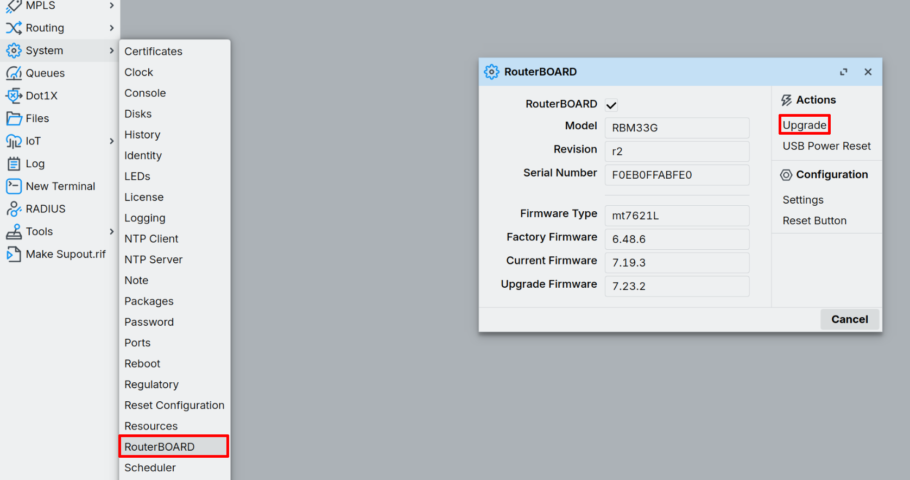

import Image from '@theme/IdealImage';

# Aktualizace brány MikroTik {#mikrotik-gateway-update}

Tento návod popisuje, jak v aplikaci Winbox 4 aktualizovat balíčky RouterOS a RouterBOARD (firmware/„BIOS“).

---

## Předpoklady {#prerequisites}
- Přístup administrátora (uživatelské jméno a heslo)

---

## 1. Aktualizace softwaru RouterOS {#1-update-routeros-software}

V levém panelu otevřete **System → Packages → Check for Updates**. V novém okně zkontrolujte, zda se verze shodují. Pokud ne, klikněte na **Download&Install** a několik minut počkejte.

---

## 2. Aktualizace RouterBOARD (firmware/„BIOS“) {#2-update-routerboard-firmwarebios}

1. V levém menu otevřete **System → RouterBOARD**.
2. Porovnejte **Current Firmware** s **Upgrade Firmware**.
3. Pokud je aktualizace dostupná, klikněte na **Upgrade**.

---

## 3. Restartem dokončete aktualizaci firmwaru {#3-reboot-to-apply-firmware}

1. V levém menu otevřete **System → Reboot**.
2. Potvrďte restart, aby se aktualizace firmwaru RouterBOARD projevila.

3. Počkejte, až bude zařízení znovu online, a přihlaste se.

---

## 4. Kontrola aktualizace {#4-verify-the-update}

1. **System → Packages**:  
   - Klikněte na **Check For Updates**: nyní by se mělo zobrazit **up to date** (obě verze by se měly shodovat).
2. **System → RouterBOARD**:  
   - Zkontrolujte, že se **Current Firmware** shoduje s **Upgrade Firmware**. Pak je firmware úspěšně aktualizovaný.
