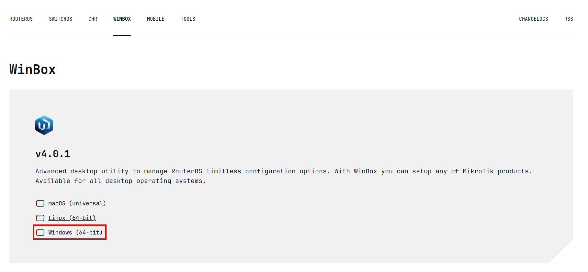
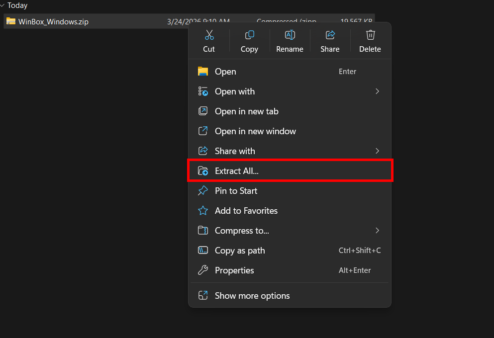
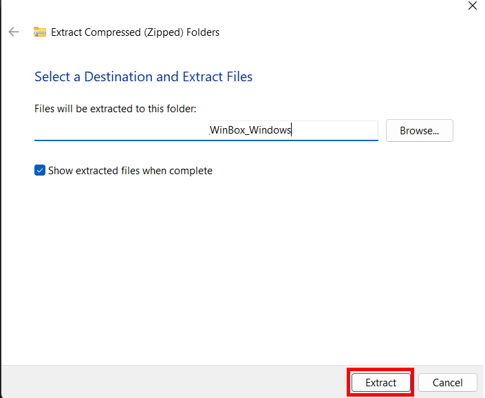
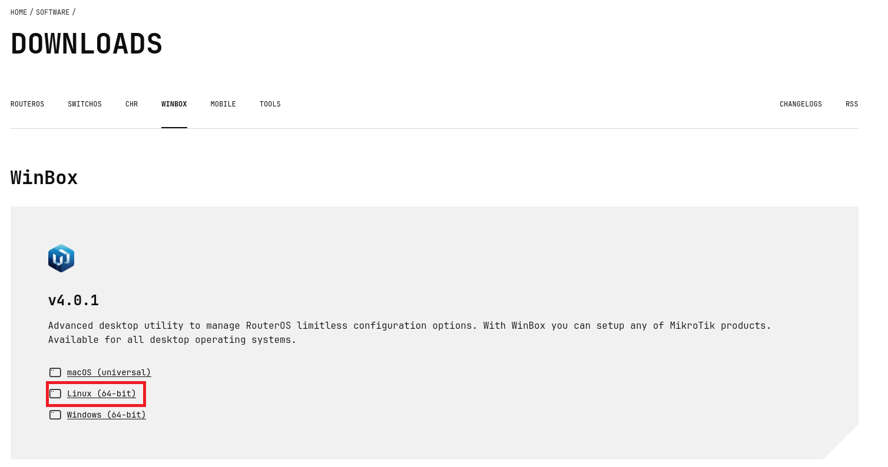

# Instalace Winbox 4 {#winbox-4-installation}

Tento průvodce krok za krokem vysvětluje, jak nainstalovat Winbox 4 na Windows a Linux.

---

## Windows {#windows}

### 1. Stažení Winbox 4 {#1-download-winbox-4}

Klikněte na odkaz níže a přejděte na stránku pro stažení MikroTik:

https://mikrotik.com/download/winbox

Na stránce klikněte na **Windows (64-bit)**. Stáhne se soubor `.zip`.

    

---

### 2. Rozbalení archivu {#2-extract-the-archive}

Otevřete složku, do které byl soubor stažen. Klikněte na soubor pravým tlačítkem a zvolte **Extract All**.

Kliknutím na tlačítko **Extract** soubor rozbalte.

---

### 3. Spuštění Winbox 4 {#3-run-winbox-4}

V rozbalené složce otevřete aplikaci **WinBox.exe**. Po otevření aplikace se zobrazí systémové okno. Potvrďte jej kliknutím na **Allow**.

**Winbox 4 je nyní připraven k použití.**

---

## Linux {#linux}

### 1. Stažení Winbox 4 {#1-download-winbox-4-1}

Klikněte na odkaz níže a přejděte na stránku pro stažení MikroTik:

[https://mikrotik.com/download/winbox](https://mikrotik.com/download/winbox)

Na stránce klikněte na **Linux (64-bit)**. Stáhne se soubor `.zip`. Umístěte jej někam, kde k němu snadno přistoupíte, například do složky **Downloads**.

---

### 2. Rozbalení archivu {#2-extract-the-archive-1}

Klikněte pravým tlačítkem na stažený soubor **WinBox_Linux.zip** a zvolte **Extract Here**, nebo **Extract to…**, pokud jej chcete umístit do konkrétní složky.

Po dokončení rozbalení uvidíte složku obsahující soubor **WinBox** a složku **assets**.

---

### 3. Spuštění Winbox 4 {#3-run-winbox-4-1}

1. Otevřete složku, kterou jste právě rozbalili.
2. Najděte soubor s názvem **WinBox**.
3. Klikněte na soubor pravým tlačítkem.
4. Zvolte **Run** nebo **Run as Program**.
5. Vyčkejte několik sekund, dokud se Winbox neotevře a nebude připraven k použití.

**Winbox 4 je nyní připraven k použití.**
