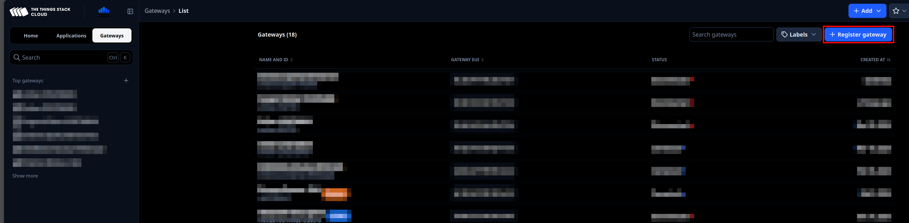
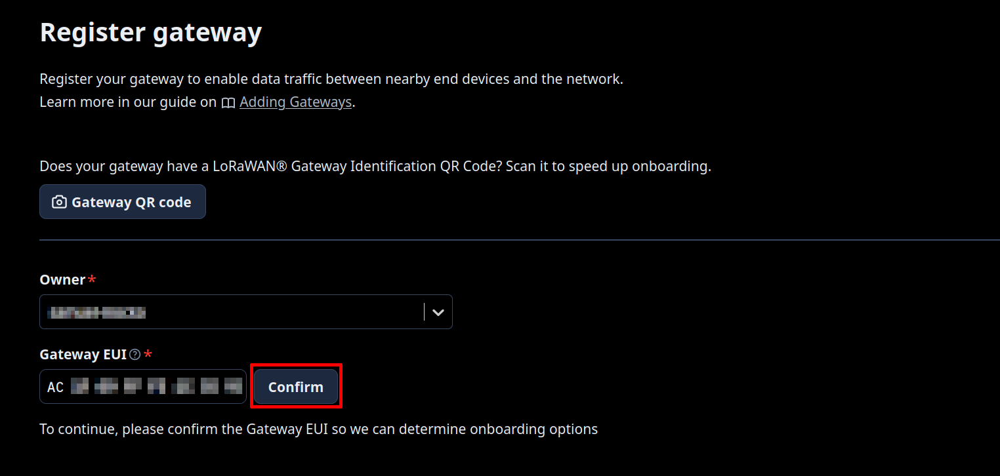
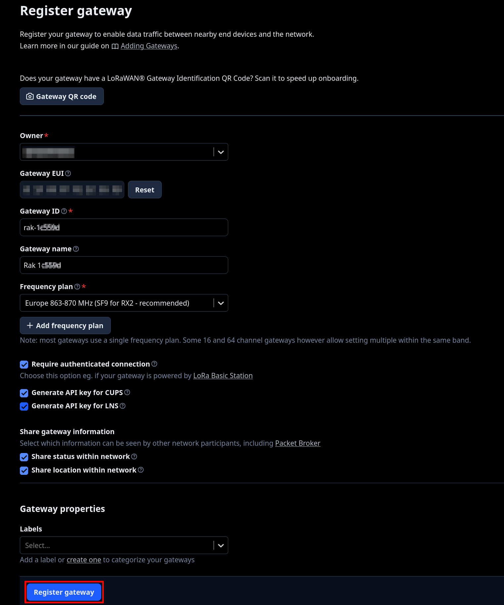
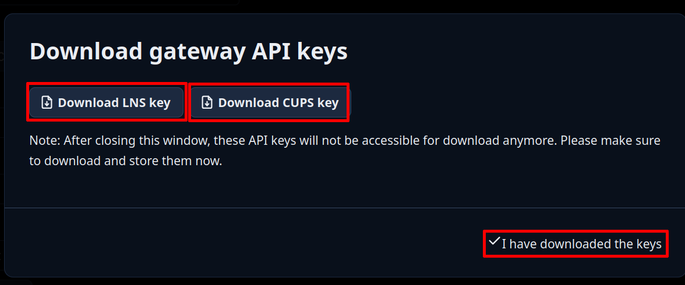
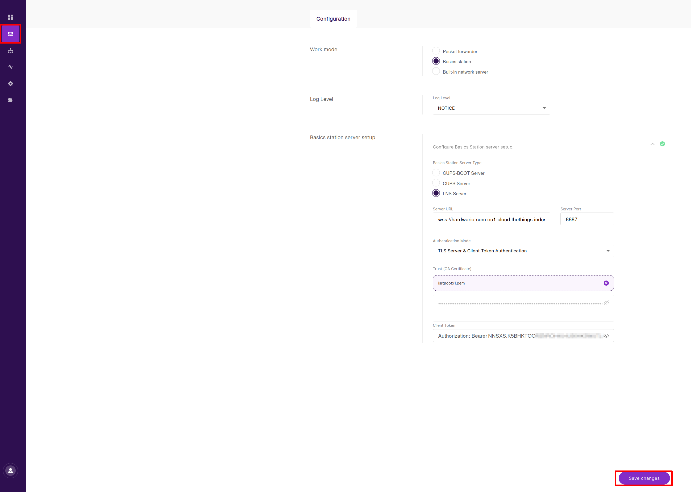
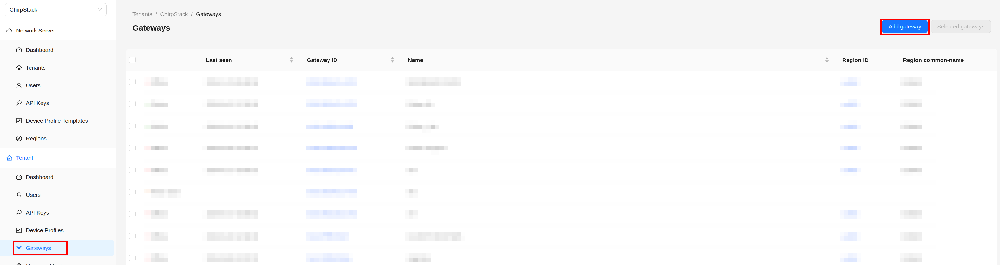
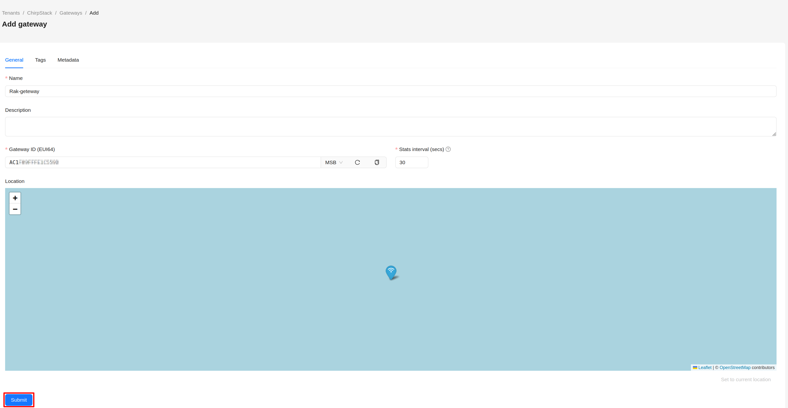
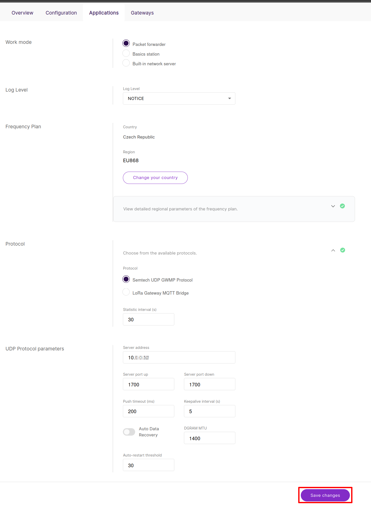

import Image from '@theme/IdealImage';

Zde je seznam bran **RAKwireless** otestovaných společností HARDWARIO s odkazy na referenční zdroje:

| Název | Typ | Přehled | Stránka produktu | Odkaz na nákup |
| :--- | :--- | :--- | :--- | :--- |
| [**RAK7268V2**](/smart-devices/rakwireless/gateways/rak-RAK7268V2) | Vnitřní LoRaWAN® brána  (WisGate Edge Lite 2) | [Podrobnosti](/smart-devices/rakwireless/gateways/rak-RAK7268V2) | [Oficiální stránky](https://docs.rakwireless.com/product-categories/wisgate/rak7268v2/overview) | [Koupit zde](https://www.hardwario.store/p/rak-7268v2) |
| [**RAK7289V2**](/smart-devices/rakwireless/gateways/rak-RAK7289V2) | Venkovní průmyslová LoRaWAN® brána  (WisGate Edge Pro) | [Podrobnosti](/smart-devices/rakwireless/gateways/rak-RAK7289V2) | [Oficiální stránky](https://docs.rakwireless.com/product-categories/wisgate/rak7289v2/overview/) | [Koupit zde](https://www.hardwario.store/p/rak-7289v2) |

---

## Možnosti sítě LoRaWAN {#lorawan-network-options}

Pro provoz vašeho zařízení LoRaWAN si můžete vybrat ze dvou podporovaných platforem síťového serveru. Obě řešení umožňují spravovat brány, registrovat koncová zařízení, konfigurovat profily a zpracovávat data payloadu.

### Možnost 1: The Things Stack (TTS) {#option-1-the-things-stack-tts}

Cloudový LoRaWAN Network Server vhodný pro malá i velká nasazení.

#### Registrace brány v TTS {#gateway-registration-on-tts}

1. Přihlaste se do konzole TTS (např. `hardwario-com.eu1.cloud.thethings.industries`).
2. Přejděte na **Gateways → Register gateway**.

3. Vložte své **Gateway EUI** (16 znaků, najdete jej v Dashboardu brány) a klikněte na **Confirm**.

4. Po zadání Gateway EUI vyplňte následující pole:
- Gateway ID: ( Vámi zvolený identifikátor zařízení → příklad: **rak-0x**)
- Gateway Name: (Vámi zvolený název zařízení → příklad **Rak 0x**)
- Frequency Plan: **Europe 863-870 MHz (SF9 for RX2 - recommended)**
- **(Volitelné)** Label

Zaškrtněte políčko **Require authenticated connection**.

Zapněte následující:
- **Generate API key for CUPS**
- **Generate API key for LNS**

Klikněte na **Register gateway** a **stáhněte oba API klíče** (CUPS + LNS).

5. Objeví se nové okno. Klikněte na **Download LNS key**, poté na **Download CUPS key** a uložte oba API klíče do svého zařízení. Jakmile jsou oba soubory stažené, klikněte na **I have downloaded the keys**.

#### Konfigurace brány {#gateway-configuration}

Ve své bráně RAK přejděte na **LoRa → Configuration** a jako **Work mode** vyberte **Basics Station**.
- Ujistěte se, že **Frequency Plan** a **Country** odpovídají vašim regionálním nastavením.
Klikněte na **Configure Basics Station server setup** a vyplňte následující pole:
- Basics Station Server Type: **LNS Server**
- Server URL: **wss://hardwario-com.eu1.cloud.thethings.industries**
- Server Port: **8887**
- Authentication Mode: **TLS Server & Client Token Authentication**
- Trust (CA Certificat): **isrgrootx1.pem** (Stáhněte z https://letsencrypt.org/certs/isrgrootx1.pem a vyberte)
- Client Token: **NNSXS.K5BHKTOO...** (Ze souboru **tc.key**)
- Potvrďte kliknutím na **Save changes**.

---

### Možnost 2: ChirpStack v4 {#option-2-chirpstack-v4}

Open-source LoRaWAN Network Server ideální pro on-premise nebo privátní síťové instalace.

#### Registrace brány v ChirpStacku {#gateway-registration-on-chirpstack}
1. V **ChirpStack v4** otevřete **Tenant → Gateways**.
2. Klikněte na **Add Gateway**.

3. Vyplňte:
   - Name: **Rak-gate** (nebo vámi preferovaný název)
   - Gateway ID: **GATEWAY_ID**
   - Stats Interval: **YOUR_PREFERENCE**
4. Klikněte na **Submit**.

#### Konfigurace brány {#gateway-configuration-1}
Ve své bráně RAK přejděte na **LoRa → Configuration** a jako **Work mode** vyberte **Packet forwarder**.
- Ujistěte se, že **Frequency Plan** a **Country** odpovídají vašim regionálním nastavením.
Jako Protocol vyberte **Samtech UDP GWMP Protocol**.
V kategorii **UDP Protocol parameters** vyplňte následující pole:
- Server address: **ADDRESS_OF_YOUR_CHIRPSTACK_SERVER**
- Server Port up: **1700**
- Server port down: **1700**
- Potvrďte kliknutím na **Save changes**.

