import Image from '@theme/IdealImage';

Zde je seznam bran **RAKwireless** otestovaných společností HARDWARIO s odkazy na referenční zdroje:

| Název | Typ | Přehled | Stránka produktu | Odkaz na nákup |
| :--- | :--- | :--- | :--- | :--- |
| [**RAK7268V2**](/smart-devices/rakwireless/gateways/rak-RAK7268V2) | Vnitřní brána LoRaWAN®  (WisGate Edge Lite 2) | [Podrobnosti](/smart-devices/rakwireless/gateways/rak-RAK7268V2) | [Oficiální stránky](https://docs.rakwireless.com/product-categories/wisgate/rak7268v2/overview) | [Koupit zde](https://www.hardwario.store/p/rak-7268v2) |
| [**RAK7289V2**](/smart-devices/rakwireless/gateways/rak-RAK7289V2) | Venkovní průmyslová brána LoRaWAN®  (WisGate Edge Pro) | [Podrobnosti](/smart-devices/rakwireless/gateways/rak-RAK7289V2) | [Oficiální stránky](https://docs.rakwireless.com/product-categories/wisgate/rak7289v2/overview/) | [Koupit zde](https://www.hardwario.store/p/rak-7289v2) |

---

## Možnosti sítě LoRaWAN {#lorawan-network-options}

Zařízení LoRaWAN můžete provozovat na jedné ze dvou podporovaných platforem síťového serveru. V obou spravujete brány, registrujete koncová zařízení, konfigurujete profily a zpracováváte data z payloadů.

### Možnost 1: The Things Stack (TTS) {#option-1-the-things-stack-tts}

Cloudový síťový server LoRaWAN vhodný pro malá i velká nasazení.

#### Registrace brány v TTS {#gateway-registration-on-tts}

1. Přihlaste se do konzole TTS (např. `hardwario-com.eu1.cloud.thethings.industries`).
2. Přejděte na **Gateways → Register gateway**.
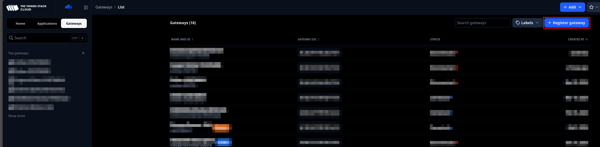

3. Vložte **Gateway EUI** (16 znaků, najdete ho na dashboardu brány) a klikněte na **Confirm**.
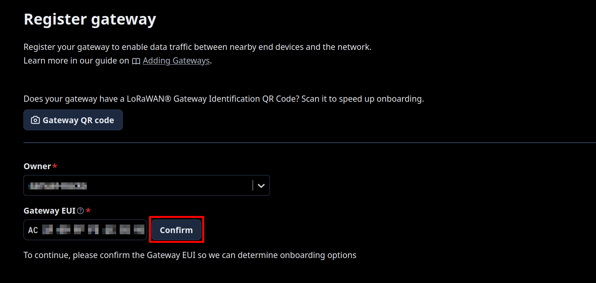

4. Po zadání Gateway EUI vyplňte tato pole:
- Gateway ID: (vámi zvolený identifikátor zařízení → například **rak-0x**)
- Gateway Name: (vámi zvolený název zařízení → například **Rak 0x**)
- Frequency Plan: **Europe 863–870 MHz (SF9 for RX2, recommended)**
- **(Volitelné)** Label

Zaškrtněte políčko **Require authenticated connection**.

Zapněte tyto volby:
- **Generate API key for CUPS**
- **Generate API key for LNS**

Klikněte na **Register gateway** a **stáhněte oba API klíče** (CUPS + LNS).

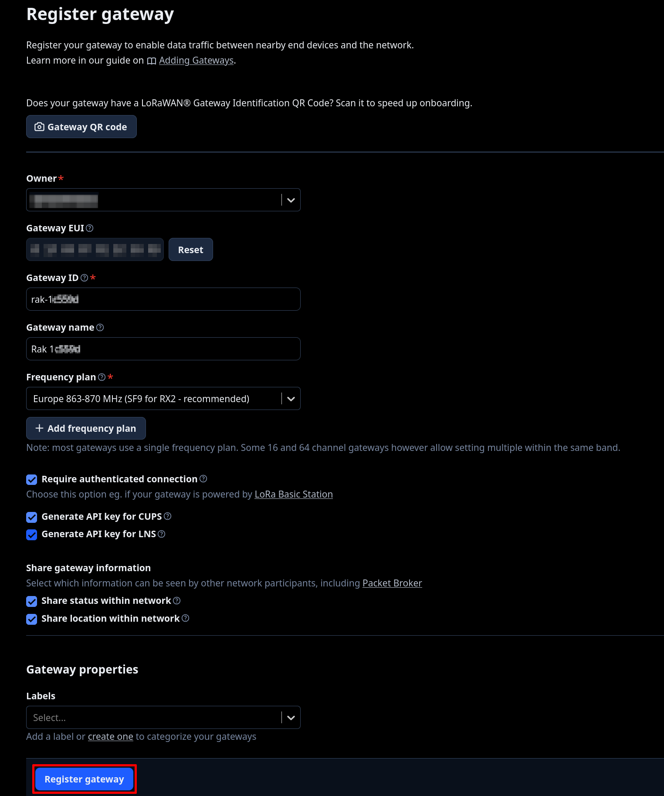

5. Objeví se nové okno. Klikněte na **Download LNS key**, poté na **Download CUPS key** a oba API klíče si uložte. Jakmile jsou oba soubory stažené, klikněte na **I have downloaded the keys**.
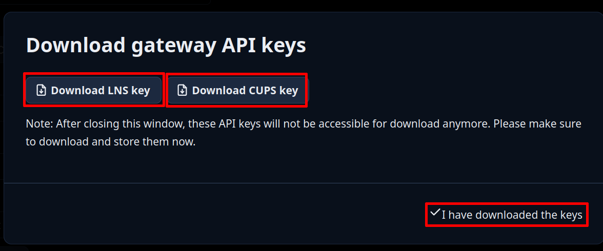
#### Konfigurace brány {#gateway-configuration}

V rozhraní brány RAK přejděte na **LoRa → Configuration** a jako **Work mode** vyberte **Basics Station**.
- Zkontrolujte, že **Frequency Plan** a **Country** odpovídají vašemu regionu.
Klikněte na **Configure Basics Station server setup** a vyplňte tato pole:
- Basics Station Server Type: **LNS Server**
- Server URL: **wss://hardwario-com.eu1.cloud.thethings.industries**
- Server Port: **8887**
- Authentication Mode: **TLS Server & Client Token Authentication**
- Trust (CA Certificat): **isrgrootx1.pem** (stáhněte ho z https://letsencrypt.org/certs/isrgrootx1.pem a vyberte)
- Client Token: **NNSXS.K5BHKTOO...** (ze souboru **tc.key**)
- Potvrďte kliknutím na **Save changes**.

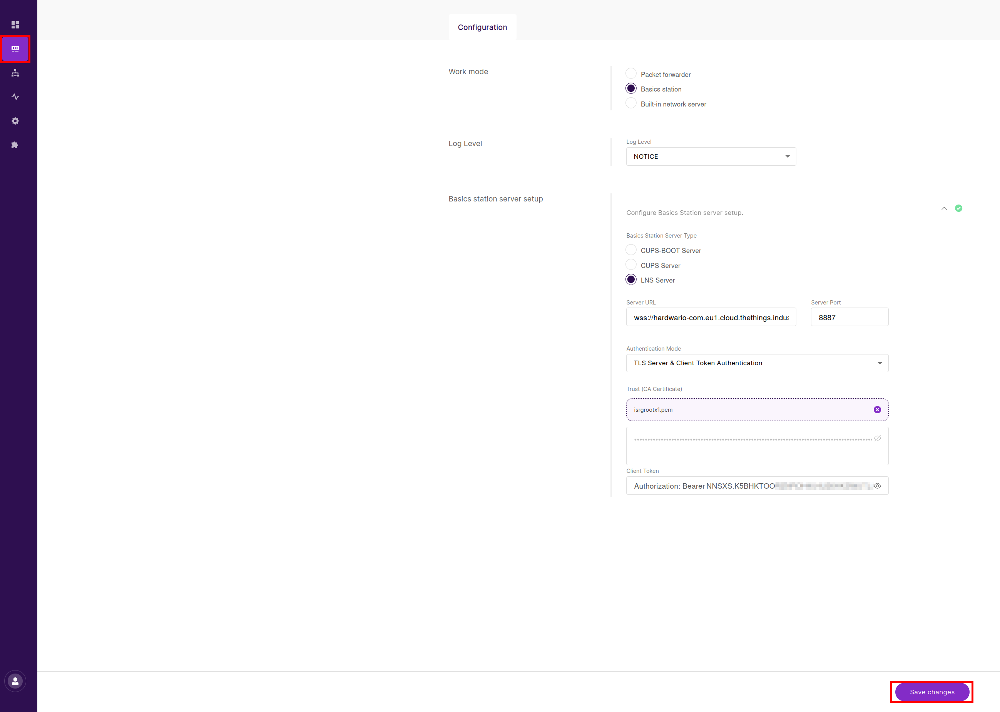

---

### Možnost 2: ChirpStack v4 {#option-2-chirpstack-v4}

Open-source síťový server LoRaWAN vhodný pro instalace on-premise nebo v privátní síti.

#### Registrace brány v platformě ChirpStack {#gateway-registration-on-chirpstack}
1. V **ChirpStack v4** otevřete **Tenant → Gateways**.
2. Klikněte na **Add Gateway**.
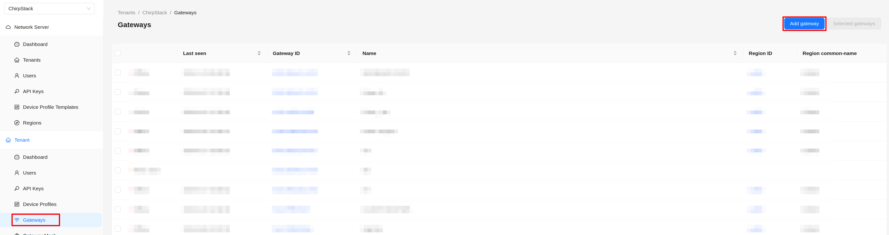
3. Vyplňte:
   - Name: **Rak-gate** (nebo jiný název podle vaší volby)
   - Gateway ID: **GATEWAY_ID**
   - Stats Interval: **YOUR_PREFERENCE**
4. Klikněte na **Submit**.
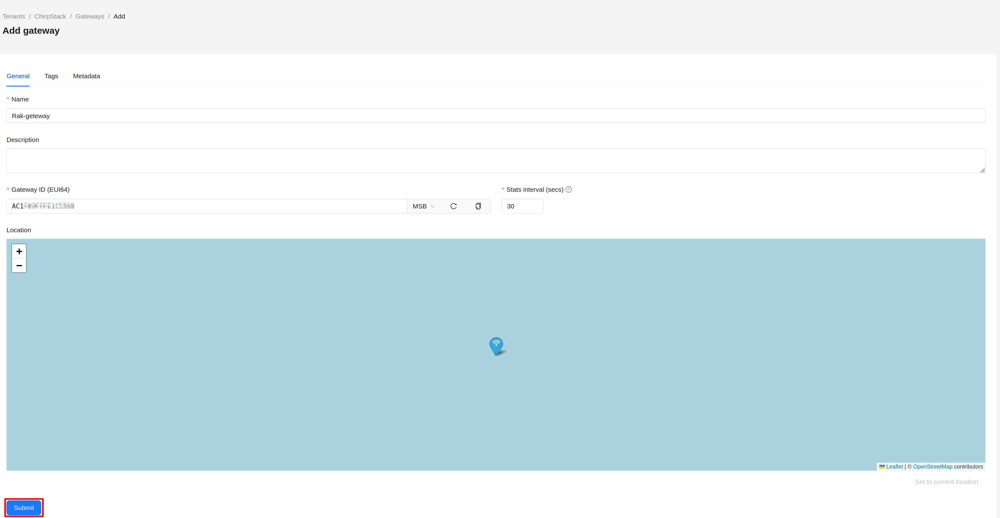

#### Konfigurace brány {#gateway-configuration-1}
V rozhraní brány RAK přejděte na **LoRa → Configuration** a jako **Work mode** vyberte **Packet forwarder**.
- Zkontrolujte, že **Frequency Plan** a **Country** odpovídají vašemu regionu.
Jako Protocol vyberte **Semtech UDP GWMP Protocol**.
V části **UDP Protocol parameters** vyplňte tato pole:
- Server address: **ADDRESS_OF_YOUR_CHIRPSTACK_SERVER**
- Server Port up: **1700**
- Server port down: **1700**
- Potvrďte kliknutím na **Save changes**.

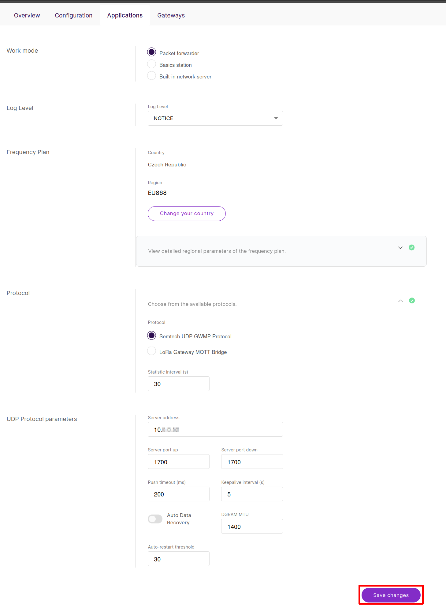

---

## Konfigurace OpenVPN {#openvpn-configuration}

Zabezpečené připojení OpenVPN na bráně RAK nastavíte takto:

1. Klikněte v levém navigačním menu na ikonu **Extensions** (dílek puzzle). Otevřete záložku **Extension gallery** a nainstalujte rozšíření **RAK OpenVPN Client**, pokud ještě nainstalované není.
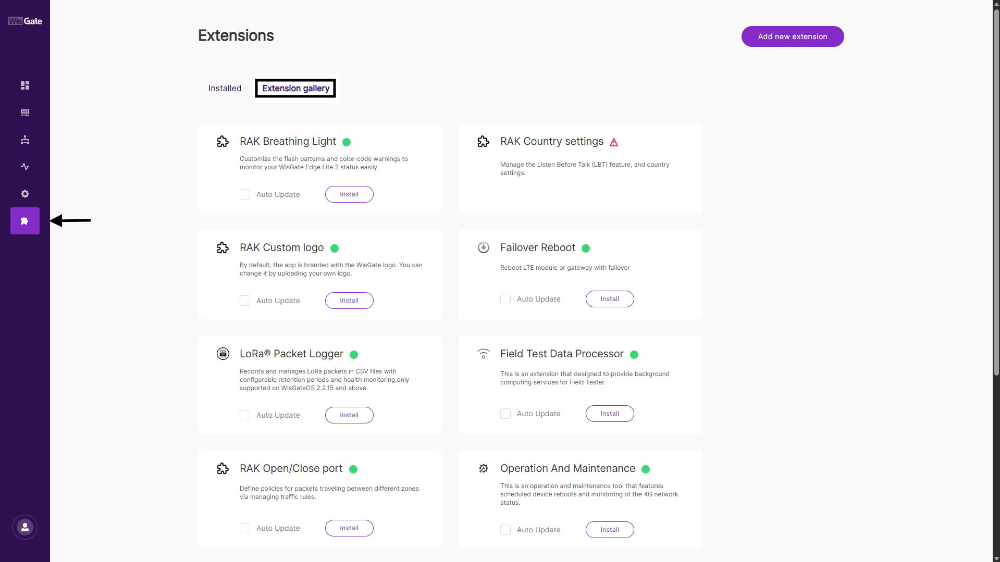

2. Přepněte na záložku **Installed**, najděte **RAK OpenVPN Client** a klikněte na **Launch**.
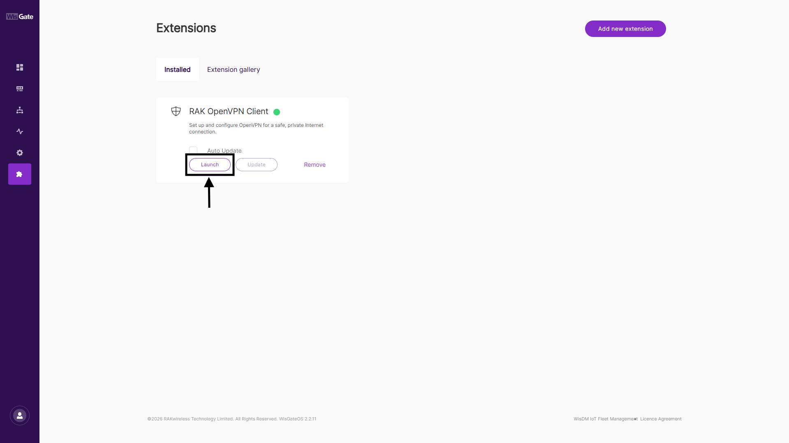

3. Na dashboardu klienta OpenVPN klikněte v přehledu **VPN Tunnel** na **Configure**.
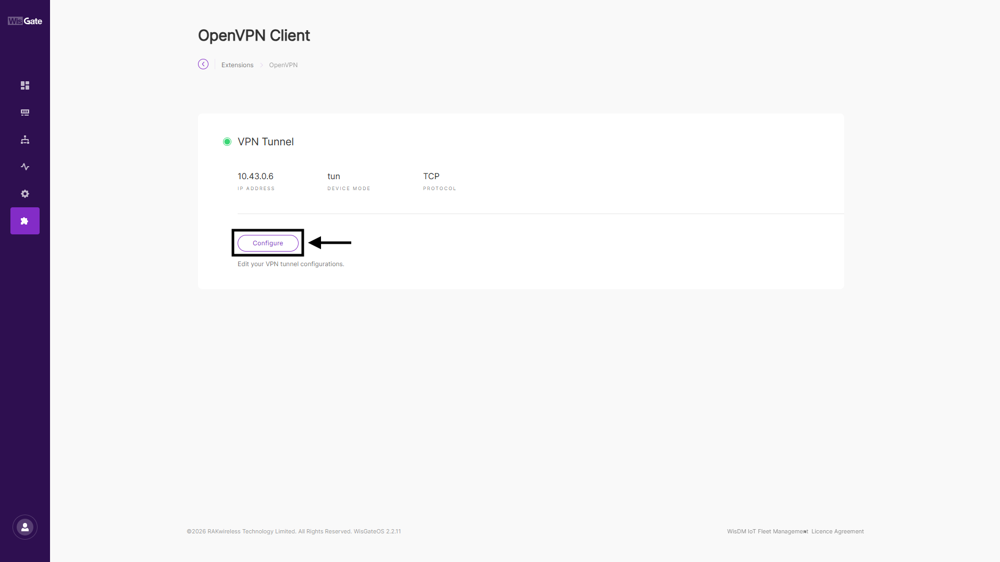

4. Přejděte na záložku **Configuration**, zapněte **Enable Connection**, nahrajte svůj konfigurační soubor `.ovpn` a klikněte na **Save changes**.
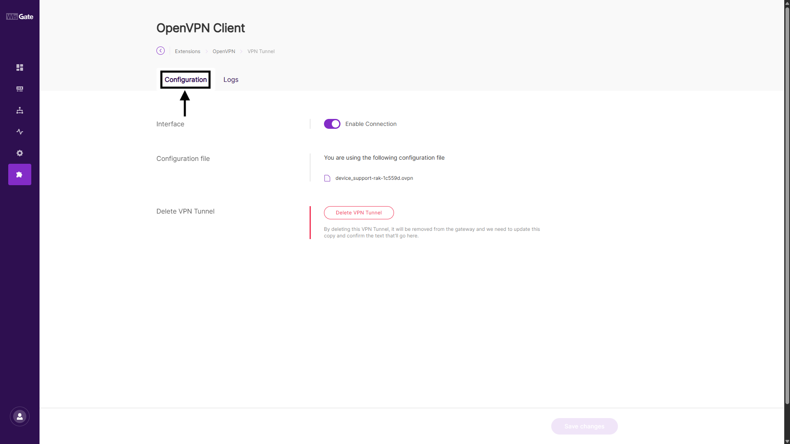
