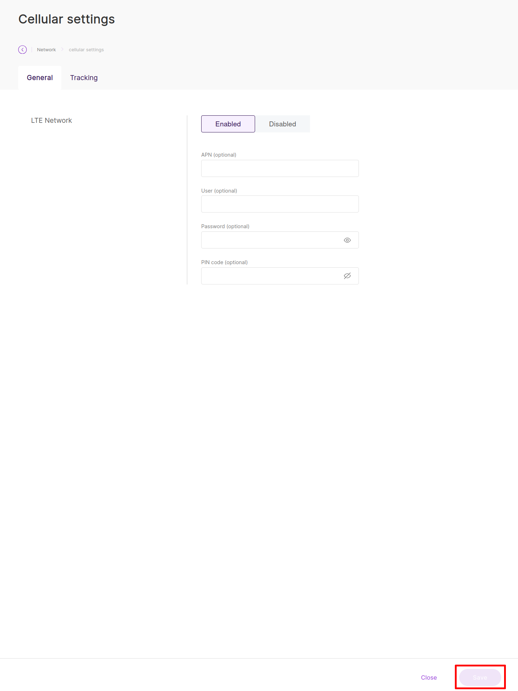

import Image from '@theme/IdealImage';

# RAK7268V2 WisGate Edge Lite 2 {#rak7268v2-wisgate-edge-lite-2}

**RAK7268V2 WisGate Edge Lite 2** je plnohodnotná 8kanálová vnitřní LoRaWAN® brána založená na nejnovějším **WisGateOS 2**. Je určena pro chytré budovy, chytré kanceláře a další vnitřní IoT aplikace.

Podporuje připojení přes Ethernet a Wi-Fi (a volitelně LTE), což z ní dělá univerzální volbu pro prostředí SOHO i podnikové sítě. Brána je vybavena vestavěným Network Serverem vhodným pro malá až středně velká nasazení, ale lze ji snadno připojit k hlavním cloudovým platformám jako The Things Stack, ChirpStack nebo AWS IoT Core.

  

    

      

        <Image img={require('../../../../../../smart-devices/rakwireless/gateways/images/rak-RAK7268V2.png')} />
      

    

    

  

 

:::tip WisGateOS 2
Tento model V2 běží na **WisGateOS 2**, který ve srovnání se starším modelem V1 nabízí modernější rozhraní, rozšiřující doplňky a lepší zabezpečení.
:::

---

## Klíčové vlastnosti {#key-features}

* **8 kanálů:** Plná podpora LoRaWAN.
* **Konektivita:** 10/100M Ethernet (PoE) a 2,4 GHz Wi-Fi (AP/klient).
* **Operační systém:** WisGateOS 2 založený na OpenWRT.
* **Rozšiřující doplňky:** Podpora Python SDK a instalace rozšíření.
* **Správa:** Webové UI, SSH a vzdálená správa přes WisDM.
* **Antena:** Interní antena (u některých modelů s možností externích konektorů).

---

## Technické parametry {#technical-specifications}

| Vlastnost | Specifikace |
| :--- | :--- |
| **Model** | RAK7268V2 |
| **LoRa kanály** | 8 kanálů |
| **Frekvence** | EU868 (podporuje i další regiony) |
| **Napájení** | 12 V DC (napájecí adaptér) nebo **PoE (802.3af)** |
| **Síť** | Ethernet, Wi-Fi (802.11b/g/n) |
| **Mobilní síť** | Volitelně (LTE Cat 4) – *zkontrolujte konkrétní SKU* |
| **Provozní teplota** | -10 °C až +55 °C |
| **Rozměry** | 166 x 129 x 43 mm |
| **Krytí IP** | IP30 (pouze pro vnitřní použití) |

---

## Rychlý průvodce {#quick-start-guide}

### 1. Zapnutí {#1-power-on}
Bránu lze napájet:
* přiloženým **adaptérem 12 V DC**,
* ethernetovým kabelem připojeným k **PoE injektoru** nebo PoE switchi (IEEE 802.3af).

### 2. Přístup k bráně {#2-accessing-the-gateway}

K lokálnímu webovému UI brány se lze připojit dvěma způsoby:

#### Režim Wi-Fi AP (výchozí) {#wifi-ap-mode-default}
1. Připojte počítač k Wi-Fi SSID: `RAK7268CV2_XXXX` (kde XXXX jsou poslední bajty MAC adresy).
2. Není vyžadováno žádné heslo.
3. Otevřete webový prohlížeč a přejděte na `192.168.230.1`.

#### Režim Ethernet {#ethernet-mode}
1. Připojte port **ETH** brány přímo k počítači.
2. Nastavte počítači statickou IP adresu (např. `169.254.15.100`), aby odpovídala záložní IP adrese brány (`169.254.15.1`).

### 3. Nastavení povinného hesla {#3-setting-the-mandatory-password}

Při prvním přístupu k bráně je nutné nastavit heslo pro uživatele **root**. Heslo musí splňovat tato kritéria:

* délka alespoň **12 znaků**
* obsahuje alespoň jeden **speciální znak**
* obsahuje alespoň jednu **číslici**
* obsahuje alespoň jedno **písmeno latinky**

:::tip Gateway EUI
Po nastavení hesla budete přesměrováni na **Dashboard**, kde určíte svou zemi a region. Zkopírujte si zde zobrazený **16znakový Gateway EUI** – budete jej potřebovat pro registraci na network serveru.
:::

### 4. Připojení k internetu {#4-internet-connectivity}

Aby brána mohla komunikovat s network serverem, potřebuje připojení k internetu. Přejděte do **Network > WAN**:

* **Ethernet:** Zapojte port ETH do svého routeru; ve výchozím stavu se použije DHCP.
* **Wi-Fi:** Přejděte na **Wi-Fi**, zapněte rozhraní a vyhledejte svou lokální síť.
* **Mobilní síť (modely s LTE):** Pokud používáte SIM kartu, nastavte APN v sekci **Cellular**.

Pokud vaše SIM karta vyžaduje PIN kód, je nutné jej nastavit v konfiguraci. Přejděte do **Network → WAN → Cellular → General**, zapněte LTE Network, zadejte PIN své SIM karty do pole **PIN code** a klikněte na **Save**.

:::warning Cellular Note
Pokud SIM kartu nepoužíváte, vypněte mobilní rozhraní, abyste zabránili zaplavení logu zprávami `SIM_ABSENT`.
:::

---

## Konfigurace pracovních režimů {#configuring-work-modes}

Brána podporuje několik pracovních režimů LoRaWAN. Přejděte do **LoRa > Configuration** a vyberte preferovaný režim:

### Basics Station (doporučeno pro TTS) {#basics-station-recommended-for-tts}

Pro připojení k The Things Stack vyberte **Basics Station**:

| Nastavení | Hodnota |
| :--- | :--- |
| **Basics Station Mode** | LNS Server |
| **Server URL** | `wss://hardwario-com.eu1.cloud.thethings.industries` (port 8887) |
| **Trust (CA Certificate)** | Nahrajte soubor [ISRG Root X1 .pem](https://letsencrypt.org/certs/isrgrootx1.pem) |
| **Client Token** | Vložte svůj API klíč z TTS |

### Další dostupné pracovní režimy {#other-available-work-modes}

* **Packet Forwarder:** Používá se pro starší připojení Semtech UDP nebo ChirpStack MQTT.
* **Built-in Network Server:** Umožňuje bráně fungovat jako samostatný LNS (ChirpStack).

---

## Možnosti sítě LoRaWAN {#lorawan-network-options}

Informace o podporovaných platformách LoRaWAN network serverů najdete v části [**Možnosti sítě LoRaWAN**](/smart-devices/rakwireless/gateways/index#lorawan-network-options)

---

## Zdroje {#resources}

* [Datasheet RAK7268V2](https://docs.rakwireless.com/Product-Categories/WisGate/RAK7268V2/Datasheet/)
* [Rychlý průvodce](https://docs.rakwireless.com/Product-Categories/WisGate/RAK7268V2/Quickstart/)
