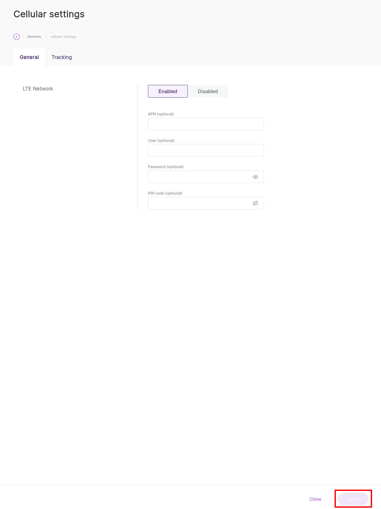

import Image from '@theme/IdealImage';

# RAK7268V2 WisGate Edge Lite 2 {#rak7268v2-wisgate-edge-lite-2}

**RAK7268V2 WisGate Edge Lite 2** je plnohodnotná 8kanálová vnitřní brána LoRaWAN® s nejnovějším systémem **WisGateOS 2**. Je určená pro chytré budovy, chytré kanceláře a další vnitřní aplikace IoT.

Připojuje se přes Ethernet a Wi-Fi (volitelně i LTE), takže se hodí do malých kanceláří (SOHO) i do podnikových sítí. Má vestavěný síťový server pro malá až středně velká nasazení, ale snadno ji připojíte i k velkým cloudovým platformám, jako jsou The Things Stack, ChirpStack nebo AWS IoT Core.

  

    

      

        <Image img={require('../../../../../../smart-devices/rakwireless/gateways/images/rak-RAK7268V2.png')} />
      

    

    

  

 

:::tip WisGateOS 2
Model V2 běží na systému **WisGateOS 2**, který má oproti starším modelům V1 modernější rozhraní, rozšiřující doplňky a lepší zabezpečení.
:::

---

## Klíčové vlastnosti {#key-features}

* **8 kanálů:** Plná podpora LoRaWAN.
* **Konektivita:** 10/100M Ethernet (PoE) a 2,4 GHz Wi-Fi (AP/klient).
* **Operační systém:** WisGateOS 2 založený na OpenWRT.
* **Rozšiřující doplňky:** Podporuje Python SDK a instalaci rozšíření.
* **Správa:** Webové rozhraní, SSH a vzdálená správa přes WisDM.
* **Anténa:** Interní anténa (některé modely mají konektory pro externí anténu).

---

## Technické parametry {#technical-specifications}

| Vlastnost | Specifikace |
| :--- | :--- |
| **Model** | RAK7268V2 |
| **Kanály LoRa** | 8 kanálů |
| **Frekvence** | EU868 (podporuje i další regiony) |
| **Napájení** | 12 V DC (napájecí adaptér) nebo **PoE (802.3af)** |
| **Síť** | Ethernet, Wi-Fi (802.11b/g/n) |
| **Mobilní síť** | Volitelně (LTE Cat 4), *ověřte u konkrétního SKU* |
| **Provozní teplota** | -10 °C až +55 °C |
| **Rozměry** | 166 x 129 x 43 mm |
| **Krytí** | IP30 (pouze pro vnitřní použití) |

---

## Rychlý průvodce {#quick-start-guide}

### 1. Zapnutí {#1-power-on}
Bránu můžete napájet:
* přiloženým **adaptérem 12 V DC**,
* ethernetovým kabelem připojeným k **PoE injektoru** nebo k PoE switchi (IEEE 802.3af).

### 2. Přístup k bráně {#2-accessing-the-gateway}

K lokálnímu webovému rozhraní brány se můžete připojit dvěma způsoby:

#### Režim Wi-Fi AP (výchozí) {#wifi-ap-mode-default}
1. Připojte počítač k síti Wi-Fi se SSID `RAK7268CV2_XXXX` (XXXX jsou poslední bajty MAC adresy).
2. Heslo není potřeba.
3. Otevřete webový prohlížeč a přejděte na `192.168.230.1`.

#### Režim Ethernet {#ethernet-mode}
1. Připojte port **ETH** brány přímo k počítači.
2. Nastavte na počítači statickou IP adresu (například `169.254.15.100`), aby odpovídala záložní IP adrese brány (`169.254.15.1`).

### 3. Nastavení povinného hesla {#3-setting-the-mandatory-password}

Při prvním přihlášení do brány musíte nastavit heslo uživatele **root**. Heslo musí:

* mít alespoň **12 znaků**
* obsahovat alespoň jeden **speciální znak**
* obsahovat alespoň jednu **číslici**
* obsahovat alespoň jedno **písmeno latinky**

:::tip Gateway EUI
Po nastavení hesla vás brána přesměruje na **Dashboard**, kde zvolíte zemi a region. Zkopírujte si zobrazené **16znakové Gateway EUI**. Budete ho potřebovat při registraci na síťovém serveru.
:::

### 4. Připojení k internetu {#4-internet-connectivity}

Aby brána mohla komunikovat se síťovým serverem, potřebuje připojení k internetu. Přejděte do **Network > WAN**:

* **Ethernet:** Zapojte port ETH do routeru; brána ve výchozím stavu používá DHCP.
* **Wi-Fi:** Přejděte na **Wi-Fi**, zapněte rozhraní a vyhledejte svou lokální síť.
* **Mobilní síť (modely s LTE):** Pokud používáte SIM kartu, nastavte APN v sekci **Cellular**.

Pokud SIM karta vyžaduje PIN, zadejte ho v nastavení. Přejděte do **Network → WAN → Cellular → General**, zapněte LTE Network, do pole **PIN code** zadejte PIN SIM karty a klikněte na **Save**.

:::warning Mobilní síť
Pokud SIM kartu nepoužíváte, vypněte mobilní rozhraní, jinak log zahltí zprávy `SIM_ABSENT`.
:::

---

## Konfigurace pracovních režimů {#configuring-work-modes}

Brána podporuje několik pracovních režimů LoRaWAN. Přejděte do **LoRa > Configuration** a vyberte požadovaný režim:

### Basics Station (doporučeno pro TTS) {#basics-station-recommended-for-tts}

Chcete-li se připojit k The Things Stack, vyberte **Basics Station**:

| Nastavení | Hodnota |
| :--- | :--- |
| **Basics Station Mode** | LNS Server |
| **Server URL** | `wss://hardwario-com.eu1.cloud.thethings.industries` (port 8887) |
| **Trust (CA Certificate)** | Nahrajte soubor [ISRG Root X1 .pem](https://letsencrypt.org/certs/isrgrootx1.pem) |
| **Client Token** | Vložte svůj API klíč z TTS |

### Další dostupné pracovní režimy {#other-available-work-modes}

* **Packet Forwarder:** Používá se pro starší připojení Semtech UDP nebo ChirpStack MQTT.
* **Built-in Network Server:** Brána pak sama funguje jako samostatný LNS (ChirpStack).

---

## Možnosti sítě LoRaWAN {#lorawan-network-options}

Podporované platformy síťových serverů LoRaWAN popisuje část [**Možnosti sítě LoRaWAN**](/smart-devices/rakwireless/gateways/index#lorawan-network-options).

---

## Zdroje {#resources}

* [Produktový list RAK7268V2](https://docs.rakwireless.com/Product-Categories/WisGate/RAK7268V2/Datasheet/)
* [Rychlý průvodce](https://docs.rakwireless.com/Product-Categories/WisGate/RAK7268V2/Quickstart/)
