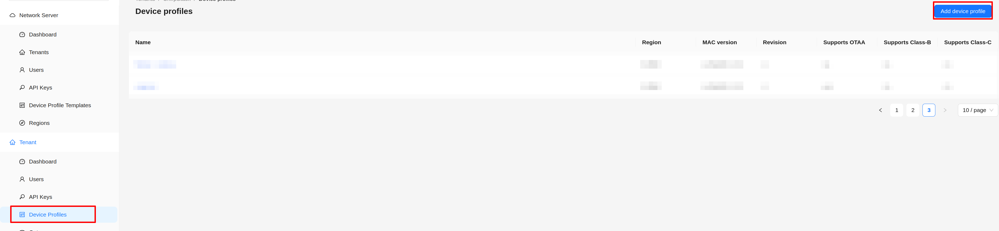
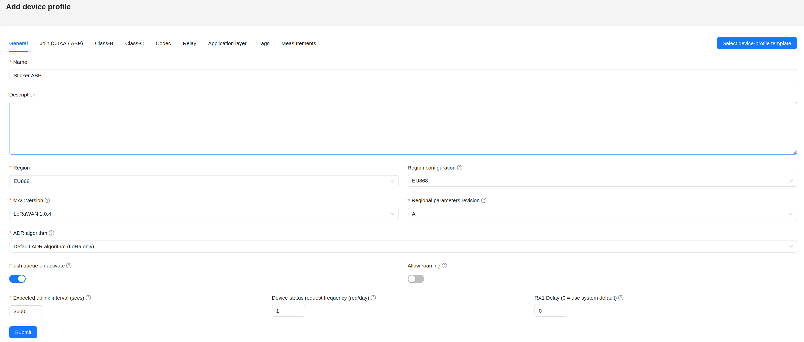
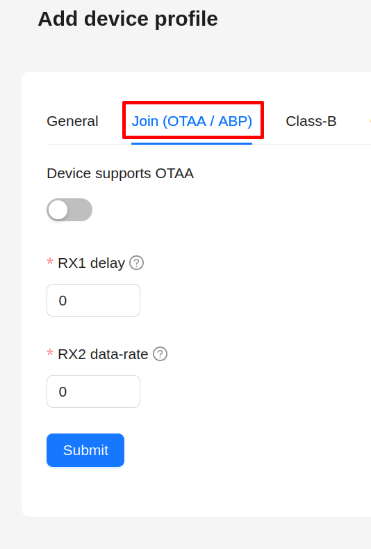
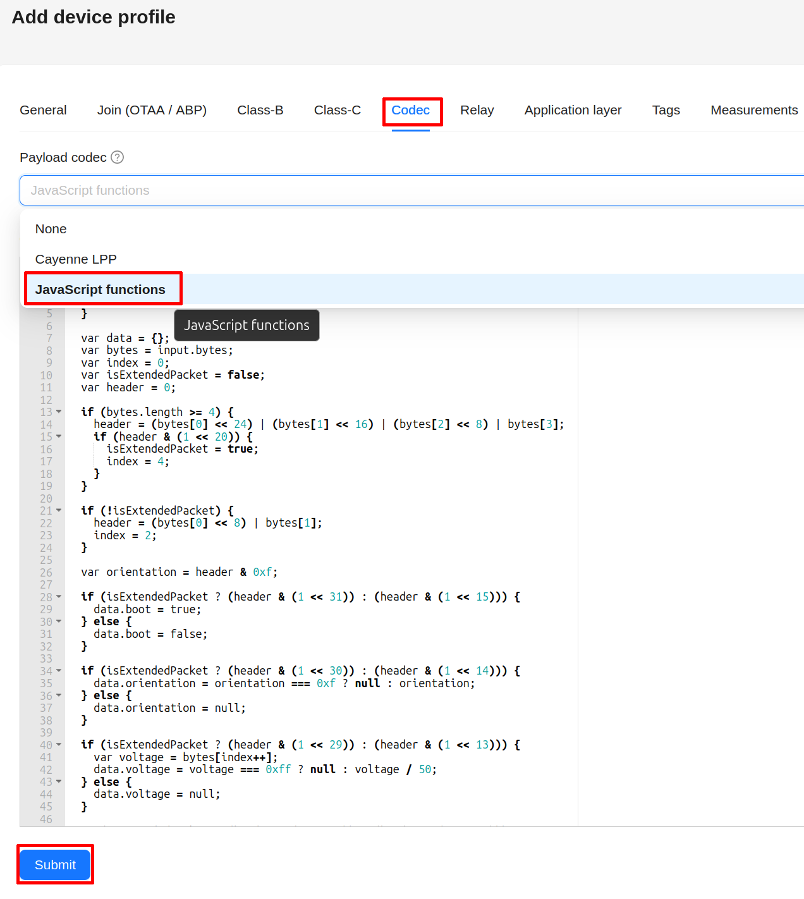
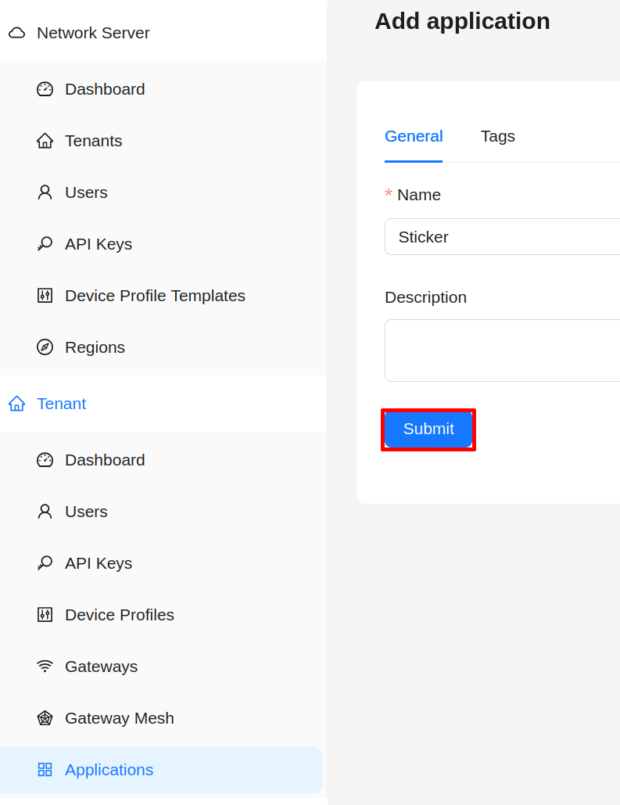
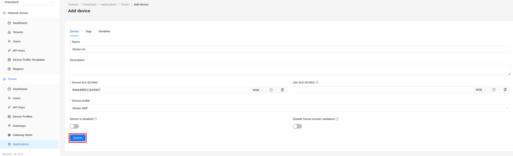
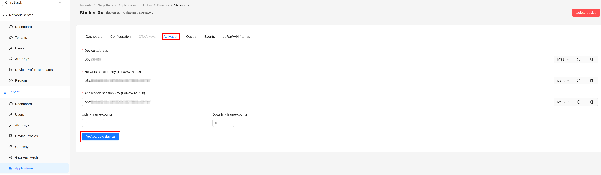

import Image from '@theme/IdealImage';

# ChirpStack v4 – ABP {#chirpstack-v4--abp}

Tato stránka vysvětluje, jak zaregistrovat zařízení **HARDWARIO STICKER** jako koncové zařízení LoRaWAN v **ChirpStack v4** pomocí **ABP (aktivace personalizací)**, včetně doporučeného nastavení profilu zařízení a přidání dekodéru payloadu.

Užitečná dokumentace HARDWARIO:
- Instalace ChirpStack v4  
  https://docs.hardwario.com/apps/chirpstack/chirpstack-installation
- ChirpStack v4 – koncová zařízení  
  https://docs.hardwario.com/apps/chirpstack/chirpstack-configuration/chirpstack-end-devices
- ChirpStack v4 – dekódování dat (ukázka kodeku pro STICKER)  
  https://docs.hardwario.com/apps/chirpstack/chirpstack-configuration/chirpstack-decoding
- Dekodér STICKER - https://github.com/hardwario/sticker-firmware/blob/main/app/decoder/ttn.js

:::info
Než zařízení STICKER zaregistrujete, ujistěte se, že je **ChirpStack v4 nainstalovaný a běží**.

Pokyny k instalaci:  
https://docs.hardwario.com/apps/chirpstack/chirpstack-installation
:::

---

## Předpoklady {#prerequisites}

- Funkční brána LoRaWAN připojená k ChirpStack v4 a nastavená pro váš region a frekvenční plán.
- Tenant v ChirpStack v4, ve kterém je brána vidět a je online.
- Zařízení STICKER napájené a v pokrytí brány.

---

## 1) Získejte potřebné identifikátory a klíče LoRaWAN {#1-collect-the-required-lorawan-identifiers--keys}

Potřebné identifikátory a klíče pro vaše zařízení STICKER zjistíte v aplikaci [**HARDWARIO Manager**](/apps/hardwario-manager/sticker/device-info).

Budete potřebovat:

- **DevEUI**
- **DevAddr**
- **NwkSKey** (Network Session Key)
- **AppSKey** (Application Session Key)

---

## 2) Vytvořte profil zařízení pro STICKER (doporučeno) {#2-create-a-device-profile-for-sticker-recommended}

V ChirpStack v4:  
**Tenant → Device Profiles → Add Device Profile**

Dále nastavte tyto parametry:
- Name: **STICKER - ABP** (nebo vlastní označení zařízení)
- MAC Version: **LoRaWAN 1.0.4**
- Region: **EU866** (nebo US915, pokud jste mimo EU)
- Expected uplink interval: **X** (podle konfigurace firmwaru vašeho zařízení STICKER)

Přejděte na kartu **Join (OTAA / ABP)** a zkontrolujte, že je volba **Device supports OTAA** vypnutá.

Nakonec k profilu zařízení přidejte kodek. Přepněte na kartu Codec, v rozbalovací nabídce Payload codec zvolte JavaScript functions a do vstupního pole vložte kodek z odkazu níže:
- https://github.com/hardwario/sticker-firmware/blob/main/app/decoder/ttn.js

Profil zařízení uložte kliknutím na **Submit**.

:::tip Generování downlink příkazů
_Kódování downlink příkazů je součástí připravovaného **firmwaru STICKER v1.4.0** (ne v1.3.x)._

Tento kodek zároveň **kóduje downlink příkazy** (funkcí `encodeDownlink`), takže není potřeba nic dalšího nastavovat. Chcete-li zařízení poslat příkaz, například vynutit report, změnit nastavení nebo nastavit pravidlo alarmu, zařaďte ho na kartě **Queue** zařízení jako objekt JSON na fPort **85** a ChirpStack kodekem vytvoří bajtový payload. Pro sestavení příkazu a získání jeho JSON i hex podoby použijte [**generátor downlink příkazů**](downlink-commands-generator.mdx).
:::

---

## 3) Vytvořte aplikaci v ChirpStacku {#3-create-an-application-in-chirpstack}

V ChirpStacku přejděte na **Applications → Add Application** a vyplňte pole:
- Name: **STICKER** (nebo jakékoli jméno)

Uložte kliknutím na **Submit**.

---

## 4) Zaregistrujte koncové zařízení STICKER {#4-register-the-sticker-end-device}

Ve své aplikaci:  
**Application → End Devices → Add End Device**

Vyplňte:
- **Name** (čitelné jméno)
- **Device EUI (DevEUI)**
- **Device Profile** → zvolte profil STICKER, který jste vytvořili

Uložte kliknutím na **Submit**.

### Aktivujte zařízení (ABP) {#activate-the-device-abp}

Po vytvoření zařízení otevřete jeho kartu **Activation**.

Vyplňte:
- **Device address (DevAddr)**
- **Network session key (NwkSKey)**
- **Application session key (AppSKey)**

Pak klikněte na **(Re)activate device**.

---

## 5) Zkontrolujte uplinky {#5-verify-uplinks}

- Přejděte na **Applications → (vaše aplikace) → Events**
- Zkontrolujte události **Up**
- Měli byste vidět:
  - surové bajty payloadu
  - dekódovaná pole JSON (pokud je kodek správný)
