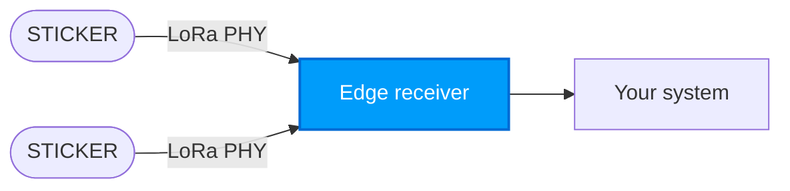

import Image from '@theme/IdealImage';

# Režim LoRa P2P (peer-to-peer) {#lora-p2p-peer-to-peer-mode}

:::info Připravovaná funkce
Komunikační režim LoRa P2P přichází v připravovaném vydání firmwaru platformy.
:::

**LoRa P2P (peer-to-peer)** umožňuje zařízením STICKER vysílat proprietární nespravované radiové rámce přímo dalším uzlům nebo edge přijímačům bez připojení k síťovému serveru LoRaWAN (LNS).

---

## Hlavní výhody {#key-advantages}

- **Žádná infrastruktura síťového serveru:** Funguje bez cloudových i lokálních síťových serverů LoRaWAN (ChirpStack, TTS).
- **Nízká latence a vlastní časování:** Přímé vysílání bez vyjednávání připojení do sítě a bez režie duty cycle na straně LNS.
- **Samostatné edge brány:** Ideální pro přímé spárování s HARDWARIO FIBER nebo s vlastními edge přijímači v odlehlých či izolovaných nasazeních.
- **Energetická efektivita:** Odpadají poslechová okna pro downlinky a opakované žádosti o připojení mimo pokrytí sítě.

---

## Architektura a topologie {#architecture--topology}

V režimu LoRa P2P obchází zařízení STICKER vrstvu MAC protokolu LoRaWAN, ale využívá spodní modulační vrstvu LoRa PHY čipů Semtech SX1262 / STM32WL. Rámce jdou přímo ze zařízení do přijímače, který provozujete vy. V cestě není žádná brána, žádné připojení k síti (Join) ani síťový server.



Porovnejte to s cestou přes [**LoRaWAN**](./index.md), kde uplinky putují STICKER → brána → síťový server → vaše aplikace. V režimu P2P není vrstva MAC protokolu LoRaWAN, a tedy ani procedura připojení (Join), ADR ani síťově řízená okna pro downlinky. Obě strany se prostě musí shodnout na níže uvedených parametrech radia.

---

## Parametry radia {#radio-parameters}

Při provozu v režimu P2P musí být vysílač i přijímač nastavené na shodné fyzické RF parametry:

| Parametr | Výchozí hodnota | Popis |
|---|---|---|
| **Frekvence** | 868.100 MHz (EU868) / 915.000 MHz (US915) | Středový RF frekvenční kanál. |
| **Šířka pásma (BW)** | 125 kHz | Šířka pásma kanálu. |
| **Spreading Factor (SF)** | SF7 | Kompromis mezi link budgetem/dosahem a vysílacím časem (SF7 až SF12). |
| **Coding Rate (CR)** | 4/5 | Schéma dopředné korekce chyb. |
| **Délka preambule** | 8 symbolů | Preambule pro synchronizaci radiového rámce. |
| **Sync Word** | `0x12` (privátní) | Sync word na úrovni PHY, který izoluje privátní provoz P2P. |
| **Vysílací výkon** | +14 dBm | Výstupní RF vysílací výkon. |

---

## Konfigurace a správa {#configuration--management}

Parametry P2P a režimy radia lze nastavit lokálně přes NFC v aplikaci [**HARDWARIO Manager**](/sticker/hardwario-manager/) nebo přes vývojářský RTT shell:

```bash
config radio-mode p2p
config p2p-frequency 868100000
config p2p-sf 7
config p2p-bandwidth 125
settings save
```

Podrobné postupy uvedení do provozu v terénu najdete v dokumentaci [**HARDWARIO Manager**](/sticker/hardwario-manager/).
