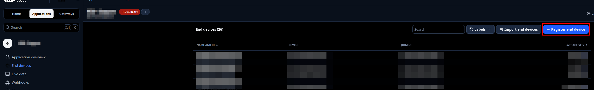
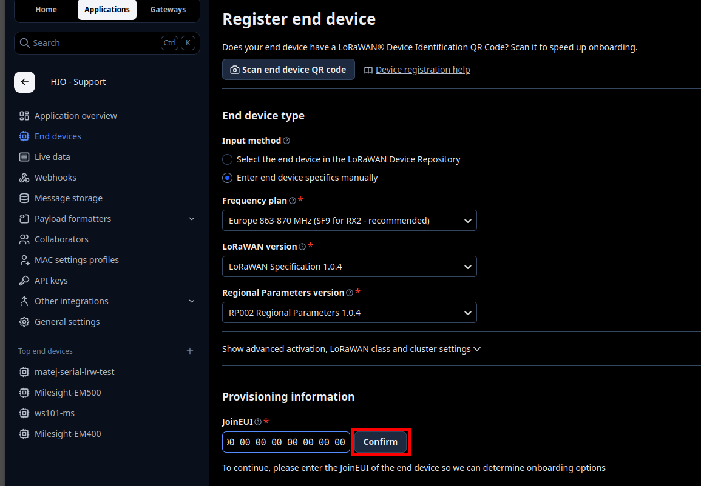
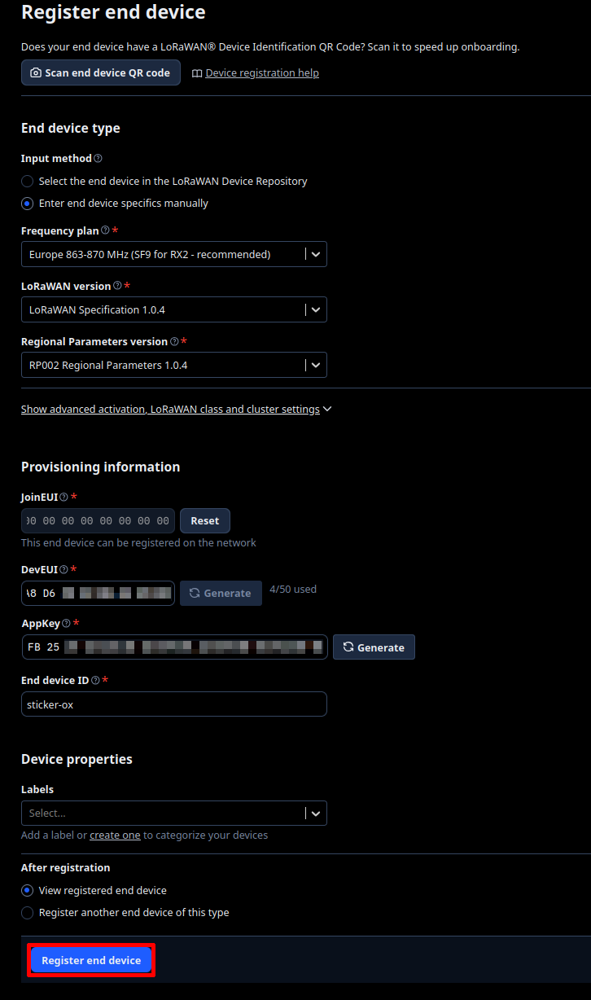
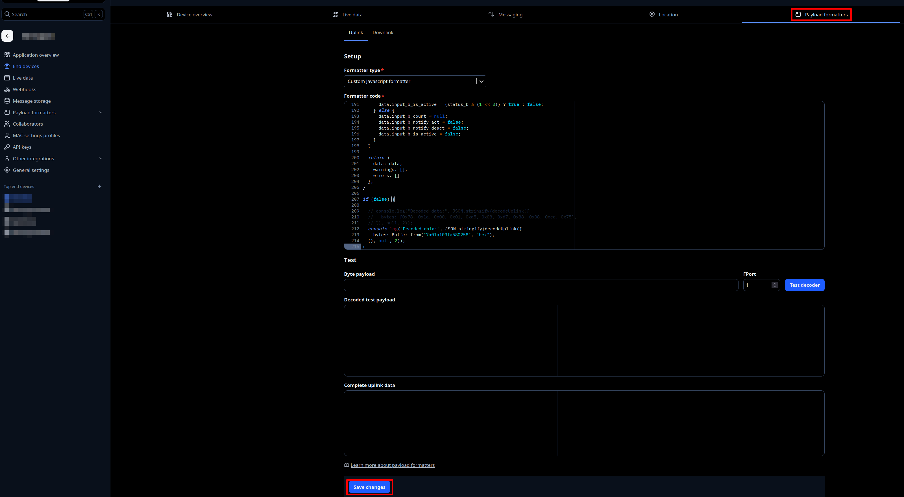

import Image from '@theme/IdealImage';

# The Things Stack – OTAA {#the-things-stack--otaa}

Tato stránka popisuje, jak **HARDWARIO STICKER** zaregistrovat jako koncové zařízení LoRaWAN v **The Things Stack (TTS)** pomocí **OTAA (bezdrátová aktivace)** a jak přidat formátovač payloadu (dekodér).

Užitečná dokumentace HARDWARIO:
- TTS: koncová zařízení  
  https://docs.hardwario.com/apps/the-things-stack/tts-configuration/tts-end-devices
- Dekodér STICKER: https://github.com/hardwario/sticker-firmware/blob/main/app/decoder/ttn.js

:::info
Než zařízení STICKER zaregistrujete, ujistěte se, že máte přístup k instanci **The Things Stack** (Cloud, Community nebo Enterprise) a že je brána LoRaWAN připojená a online.
:::

---

## Předpoklady {#prerequisites}

- Funkční brána LoRaWAN připojená k The Things Stack a nastavená pro váš region a frekvenční plán.
- Účet TTS s právem vytvářet aplikace a registrovat zařízení.
- Napájené zařízení STICKER v dosahu brány.

---

## 1) Získejte potřebné identifikátory a klíče LoRaWAN {#1-collect-the-required-lorawan-identifiers--keys}

Potřebné identifikátory a klíče zařízení STICKER zjistíte v aplikaci [**HARDWARIO Manager**](/apps/hardwario-manager/sticker/device-info).

Budete potřebovat:

- **DevEUI**
- **AppEUI / JoinEUI**
- **AppKey**

---

## 2) Zaregistrujte koncové zařízení STICKER {#2-register-the-sticker-end-device}

Ve své aplikaci:  
**Application → + Register end device**

Zvolte **Enter end device specifics manually**.

V části **End Device Type** nastavte:
- Frequency plan: zvolte svůj region (například **Europe 863–870 MHz**)
- LoRaWAN version: **LoRaWAN Specification 1.0.4**
- Regional Parameters version: **RP002 Regional Parameters 1.0.4**

V části **Provisioning Information** zadejte **JoinEUI (AppEUI)** a klikněte na **Confirm**.

V části **Device Identifiers** vyplňte:
- DevEUI: **DEVICE_EUI** (jedinečný identifikátor vytištěný na zařízení)
- AppKey: **APPLICATION_KEY** (z aplikace HARDWARIO Manager)
- Device ID: zvolený název zařízení (například **sticker-ox**)

Klikněte na **Register end device**.

---

## 3) Přidejte formátovač payloadu (dekodér) {#3-add-a-payload-formatter-decoder}

Aby se surové bajty uplinku dekódovaly do čitelných polí JSON, přejděte na:  
**Application → (VAŠE_ZAŘÍZENÍ) → Payload formatters → Uplink**

Nastavte typ formátovače na **Custom Javascript formatter** a vložte dekodér STICKER z odkazu níže:
- https://github.com/hardwario/sticker-firmware/blob/main/app/decoder/ttn.js

Klikněte na **Save changes**.

:::tip Generování příkazů přes downlink
_Kódování příkazů přes downlink přinesl **firmware STICKER v1.4.0** (verze v1.3.x ho nemají)._

Tentýž kodek `ttn.js` zároveň **kóduje příkazy pro downlink** (funkcí `encodeDownlink`), takže můžete zařízení posílat příkazy, například vynutit odeslání hlášení, změnit nastavení nebo nastavit pravidlo alarmu. Přidejte stejný soubor ještě jako formátovač **Downlink** v **Application → (VAŠE_ZAŘÍZENÍ) → Payload formatters → Downlink** (Custom Javascript formatter), pak zařaďte příkaz jako objekt JSON na fPort **85** a The Things Stack ho zakóduje do bajtů. Příkaz sestavíte a jeho podobu v JSON i hex získáte v [**generátoru příkazů přes downlink**](downlink-commands-generator.mdx).
:::

---

## 4) Zkontrolujte uplinky {#4-verify-uplinks}

- Otevřete v konzoli TTS pohled **Live data** zařízení
- Měli byste vidět:
  - přicházející rámce uplinku
  - dekódovaná pole JSON (pokud je formátovač payloadu správně nastavený)
