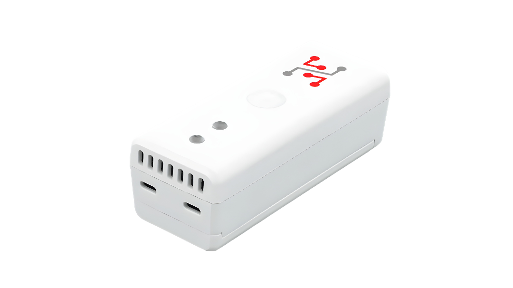

import Image from '@theme/IdealImage';

# Popis hardwaru {#hardware-description}

STICKER je kompaktní IoT zařízení postavené na **System-on-Chip STM32WL** s integrovaným **rádiem LoRa** a jádrem ARM Cortex-M4F.  
Napájejí ho dvě baterie AA; zařízení hlídá jejich napětí a úsporně řídí napájení (zvyšující měnič a LDO).

Zařízení obsahuje **paměť a anténu NFC** pro snadnou konfiguraci, a to i bez napájení (sběr energie).

---

## Senzory a periferie {#sensors--peripherals}

### Vestavěné senzory {#built-in-sensors}

Podle varianty osazení obsahuje zařízení STICKER:
- **Teplota a vlhkost:** Senzor Sensirion SHT43 pro velmi přesné měření prostředí.
- **Osvětlenost:** Senzor okolního světla Texas Instruments OPT3001.
- **Atmosférický tlak:** Senzor tlaku NXP MPL3115A2.
- **Pohyb PIR:** Pasivní infračervený senzor pohybu Excelitas PYD1698 pro detekci přítomnosti (až 5 m, ≥ 50°).
- **Tříosý akcelerometr:** Akcelerometr STMicroelectronics LIS2DH12 pro sledování náklonu, vibrací a orientace.
- **Detekce otevření dveří:** Dva Hallovy spínače Allegro A1266.

### Fyzická rozhraní a externí konektivita {#physical-interfaces--external-connectivity}

- **Rozhraní SWD:** Fyzické programovací pady SWD pro nahrávání a ladění firmwaru přes J-Link (`make flash`). Bez nich firmware nenahrajete, protože záměrně nemá bootloader ani bezdrátové aktualizace.
- **Master sběrnice 1-Wire:** Vyhrazené rozhraní 1-Wire pro externí digitální teplotní sondy (například Dallas DS18B20) a senzory HARDWARIO Machine Probe.
- **Rozhraní S0:** Vstup pro čítání impulzů kompatibilní se standardními výstupy S0 elektroměrů, plynoměrů a vodoměrů.
- **Měření napětí a průmyslové logické vstupy:** Až 2 digitální vstupy pro průmyslové logické úrovně do 30 V DC, které lze napojit přímo na PLC nebo na stavové výstupy strojů.

Stav zařízení signalizuje **vícebarevná LED (R/G/Y)** (podrobnosti viz [**Signalizace LED**](#led-indication)) a bezdrátovou komunikaci obstarává **vnitřní anténa 868/915 MHz**.

---

## Blokové schéma {#block-diagram}

  

    

      

        <Image img={require('../../../../sticker/images/block-diagram-sticker.png')} alt="Blokové schéma zařízení STICKER: SoC LoRa STM32WLE5CC se senzory, pamětí NFC, napájením ze 2× AA a stavovou LED" />
      

    

    

    

  

 

---

### Architektura konfigurace přes NFC {#nfc-configuration-architecture}

---

## Signalizace LED {#led-indication}

Zařízení STICKER má jednu stavovou LED se třemi nezávisle řízenými kanály: **červeným**, **zeleným** a **žlutým**. Firmware rozsvěcí červený a zelený kanál i společně, čímž vzniká **oranžová**, kterou vyhrazuje pro servisní režimy. LED je jediná zpětná vazba, kterou zařízení na místě poskytuje, a podle těchto vzorů nejrychleji poznáte, co zařízení dělá, ještě než se objeví v síti.

:::note
Vzory a časování níže platí pro **firmware v1.4.0**. Většina stavových bliknutí je kvůli úspoře baterie záměrně velmi krátká, 5 až 10 ms. Čekejte spíš krátký záblesk než zřetelné bliknutí.
:::

### Startovní sekvence {#boot-sequence}

Po každém zapnutí proběhne pevná sekvence, která zároveň ověří, že fungují všechny tři kanály:

| Krok | Barva | Doba |
|---|---|---|
| 1 | Červená | 0,5 s |
| 2 | *(zhasnuto)* | 0,25 s |
| 3 | Žlutá | 0,5 s |
| 4 | *(zhasnuto)* | 0,25 s |
| 5 | Zelená | 1,5 s |

Sekvence trvá asi 5 sekund. Pokud ho uvidíte nečekaně, zařízení se restartovalo.

### Stavový heartbeat {#status-heartbeat}

Za provozu zařízení signalizuje svůj stav každé **3 sekundy**. Zobrazuje se vždy jen jeden vzor. Firmware kontroluje podmínky níže v uvedeném pořadí a **platí první shoda**, takže závažnější stav vždy překryje méně závažný:

| Priorita | Stav zařízení | Vzor LED |
|---|---|---|
| 1 | Probíhá výměna přes NFC | LED ukazuje [vzory pro NFC](#nfc-interaction) popsané níže |
| 2 | **Konfiguraci se nepodařilo načíst**: uložené nastavení je poškozené | Červená a žlutá střídavě, dvakrát, po ~60 ms |
| 3 | **Připojování nebo opětovné připojování** k síti LoRaWAN | Jedno žluté bliknutí a po ~200 ms jedno červené |
| 4 | **Zhoršené spojení**: kontroly spojení selhávají, ale relace stále trvá | Dvě žlutá bliknutí ~200 ms po sobě |
| 5 | **Rádio vypnuté** nastavením `radio-mode` | Jedno žluté bliknutí |
| 6 | **Je aktivní alarm** | Jedno červené bliknutí |
| 7 | Normální provoz | Jedno zelené bliknutí |

Tři žluté stavy tvoří záměrnou stupnici závažnosti, takže vážnost síťového problému poznáte už z počtu bliknutí:

**rádio vypnuté (1× žlutá)** → **zhoršené spojení (2× žlutá)** → **připojování / opětovné připojování (žlutá + červená)**

Priorita 2 stojí nad nimi všemi: zařízení, které bliká červeně a žlutě, přišlo o uloženou identitu i zprovoznění a běží na výchozích hodnotách z výroby. Takový stav vyžaduje technika, ne kontrolu sítě.

:::note
Zařízení bez zeleného bliknutí nemusí být vadné. Může jen zobrazovat stav s vyšší prioritou. Alarmy se navíc vyhodnocují i tehdy, když LED patří vzoru s vyšší prioritou. Skryté je jen červené bliknutí alarmu; samotný alarm se přesto vyvolá a odešle svůj uplink.
:::

V sestavení firmwaru debug nahrazuje jedno zelené bliknutí dvojice zelená a žlutá, takže kus s firmwarem debug snadno odlišíte od kusu s firmwarem release.

### Interakce s NFC {#nfc-interaction}

Dokud je telefon přiložený k zařízení, LED krok za krokem ukazuje průběh výměny dat:

| Co se děje | LED |
|---|---|
| Telefon je v poli NFC | Zelená, svítí |
| Zpracovává se příkaz | Rychlé zelené blikání (~90 ms) |
| **Příkaz odmítnut**: špatný klíč nebo token, zopakovaný nebo poškozený požadavek | Rychlé červené blikání 2 s, pak zhasne |
| Odpověď je zapsaná a zařízení čeká, až si ji telefon přečte | Zelená **a** žlutá, svítí |
| Výměna skončila, telefon je oddálený | Zhasnuto |
| Zařízení konfiguraci úspěšně přijalo | Deset zelených bliknutí, 100 ms svítí / 100 ms zhasnuto |

Červené blikání při odmítnutí je dobré znát: bez něj vypadá odmítnutý příkaz pro toho, kdo drží telefon, stejně jako úspěšný.

### Aktivace vstupu {#input-activation}

Na zařízeních s nastavenými Hallovými spínači nebo externími vstupy LED potvrzuje každou změnu vstupu. **Pořadí barev určuje směr**, takže aktivaci nelze zaměnit s uvolněním:

| Událost | Vzor |
|---|---|
| Vstup se aktivuje | Zelená, pak oranžová, po 50 ms |
| Vstup se vrátí do klidu | Oranžová, pak zelená, po 50 ms |

Při rychlých změnách se signalizace zobrazí nejvýš jednou za 500 ms.

:::warning Pouze pomůcka při uvádění do provozu
Tato signalizace se **sama vypne hodinu po zapnutí**. Doba se počítá od startu, ne od poslední události, protože po instalaci už blikání není žádoucí. Pokud ji při testování potřebujete znovu, odpojte zařízení od napájení a znovu ho připojte.
:::

PIR a akcelerometr hlásí vždy jen okamžitou aktivaci, takže na těchto vstupech uvidíte jen sekvenci zelená, pak oranžová.

### Kalibrační režim {#calibration-mode}

| Stav | Vzor |
|---|---|
| Vstup do kalibrace | Pět rychlých oranžových bliknutí, 100 ms svítí / 100 ms zhasnuto |
| Kalibrace běží | Jedno oranžové bliknutí každou sekundu |

Kalibraci spustíte tak, že do **30 minut** od zapnutí přiložíte magnet k **oběma** Hallovým spínačům. Kalibrace běží **120 minut** a pak se zařízení samo restartuje. Oba stavy používají oranžovou barvu, aby se kalibrace nikdy nespletla se žlutými varováními sítě.

### Hluboký spánek {#deep-sleep}

Když zařízení uspíte do hlubokého spánku, všechny tři kanály se vypnou. Úplně zhasnutá LED na spícím zařízení je normální a není to závada.

### Testování LED {#testing-the-led}

LED lze ovládat přímo z vývojářské konzole příkazy `ats led`, což se hodí při kontrole podezřelého kusu. Viz [**Diagnostika**](developer-access/diagnostics.md).

---

## Přehled {#overview}

#### STICKER Clime - krabička, základní deska a držák baterií {#sticker-clime---enclosure-mainboard-and-battery-holder}

#### STICKER Input - krabička, základní deska a držák baterií {#sticker-input---enclosure-mainboard-and-battery-holder}

#### STICKER Motion - krabička, základní deska a držák baterií {#sticker-motion---enclosure-mainboard-and-battery-holder}

---

## Schémata hardwaru {#hardware-schematics}

### Napájení {#power}

**[Stáhnout schéma napájení (PDF)](pathname:///sticker/hardware-diagrams/power.pdf)**

### Anténa {#antenna}

**[Stáhnout schéma antény (PDF)](pathname:///sticker/hardware-diagrams/antenna.pdf)**

### MCU {#mcu}

**[Stáhnout schéma MCU (PDF)](pathname:///sticker/hardware-diagrams/mcu.pdf)**

### Senzory {#sensors}

**[Stáhnout schéma senzorů (PDF)](pathname:///sticker/hardware-diagrams/sensors.pdf)**

### NFC {#nfc}

**[Stáhnout schéma NFC (PDF)](pathname:///sticker/hardware-diagrams/nfc.pdf)**

---

## Technické parametry {#technical-specification}

| **Kategorie** | **Parametr** | **Hodnota** |
|-------------------|---------------------------|------------------------------------|
| **Konstrukce** | Materiál krabičky        | ABS                                |
|                   | Rozměry                 | 91 × 36,5 × 33,3 mm                |
| **Napájení** | Jmenovité napětí článku      | 1,5 V                              |
|                   | Jmenovitá kapacita baterií  | 3000 mAh                           |
|                   | Rozsah provozního napětí   | 1,8 V až 3,6 V                     |
|                   | Klidová spotřeba    | < 80 µA                            |
|                   | Špičková spotřeba    | < 100 mA                           |
| **Prostředí** | Provozní teplota     | -30 °C až +70 °C                   |
|                   | Skladovací teplota       | -30 °C až +70 °C                   |
|                   | Krytí krabičky      | IP30                               |
| **Senzory** | Integrovaný teploměr: rozsah měření   | -20 °C až +60 °C     |
|                   | Integrovaný teploměr: přesnost měření| ±0,2 °C (0 °C až 65 °C) |
|                   | Integrovaný vlhkoměr: rozsah měření    | 0 % až 100 %           |
|                   | Integrovaný vlhkoměr: přesnost měření | ±2 % (od 10 % do 90 %) |
|                   | PIR: dosah detekce     | 5 m                                |
|                   | PIR: zorný úhel       | ≥ 50°                              |

