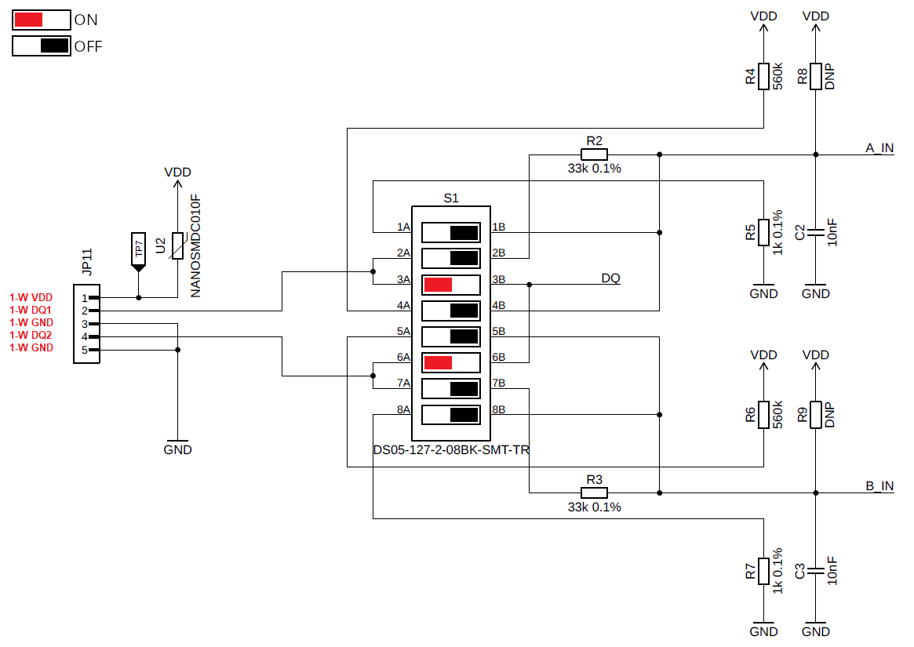
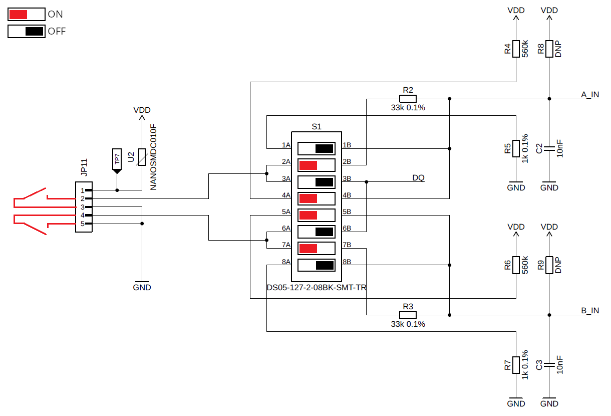
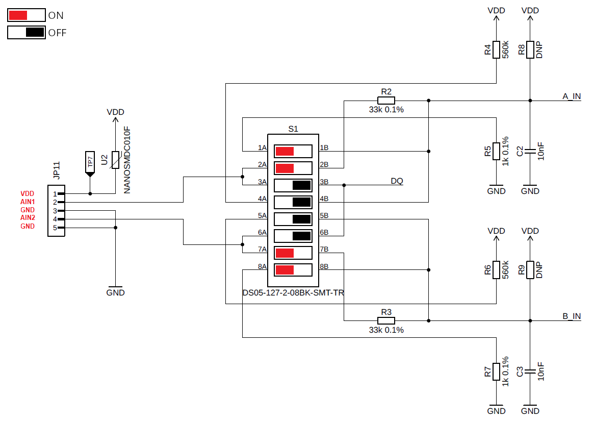
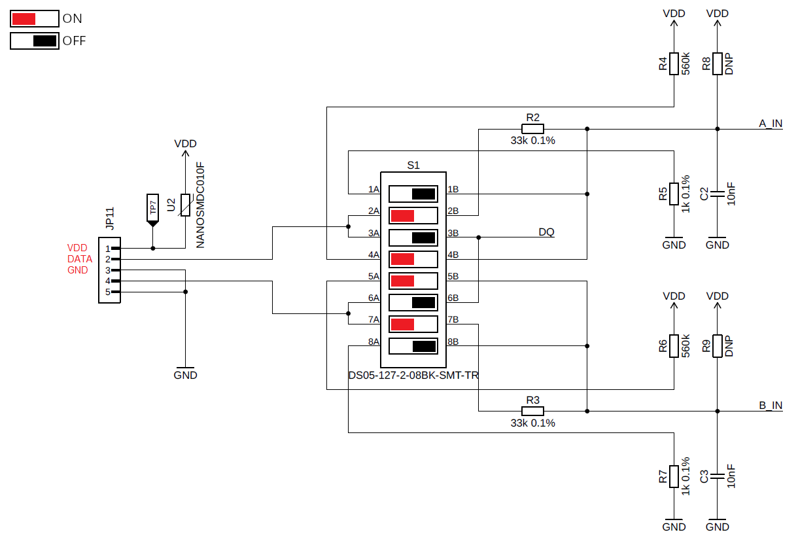

import Image from '@theme/IdealImage';

# Zapojení vstupů STICKER Input {#sticker-input-wiring}

## Legenda přepínačů DIP {#dip-switch-legend}

- |🟥←| **ON**: přepínač DIP v poloze ON (červeně)
- |→⬛| **OFF**: přepínač DIP v poloze OFF (černě)

## Vstup 1-Wire {#1-wire-input}
Zapojení pro 1-Wire (Dallas, ...):
- Přepínače DIP zapínají datové linky (DQ1/DQ2).

---

## Vstup pro bezpotenciálový kontakt {#dry-contact-input}
Zapojení pro DRY CONTACT:  
- Pull-up 560 kΩ a uzemnění přes 33 kΩ.  

---

## Analogový vstup (0–24 V) {#analog-input-024-v}
Analogový vstup 0–24 V:  
- Dělič 1 kΩ / 33 kΩ.

## Senzor SO {#so-sensor}

