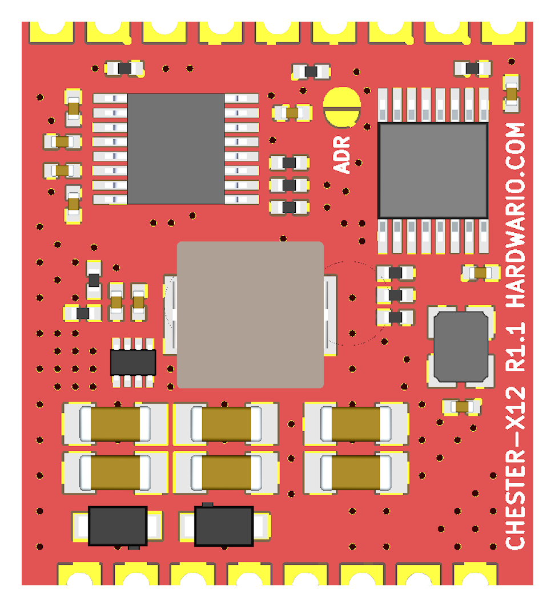
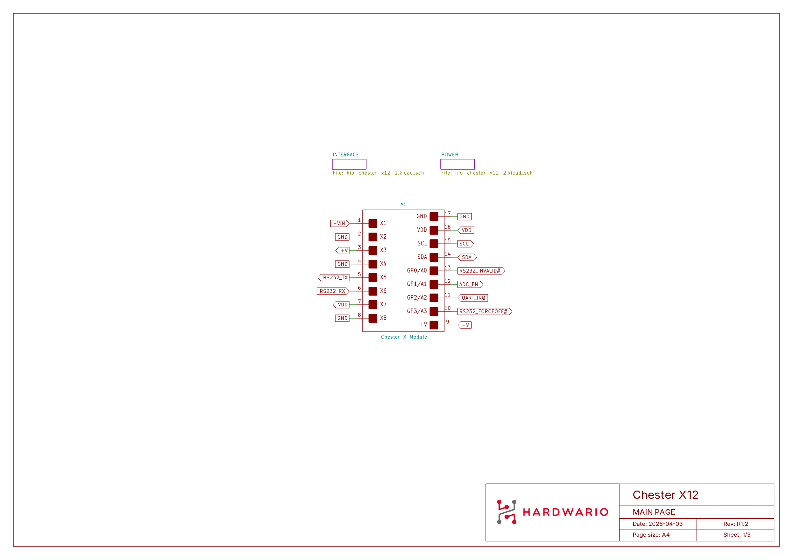
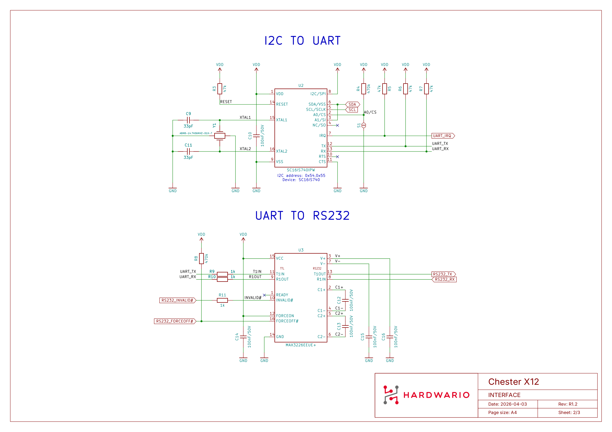
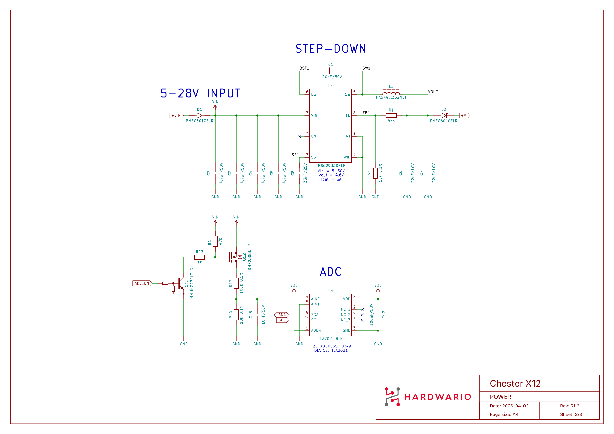

# CHESTER-X12 {#chester-x12}

Modul **CHESTER-X12** je rozšiřující modul pro sériovou komunikaci **RS-232** určený pro platformu CHESTER.

## Přehled modulu {#module-overview}

CHESTER-X12 poskytuje sériové rozhraní **RS-232**. I²C-to-UART převodník **SC16IS740IPW** se připojuje k základní desce CHESTER přes **I²C** a transceiver **MAX3226EEUE+** převádí signály UART na skutečné úrovně RS-232 s ochranou proti ESD ±15 kV. Vysílací a přijímací linky RS-232 jsou vyvedeny na svorkovnici.

Modul může být napájen přímo ze základní desky CHESTER. Alternativně externí linka **5–28 VDC** na **+VIN** napájí sestupný měnič **TPS62933** na desce, jehož pevný výstup **5 V** (**+V**) napájí základní desku CHESTER. Vstup chrání Schottkyho diody (**PMEG6010ELR**). Vstupní napětí měří ADC převodník **TLA2021** na desce, čtený přes I²C.

## Klíčové vlastnosti {#key-features}

* **Rozhraní RS-232:** Plně duplexní sériová linka se skutečnými úrovněmi RS-232 a ochranou proti ESD ±15 kV na I/O pinech (MAX3226EEUE+).
* **I²C-to-UART převodník:** SC16IS740IPW propojuje UART sběrnice RS-232 s I²C sběrnicí základní desky CHESTER.
* **Flexibilní napájení:** Provoz ze základní desky CHESTER, nebo z volitelné linky 5–28 VDC na +VIN přes sestupný měnič TPS62933 na desce.
* **Ochrana vstupu:** Schottkyho diody (PMEG6010ELR) na napájecím vstupu.
* **Měření vstupního napětí:** I²C ADC převodník na desce (TLA2021) měří vstupní napětí.
* **Řízení nízké spotřeby:** Transceiver RS-232 lze pomocí FORCEOFF# přepnout do vypnutého stavu pro provoz s nízkou spotřebou.

## Typické aplikace {#typical-applications}

* **Průmyslové senzory:** Připojení senzorů a řídicích jednotek přes platformu CHESTER.
* **Starší zařízení:** Integrace se stávajícími zařízeními RS-232.
* **Automatizace budov:** Systémy HVAC, řízení osvětlení a měření.
* **Komerční využití:** Pokladní terminály (POS) a čtečky čárových kódů.
* **Utility:** Přístup k sériové konzoli a rozhraní laboratorních přístrojů.

## Technické parametry {#technical-specifications}

| Parametr | Hodnota |
| :--- | :--- |
| **Typ rozhraní** | RS-232 |
| **Protokol** | Plně duplexní asynchronní sériová linka |
| **Přenosová rychlost** | Až 250 kbps (limit transceiveru) / 3 Mbps (limit převodníku) |
| **Datové bity** | 5, 6, 7, 8 |
| **Stop bity** | 1, 1.5, 2 |
| **Parita** | Žádná, sudá, lichá, Mark, Space |
| **Řízení toku** | Softwarové (XON/XOFF) |
| **Rozhraní k hostiteli** | I²C |
| **Napájecí vstup (+VIN)** | 5–28 VDC (volitelné externí napájení) |
| **Napájecí výstup (+V)** | Pevných 5 V, napájí základní desku CHESTER |
| **Měření napětí** | 12bitový I²C ADC na desce (TLA2021), měří vstupní napětí |
| **Konektor** | Standardní header s roztečí 2.54 mm (pájený) |
| **Revize hardwaru** | R1.2 |

## Klíčové komponenty {#key-components}

| Komponenta | Označení součástky | Popis |
| :--- | :--- | :--- |
| **I²C-to-UART převodník** | SC16IS740IPW | Jeden UART s rozhraním I²C, 64bajtová FIFO |
| **RS-232 transceiver** | MAX3226EEUE+ | Skutečné úrovně RS-232, ochrana proti ESD ±15 kV |
| **ADC pro měření napětí** | TLA2021 | 12bitový I²C ADC (adresa 0x49); měří vstupní napětí |
| **DC-DC měnič** | TPS62933 | Sestupný měnič, vstup 5–28 VDC, výstup 5 V |
| **Ochrana vstupu** | PMEG6010ELR | Schottkyho diody pro ochranu vstupu |

## Konfigurace pinů {#pin-configuration}

Modul používá standardizované rozložení headeru kompatibilní s rozšiřujícími sloty CHESTER.

:::note
Zobrazená konfigurace pinů platí pro základní desku CHESTER-M CGLS.
:::

### Pinout konektoru CHESTER-X12 {#chester-x12-connector-pinout}

| Pin | Signál | Typ | Popis |
| :---: | :--- | :--- | :--- |
| 1 | +VIN | Napájecí vstup | Volitelný externí DC vstup do sestupného měniče na desce (5–28 VDC) |
| 2 | GND | Zem | Referenční zem systému |
| 3 | +V | Napájecí výstup | Pevných 5 V ze sestupného měniče na desce (napájí základní desku CHESTER) |
| 4 | GND | Zem | Referenční zem systému |
| 5 | RS232 TX | RS-232 | Vysílaná data RS-232 (výstup modulu) |
| 6 | RS232 RX | RS-232 | Přijímaná data RS-232 (vstup modulu) |
| 7 | VDD | Napájení | Logické napájení 3,3 V ze základní desky CHESTER |
| 8 | GND | Zem | Referenční zem systému |

:::info
Modul může být napájen přímo ze základní desky CHESTER. Když je k **+VIN** (pin 1) připojeno externí napájení **5–28 VDC**, sestupný měnič TPS62933 na desce vytváří pevných **5 V** na **+V** (pin 3), které napájejí základní desku CHESTER.
:::

:::warning Nutná úprava ochrany proti ESD
Transceiver RS-232 používá záporné napěťové úrovně. Zařízení CHESTER musí mít upravenou ochranu proti ESD na vstupech pro signály **A3** a **A4** na **slotu A**, nebo **B3** a **B4** na **slotu B**. Standardní unipolární TVS diody (**SMA6J28A**) musí být nahrazeny obousměrnými (**SMA6J28CA**). Pokud ochrana proti ESD není potřeba, lze tyto diody odstranit.

:::

### Rozhraní k hostiteli (I²C) {#host-interface-ic}

CHESTER-X12 komunikuje se základní deskou CHESTER přes standardní sběrnici **I²C**. Na sběrnici jsou dvě zařízení: UART převodník **SC16IS740IPW** a ADC převodník **TLA2021** pro měření napětí.

Adresa UART převodníku se volí pájecí propojkou **S1** na desce (potisk **ADR**): **0x54** ve **slotu A** a **0x55** ve **slotu B**. Pokud je modul dodáván jako součást kompletní jednotky CHESTER, je tato adresa nastavena z výroby; u samostatného modulu si adresu musí nastavit uživatel. ADC TLA2021 má adresu **0x49**.

Kromě SDA/SCL používá modul GP piny slotu:

| Pin CHESTER-X | Signál | Zdroj / funkce |
| :--- | :--- | :--- |
| GP0 / A0 | INVALID# | MAX3226EEUE+ — indikace platné úrovně na přijímači RS-232 |
| GP1 / A1 | ADC_EN | Povoluje měření vstupního napětí obvodem TLA2021 |
| GP2 / A2 | IRQ | Přerušení UART převodníku SC16IS740IPW |
| GP3 / A3 | FORCEOFF# | Řízení vypnutí (nízká spotřeba) obvodu MAX3226EEUE+ |

Vstup FORCEON transceiveru je připojen na vysokou úroveň, takže firmware může transceiver RS-232 uvést do stavu nízké spotřeby aktivací **FORCEOFF#** (GP3/A3).

## Připojení RS-232 {#rs-232-connection}

Sériové zařízení připojte ke svorkovnici: **RS232 TX** (pin 5), **RS232 RX** (pin 6) a společná **GND** (pin 2, 4 nebo 8). Vyvedeny jsou pouze datové linky pro vysílání a příjem — na konektoru nejsou k dispozici linky hardwarového handshakingu (RTS/CTS).

Rozhraní RS-232 **není galvanicky oddělené**, takže sériové zařízení a jednotka CHESTER musí sdílet společnou referenční zem.

### Průchod do krabičky {#enclosure-feed-through}

Sériový kabel lze do krabičky přivést dvěma způsoby:

- **Kabelová průchodka (výchozí):** vodiče RS-232 protáhněte kabelovou průchodkou ve stěně krabičky a připojte je ke svorkovnici.
- **Panelový konektor (na vyžádání):** externí konektor ve stěně krabičky umožňuje uživateli zapojit sériový kabel bez volné kabeláže uvnitř. K dispozici na vyžádání.

## Kompatibilní konfigurace CHESTER {#compatible-chester-configurations}

Modul CHESTER-X12 lze použít s různými konfiguracemi základních desek CHESTER. Níže jsou příklady kompatibilních sestav:

<h4>CHESTER-M (CGLS)</h4>

<h4>CHESTER-C4</h4>

## Použití v CHESTER SDK {#chester-sdk-usage}

CHESTER-X12 lze v rámci CHESTER SDK použít pomocí shieldů `ctr_x12_a` a `ctr_x12_b`, nebo funkcí `hardware-chester-x12-a` a `hardware-chester-x12-b` v nástroji [Project Generator](/chester/firmware-sdk/how-to-project-generator).

- [Příklad použití SDK](https://github.com/hardwario/chester-sdk/tree/main/samples/chester_x12_loop)

## Schémata zapojení {#schematic-diagrams}

Následující schémata ukazují vnitřní zapojení modulu na třech listech: hlavní stránka, rozhraní a napájení.

- [Schéma (PDF)](../../../../../chester/extension-modules/schematics/hio-chester-x12-r1.2.pdf)
- [Interaktivní prohlížeč konektorů, součástek, testovacích bodů a signálů PCB](pathname:///download/ibom/hio-chester-x12-r1.2.html)

### Hlavní stránka {#main-page}

### Rozhraní {#interface}

### Napájení {#power}

## Výkres modulu {#module-drawing}

